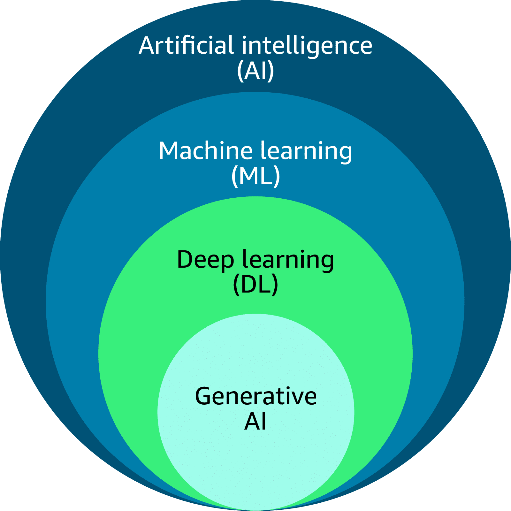
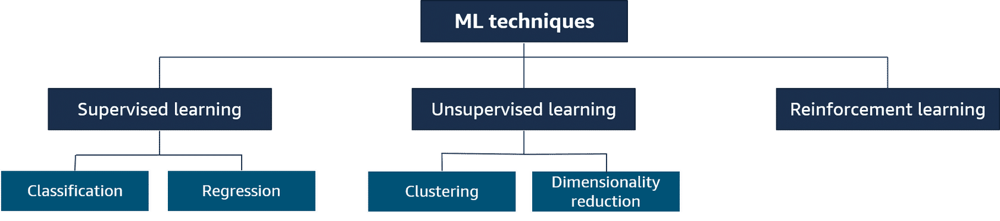
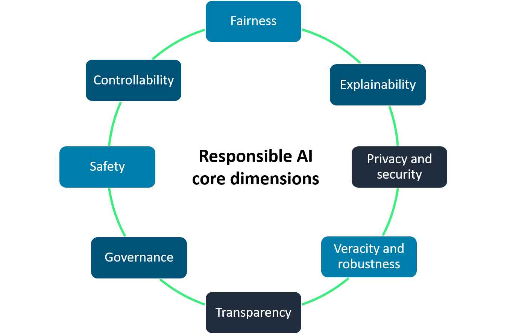
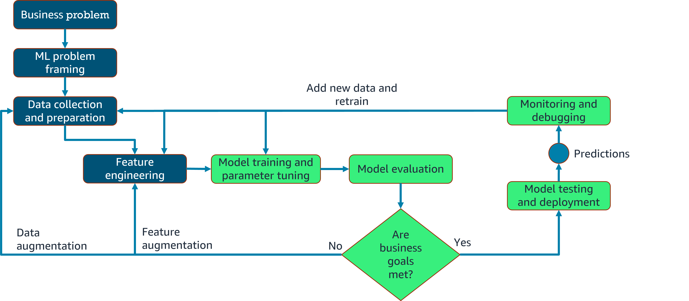

# AWS Machine Learning And Generative AI

## Fundamentals of Machine Learning and Artificial Intelligence on AWS

Machine Learning (ML) and Artificial Intelligence (AI) are technologies that enable systems to learn from data, identify patterns, and make decisions 
with minimal human intervention. Within AWS, these capabilities are delivered through a combination of managed services, scalable infrastructure, and 
pre-built models that simplify development and deployment.

At a fundamental level, machine learning involves training a model using historical data so that it can make predictions or classifications on new data. 
This process typically includes data collection, data preprocessing, model training, evaluation, and deployment. Artificial intelligence extends these 
concepts by enabling systems to simulate human-like tasks such as language understanding, image recognition, and decision-making.

In AWS, ML and AI services are designed to support different levels of expertise. For beginners and developers without deep ML knowledge, AWS provides 
fully managed AI services such as Amazon Rekognition for image analysis, Amazon Comprehend for natural language processing, and Amazon Polly for 
text-to-speech conversion. These services allow users to integrate AI capabilities into applications using simple APIs.

For more advanced use cases, AWS offers Amazon SageMaker, a comprehensive platform for building, training, and deploying machine learning models. 
SageMaker provides tools for data labeling, model training, tuning, and hosting, all within a scalable cloud environment. It also supports popular 
ML frameworks such as TensorFlow and PyTorch.

In addition to SageMaker, AWS provides several specialized machine learning services, including:

- AWS Deep Learning AMIs for pre-configured ML environments  
- AWS Deep Learning Containers for containerized ML workflows  
- Amazon Forecast for time-series forecasting  
- Amazon Personalize for recommendation systems  
- Amazon Textract for extracting text and data from documents  
- Amazon Lex for building conversational interfaces such as chatbots  

AWS also supports the full ML lifecycle by integrating with data storage and processing services such as Amazon S3 for data storage and AWS Lambda 
for serverless execution. This integration enables automated workflows and efficient data pipelines.

A key advantage of using AWS for ML and AI is scalability. Users can train models on large datasets using powerful compute resources without needing 
to manage physical infrastructure. Additionally, AWS provides security, monitoring, and cost management tools to ensure that ML solutions are reliable 
and efficient.

Overall, AWS simplifies the adoption of machine learning and artificial intelligence by providing flexible tools and services that cater to both beginners 
and experienced practitioners.

## Exploring Artificial Intelligence Use Cases and Applications

  

Artificial Intelligence (AI) is a broad field that enables systems to perform human-like tasks such as reasoning, learning, and decision-making. Machine Learning (ML) is a subset of AI that learns patterns from data to improve performance over time without explicit programming. Deep Learning (DL) is a subset of ML that uses neural networks to model complex patterns. Generative AI is a subset of deep learning that creates new content such as text, images, audio, video, and code based on learned patterns.

AI and ML are widely used across industries to improve efficiency, enhance customer experience, and automate processes. Key application areas include:

- **Media and entertainment:** content generation, virtual environments, automated summarization  
- **Retail:** pricing optimization, product recommendations, virtual try-ons, review summaries  
- **Healthcare:** clinical documentation (e.g., AWS HealthScribe), personalized treatment, medical imaging improvement  
- **Life sciences:** drug discovery, protein folding prediction, synthetic biology  
- **Financial services:** fraud detection, portfolio management, debt collection optimization  
- **Manufacturing:** predictive maintenance, process optimization, product and material design  

Common AI application types include computer vision, natural language processing (NLP), intelligent document processing (IDP), and fraud detection, which support automation and improve decision-making across industries.

Machine Learning is appropriate when rule-based systems are insufficient or when large-scale data processing is required. ML techniques include:
- Supervised learning (classification and regression)
- Unsupervised learning (clustering and dimensionality reduction)
- Reinforcement learning (learning through trial and error with rewards)

Generative AI provides additional capabilities such as adaptability, scalability, personalization, and real-time content generation. However, it also introduces challenges including bias, hallucinations, privacy risks, toxicity, and compliance issues, which require mitigation strategies such as guardrails, data minimization, and model evaluation.

When selecting generative AI models, key factors include performance, capabilities, constraints, compliance, and cost. Popular foundation models include Amazon Titan, Claude, Llama, and Stable Diffusion, each designed for different tasks such as text generation, summarization, and image creation.

Business success in generative AI is measured using metrics such as user satisfaction, revenue per user, conversion rate, efficiency, and cross-domain performance. These metrics help evaluate impact and guide optimization.

Overall, AI and ML technologies enable scalable, data-driven solutions that transform industries and improve business outcomes when applied appropriately.

## Responsible Artificial Intelligence Practices

Responsible AI refers to practices that ensure AI systems are **transparent, trustworthy, and safe** throughout their lifecycle, including design, 
development, deployment, and monitoring. It applies to both traditional AI and generative AI systems.

Key challenges include:
- Bias and accuracy issues in models  
- Bias-variance tradeoff affecting performance  
- Generative AI risks such as toxicity, hallucinations, intellectual property concerns, and misuse  

To address these challenges, responsible AI is built on several core dimensions:
- Fairness and inclusion  
- Explainability of model decisions  
- Privacy and security of data  
- Transparency of system capabilities and limitations  
- Robustness and reliability  
- Governance and compliance  
- Safety and controllability  

Responsible AI also provides important business benefits. These include:
- Increased trust and reputation  
- Regulatory compliance  
- Reduced risks and costs  
- Improved decision-making  
- Competitive advantage  

AWS supports responsible AI through services such as:
- **Amazon SageMaker**, which provides tools for model building, bias detection, explainability, and monitoring  
- **Amazon Bedrock**, which offers foundation models with built-in guardrails, content filtering, and privacy protection  

Overall, responsible AI ensures that AI systems are developed and used ethically and effectively while delivering value to both organizations and society.

## Developing Machine Learning Solutions

Machine learning (ML) solutions follow an end-to-end lifecycle that includes defining business goals, framing the problem, preparing data, building and training models, deploying them, and continuously monitoring and retraining for improvement.

- **Lifecycle phases**:
  - Business understanding and problem framing
  - Data collection, preprocessing, and feature engineering
  - Model training, evaluation, and tuning
  - Deployment, monitoring, and retraining

ML models are trained using labeled or unlabeled data and must generalize to new data. Data is typically split into training, validation, and test sets to ensure reliable evaluation.

- **Model performance**:
  - Models can be underfit, overfit, or balanced
  - Balanced models achieve low bias and low variance
  - Evaluation metrics depend on the task:
    - Classification: accuracy, precision, recall, AUC-ROC
    - Regression: mean squared error (MSE), R²

Business metrics and KPIs are used to align model performance with real-world objectives, and techniques like A/B testing help optimize outcomes.

- **Model deployment**:
  - Integrates models into production for predictions
  - Options include self-hosted or managed services
  - Deployment types include real-time, batch, asynchronous, and serverless

- **AWS support**:
  - Amazon SageMaker AI enables data preparation, model building, training, deployment, and monitoring in a unified environment
  - Supports pre-trained models, built-in algorithms, and custom implementations for tasks like classification, clustering, NLP, and computer vision

- **MLOps**:
  - Combines people, processes, and technology to automate and manage the ML lifecycle
  - Focuses on continuous integration, deployment, monitoring, and governance
  - Improves collaboration, scalability, and reliability of ML systems

## Certifications

  
  
  
  

