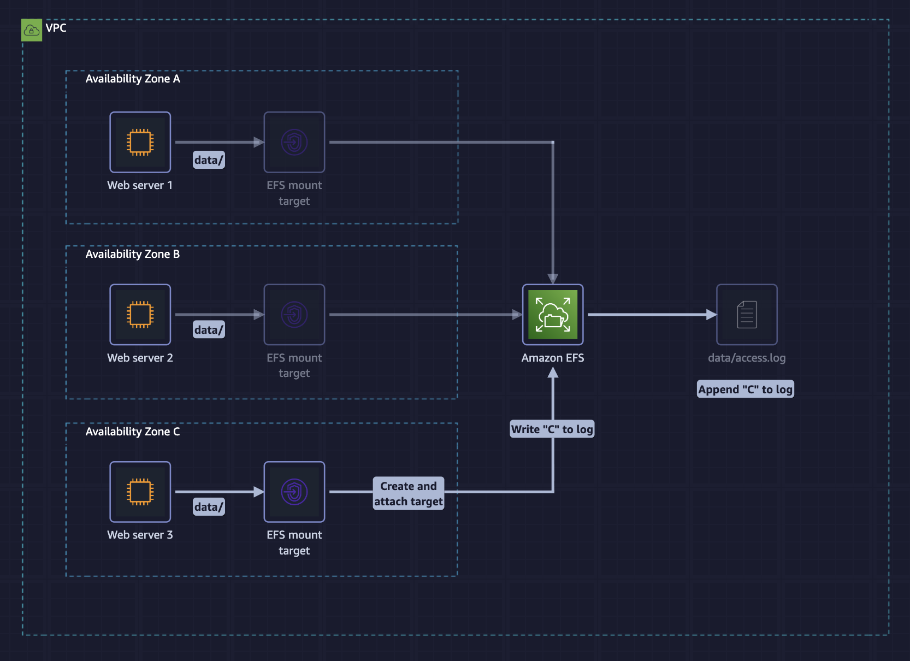

# AWS SimuLearn: File Systems in the Cloud

## Simulated business scenario
The pet modeling agency wants a way to share files across its branch offices without managing physical storage infrastructure.

## Objectives
- Evaluate different storage options available on AWS.
- Analyze the key features and benefits of Amazon EFS.
- Apply Amazon EFS solutions to specific business scenarios.
- Configure Amazon EFS endpoints for centralized storage access.

## AWS Services
- Amazon Elastic Compute Cloud
- Amazon Elastic File System



[Link to course on Skillbuilder](https://skillbuilder.aws/learn/A5M8X2CHM3/aws-simulearn-file-systems-in-the-cloud/RAJVAUNMHR)

## Solution

1. I add a network to EFS (AZ, subnet and security group). The third EFS mount target is in us-east-1c.

2. I connect to the third EC2 instance called **PetModels-C**.

3. I install the `amazon-efs-utils` and mount an EFS endpoint to the istance.
```bash
$ sudo -i
$ sudo yum install -y amazon-efs-utils
$ mkdir data
$ sudo mount -t efs -o tls fs-03f55334debb8de40:/ data
```

4. In the `data` folder I add a new line to the file `efs-1-setup.log`.
```bash
$ cd data
$ sudo bash -c "cat >> efs-1-setup.log"
$ efs-1 mounted in site C
```

5. Eventually, I view the content of the file.
```bash
$ cat efs-1-setup.log
efs-1 mounted in site A
efs-1 mounted in site B
efs-1 mounted in site C
```

## Conclusion
- I launched an Amazon EFS file system and mounted it to the EC2 instance PetModels-C.
- I added the correct files to it.

## Completion Certificate


