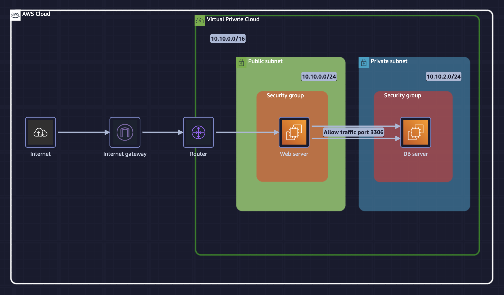
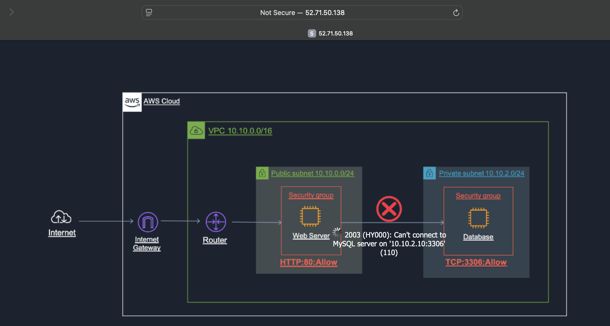
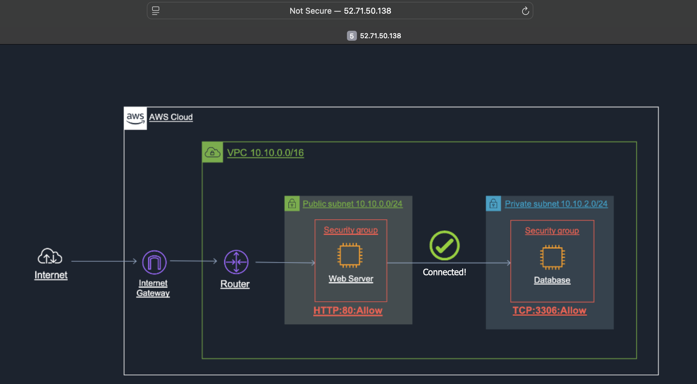
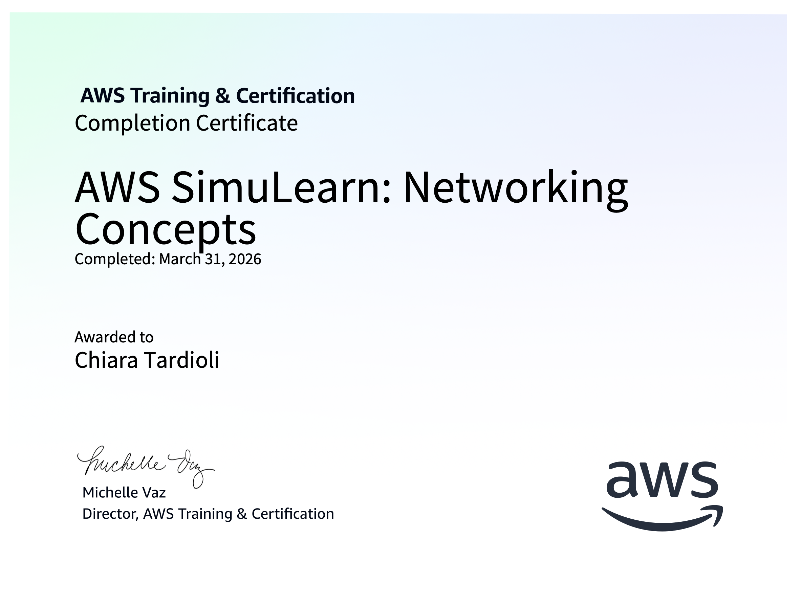

# AWS SimuLearn: Networking Concepts

[Link to course on AWS Skill Builder](https://skillbuilder.aws/learn/XCEMH2NXKJ/aws-simulearn-networking-concepts/QN5P4AJMUV)

## Simulated business scenario
The bank wants to establish a network architecture that securely controls communication between its internal resources and the internet.

## AWS Services
- Amazon Virtual Private Cloud (Amazon VPC)
- EC2 Instance

## Solution

In the first part I allow traffic on port 80 from the internet to the public subnet.
1. I explore the components that comprise a virtual private cloud (VPC).
2. I configure a route table attached to a subnet within a VPC.
3. I configure a route table to direct internet-bound traffic to the internet gateway.
4. I configure inbound rules within a security group to control access.

The WebServer instance is accessible from the Public IPv4 address `http://52.71.50.138`, 
however the private subnet `10.10.2.0/24` is still unaccessible from the private subnet. 

To fix it, I change the security group rules to allow traffic, over port 3306 (MySQL/Aurora), into the DB server
from source `10.10.0.0/24` (public subnet IP address).

## Conclusion
- I explored the components that comprise a virtual private cloud (VPC).
- I configured a route table attached to a subnet within a VPC.
- I configured a route table to direct internet-bound traffic to the internet gateway.
- I configured inbound rules within a security group to control access.

## Completion Certificate

