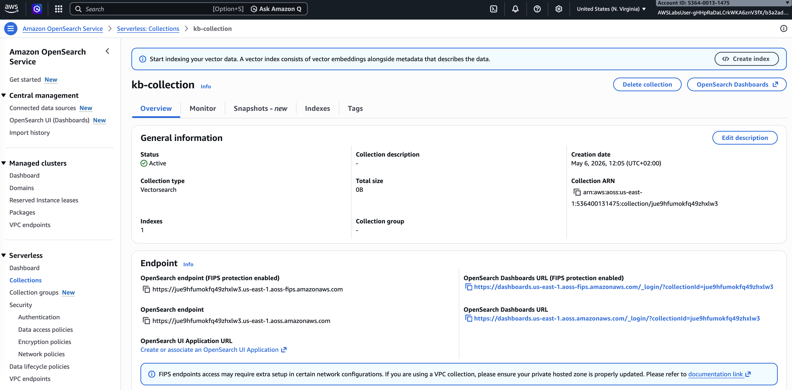
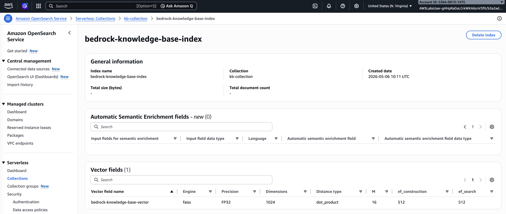
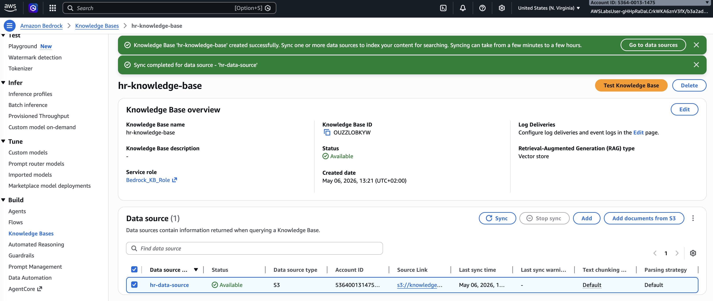
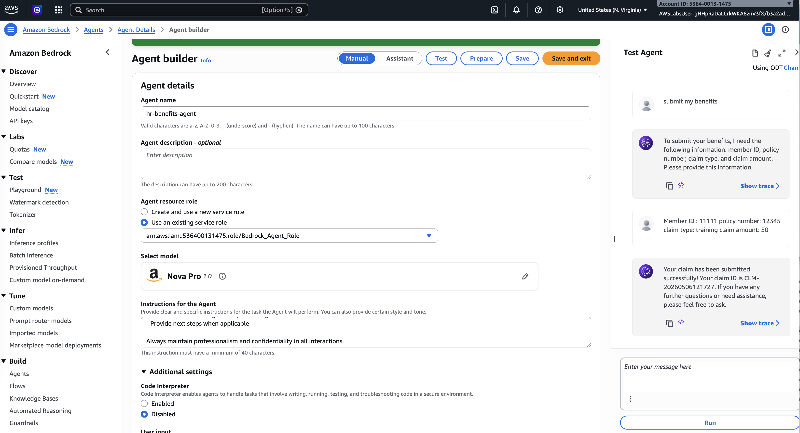
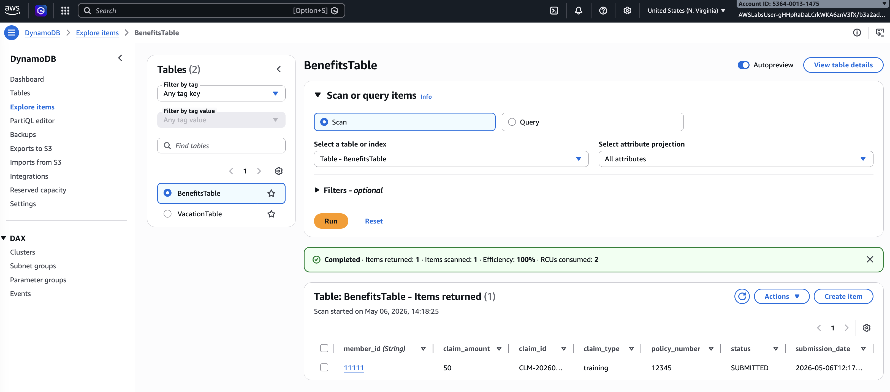
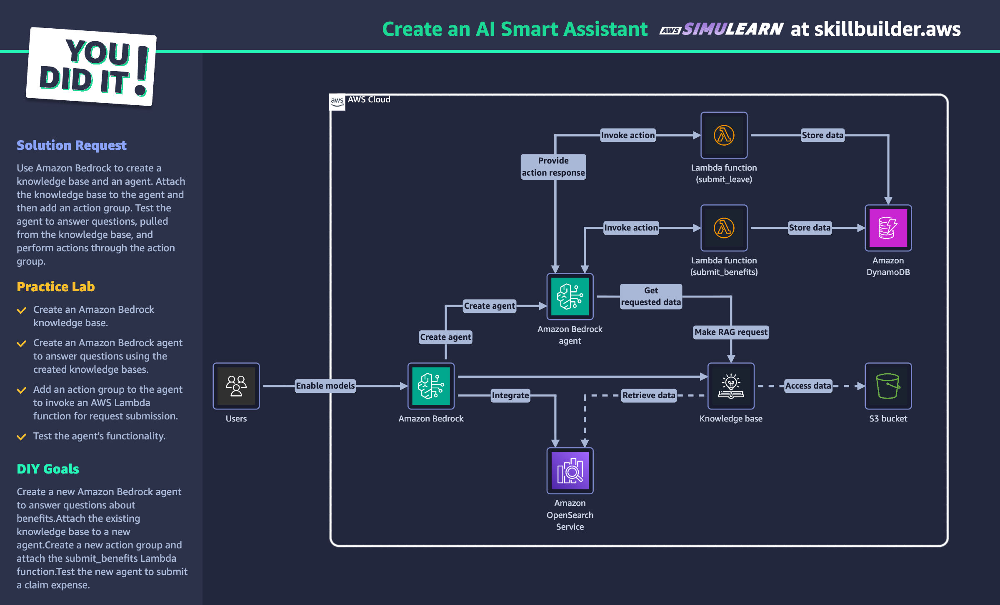

## AWS SimuLearn: Create an AI Smart Assistant

[Link to course on AWS Skill Builder](https://skillbuilder.aws/learn/PT6HBMUFM8/aws-simulearn-create-an-ai-smart-assistant/9VN4PQCUR8)

## Simulated business scenario
The HR department receives over 500 daily requests about policies, benefits, and procedures, but responses are limited to business hours and capacity. An AI solution is needed to automate responses and improve availability.

## AWS Services
* **Amazon Bedrock**: to create the knowledge base and AI agent
* **Amazon OpenSearch Service**: to store and retrieve vector embeddings for the knowledge base
* **AWS Lambda**: to execute actions (e.g., submit requests) through the agent’s action group
* **Amazon DynamoDB**: to store and manage request data (e.g., vacation or benefits requests)
* **Amazon Simple Storage Service (S3)**: to store HR documents used to build the knowledge base

## Solution

1. I reviewed the HR documents and the prompt stored in the S3 bucket.

2. I retrieved the ARN from the Amazon OpenSearch Service serveless collection `kb-collection` and reviewed the base index.




3. I created an Amazon Bedrock knowledge base with vector store and I called it `hr-knowledge-base`. As data source I used the HR documents stored in the S3 bucket.



4. I build an AI agent to answer employee questions
  - I used the pre-existing service role called `Bedrock Agent Role`
  - I used the model `Nova Pro 1.0`
  - I added the following instructions for the agent:
  ```
  You are a professional HR Assistant responsible for helping employees with HR-related policy questions. Follow these guidelines:

1. Primary Responsibilities:
- Answer questions about HR policies using all knowledge bases available
- Maintain professional and friendly tone
- Protect confidential information

2. When handling HR policy questions:
- Include relevant policy references only from available knowledge bases
- If the information is not in the knowledge bases, recommend consulting HR department

3. Limitations:
- Defer sensitive matters to HR department

4. Response Format:
- Be concise and clear
- Confirm understanding before proceeding
- Provide next steps when applicable

Always maintain professionalism and confidentiality in all interactions.
  ```
  - I attached the knowledge base to the agent for accurate responses
  - I created an action group called `submit-benefits` to handle requests using AWS Lambda function `submitBenefits.py`
  - I tested the agent for question answering and task execution  



5. I verified that the dynamoDB `BenefitsTable` contains my test entry.




## Final Architecture




## Conclusion
The AI smart assistant automates HR support by providing accurate answers and handling requests, improving efficiency and availability.

- I determined how to use Amazon Bedrock to create automated customer service solutions.
- I determined how to setup an Amazon Bedrock agent with knowledge bases.
- I demonstrated how to add action groups to an Amazon Bedrock agent.


## Completion Certificate


