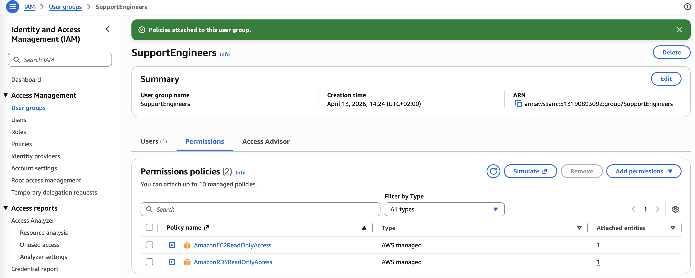
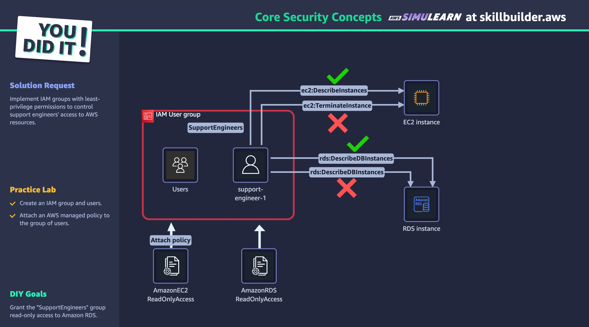
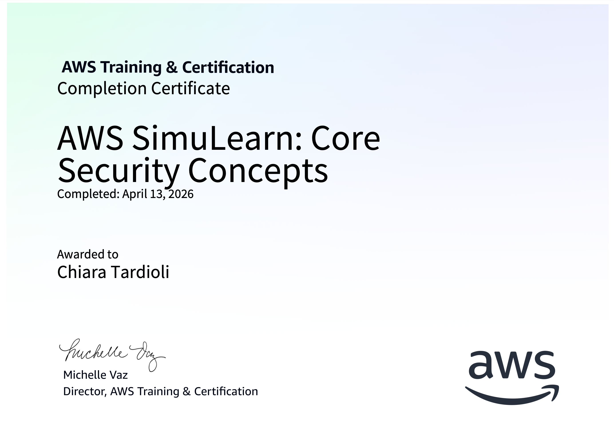

# AWS SimuLearn: Core Security Concepts

## Simulated business scenario

The stock exchange wants to restrict support engineers' system access to only those actions required for their specific roles, enhancing overall security controls.

## Overview

In this AWS SimuLearn assignment, I will review a real-world scenario, helping a fictional customer design a solution on AWS.

After the design is completed, I will build the proposed solution through structured, step-by-step guidance in a lab within a live AWS Management Console environment.

I will gain hands-on experience working with AWS services, developing job-ready competencies using the same tools technology professionals use to construct AWS solutions.

## AWS Services
- Amazon Elastic Compute Cloud
- AWS Identity and Access Management
- Amazon Relational Database Service

[Link to course on Skillbuilder](https://skillbuilder.aws/learn/3KYWQBTSTV/aws-simulearn-core-security-concepts/Q29T2DWZPK)

## Solution

1. I create an IAM group and users.
2. I attach an AWS managed policy to the group of users.
3. I grant the "SupportEngineers" group read-only access to Amazon RDS.

## Final Architecture

## Conclusion
- I compared IAM users, roles, and groups and their creation processes.
- I analyzed the structure and components of IAM policies.
- I explained the AWS Shared Responsibility Model and compliance programs.
- I implemented IAM best practices for secure access management.

## Completion Certificate

