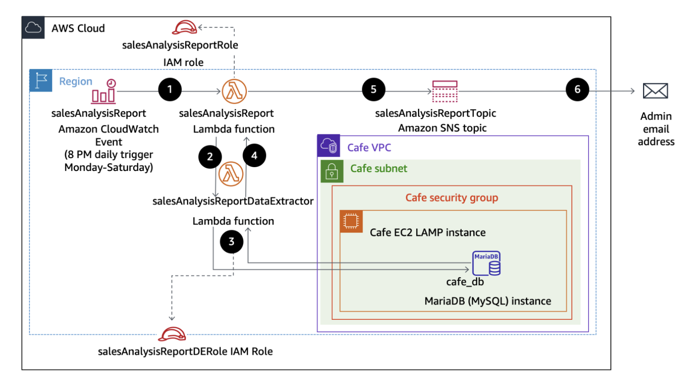
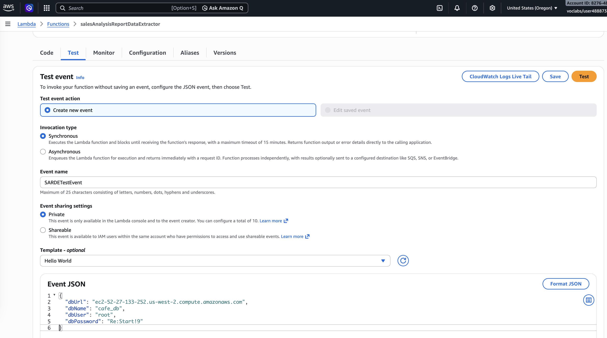

# Activity - Working with AWS Lambda

In this lab, I will deploy and configure an AWS Lambda based serverless computing solution. 
The Lambda function generates a sales analysis report by pulling data from a database and emailing the results daily. 
The database connection information is stored in Parameter Store, a capability of AWS Systems Manager. 
The database itself runs on an Amazon Elastic Compute Cloud (Amazon EC2) Linux, Apache, MySQL, and PHP (LAMP) instance.

The following diagram shows the architecture of the sales analysis report solution and illustrates the order in which actions occur.



## Sales Analysis Report Workflow

| Step | Details |
|------|---------|
| 1 | An Amazon CloudWatch Events event calls the `salesAnalysisReport` Lambda function at 8 PM every day Monday through Saturday. |
| 2 | The `salesAnalysisReport` Lambda function invokes another Lambda function, `salesAnalysisReportDataExtractor`, to retrieve the report data. |
| 3 | The `salesAnalysisReportDataExtractor` function runs an analytical query against the café database (`cafe_db`). |
| 4 | The query result is returned to the `salesAnalysisReport` function. |
| 5 | The `salesAnalysisReport` function formats the report into a message and publishes it to the `salesAnalysisReportTopic` Amazon SNS topic. |
| 6 | The `salesAnalysisReportTopic` SNS topic sends the message by email to the administrator. |

## Task 1: Observing the IAM role settings

1. The **salesAnalysisReportRole** IAM role has 4 policies:
- **AmazonSNSFullAccess** provides full access to Amazon SNS resources.
- **AmazonSSMReadOnlyAccess** provides read-only access to Systems Manager resources.
- **AWSLambdaBasicRunRole** provides write permissions to CloudWatch logs (which are required by every Lambda function).
- **AWSLambdaRole** gives a Lambda function the ability to invoke another Lambda function.  
Besides, *lambda.amazonaws.com* is listed as a trusted entity, which means that the Lambda service can use this role.

3. The **salesAnalysisReportDERole** IAM role has 2 policies:
- **AWSLambdaBasicRunRole** provides write permissions to CloudWatch logs.
- **AWSLambdaVPCAccessRunRole** provides permissions to manage elastic network interfaces to connect a function to a virtual private cloud (VPC).
Besides, *lambda.amazonaws.com* is listed as a trusted entity.

## Task 2: Creating a Lambda layer and a data extractor Lambda function

1. In AWS Lambda service, I create a **Lambda Layer** with these settings:
- Name: `pymysqlLibrary`
- Description: `PyMySQL library modules`
- Upload a .zip file: `pymysql-v3.zip` (previously downloaded)
- Compatible runtimes: `Python 3.14`

2. In AWS Lambda service, I create a data extractor **Lambda Function** with these settings:
- Select `Author from scratch`
- Name: `salesAnalysisReportDataExtractor`
- Runtime: `Python 3.14`
- Execution role: `salesAnalysisReportDERole` (existing role)

3. At the bottom of the page for the new function, in the Layers panel, I click edit and then add a layer with these options:
- Layer: `Custom layers`
- Custom layers: `pymysqlLibrary`
- Version: `1`

4. In the Runtime settings panel, I updated the **Handler** with `salesAnalysisReportDataExtractor.lambda_handler`. 
Then I import the code `salesAnalysisReportDataExtractor.py` (previously downloaded) for the data extractor Lambda function.

The AWS Lambda function connects to a MySQL database and retrieves aggregated sales data. It uses **pymysql** to establish a 
connection using credentials passed in the event. If the connection fails, it prints an error and exits. Once connected, it 
executes an SQL query that joins three tables (order_item, product, product_group) to calculate total quantities sold per 
product group and product. The results are fetched as a list of dictionaries. The database connection is then closed, and the 
function returns the query results in a JSON-like response with a status code.

The function expects these input parameters (from event):
- **dbUrl**: Database host (endpoint)
- **dbName**: Database name
- **dbUser**: Username
- **dbPassword**: Password

These inputs allow the Lambda function to securely connect to the database dynamically.

6. In the Configuring setting, I edit the VPC network settings for the function:
- VPC: option with Cafe VPC as the Name
- Subnets: option with Cafe Public Subnet 1 as the Name
- Security groups: option with CafeSecurityGroup as the Name

## Task 3: Testing the data extractor Lambda function

To invoke the salesAnalysisReportDataExtractor function, I need to supply values for the café database connection parameters. 
That these are stored in Parameter Store.

1. Launching a test of the Lambda function. I found the values for the parameters in **Parameter Store** under AWS Systems Manager.



After a few seconds, the page shows the message "Execution result: failed". 

2. Troubleshooting the data extractor Lambda function.
This error message indicates that the function timed out after 3 seconds.
```
{
  "errorType": "Sandbox.Timedout",
  "errorMessage": "RequestId: 2b68f3d0-d201-4466-898e-1a7fe124494e Error: Task timed out after 3.00 seconds"
}
```
Also the **Log output** section includes:
```
START RequestId: 2b68f3d0-d201-4466-898e-1a7fe124494e Version: $LATEST
END RequestId: 2b68f3d0-d201-4466-898e-1a7fe124494e
REPORT RequestId: 2b68f3d0-d201-4466-898e-1a7fe124494e	Duration: 3000.00 ms	Billed Duration: 3403 ms	Memory Size: 128 MB	Max Memory Used: 73 MB	Init Duration: 402.04 ms	Status: timeout
```

3. Fix the Lambda function: I added the inboud rule `MYSQL/Aurora` (port 3306)
for the security group **CafeSecurityGroup** that is used by the EC2 instance running the database
and then I test the function again. This time, the execution succedded with statusCode 200.

4. I open the café websit at the url `http://52.27.133.252/cafe/` and place an order. 
Then I test again the Lambda function. Now the result is code 200 and the product quantity information in the body:
```
{
  "statusCode": 200,
  "body": [
    {
      "product_group_number": 1,
      "product_group_name": "Pastries",
      "product_id": 1,
      "product_name": "Croissant",
      "quantity": 1
    },
    {
      "product_group_number": 1,
      "product_group_name": "Pastries",
      "product_id": 2,
      "product_name": "Donut",
      "quantity": 1
    },
    {
      "product_group_number": 1,
      "product_group_name": "Pastries",
      "product_id": 6,
      "product_name": "Strawberry Tart",
      "quantity": 1
    }
  ]
}
```

## Task 4: Configuring notifications

1. I create an SNS topic in **Simple Notification Service**:
- **Type**: Standard
- **Name**: `salesAnalysisReportTopic`
- **Display name**: `SARTopic`
This is the **ARN** value for this topic: `arn:aws:sns:us-west-2:827648958306:salesAnalysisReportTopic`.

2. I subscribing to the SNS topic in the **Subscription** tab:
- **Protocol**: `Email`
- **Endpoint**: `<my email>`
The subscription is created and has a Status of *Pending confirmation*.
After confirm the subscription using the link in the email *AWS Notification - Subscription Confirmation*, the status changes to *Confirmed*.

## Task 5: Creating the salesAnalysisReport Lambda function
Here I create and configure the salesAnalysisReport Lambda function. This function is the main driver of the sales analysis report flow. 
It does the following:
- Retrieves the database connection information from Parameter Store
- Invokes the salesAnalysisReportDataExtractor Lambda function, which retrieves the report data from the database
- Formats and publishes a message containing the report data to the SNS topic

1. I connecting to the CLI Host instance using the EC2 Management Console.
2. I configure the AWS CLI with the command `asw confugure` and the parameters from the lab.
3. I create the salesAnalysisReport Lambda function using the AWS CLI:
```bash
[ec2-user@ip-10-200-0-25 ~]$ cd activity-files/
[ec2-user@ip-10-200-0-25 activity-files]$ ls
salesAnalysisReport-v2.zip
[ec2-user@ip-10-200-0-25 activity-files]$ aws lambda create-function \
> --function-name salesAnalysisReport \
> --runtime python3.14 \
> --zip-file fileb://salesAnalysisReport-v2.zip \
> --handler salesAnalysisReport.lambda_handler \
> --region us-west-2 \
> --role arn:aws:iam::827648958306:role/salesAnalysisReportRole
{
    "FunctionName": "salesAnalysisReport", 
    "LastModified": "2026-03-25T17:38:44.194+0000", 
    "RevisionId": "c99c78ad-7a87-4ede-9f58-9d95e645bc7f", 
    "MemorySize": 128, 
    "State": "Pending", 
    "Version": "$LATEST", 
    "Role": "arn:aws:iam::827648958306:role/salesAnalysisReportRole", 
    "Timeout": 3, 
    "StateReason": "The function is being created.", 
    "Runtime": "python3.14", 
    "StateReasonCode": "Creating", 
    "TracingConfig": {
        "Mode": "PassThrough"
    }, 
    "CodeSha256": "FOQaNphpQr/canEnzctygYFVreHKiABxYNh8X8lOpnE=", 
    "Description": "", 
    "CodeSize": 1643, 
    "FunctionArn": "arn:aws:lambda:us-west-2:827648958306:function:salesAnalysisReport", 
    "Handler": "salesAnalysisReport.lambda_handler"
}
[ec2-user@ip-10-200-0-25 activity-files]$ 
```

4. I configure the salesAnalysisReport Lambda function by adding the enviromental variale:
- **Key**: `topicARN`
- **Value**: `arn:aws:iam::827648958306:role/salesAnalysisReportRole`

5. I create a test for the salesAnalysisReport Lambda function:
- **Test event action**: `Create new event`
- **Event name**:, `SARTestEvent`
- **Template**: `hello-world`
The function does not require any input parameters. Leave the default JSON lines as is.

I got a timeout error the first time, but the second time was successful:
```
{
  "statusCode": 200,
  "body": "\"Sale Analysis Report sent.\""
}
```

6. Adding a trigger to the salesAnalysisReport Lambda function

## 

## Conclusions
In this lab I learnt the followings.
- Recognize necessary AWS Identity and Access Management (IAM) policy permissions to facilitate a Lambda function to other Amazon Web Services (AWS) resources.
- Create a Lambda layer to satisfy an external library dependency.
- Create Lambda functions that extract data from database, and send reports to user.
- Deploy and test a Lambda function that is initiated based on a schedule and that invokes another function.
- Use CloudWatch logs to troubleshoot any issues running a Lambda function.


## Python code

```python
#
# Sales Analysis Report
#
import boto3
import os
import json
import io
import datetime

def setTabsFor(productName):

    # Determine the required number of tabs between Item Name and Quantity based on the item name's length.

    nameLength = len(productName)

    if nameLength < 20:
        tabs='\t\t\t'
    elif 20 <= nameLength <= 37:
        tabs = '\t\t'
    else:
        tabs = '\t'

    return tabs

def lambda_handler(event, context):

    # Retrieve the topic ARN and the region where the lambda function is running from the environment variables.

    TOPIC_ARN = os.environ['topicARN']
    FUNCTION_REGION = os.environ['AWS_REGION']

    # Extract the topic region from the topic ARN.

    arnParts = TOPIC_ARN.split(':')
    TOPIC_REGION = arnParts[3]

    # Get the database connection information from the Systems Manager Parameter Store.

    # Create an SSM client.

    ssmClient = boto3.client('ssm', region_name=FUNCTION_REGION)

    # Retrieve the database URL and credentials.

    parm = ssmClient.get_parameter(Name='/cafe/dbUrl')
    dbUrl = parm['Parameter']['Value']

    parm = ssmClient.get_parameter(Name='/cafe/dbName')
    dbName = parm['Parameter']['Value']

    parm = ssmClient.get_parameter(Name='/cafe/dbUser')
    dbUser = parm['Parameter']['Value']

    parm = ssmClient.get_parameter(Name='/cafe/dbPassword')
    dbPassword = parm['Parameter']['Value']

    # Create a lambda client and invoke the lambda function to extract the daily sales analysis report data from the database.

    lambdaClient = boto3.client('lambda', region_name=FUNCTION_REGION)

    dbParameters = {"dbUrl": dbUrl, "dbName": dbName, "dbUser": dbUser, "dbPassword": dbPassword}
    response = lambdaClient.invoke(FunctionName = 'salesAnalysisReportDataExtractor', InvocationType = 'RequestResponse', Payload = json.dumps(dbParameters))

    # Convert the response payload from bytes to string, then to a Python dictionary in order to retrieve the data in the body.

    reportDataBytes = response['Payload'].read()
    reportDataString = str(reportDataBytes, encoding='utf-8')
    reportData = json.loads(reportDataString)
    reportDataBody = reportData["body"]

    # Create an SNS client, and format and publish a message containing the sales analysis report based on the extracted report data.

    snsClient = boto3.client('sns', region_name=TOPIC_REGION)

    # Create the message.

    # Write the report header first.

    message = io.StringIO()
    message.write('Sales Analysis Report'.center(80))
    message.write('\n')

    today = 'Date: ' + str(datetime.datetime.now().strftime('%Y-%m-%d'))
    message.write(today.center(80))
    message.write('\n')

    if (len(reportDataBody) > 0):

        previousProductGroupNumber = -1

        # Format and write a line for each item row in the report data.

        for productRow in reportDataBody:

            # Check for a product group break.

            if productRow['product_group_number'] != previousProductGroupNumber:

               # Write the product group header.

                message.write('\n')
                message.write('Product Group: ' + productRow['product_group_name'])
                message.write('\n\n')
                message.write('Item Name'.center(40) + '\t\t\t' + 'Quantity' + '\n')
                message.write('*********'.center(40) + '\t\t\t' + '********' + '\n')

                previousProductGroupNumber = productRow['product_group_number']

            # Write the item line.

            productName = productRow['product_name']
            tabs = setTabsFor(productName)

            itemName = productName.center(40)
            quantity = str(productRow['quantity']).center(5)
            message.write(itemName + tabs + quantity + '\n')

    else:

        # Write a message to indicate that there is no report data.

        message.write('\n')
        message.write('There were no orders today.'.center(80))

    # Publish the message to the topic.

    response = snsClient.publish(
        TopicArn = TOPIC_ARN,
        Subject = 'Daily Sales Analysis Report',
        Message = message.getvalue()
    )

    # Return a successful function execution message.

    return {
        'statusCode': 200,
        'body': json.dumps('Sale Analysis Report sent.')
    }
```

