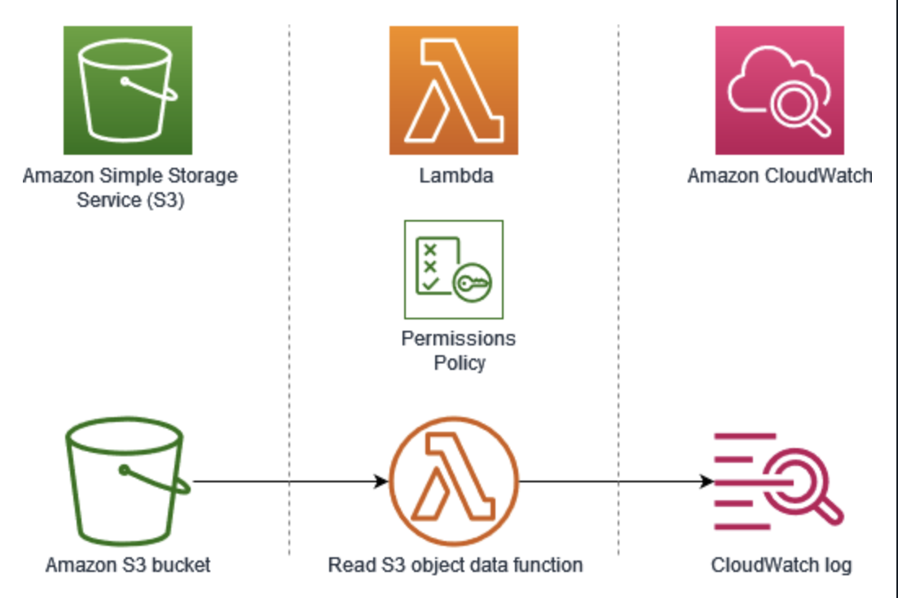

# AWS Lambda Exercise (Challenge)

In this challenge lab, I will create an AWS Lambda function to count the number of words in a text file.
Then, I will configure an Amazon S3 bucket to automatically invoke the Lambda function when a text file is uploaded.
Eventually, I will use an Amazon SNS topic to send the word count result as an email notification.

I will use the following AWS services:
- AWS Lambda
- Amazon S3
- Amazon SNS



## Implementation

1. I create an Amazon S3 bucket:
- Bucket type: `General purpose`
- Bucket Name: `amzon-s3-lambda-20260326`
I leave all other options set to their default values and choose Create bucket.

2. I generated a lorem ipsum text with `225` words and upload it to my bucket as test object.
```bash
$ wc -w loremipsum.txt 
     225 loremipsum.txt
```

3. I review the LambdaAccessRole role.

I need an AWS Identity and Access Management (IAM) role for the Lambda function to access other AWS services. 
Because the lab policy does not permit the creation of an IAM role, I use the LambdaAccessRole role. 
The LambdaAccessRole role provides the following permissions:
- AWSLambdaBasicExecutionRole - This is an AWS managed policy that provides write permissions to Amazon CloudWatch Logs.
- AmazonSNSFullAccess - This is an AWS managed policy that provides full access to Amazon SNS via the AWS Management Console.
- AmazonS3FullAccess - This is an AWS managed policy that provides full access to all buckets via the AWS Management Console.
- CloudWatchFullAccess - This is an AWS managed policy that provides full access to Amazon CloudWatch.

4. I create the Lambda function:
- Function name: `s3-trigger-wordcount`
- Runtime: Python 3.14
- Execution role: LambdaAccessRole


5. I deploy the Python code to count the number of words in a text file.
```python
# ========================== countwords.py ==========================
# Author: chatgpt
# Date  : 2026/03/25 
import boto3
import json

s3 = boto3.client('s3')

def lambda_handler(event, context):
    try:
        # Get bucket and file from event
        bucket = event['bucket']
        key = event['key']

        # Read file from S3
        response = s3.get_object(Bucket=bucket, Key=key)
        text = response['Body'].read().decode('utf-8')

        # Count words
        word_count = len(text.split())

        # Return response in standard JSON format
        return {
            "statusCode": 200,
            "body": json.dumps({
                "file": key,
                "word_count": word_count
            })
        }

    except Exception as e:
        return {
            "statusCode": 500,
            "body": json.dumps({
                "error": str(e)
            })
        }
```

6. I create the Amazon S3 trigger for the Lambda function `s3-trigger-wordcount`:
- Trigger configuration: `S3`
- Bucket: `amzon-s3-lambda-20260326`
- Event types: `All object create events`
- Recursive invocation: ckeck to acknowledge that using the same Amazon S3 bucket for input and output is not recommended

7. I test my Lambda function with the file I uploaded in step 2:
- Test event action: `Create New Even`
- Invocation type: `Synchronous`
- Event name: `MyTestEvent01`
- Event sharing settings: `Private`
- Even JSON:
```json
{
  "bucket": "amzon-s3-lambda-20260326",
  "key": "loremipsum.txt"
}
```
The test passed with output:
```json
{
  "statusCode": 200,
  "body": "{\"file\": \"loremipsum.txt\", \"word_count\": 225}"
}
```

## Step 3: Set up an Amazon SNS topic

2. Report the word count in an email by using an SNS topic. Optionally, also send the result in an SMS (text) message.

3. Format the response message as follows:
   - The word count in the <textFileName> file is nnn. 
   - Replace <textFileName> with the name of the file.

4. Enter the following text as the email subject: Word Count Result

5. Automatically invoke the function when the text file is uploaded to an S3 bucket.

## Challenge 2: Test the function by uploading a few sample text files with different word counts to the S3 bucket.

Test the Lambda function with the Amazon S3 trigger


## Conclusion
In this lab, I learnt how to:
- Create a Lambda function to count the number of words in a text file.
- Configure an Amazon Simple Storage Service (Amazon S3) bucket to invoke a Lambda function when a text file is uploaded to the S3 bucket.
- Create an Amazon Simple Notification Service (Amazon SNS) topic to report the word count in an email.


## Additional resources
- [What is AWS Lambda?](https://docs.aws.amazon.com/lambda/latest/dg/welcome.html)
- [Using an Amazon S3 trigger to invoke a Lambda function](https://docs.aws.amazon.com/lambda/latest/dg/with-s3-example.html)
- [AWS managed policy](https://docs.aws.amazon.com/IAM/latest/UserGuide/access_policies_managed-vs-inline.html#aws-managed-policies)

