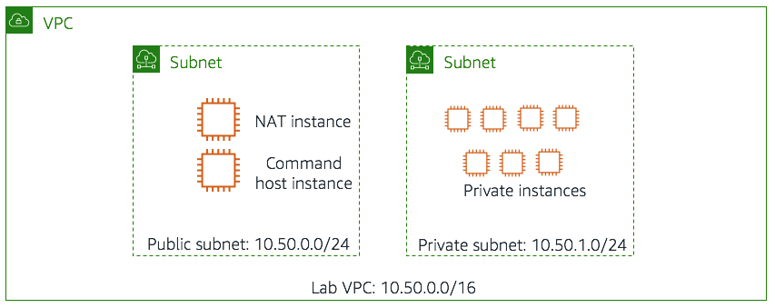
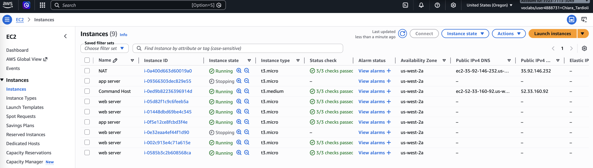
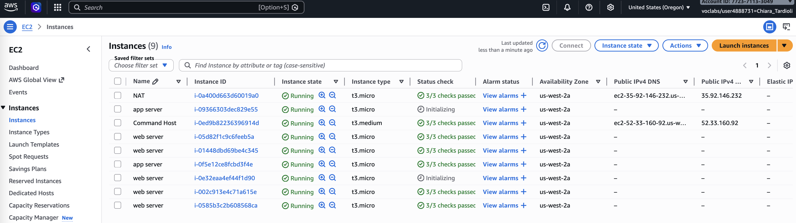
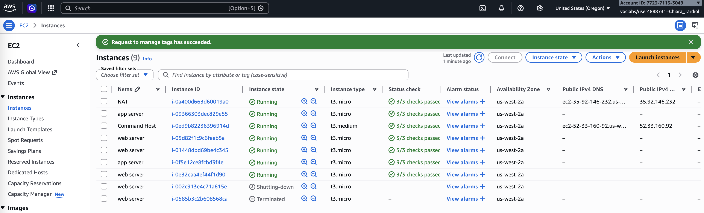

# Managing Resources with Tagging

This lab explores how AWS resource tagging can be used to organize, identify, and manage EC2 instances efficiently. 
Tagging enables automation of operational tasks such as filtering, updating, stopping, starting, and terminating instances 
based on metadata rather than manual selection. The lab demonstrates practical use of AWS CLI commands and scripts to manage 
instances in a structured environment using tags like Project, Environment, and Version.

The environment for this lab (diagram below) consists of:
- Amazon VPC named Lab VPC
- Public subnet
- Private subnet
- Amazon EC2 Linux instance named CommandHost [AWS Command Line Interface (CLI) tools have been pre-installed and configured for you on this instance]
- 8 Amazon EC2 Linux instances
- Private instances have three custom tags applied to them:
	- Project.	The project that the instance belongs to. The instances in this lab belong to one of two projects: ERPSystem and Experiment1.
	- Version.	The version of the project that this instance belongs to. All Version tags are currently set to 1.0.
	- Environment.	One of three values: development, staging, or production.



## Task 1: Inspecting and Updating Tags Using AWS CLI

I began by accessing the CommandHost instance where AWS CLI was preconfigured. My first step was to identify EC2 instances associated with the 
`ERPSystem` project using tag-based filtering.

I ran the following command:

```bash
[ec2-user@ip-10-5-0-10 ~]$ aws ec2 describe-instances --filter "Name=tag:Project,Values=ERPSystem" "Name=tag:Environment,Values=development"
{
    "Reservations": [
        {
            "Instances": [
                {
                    "Monitoring": {
                        "State": "disabled"
                    }, 
                    "PublicDnsName": "", 
                    "State": {
                        "Code": 16, 
                        "Name": "running"
                    }, 
...
````

This returned all instances linked to the ERPSystem project. However, the output was too detailed, so I refined it using JMESPath queries.

To extract only instance IDs, I used:

```bash
[ec2-user@ip-10-5-0-10 ~]$ aws ec2 describe-instances --filter "Name=tag:Project,Values=ERPSystem" --query 'Reservations[*].Instances[*].InstanceId'
[
    [
        "i-09366303dec829e55"
    ], 
...
]
```

To improve readability, I included both Instance ID and Availability Zone:

```bash
[ec2-user@ip-10-5-0-10 ~]$ aws ec2 describe-instances --filter "Name=tag:Project,Values=ERPSystem" --query 'Reservations[*].Instances[*].{ID:InstanceId,AZ:Placement.AvailabilityZone}'

[
    [
        {
            "AZ": "us-west-2a", 
            "ID": "i-09366303dec829e55"
        }
    ], 
...
]
```

I then extended the query to include custom tags (Project, Environment, Version):

```bash
[ec2-user@ip-10-5-0-10 ~]$ aws ec2 describe-instances --filter "Name=tag:Project,Values=ERPSystem" --query 'Reservations[*].Instances[*].{ID:InstanceId,AZ:Placement.AvailabilityZone,Project:Tags[?Key==`Project`] | [0].Value,Environment:Tags[?Key==`Environment`] | [0].Value,Version:Tags[?Key==`Version`] | [0].Value}'

[
    [
        {
            "Project": "ERPSystem", 
            "Environment": "development", 
            "AZ": "us-west-2a", 
            "Version": "1.0", 
            "ID": "i-09366303dec829e55"
        }
    ], 
...
]
```

To focus only on development instances, I applied an additional filter:
```bash
[ec2-user@ip-10-5-0-10 ~]$ aws ec2 describe-instances --filter "Name=tag:Project,Values=ERPSystem" "Name=tag:Environment,Values=development" --query 'Reservations[*].Instances[*].{ID:InstanceId,AZ:Placement.AvailabilityZone,Project:Tags[?Key==`Project`] | [0].Value,Environment:Tags[?Key==`Environment`] | [0].Value,Version:Tags[?Key==`Version`] | [0].Value}'
[
    [
        {
            "Project": "ERPSystem", 
            "Environment": "development", 
            "AZ": "us-west-2a", 
            "Version": "1.0", 
            "ID": "i-09366303dec829e55"
        }
    ], 
    [
        {
            "Project": "ERPSystem", 
            "Environment": "development", 
            "AZ": "us-west-2a", 
            "Version": "1.0", 
            "ID": "i-0e32eaa4ef44f1d90"
        }
    ]
]
```

Only two instances were returned by this command, both with a Project tag value of ERPSystem and an Environment tag value of development.

### Updating the Version Tag

I used the bash script `change-resource-tags.sh` to automatically change all of the Version tags on the instances marked as development for the project ERPSystem.
```bash
GNU nano 2.9.8      change-resource-tags.sh                                                                                 
#!/bin/bash
ids=$(aws ec2 describe-instances \
    --filter "Name=tag:Project,Values=ERPSystem" "Name=tag:Environment,Values=development" \
    --query 'Reservations[*].Instances[*].InstanceId' \
    --output text)
aws ec2 create-tags --resources $ids --tags 'Key=Version,Value=1.1'
```
The script identified development instances and updated their Version tag from `1.0` to `1.1` using:
I also noticed how the first command uses the **--output text** option to manipulate the return results as text instead of as JSON, 
making it easier to manipulate the return result and pass it to other commands.


I executed the script:

```bash
./change-resource-tags.sh
```

Finally, I verified the update using the same describe-instances command and confirmed that only development instances had their version updated.
```bash
[ec2-user@ip-10-5-0-10 ~]$ aws ec2 describe-instances --filter "Name=tag:Project,Values=ERPSystem" --query 'Reservations[*].Instances[*].{ID:InstanceId, AZ:Placement.AvailabilityZone, Project:Tags[?Key==`Project`] |[0].Value,Environment:Tags[?Key==`Environment`] | [0].Value,Version:Tags[?Key==`Version`] | [0].Value}'
[
    [
        {
            "Project": "ERPSystem", 
            "Environment": "development", 
            "AZ": "us-west-2a", 
            "Version": "1.1", 
            "ID": "i-09366303dec829e55"
        }
    ], 
    [
        {
            "Project": "ERPSystem", 
            "Environment": "production", 
            "AZ": "us-west-2a", 
            "Version": "1.0", 
            "ID": "i-05d82f1c9c6feeb5a"
        }
    ], 
    [
        {
            "Project": "ERPSystem", 
            "Environment": "staging", 
            "AZ": "us-west-2a", 
            "Version": "1.0", 
            "ID": "i-01448dbd69be4c345"
        }
    ], 
    [
        {
            "Project": "ERPSystem", 
            "Environment": "staging", 
            "AZ": "us-west-2a", 
            "Version": "1.0", 
            "ID": "i-0f5e12ce8fcbd3f4e"
        }
    ], 
    [
        {
            "Project": "ERPSystem", 
            "Environment": "development", 
            "AZ": "us-west-2a", 
            "Version": "1.1", 
            "ID": "i-0e32eaa4ef44f1d90"
        }
    ], 
    [
        {
            "Project": "ERPSystem", 
            "Environment": "production", 
            "AZ": "us-west-2a", 
            "Version": "1.0", 
            "ID": "i-002c913e4c71a615e"
        }
    ], 
    [
        {
            "Project": "ERPSystem", 
            "Environment": "staging", 
            "AZ": "us-west-2a", 
            "Version": "1.0", 
            "ID": "i-0585b3c2b608568ca"
        }
    ]
]
```

## Task 2: Stopping and Starting Instances by Tag

I navigated to the tools directory `aws-tools` and review the file `stopinator.php`:
```bash
 GNU nano 2.9.8              stopinator.php                                                                                     

#!/usr/bin/php
<?php
# A simple PHP script to start all Amazon EC2 instances and Amazon RDS
# databases within all regions.
#
# USAGE: stopinator.php [-t stop-tags] [-nt exclude-tags]
#
# If no arguments are supplied, stopinator stops every Amazon EC2 and 
# Amazon RDS instance running in an account. 
#
# -t stop-tag: The tags to inspect to determine if a resource should be 
# shut down. Format must follow the same format used by the AWS CLI.
#
# -e exclude-id: The instance ID of an Amazon EC2 instance NOT to terminate. Useful
# when running the stopinator from an Amazon EC2 instance. 
#
# -p profile-name: The name of the AWS configuration section to use for 
# credentials. Configuration sections are defines in your .aws/credentials file. 
# If not supplied, will use the default profile. 
#
# -s start: If present, starts instead of stops instances.
# PREREQUISITES
# This app assumes that you have defined an .aws/credentials file. 

require 'vendor/autoload.php';
use Aws\Ec2\Ec2Client;

...
```

The script uses AWS SDK for PHP to stop or start instances based on tag filters.

To stop development instances:
```bash
[ec2-user@ip-10-5-0-10 aws-tools]$ ./stopinator.php -t"Project=ERPSystem;Environment=development"
...
Region is us-west-1
	No instances to stop in Array.
Region is us-west-2
	Identified instance i-09366303dec829e55
	Identified instance i-0e32eaa4ef44f1d90
	Stopping identified instances in Array...
```

The script identified two instances and stopped them.

I verified the status in the AWS EC2 console:



Next, I restarted them using:
```bash
[ec2-user@ip-10-5-0-10 aws-tools]$ ./stopinator.php -t"Project=ERPSystem;Environment=development" -s
...
Region is us-west-1
	No instances to start in Array
Region is us-west-2
	Identified instance i-09366303dec829e55
	Identified instance i-0e32eaa4ef44f1d90
PHP Notice:  Array to string conversion in /home/ec2-user/aws-tools/stopinator.php on line 105

	Starting identified instances in Array...
```

I confirmed that both instances returned to running state.



## Task 3: Challenge – Terminate Non-Compliant Instances

In this challenge, I worked on identifying and terminating instances that did not have the required `Environment` tag.

I reviewed the provided script:

```bash
nano terminate-instances.php
```

The script performs three key actions:

1. Retrieves instances with the `Environment` tag.
2. Compares them against all instances in a subnet.
3. Identifies and terminates those missing the required tag.

To simulate non-compliance, I removed the `Environment` tag from two instances using the EC2 console.

Then I executed the script:

```bash
[ec2-user@ip-10-5-0-10 aws-tools]$ ./terminate-instances.php -region us-west-2 -subnetid subnet-075ad19c0c67c4326

Checking i-09366303dec829e55
Checking i-05d82f1c9c6feeb5a
Checking i-01448dbd69be4c345
Checking i-0f5e12ce8fcbd3f4e
Checking i-0e32eaa4ef44f1d90
Checking i-002c913e4c71a615e
Checking i-0585b3c2b608568ca
Terminating instances...
Instances terminated.
```

The script detected non-compliant instances and terminated them automatically.



## Conclusion

This lab demonstrated how AWS tagging can be effectively used to manage and automate EC2 instance operations. I learned how to filter resources 
using AWS CLI, manipulate output using JMESPath queries, and automate tagging operations through scripts. Additionally, I gained practical 
experience using tags to control instance lifecycle actions such as stopping, starting, and terminating resources. Overall, tagging proved to be a 
powerful method for organizing and managing cloud infrastructure efficiently.

In summary:
- I applied tags to existing AWS resources.
- I find resources based on tags.
- I used the AWS CLI or AWS SDK for PHP to stop and terminate Amazon EC2 instances based on certain attributes of the resource.

## Bash Commands
```bash
# Describe all EC2 instances with the tag Project=ERPSystem
aws ec2 describe-instances --filter "Name=tag:Project,Values=ERPSystem"

# Retrieve only the Instance IDs of EC2 instances tagged with Project=ERPSystem
aws ec2 describe-instances \
  --filter "Name=tag:Project,Values=ERPSystem" \
  --query 'Reservations[*].Instances[*].InstanceId'

# Retrieve Instance IDs along with their Availability Zones
aws ec2 describe-instances \
  --filter "Name=tag:Project,Values=ERPSystem" \
  --query 'Reservations[*].Instances[*].{ID:InstanceId,AZ:Placement.AvailabilityZone}'

# Retrieve Instance details including custom tags: Project, Environment, and Version
aws ec2 describe-instances \
  --filter "Name=tag:Project,Values=ERPSystem" \
  --query 'Reservations[*].Instances[*].{ID:InstanceId,AZ:Placement.AvailabilityZone,Project:Tags[?Key==`Project`] | [0].Value,Environment:Tags[?Key==`Environment`] | [0].Value,Version:Tags[?Key==`Version`] | [0].Value}'

# Retrieve only development instances within the ERPSystem project
aws ec2 describe-instances \
  --filter "Name=tag:Project,Values=ERPSystem" "Name=tag:Environment,Values=development" \
  --query 'Reservations[*].Instances[*].{ID:InstanceId,AZ:Placement.AvailabilityZone,Project:Tags[?Key==`Project`] | [0].Value,Environment:Tags[?Key==`Environment`] | [0].Value,Version:Tags[?Key==`Version`] | [0].Value}'

# Store Instance IDs of development instances in a variable for reuse
ids=$(aws ec2 describe-instances \
  --filter "Name=tag:Project,Values=ERPSystem" "Name=tag:Environment,Values=development" \
  --query 'Reservations[*].Instances[*].InstanceId' \
  --output text)

# Update (or create) the Version tag to 1.1 for selected instances
aws ec2 create-tags --resources $ids --tags 'Key=Version,Value=1.1'

# Verify that tags have been updated correctly
aws ec2 describe-instances \
  --filter "Name=tag:Project,Values=ERPSystem" \
  --query 'Reservations[*].Instances[*].{ID:InstanceId,AZ:Placement.AvailabilityZone,Project:Tags[?Key==`Project`] | [0].Value,Environment:Tags[?Key==`Environment`] | [0].Value,Version:Tags[?Key==`Version`] | [0].Value}'

# Stop all instances matching specific tags using the provided PHP script
./stopinator.php -t"Project=ERPSystem;Environment=development"

# Start previously stopped instances matching the same tags
./stopinator.php -t"Project=ERPSystem;Environment=development" -s

# Terminate non-compliant instances (missing required tags) in a given region and subnet
./terminate-instances.php -region <region> -subnetid <subnet-id>

# (Optional) Directly terminate instances by specifying their Instance IDs
aws ec2 terminate-instances --instance-ids <instance-id-1> <instance-id-2>
```

## Stopping Instances PHP
```GNU nano 2.9.8 stopping-instances.php
#!/usr/bin/php
<?php
# A simple PHP script to start all Amazon EC2 instances and Amazon RDS
# databases within all regions.
#
# USAGE: stopinator.php [-t stop-tags] [-nt exclude-tags]
#
# If no arguments are supplied, stopinator stops every Amazon EC2 and 
# Amazon RDS instance running in an account. 
#
# -t stop-tag: The tags to inspect to determine if a resource should be 
# shut down. Format must follow the same format used by the AWS CLI.
#
# -e exclude-id: The instance ID of an Amazon EC2 instance NOT to terminate. Useful
# when running the stopinator from an Amazon EC2 instance. 
#
# -p profile-name: The name of the AWS configuration section to use for 
# credentials. Configuration sections are defines in your .aws/credentials file. 
# If not supplied, will use the default profile. 
#
# -s start: If present, starts instead of stops instances.
# PREREQUISITES
# This app assumes that you have defined an .aws/credentials file. 

require 'vendor/autoload.php';
use Aws\Ec2\Ec2Client;

date_default_timezone_set('UTC');

# Obtain the profile name.
$profile = "default"; 
$opts = getopt('p::t::e::s::');
if (array_key_exists('p', $opts)) { $profile = $opts['p']; }

$excludeID = "";
if (array_key_exists('e', $opts)) {
        $excludeID = $opts['e'];
}

$start = false;
if (array_key_exists('s', $opts)) {
        $start = true;
}

$ec2DescribeArgs = array();
if (array_key_exists('t', $opts))
{
        $tagArray = array();
        foreach (explode(";", $opts['t']) as $pair) { 
                $nameVal = explode("=", $pair);
                array_push($tagArray, array(
                        'Name' => "tag:" . $nameVal[0], 
                        'Values' => array($nameVal[1])
                        ));
        }

        $ec2DescribeArgs['Filters'] = $tagArray; 
}

# Iterate through all available AWS regions.
$ec2 = Ec2Client::factory(array(
        'profile' =>$profile,
        'region' => 'us-east-1'
));

$regions = $ec2->describeRegions();
foreach ($regions['Regions'] as $region) {
        $instanceIds = array();

        # Find resources in each region. 
        echo 'Region is ' . $region['RegionName'] . "\n"; 
        $ec2Current = Ec2Client::factory(array( 
                'profile' => $profile, 
                'region' => $region['RegionName']
        ));
	$result = $ec2Current->describeInstances($ec2DescribeArgs);
        foreach ($result['Reservations'] as $reservation) {
                foreach ($reservation['Instances'] as $instance) {
                        # Check that this is not an excluded instance.  
                        if (strlen($excludeID) > 0 && $excludeID == $instance['InstanceId']) {
                                echo "\tExcluding instance " . $instance['InstanceId'] . "\n";
                        } else { 
                                # Is it a running instance?
                                if ($start) {
                                        if ($instance['State']['Code'] == 80) {
                                                array_push($instanceIds, $instance['InstanceId']);
                                                echo "\tIdentified instance " . $instance['InstanceId'] . "\n"; 
                                        } else {
                                                echo "\tInstance " . $instance['InstanceId'] . " - not stopped\n";  
                                        }
                                } else {
                                        if ($instance['State']['Code'] == 16) {
                                                array_push($instanceIds, $instance['InstanceId']); 
                                                echo "\tIdentified instance " . $instance['InstanceId'] . "\n"; 
                                        } else {
                                                echo "\tInstance " . $instance['InstanceId'] . " - already stopped\n"; 
                                        }
                                }
                        }
                }
        } 

	if ($start) {
                if (count($instanceIds) > 0) { 
                        echo "\n\tStarting identified instances in " . $region . "...\n"; 
                        $ec2Current->startInstances(array(
                                "InstanceIds" => $instanceIds
                        ));
                } else {
                        echo "\n\tNo instances to start in " . $region . "\n";  
                } 
        } else { 
                # Stop all identified instances. 
                if (count($instanceIds) > 0) {
                        echo "\n\tStopping identified instances in " . $region . "...\n";
                        $ec2Current->stopInstances(array(
                                "InstanceIds" => $instanceIds
                        ));
                } else {
                        echo "\n\tNo instances to stop in " . $region . ".\n"; 
                }
        } 
}
?>
```

## Terminate Instances PHP
```GNU nano 2.9.8 terminate-instances.php
#!/usr/bin/php

<?php
require 'vendor/autoload.php';
use Aws\Ec2\Ec2Client;

$region = "us-west-2";
$subnetid = "";
$profile = "default"; # Only needed if not using IAM roles

# Necessary to quell a PHP error.
date_default_timezone_set('America/Los_Angeles');

array_shift($argv);
if (count($argv>0)) {
        do {
            	$elem = array_shift($argv);
                if ($elem == "-region") {
                        $region = array_shift($argv);
                } elseif ($elem == "-subnetid") {
                        $subnetid = array_shift($argv);
                }
        } while (count($argv) > 0);
}

# Iterate through all available AWS regions.
$ec2 = Ec2Client::factory(array(
        'profile' =>$profile,
        'region' => $region
));

# Obtain a list of all instances with the Environment tag set.
$goodInstances = array();
$terminateInstances = array();

$tagArgs = array();
array_push($tagArgs,  array(
        'Name' => 'tag-key',
        'Values' => array('Environment')
));
$ec2DescribeArgs['Filters'] = $tagArgs;

$result = $ec2->describeInstances($ec2DescribeArgs);
foreach ($result['Reservations'] as $reservation) {
        foreach ($reservation['Instances'] as $instance) {
                $goodInstances[$instance['InstanceId']] = 1;
        }
}
# Obtain a list of all instances.
$subnetArgs = array();
array_push($subnetArgs, array(
        'Name' => 'subnet-id',
        'Values' => array($subnetid)
));
$ec2DescribeArgs['Filters'] = $subnetArgs;

$result = $ec2->describeInstances($ec2DescribeArgs);
foreach ($result['Reservations'] as $reservation) {
        foreach ($reservation['Instances'] as $instance) {
                echo "Checking " . $instance['InstanceId'] . "\n";
                if (!array_key_exists($instance['InstanceId'], $goodInstances)) {
                        $terminateInstances[$instance['InstanceId']] = 1;
                }
        }
}

# Terminate all identified instances.
if (count($terminateInstances) > 0) {
        echo "Terminating instances...\n";
        $ec2->terminateInstances(array(
                "InstanceIds" => array_keys($terminateInstances),
                "Force" => true
        ));
	echo "Instances terminated.\n";
} else {
        echo "No instances to terminate.\n";
}
?>
```
