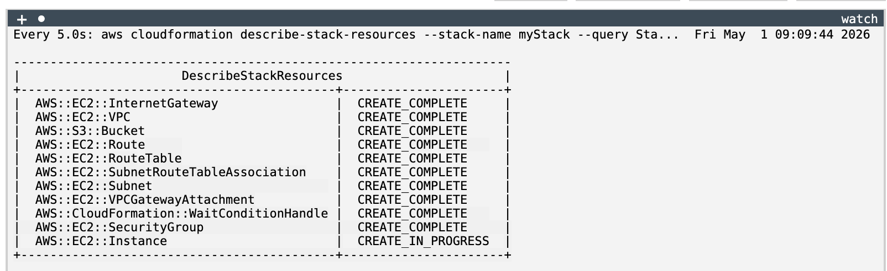
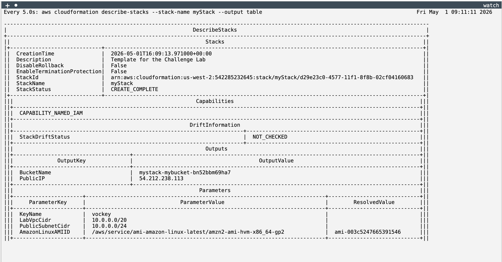

# Using AWS CloudFormation to Create an AWS VPC and Amazon EC2 Instance

This lab focused on using AWS CloudFormation to deploy infrastructure as code (IaC) in order to create a basic AWS environment. 
The environment consisted of a Virtual Private Cloud (VPC), Internet Gateway, subnet configuration, security group rules, and an EC2 instance deployed inside the network.

The purpose of the lab was to build and troubleshoot a CloudFormation template through iterative testing until all required resources were successfully deployed.

## Solution

I started by accessing the AWS CLI environment and verifying that my credentials were properly configured. I confirmed access using the identity command.

```bash
eee_W_5901813@runweb225490:~$ aws sts get-caller-identity                                    
{                                                                                            
    "UserId": "AROAX4QVX7ICSJH7MBQE5:user4888731=Chiara_Tardioli",                           
    "Account": "542285232645",                                                               
    "Arn": "arn:aws:sts::542285232645:assumed-role/voclabs/user4888731=Chiara_Tardioli"      
}                                                                                            
````

After confirming access, I wrote the CloudFormation template. During the first attempt, I encountered a validation error caused by an incorrect template version:

```text
2026-05-01 is not a supported value for AWSTemplateFormatVersion
```

To fix this, I updated the template to the correct format version:

```yaml
AWSTemplateFormatVersion: 2010-09-09
```

Here is the final version of the [template.yaml](./files/template.yaml).

I then proceeded to create the CloudFormation stack using the AWS CLI:

```bash
aws cloudformation create-stack \
--stack-name myStack \
--template-body file://template.yaml \
--parameters ParameterKey=KeyName,ParameterValue=vockey
```

During deployment, I monitored the stack progress using CloudFormation commands and JMESPath filtering:

```bash
aws cloudformation describe-stack-resources \
--stack-name myStack \
--query 'StackResources[*].[ResourceType,ResourceStatus]' \
--output table
```

This helped me track resource creation in real time.



I also validated the overall stack status:

```bash
aws cloudformation describe-stacks \
--stack-name myStack
```

I waited until it reached `CREATE_COMPLETE`.

Finally, I verified that all resources were successfully deployed:

* VPC created successfully
* Internet Gateway attached
* Security group configured for SSH access
* EC2 instance launched in the VPC



## Conclusion

In this lab, I learned how to deploy and troubleshoot AWS infrastructure using CloudFormation and the AWS CLI. I gained experience identifying template 
validation errors, correcting configuration issues, and monitoring stack deployment using CLI commands.

I also learned how small syntax mistakes in a CloudFormation template can prevent deployment and how iterative debugging is essential for successful 
infrastructure creation. By the end of the lab, I was able to successfully deploy a complete AWS environment using infrastructure as code.

## Additional resources

[Boto3 documentation](https://docs.aws.amazon.com/boto3/latest/)

You use the AWS SDK for Python (Boto3) to create, configure, and manage AWS services, such as Amazon Elastic Compute Cloud (Amazon EC2) and Amazon Simple Storage Service (Amazon S3). The SDK provides an object-oriented API as well as low-level access to AWS services.
