# Scaling and Load Balancing Your Architecture

This lab focuses on implementing scalability and high availability in a cloud environment using Amazon Web Services. 
The main objective is to configure Elastic Load Balancing (ELB) and EC2 Auto Scaling to dynamically distribute traffic and 
adjust compute capacity based on demand. These services help ensure fault tolerance, optimize performance, and reduce operational 
costs by automatically responding to varying workloads.

The architecture evolves from a single EC2 instance in a public subnet to a more resilient setup that includes a load balancer and 
multiple EC2 instances distributed across private subnets in multiple Availability Zones.

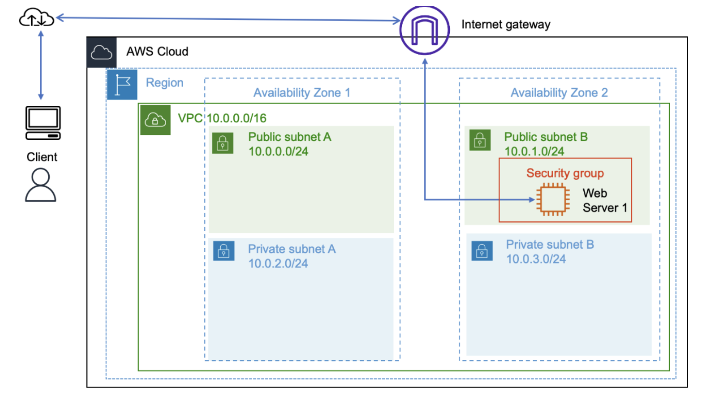

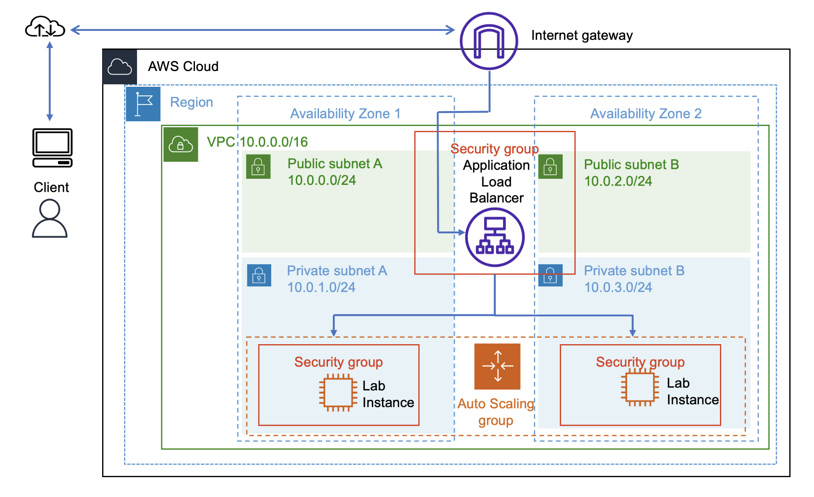

## Task 1: Creating an AMI for Auto Scaling

In this task, I created an Amazon Machine Image (AMI) from the existing Web Server 1 instance. This allowed me to capture the configuration 
and state of the instance so that identical instances could be launched later.

I navigated to the EC2 dashboard, selected the running instance, and created an image named *Web Server AMI*. This AMI serves as the base image 
for future instances in the Auto Scaling group.

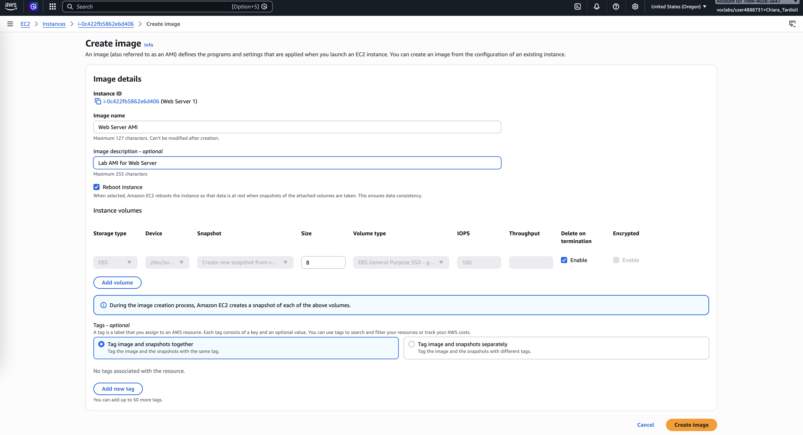

## Task 2: Creating a Load Balancer

I created an Application Load Balancer named *LabELB* to distribute incoming traffic across multiple EC2 instances.

I configured it to span two Availability Zones using public subnets and associated it with the existing Web Security Group. I also created a 
target group named *lab-target-group* to route traffic to EC2 instances.

After completing the setup, I retrieved the DNS name of the load balancer for later testing.

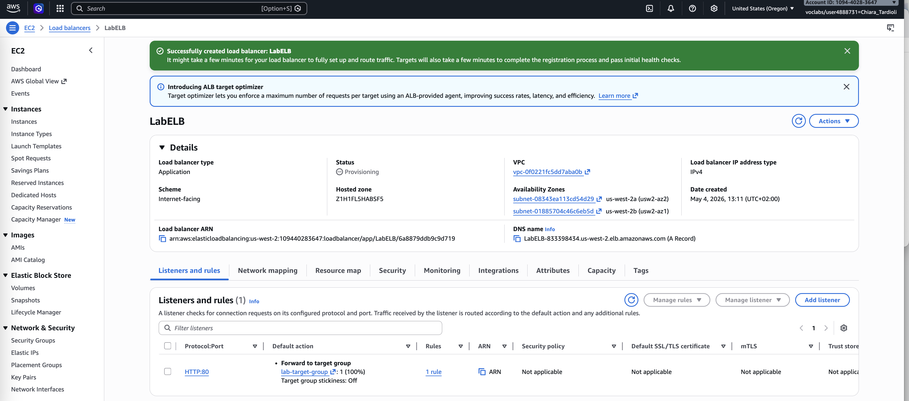

DNS name: `LabELB-833398434.us-west-2.elb.amazonaws.com`

## Task 3: Creating a Launch Template

Next, I created a launch template named *lab-app-launch-template*. This template defines the configuration for instances launched by the Auto Scaling group.

I selected the previously created AMI, chose the instance type *t3.micro*, and assigned the Web Security Group. No key pair was required since direct 
access to instances was not needed.

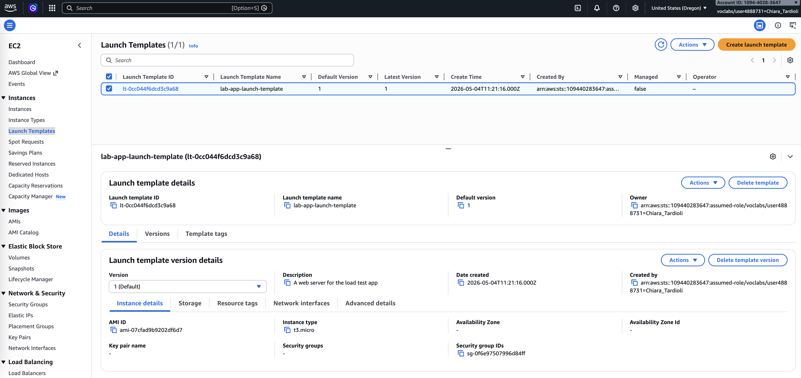

## Task 4: Creating an Auto Scaling Group

Using the launch template, I created an Auto Scaling group named *Lab Auto Scaling Group*.

I configured the group to launch instances in private subnets across two Availability Zones. I attached the group to the previously 
created target group and enabled ELB health checks.

I set the desired capacity to 2 instances, with a minimum of 2 and a maximum of 4. I also configured a target tracking scaling policy to 
maintain average CPU utilization at 50%.

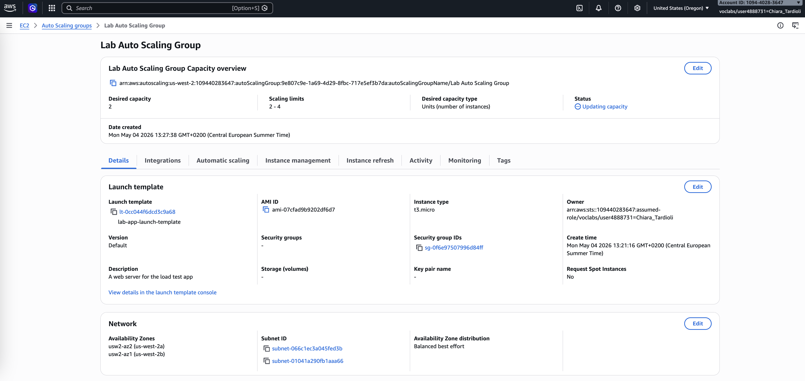

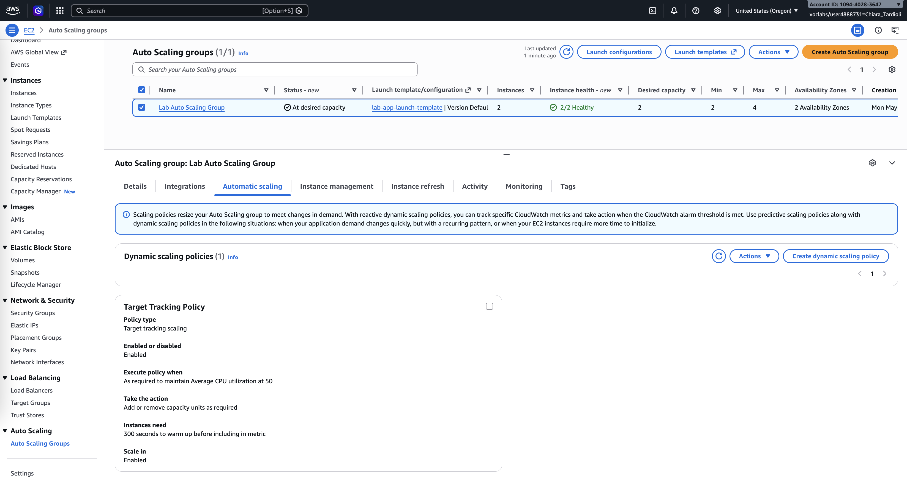

## Task 5: Verifying Load Balancing

I verified that the Auto Scaling group successfully launched two EC2 instances. Then, I checked the target group to confirm that both instances 
passed the health checks and were marked as healthy.

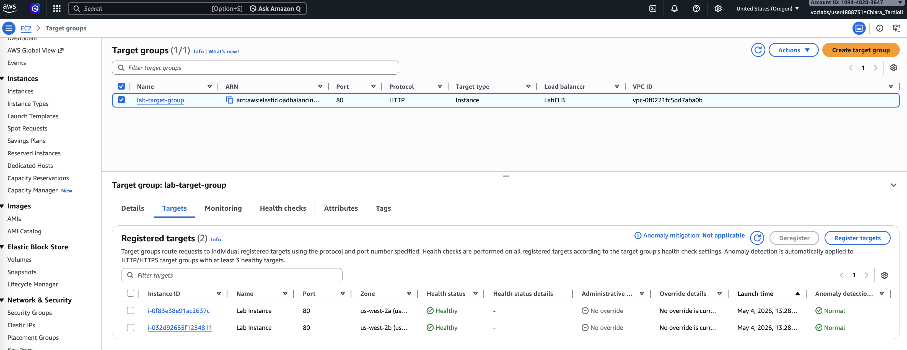

A *healthy status* indicates that an instance has passed the load balancer's health check. This check means that the load balancer will send traffic to the instance.

Using the load balancer’s DNS name, I accessed the application in a browser and confirmed that the load balancer was correctly routing traffic to the instances.

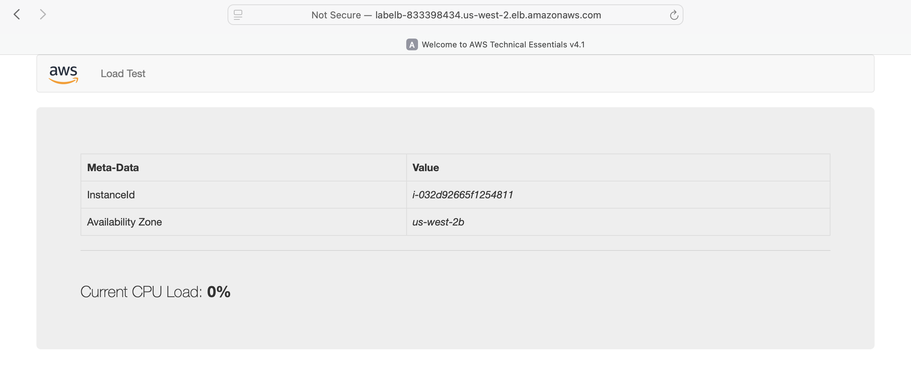

## Task 6: Testing Auto Scaling

To test scaling behavior, I generated load using the Load Test application. This increased CPU utilization across instances.

I monitored the CloudWatch alarms and observed that the *AlarmHigh* state was triggered once CPU usage exceeded 50%. 
As a result, the Auto Scaling group launched additional instances.

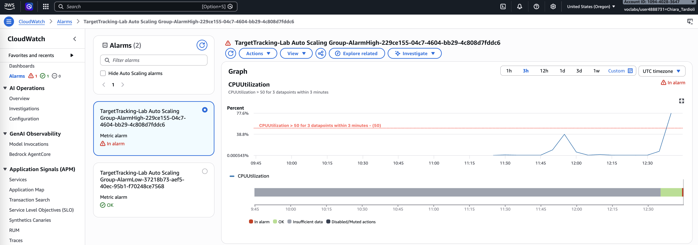

I confirmed that more than two instances were running, demonstrating successful automatic scaling.

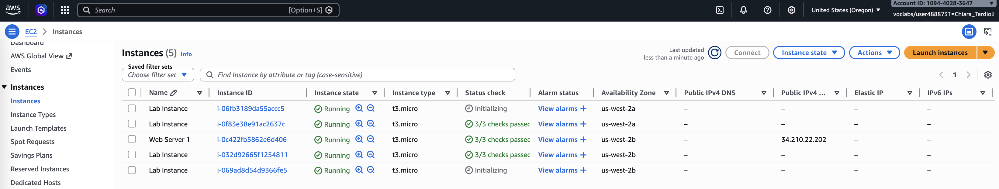

## Task 7: Terminating the Original Instance

Finally, I terminated the original Web Server 1 instance, as it was no longer required after creating the AMI.

This step ensured that only instances managed by the Auto Scaling group remained active in the architecture.

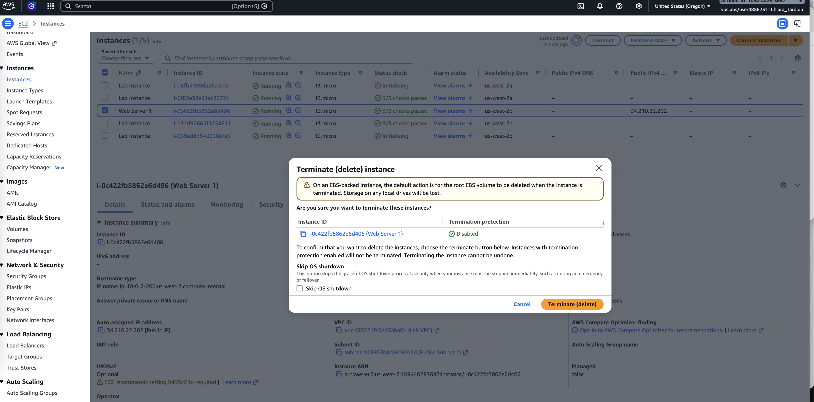

## Conclusion

In this lab, I successfully implemented a scalable and fault-tolerant architecture using AWS services.

I created an AMI from an existing EC2 instance and used it to define a launch template. I then configured an Application Load Balancer to distribute 
traffic across multiple instances. With the Auto Scaling group, I ensured that the number of running instances automatically adjusted based on CPU utilization.

Additionally, I used CloudWatch alarms to monitor system performance and trigger scaling events. This lab demonstrated how AWS services can be combined to 
build an efficient, resilient, and cost-effective infrastructure.

In summary I was able to:
- Create an AMI from an EC2 instance.
- Create a load balancer.
- Create a launch template and an Auto Scaling group.
- Configure an Auto Scaling group to scale new instances within private subnets.
- Use Amazon CloudWatch alarms to monitor the performance of your infrastructure.
