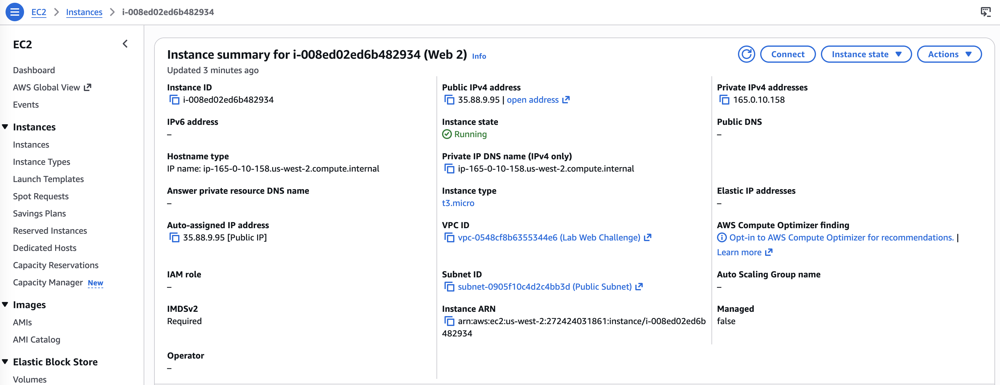
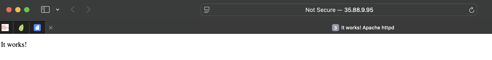
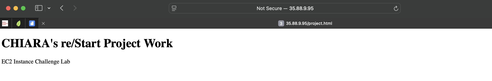

# Amazon EC2 Instances (Challenge)
In this challenge I will create a web application running on an Amazon Linux EC2 instance.

## Task 1: Create an Amazon Linux EC2 instance to run a web application

1. (Optional) Before launching the instance, I created an internet gateway and properly configure the subnet's route table in your VPC following these steps:
- Create a VPC with IPv4 CIDR block 10.0.0.0/16
- Create a Subnet connected with the VPC and CIDR block 10.0.1.0/24
- Create an Internet Gateway (IGW)
- Attach Internet Gateway to VPC
- Select Route Table associate to my VPC
- Update Route table: add route destination 0.0.0.0/0 (all internet traffic) with target my IGW
- Associate Route Table with Subnet
- Enable Auto-Assign Public IP (Subnet → Actions → Edit subnet settings)

Note: How to choose IPv4 CIDR block:
- VPC: 10.0.0.0/16
- Subnets:
    - 10.0.1.0/24 → Public
    - 10.0.2.0/24 → Private
    - 10.0.3.0/24 → Public (AZ2)
    - 10.0.4.0/24 → Private (AZ2)

2. I launched an EC2 Instance using AWS Management Console with these settings:
- VPC : the new VPC created in the previous step
- Machine: Amazon Linux 2023
- Instance type: t3.micro
- Auto-assign public IP: enabled
- Root volume: General Purpose SSD (gp2) volume type
- Security group: new group that allows SSH (port 22) and HTTP (port 80) traffic



3. I used the EC2 Instance Connect to connected to the instance I created in the revious step and launch  the web application
```bash
  ,     #_
   ~\_  ####_        Amazon Linux 2023
  ~~  \_#####\
  ~~     \###|
  ~~       \#/ ___   https://aws.amazon.com/linux/amazon-linux-2023
   ~~       V~' '->
    ~~~         /
      ~~._.   _/
         _/ _/
       _/m/'
[ec2-user@ip-165-0-10-158 ~]$ sudo yum install httpd -y
Waiting for process with pid 1639 to finish.
Amazon Linux 2023 Kernel Livepatch repository                                                                                                       260 kB/s |  30 kB    
...
Complete!
[ec2-user@ip-165-0-10-158 ~]$ sudo systemctl start httpd
[ec2-user@ip-165-0-10-158 ~]$ sudo systemctl enable httpd
Created symlink /etc/systemd/system/multi-user.target.wants/httpd.service → /usr/lib/systemd/system/httpd.service.
```
I confirmed the status is active with the command `systemctl status httpd`.
```bash
[ec2-user@ip-165-0-10-158 ~]$ sudo systemctl status httpd
● httpd.service - The Apache HTTP Server
     Loaded: loaded (/usr/lib/systemd/system/httpd.service; enabled; preset: disabled)
     Active: active (running) since Wed 2026-03-18 22:11:26 UTC; 9s ago
       Docs: man:httpd.service(8)
   Main PID: 17053 (httpd)
     Status: "Total requests: 0; Idle/Busy workers 100/0;Requests/sec: 0; Bytes served/sec:   0 B/sec"
      Tasks: 177 (limit: 1067)
     Memory: 13.4M
        CPU: 85ms
     CGroup: /system.slice/httpd.service
             ├─17053 /usr/sbin/httpd -DFOREGROUND
             ├─17170 /usr/sbin/httpd -DFOREGROUND
             ├─17181 /usr/sbin/httpd -DFOREGROUND
             ├─17182 /usr/sbin/httpd -DFOREGROUND
             └─17183 /usr/sbin/httpd -DFOREGROUND

Mar 18 22:11:26 ip-165-0-10-158.us-west-2.compute.internal systemd[1]: Starting httpd.service - The Apache HTTP Server...
Mar 18 22:11:26 ip-165-0-10-158.us-west-2.compute.internal systemd[1]: Started httpd.service - The Apache HTTP Server.
Mar 18 22:11:27 ip-165-0-10-158.us-west-2.compute.internal httpd[17053]: Server configured, listening on: port 80
```
Another approach is to add a user data script before launching the instance, which installs, starts, and enables the Apache Web Server.
```bash
#!/bin/bash
yum update -y
yum install -y httpd
systemctl start httpd
systemctl enable httpd
```


## Task 2: Deploy and test the web page

1. In the terminal for the EC2 instance, I created the file `project.html`, as requested by the lab, and placed it in the folder `/var/www/html/`.
```
<!DOCTYPE html>
<html>
<body>
<h1>CHIARA's re/Start Project Work</h1>
<p>EC2 Instance Challenge Lab</p>
</body>
</html>
```

2. I opened a web browser, and copy the **public IPv4** adreess of my instance. Here is the result!



3. Then I navigated to my webpage using the URL: `http://<instance public IPv4>/projects.html`.


