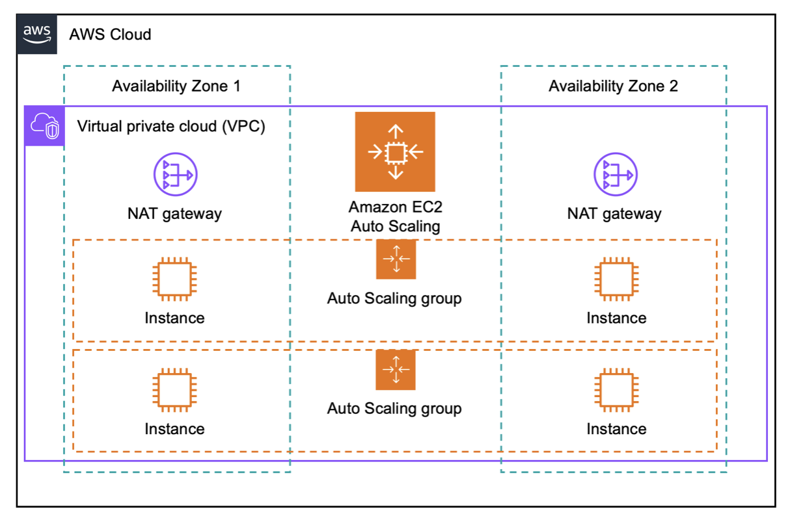

# Cloud Foundations - Introduction to Amazon EC2

In this lab, I learned the fundamentals of **Amazon Elastic Compute Cloud (EC2)**, which allows users to launch and manage virtual servers in the cloud.

Amazon EC2 provides **resizable compute capacity**, allowing developers to quickly deploy servers without purchasing physical hardware. It enables scaling resources up or down depending on workload requirements.

### Architecture Overview



Source: AWS architecture icons [link here](https://aws.amazon.com/architecture/icons/)


## Lab Objectives

By completing this lab, I learned how to:

* Launch an EC2 instance with **termination protection**
* Monitor an EC2 instance
* Modify a **security group** to allow web traffic
* Resize an EC2 instance
* Test **termination protection**
* Terminate an EC2 instance

## Task 1 – Launching an EC2 Instance

First, I launched a new **Amazon EC2 instance** from the AWS Management Console.

### Steps I performed

1. Opened **EC2 Dashboard**
2. Selected **Launch Instance**
3. Named the instance **Web Server**
4. Selected **Amazon Linux 2023 AMI**
5. Chose the **t3.micro instance type**
6. Continued **without a key pair**
7. Configured network settings using the **Lab VPC**
8. Created a **security group** called *Web Server security group*
9. Removed the **SSH rule** for better security

### User Data Script

I added a script that automatically installs and starts a web server.

```bash
#!/bin/bash
yum -y install httpd
systemctl enable httpd
systemctl start httpd
echo '<html><h1>Hello From Your Web Server!</h1></html>' > /var/www/html/index.html
```

This script installs **Apache HTTP Server**, starts the service, and creates a simple web page.

## Task 2 – Monitoring the EC2 Instance

After launching the instance, I monitored its status and performance.

I checked:

* **Instance State**
* **System Status Checks**
* **Instance Reachability**

Both checks passed successfully.

I also explored the **Monitoring tab**, which shows metrics from **Amazon CloudWatch**, such as CPU utilization.

## Task 3 – Updating the Security Group

Initially, I could not access the web server using the **public IP address**.

This happened because the **security group did not allow HTTP traffic**.

To fix this, I updated the inbound rules.

### Steps

1. Opened **Security Groups**
2. Selected **Web Server security group**
3. Added a new rule:

   * **Type:** HTTP
   * **Port:** 80
   * **Source:** Anywhere (IPv4)

After saving the rule, I refreshed the browser and saw the message:

## Task 4 – Resizing the EC2 Instance

I learned that EC2 instances can be resized if more resources are required.

### Steps I followed

1. Stopped the instance
2. Changed the **instance type**
3. Increased the **EBS volume size**

### Changes I made

| Resource      | Before   | After    |
| ------------- | -------- | -------- |
| Instance Type | t3.micro | t3.small |
| Storage       | 8 GiB    | 10 GiB   |

This process helps scale resources depending on application requirements.

---

## Task 5 – Testing Termination Protection

Termination protection prevents accidental deletion of instances.

I attempted to terminate the instance but AWS displayed an error because **termination protection was enabled**.

To terminate the instance, I:

1. Disabled **termination protection**
2. Selected **Terminate Instance**

This successfully deleted the instance.

---

## Conclusion

In this lab, I learned how to use **Amazon EC2 to deploy and manage a cloud-based server**.

Key skills I gained include:

* Launching and configuring EC2 instances
* Monitoring instance health
* Managing security groups
* Scaling instance resources
* Using termination protection

This lab helped me understand how cloud servers are deployed and managed in real-world AWS environments.
