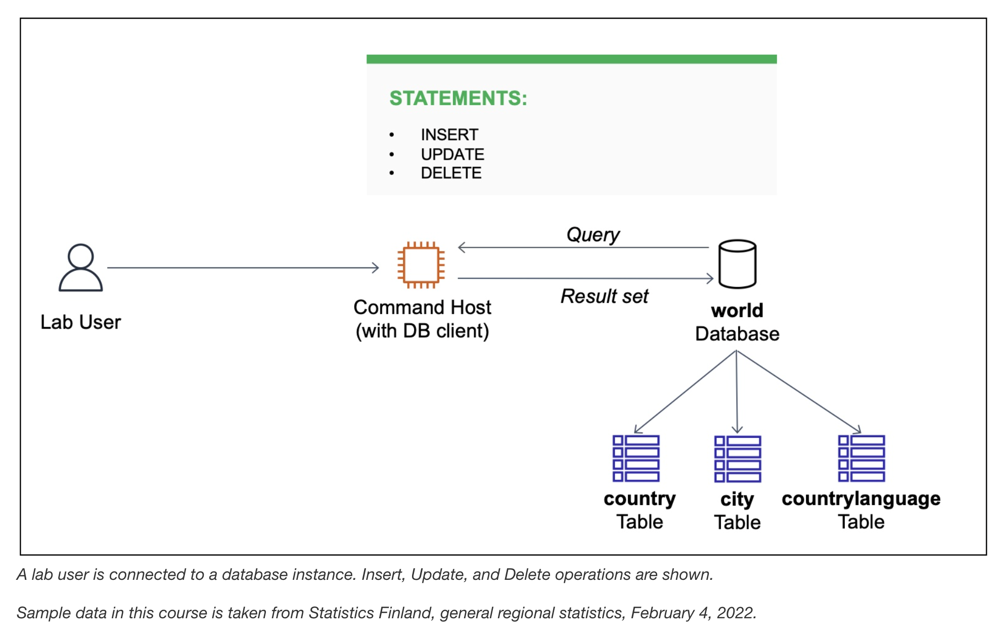

# Insert, Update, and Delete Data in a Database

The database operations team has created a relational database called world containing three tables: city, country, and countrylanguage. 
I have to validate the configuration of the database by running **INSERT**, **UPDATE**, and **DELETE** statements on the country table.



## Task 1: Connect to a database
I connect to the Command Host EC2 instance using the Session Manager tab. Then on terminal I type:
```bash
sudo su
cd /home/ec2-user/
mysql -u root --password='re:St@rt!9'
```

I also verify the existing database using the command `SHOW DATABASES;`:
```sql
MariaDB [(none)]> SHOW DATABASES;
+--------------------+
| Database           |
+--------------------+
| information_schema |
| mysql              |
| performance_schema |
| world              |
+--------------------+
4 rows in set (0.002 sec)
```

## Task 2: Insert data into a table
Here I verufy that the **country** table exist and **INSERT** sample data into it.

```sql
MariaDB [(none)]> SELECT * FROM world.country;
Empty set (0.001 sec)

MariaDB [(none)]> INSERT INTO world.country VALUES ('IRL','Ireland','Europe','British Islands',70273.00,1921,3775100,76.8,75921.00,73132.00,'Ireland/ire','Republic',1447,'IE');
Query OK, 1 row affected (0.003 sec)

MariaDB [(none)]>
MariaDB [(none)]> INSERT INTO world.country VALUES ('AUS','Australia','Oceania','Australia and New Zealand',7741220.00,1901,18886000,79.8,351182.00,392911.00,'Australia','Constitutional Monarchy, Federation',135,'AU');
Query OK, 1 row affected (0.001 sec)

MariaDB [(none)]> SELECT * FROM world.country WHERE Code IN ('IRL', 'AUS');
+------+-----------+-----------+---------------------------+-------------+-----------+------------+----------------+-----------+-----------+-------------+-------------------------------------+---------+-------+
| Code | Name      | Continent | Region                    | SurfaceArea | IndepYear | Population | LifeExpectancy | GNP       | GNPOld    | LocalName   | GovernmentForm                      | Capital |Code2 |
+------+-----------+-----------+---------------------------+-------------+-----------+------------+----------------+-----------+-----------+-------------+-------------------------------------+---------+-------+
| AUS  | Australia | Oceania   | Australia and New Zealand |  7741220.00 |      1901 |   18886000 |           79.8 | 351182.00 | 392911.00 | Australia   | Constitutional Monarchy, Federation |     135 |AU    |
| IRL  | Ireland   | Europe    | British Islands           |    70273.00 |      1921 |    3775100 |           76.8 |  75921.00 |  73132.00 | Ireland/ire | Republic                            |    1447 |IE    |
+------+-----------+-----------+---------------------------+-------------+-----------+------------+----------------+-----------+-----------+-------------+-------------------------------------+---------+-------+
2 rows in set (0.001 sec)

MariaDB [(none)]>
```
## Task 3: Update rows in a table
Here I update both rows in the **country** table using an **UPDATE** statement.

```sql
MariaDB [(none)]> UPDATE world.country SET Population = 0;
Query OK, 2 rows affected (0.003 sec)
Rows matched: 2  Changed: 2  Warnings: 0

MariaDB [(none)]> SELECT * FROM world.country;
+------+-----------+-----------+---------------------------+-------------+-----------+------------+----------------+-----------+-----------+-------------+-------------------------------------+---------+-------+
| Code | Name      | Continent | Region                    | SurfaceArea | IndepYear | Population | LifeExpectancy | GNP       | GNPOld    | LocalName   | GovernmentForm                      | Capital | Code2 |
+------+-----------+-----------+---------------------------+-------------+-----------+------------+----------------+-----------+-----------+-------------+-------------------------------------+---------+-------+
| AUS  | Australia | Oceania   | Australia and New Zealand |  7741220.00 |      1901 |          0 |           79.8 | 351182.00 | 392911.00 | Australia   | Constitutional Monarchy, Federation |     135 | AU    |
| IRL  | Ireland   | Europe    | British Islands           |    70273.00 |      1921 |          0 |           76.8 |  75921.00 |  73132.00 | Ireland/ire | Republic                            |    1447 | IE    |
+------+-----------+-----------+---------------------------+-------------+-----------+------------+----------------+-----------+-----------+-------------+-------------------------------------+---------+-------+
2 rows in set (0.000 sec)

MariaDB [(none)]> UPDATE world.country SET Population = 100, SurfaceArea = 100;
Query OK, 2 rows affected (0.001 sec)
Rows matched: 2  Changed: 2  Warnings: 0

MariaDB [(none)]> SELECT * FROM world.country;
+------+-----------+-----------+---------------------------+-------------+-----------+------------+----------------+-----------+-----------+-------------+-------------------------------------+---------+-------+
| Code | Name      | Continent | Region                    | SurfaceArea | IndepYear | Population | LifeExpectancy | GNP       | GNPOld    | LocalName   | GovernmentForm                      | Capital | Code2 |
+------+-----------+-----------+---------------------------+-------------+-----------+------------+----------------+-----------+-----------+-------------+-------------------------------------+---------+-------+
| AUS  | Australia | Oceania   | Australia and New Zealand |      100.00 |      1901 |        100 |           79.8 | 351182.00 | 392911.00 | Australia   | Constitutional Monarchy, Federation |     135 | AU    |
| IRL  | Ireland   | Europe    | British Islands           |      100.00 |      1921 |        100 |           76.8 |  75921.00 |  73132.00 | Ireland/ire | Republic                            |    1447 | IE    |
+------+-----------+-----------+---------------------------+-------------+-----------+------------+----------------+-----------+-----------+-------------+-------------------------------------+---------+-------+
2 rows in set (0.000 sec)
```

## Task 4: Delete rows from a table
Here I delete rows in the **country** table using a **DELETE** statement. 

```sql
MariaDB [(none)]> SET FOREIGN_KEY_CHECKS = 0;  # Ignore all foreign key rules for now
Query OK, 0 rows affected (0.000 sec)

MariaDB [(none)]> DELETE FROM world.country;   # delete all rows
Query OK, 2 rows affected (0.001 sec)

MariaDB [(none)]> SELECT * FROM world.country; # check
Empty set (0.000 sec)
```

## Task 5: Import data using an SQL file
Here I import sample data into the **country** table using an SQL file.

First, I qui the the MySQL terminal:
```sql
MariaDB [(none)]> QUIT;
Bye
```

It is time-consuming to insert individual rows into a table. The lab aleady created a SQL script file 
`/home/ec2-user/world.sql` containing a group  of SQL statements to quickly load data into a database. 
To load rows into the country table, I run the command:
```bash
mysql -u root --password='re:St@rt!9' < /home/ec2-user/world.sql
```

Then I reconnect to the database. Now the database **world** contains 3 tables with more entries:

| Tables in world     | Number of entries |
|---------------------|------|
| city                | 4079 |
| country             | 237  |
| countrylanguage     | 984  |


## Conclusions
In this lab I learnt how to:
- Insert rows into a table
- Updat rows in a table
- Delete rows from a table
- Import rows from a database backup file

## Additional resources
- Country, city, and language data, Statistics Finland: The material was downloaded from Statistics Finland's interface service 
on February 4, 2022, with the [license CC BY 4.0](https://creativecommons.org/licenses/by/4.0/deed.en).
The original data source is available from [Statistics Finland](https://tilastokeskus.fi/tup/kvportaali/index_en.html).

- For more information about database functions and operators, see the following resources:

  - [INSERT statement](https://mariadb.com/kb/en/insert/)
  - [UPDATE statement](https://mariadb.com/kb/en/update/)
  - [DELETE statement](https://mariadb.com/kb/en/delete/)
 
## SQL script file
This *SQL script file* copntains a group of SQL statements to quickly load data into a database.

```sql
-- MariaDB dump 10.19  Distrib 10.6.5-MariaDB, for Linux (x86_64)
--
-- Host: localhost    Database: world
-- ------------------------------------------------------
-- Server version       10.6.5-MariaDB

/*!40101 SET @OLD_CHARACTER_SET_CLIENT=@@CHARACTER_SET_CLIENT */;
/*!40101 SET @OLD_CHARACTER_SET_RESULTS=@@CHARACTER_SET_RESULTS */;
/*!40101 SET @OLD_COLLATION_CONNECTION=@@COLLATION_CONNECTION */;
/*!40101 SET NAMES utf8mb4 */;
/*!40103 SET @OLD_TIME_ZONE=@@TIME_ZONE */;
/*!40103 SET TIME_ZONE='+00:00' */;
/*!40014 SET @OLD_UNIQUE_CHECKS=@@UNIQUE_CHECKS, UNIQUE_CHECKS=0 */;
/*!40014 SET @OLD_FOREIGN_KEY_CHECKS=@@FOREIGN_KEY_CHECKS, FOREIGN_KEY_CHECKS=0 */;
/*!40101 SET @OLD_SQL_MODE=@@SQL_MODE, SQL_MODE='NO_AUTO_VALUE_ON_ZERO' */;
/*!40111 SET @OLD_SQL_NOTES=@@SQL_NOTES, SQL_NOTES=0 */;

DROP DATABASE IF EXISTS `world`;
CREATE DATABASE `world` DEFAULT CHARACTER SET utf8mb4;

USE `world`;

--
-- Table structure for table `city`
--

DROP TABLE IF EXISTS `city`;
/*!40101 SET @saved_cs_client     = @@character_set_client */;
/*!40101 SET character_set_client = utf8 */;
CREATE TABLE `city` (
  `ID` int(11) NOT NULL AUTO_INCREMENT,
  `Name` char(35) NOT NULL DEFAULT '',
  `CountryCode` char(3) NOT NULL DEFAULT '',
  `District` char(20) NOT NULL DEFAULT '',
  `Population` int(11) NOT NULL DEFAULT 0,
  PRIMARY KEY (`ID`),
  KEY `CountryCode` (`CountryCode`),
  CONSTRAINT `city_ibfk_1` FOREIGN KEY (`CountryCode`) REFERENCES `country` (`Code`)
) ENGINE=InnoDB AUTO_INCREMENT=4080 DEFAULT CHARSET=utf8mb4;
/*!40101 SET character_set_client = @saved_cs_client */;

--
-- Dumping data for table `city`
--

LOCK TABLES `city` WRITE;
/*!40000 ALTER TABLE `city` DISABLE KEYS */;
INSERT INTO `city` VALUES (1,'Kabul','AFG','Kabol',1780000),(2,'Qandahar','AFG','Qandahar',237500),(3,'Herat','AFG','Herat',186800),(4,'Mazar-e-Sharif','AFG','Balkh',127800),(5,'Amsterdam','NLD','Noord-Holland',731200),(6,'Rotterdam','NLD','Zuid-Holland',593321),(7,'Haag','NLD','Zuid-Holland',440900),(8,'Utrecht','NLD','Utrecht',234323),(9,'Eindhoven','NLD','Noord-Brabant',201843),(10,'Tilburg','NLD','Noord-Brabant',193238),(11,'Groningen','NLD','Groningen',172701),(12,'Breda','NLD','Noord-Brabant',160398),(13,'Apeldoorn','NLD','Gelderland',153491),(14,'Nijmegen','NLD','Gelderland',152463),(15,'Enschede','NLD','Overijssel',149544),(16,'Haarlem','NLD','Noord-Holland',148772),(17,'Almere','NLD','Flevoland',142465),(18,'Arnhem','NLD','Gelderland',138020),(19,'Zaanstad','NLD','Noord-Holland',135621),(20,'´s-Hertogenbosch','NLD','Noord-Brabant',129170),(21,'Amersfoort','NLD','Utrecht',126270),(22,'Maastricht','NLD','Limburg',122087),(23,'Dordrecht','NLD','Zuid-Holland',119811),(24,'Leiden',/home/ec2-user/world.sql
```
