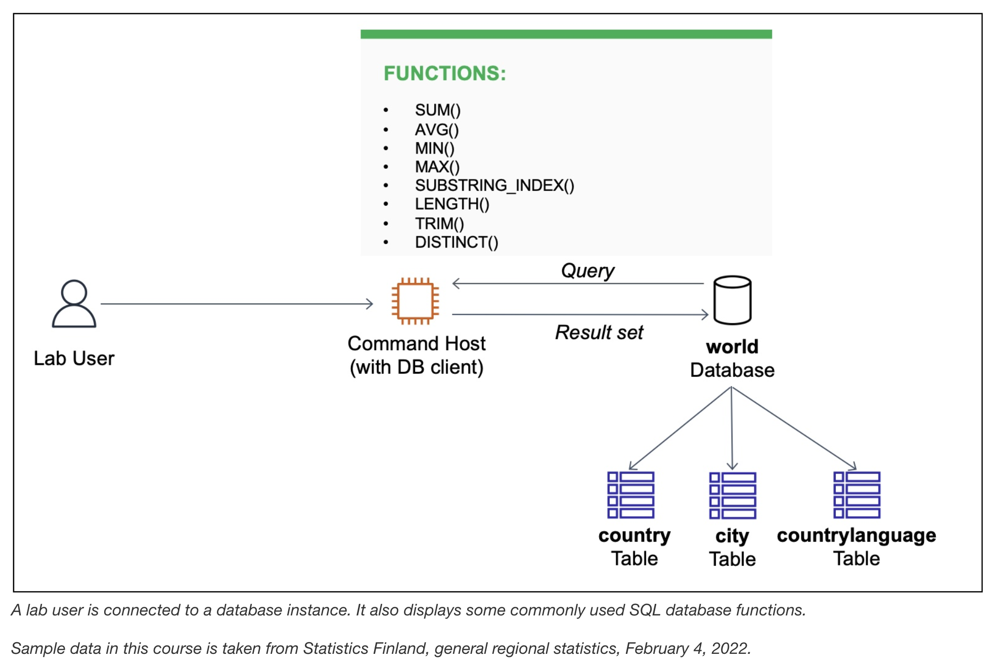

# Working with Functions

The database operations team has created a relational database named **world** containing three tables: city, 
country, and countrylanguage. Based on specific use cases in the lab exercise, I write a few queries 
using database functions with the **SELECT** statement and **WHERE** clause.



## Task 1: Connect to the Command Host
I connect to the Command Host EC2 instance containing a database client via the Session Manager tab.
```bash
sudo su
cd /home/ec2-user/
mysql -u root --password='re:St@rt!9'
```

## Task 2: Query the world database
I query the **world** database using various SELECT statements and database functions. 
I use a function to process and manipulate data in a query.

```sql
-- review the table schema, data, and number of rows in the country table
SELECT * FROM world.country;             -- 239 rows

-- aggregate data from all records in the country table
SELECT sum(Population), avg(Population), max(Population), min(Population), count(Population) FROM world.country;
-- SUM() adds all the population values together.
-- AVG() generates an average across all the population values.
-- MAX() finds the row with the highest population value.
-- MIN() finds the row with the lowest population value.
-- COUNT() finds the number of rows with a population value.
+-----------------+-----------------+-----------------+-----------------+-------------------+
| sum(Population) | avg(Population) | max(Population) | min(Population) | count(Population) |
+-----------------+-----------------+-----------------+-----------------+-------------------+
|      6078749450 |   25434098.1172 |      1277558000 |               0 |               239 |
+-----------------+-----------------+-----------------+-----------------+-------------------+
1 row in set (0.002 sec)

-- split a string
SELECT Region, substring_index(Region, " ", 1) FROM world.country;
+-------------------------------+---------------------------+
| Name                          | Region                    |
+-------------------------------+---------------------------+
| Afghanistan                   | Southern and Central Asia |
| Albania                       | Southern Europe           |
| Andorra                       | Southern Europe           |
| Bangladesh                    | Southern and Central Asia |
| Bosnia and Herzegovina        | Southern Europe           |
| Bhutan                        | Southern and Central Asia |
| Botswana                      | Southern Africa           |
| Spain                         | Southern Europe           |
| Gibraltar                     | Southern Europe           |
| Greece                        | Southern Europe           |
| Croatia                       | Southern Europe           |
| India                         | Southern and Central Asia |
| Iran                          | Southern and Central Asia |
| Italy                         | Southern Europe           |
| Kazakstan                     | Southern and Central Asia |
| Kyrgyzstan                    | Southern and Central Asia |
| Sri Lanka                     | Southern and Central Asia |
| Lesotho                       | Southern Africa           |
| Maldives                      | Southern and Central Asia |
| Macedonia                     | Southern Europe           |
| Malta                         | Southern Europe           |
| Namibia                       | Southern Africa           |
| Nepal                         | Southern and Central Asia |
| Pakistan                      | Southern and Central Asia |
| Portugal                      | Southern Europe           |
| San Marino                    | Southern Europe           |
| Slovenia                      | Southern Europe           |
| Swaziland                     | Southern Africa           |
| Tajikistan                    | Southern and Central Asia |
| Turkmenistan                  | Southern and Central Asia |
| Uzbekistan                    | Southern and Central Asia |
| Holy See (Vatican City State) | Southern Europe           |
| Yugoslavia                    | Southern Europe           |
| South Africa                  | Southern Africa           |
+-------------------------------+---------------------------+
34 rows in set (0.001 sec)

-- regions that have fewer than 10 characters in their names
SELECT DISTINCT Region FROM world.country WHERE LENGTH(TRIM(Region)) < 10;
+-----------+
| Region    |
+-----------+
| Caribbean |
| Polynesia |
| Melanesia |
+-----------+
3 rows in set (0.001 sec)
```

## Challenge
Query the country table to return a set of records based on the following requirement:

Write a query to return rows that have Micronesian/Caribbean as the name in the region column. 
The output should split the region as Micronesia and Caribbean into two separate columns: one named Region Name 1 and one named Region Name 2.

```sql
SELECT Name,
  substring_index(Region, "/", 1) as "Region Name 1",
  substring_index(region, "/", -1) as "Region Name 2"
  FROM world.country
  WHERE Region = "Micronesia/Caribbean";
+--------------------------------------+---------------+---------------+
| Name                                 | Region Name 1 | Region Name 2 |
+--------------------------------------+---------------+---------------+
| United States Minor Outlying Islands | Micronesia    | Caribbean     |
+--------------------------------------+---------------+---------------+
1 row in set (0.000 sec)
```


## Additional resources
- Country, city, and language data, Statistics Finland: The material was downloaded from Statistics Finland's interface 
service on February 4, 2022, with the [license CC BY 4.0](https://creativecommons.org/licenses/by/4.0/deed.en). 
The original data source is available from [Statistics Finland](https://tilastokeskus.fi/tup/kvportaali/index_en.html).

- For more information about database functions and operators, see the following resources:

  - [SELECT statements](https://mariadb.com/kb/en/select/)
  - [Count function](https://mariadb.com/kb/en/count/)
  - [SUM function](https://mariadb.com/kb/en/sum/)
  - [AVG function](https://mariadb.com/kb/en/avg/)
  - [MIN function](https://mariadb.com/kb/en/min/)
  - [MAX function](https://mariadb.com/kb/en/max/)
  - [SUBSTRING_INDEX function](https://mariadb.com/kb/en/substring_index/)
  - [LENGTH function](https://mariadb.com/kb/en/length/)
  - [TRIM function](https://mariadb.com/kb/en/trim/)
