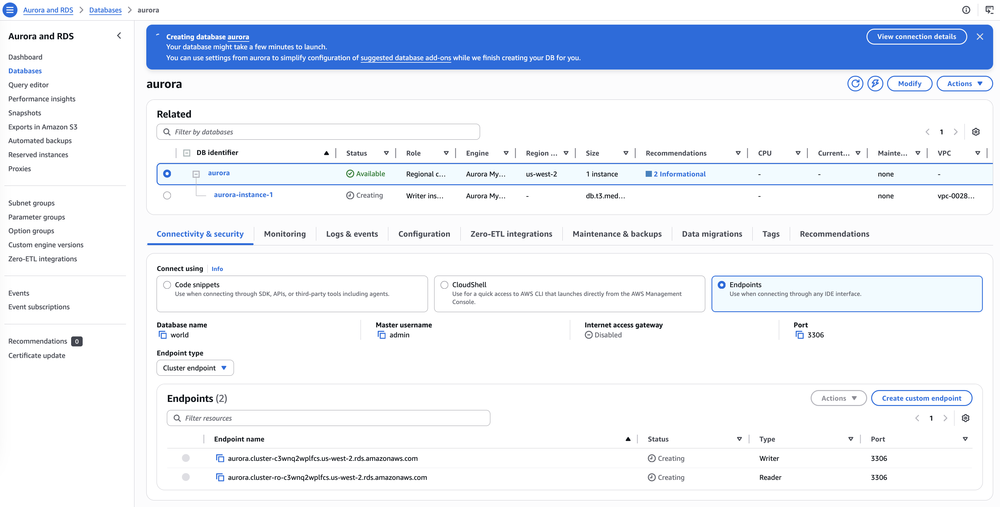
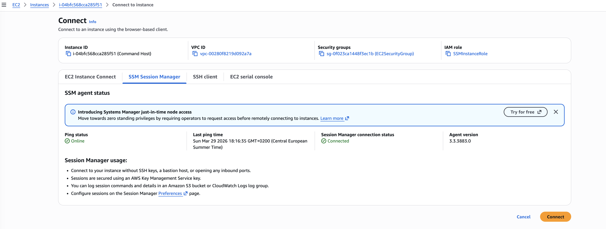

# Introduction to Amazon Aurora

This lab introduces to Amazon Aurora and provides basic understanding of how to use Aurora. 
I will follow the steps to create an Aurora instance and then connect to it.

## Amazon technologies n this lab
- **Amazon Aurora**
  
  Aurora is a fully managed, MySQL-compatible, relational database engine that combines the performance and reliability of high-end commercial
  databases with the simplicity and cost-effectiveness of open-source databases. It delivers up to five times the performance of MySQL without
  requiring changes to most of your existing applications that use MySQL databases.
- **Amazon Elastic Compute Cloud (Amazon EC2)**
  
  Amazon EC2 is a web service that provides resizable compute capacity in the cloud. It is designed to make web-scale cloud computing easier
  for developers. Amazon EC2 reduces the time required to provision new server instances to minutes, giving you the ability to quickly scale
  capacity, both up and down, as your computing requirements change.
- **Amazon Relational Database Service (Amazon RDS)**
  
  Amazon RDS makes it easy to set up, operate, and scale a relational database in the cloud. It provides cost-efficient and resizable capacity while
  managing time-consuming database administration tasks, freeing you up to focus on your applications and business. Amazon RDS provides you with six
  database engines to choose from, including Aurora, Oracle, Microsoft SQL Server, PostgreSQL, MySQL, and MariaDB.

## Task 1: Create an Aurora instance
Here, I create an Aurora database (DB) instance with this configuration:
- Engine type: `Aurora (MySQL Compatible)`
- Engine version: `Aurora MySQL 3.10.3`
- Templates: `Dev/Test`

Unser Settings, I configure the following options:
- DB cluster identifier: `aurora`
- Master username: `admin`
- Master password: `admin123`

Under Instance configuration, I configure the following for DB instance class:
- Select `Burstable classes (includes t classes)`
- Select `db.t3.medium`

Under Availability & durability section for Multi-AZ deployment, I choose `Don't create an Aurora Replica`.
Since this is a lab environment, I do not need to perform a multi-AZ deployment.

Under Connectivity, I configure the following options:
* Virtual private cloud (VPC): `LabVPC`
* Subnet group: `dbsubnetgroup`
* Public access: `No`
* VPC security group: choose existing and select `DBSecurityGroup`

Under Monitoring:
- Uncheck Enable Enhanced monitoring

I expand Additional configuration and then I configure the following:
- Database name: `world`
- Uncheck Enable encryption.
- Uncheck Enable auto minor version upgrade.



## Task 2: Connect to an Amazon EC2 Linux instance

I log into to your Amazon EC2 Linux instance using the Session Manager tab.
This instance was launched when the lab started using CloudFormation.



## Task 3: Configure the Amazon EC2 Linux instance to connect to Aurora

First, I use the yum package manager to install the MariaDB client.

```bash
sh-4.2$ sudo yum install mariadb -y
...
Install  1 Package

Total download size: 8.8 M
Installed size: 49 M
Downloading packages:
mariadb-5.5.68-1.amzn2.0.1.x86_64.rpm                                                                                                                                                                         | 8.8 MB  00:00:00
Running transaction check
Running transaction test
Transaction test succeeded
Running transaction
  Installing : 1:mariadb-5.5.68-1.amzn2.0.1.x86_64        1/1
  Verifying  : 1:mariadb-5.5.68-1.amzn2.0.1.x86_64        1/1

Installed:
  mariadb.x86_64 1:5.5.68-1.amzn2.0.1

Complete!
```

Then I configure the Amazon EC2 Linux instance to connect to the Aurora database.

The cluster endpoint is `aurora.cluster-c3wnq2wplfcs.us-west-2.rds.amazonaws.com`.

The reader endpoint is `aurora.cluster-ro-c3wnq2wplfcs.us-west-2.rds.amazonaws.com`.

```bash
sh-4.2$ mysql -u admin --password='admin123' -h aurora.cluster-c3wnq2wplfcs.us-west-2.rds.amazonaws.com
Welcome to the MariaDB monitor.  Commands end with ; or \g.
Your MySQL connection id is 131
Server version: 8.0.42 6252a59a

Copyright (c) 2000, 2018, Oracle, MariaDB Corporation Ab and others.

Type 'help;' or '\h' for help. Type '\c' to clear the current input statement.

MySQL [(none)]>
```
## Task 4: Create a table and insert and query records
In this task, I create a table in a database, load data, and run a query. I will use the following sql command:
- `CREATE TABLE`
- `INSERT INTO`
- `SELECT ...FROM ...`
- `SHOW DATABASES;`
- `USE <table>`

```sql
MySQL [(none)]> SHOW DATABASES;
+--------------------+
| Database           |
+--------------------+
| information_schema |
| mysql              |
| performance_schema |
| sys                |
| world              |
+--------------------+
5 rows in set (0.00 sec)

MySQL [(none)]> USE world;
Database changed
MySQL [world]> CREATE TABLE `country` (
    -> `Code` CHAR(3) NOT NULL DEFAULT '',
    -> `Name` CHAR(52) NOT NULL DEFAULT '',
    -> `Continent` enum('Asia','Europe','North America','Africa','Oceania','Antarctica','South America') NOT NULL DEFAULT 'Asia',
    -> `Region` CHAR(26) NOT NULL DEFAULT '',
    -> `SurfaceArea` FLOAT(10,2) NOT NULL DEFAULT '0.00',
    -> `IndepYear` SMALLINT(6) DEFAULT NULL,
    -> `Population` INT(11) NOT NULL DEFAULT '0',
    -> `LifeExpectancy` FLOAT(3,1) DEFAULT NULL,
    -> `GNP` FLOAT(10,2) DEFAULT NULL,
    -> `GNPOld` FLOAT(10,2) DEFAULT NULL,
    -> `LocalName` CHAR(45) NOT NULL DEFAULT '',
    -> `GovernmentForm` CHAR(45) NOT NULL DEFAULT '',
    -> `Capital` INT(11) DEFAULT NULL,
    -> `Code2` CHAR(2) NOT NULL DEFAULT '',
    -> PRIMARY KEY (`Code`)
    -> );
Query OK, 0 rows affected, 7 warnings (0.03 sec)

MySQL [world]> INSERT INTO `country` VALUES ('GAB','Gabon','Africa','Central Africa',267668.00,1960,1226000,50.1,5493.00,5279.00,'Le Gabon','Republic',902,'GA');
Query OK, 1 row affected (0.01 sec)

MySQL [world]>
MySQL [world]> INSERT INTO `country` VALUES ('IRL','Ireland','Europe','British Islands',70273.00,1921,3775100,76.8,75921.00,73132.00,'Ireland/Éire','Republic',1447,'IE');
Query OK, 1 row affected (0.01 sec)

MySQL [world]>
MySQL [world]> INSERT INTO `country` VALUES ('THA','Thailand','Asia','Southeast Asia',513115.00,1350,61399000,68.6,116416.00,153907.00,'Prathet Thai','Constitutional Monarchy',3320,'TH');
Query OK, 1 row affected (0.01 sec)

MySQL [world]>
MySQL [world]> INSERT INTO `country` VALUES ('CRI','Costa Rica','North America','Central America',51100.00,1821,4023000,75.8,10226.00,9757.00,'Costa Rica','Republic',584,'CR');
Query OK, 1 row affected (0.00 sec)

MySQL [world]>
MySQL [world]> INSERT INTO `country` VALUES ('AUS','Australia','Oceania','Australia and New Zealand',7741220.00,1901,18886000,79.8,351182.00,392911.00,'Australia','Constitutional Monarchy, Federation',135,'AU');
Query OK, 1 row affected (0.00 sec)

MySQL [world]> SELECT * FROM country WHERE GNP > 35000 and Population > 10000000;
+------+-----------+-----------+---------------------------+-------------+-----------+------------+----------------+-----------+-----------+--------------+-------------------------------------+---------+-------+
| Code | Name      | Continent | Region                    | SurfaceArea | IndepYear | Population | LifeExpectancy | GNP       | GNPOld    | LocalName    | GovernmentForm                      | Capital | Code2 |
+------+-----------+-----------+---------------------------+-------------+-----------+------------+----------------+-----------+-----------+--------------+-------------------------------------+---------+-------+
| AUS  | Australia | Oceania   | Australia and New Zealand |  7741220.00 |      1901 |   18886000 |           79.8 | 351182.00 | 392911.00 | Australia    | Constitutional Monarchy, Federation |     135 | AU    |
| THA  | Thailand  | Asia      | Southeast Asia            |   513115.00 |      1350 |   61399000 |           68.6 | 116416.00 | 153907.00 | Prathet Thai | Constitutional Monarchy             |    3320 | TH    |
+------+-----------+-----------+---------------------------+-------------+-----------+------------+----------------+-----------+-----------+--------------+-------------------------------------+---------+-------+
2 rows in set (0.00 sec)

MySQL [world]>
```

The last query returns two records, one for Australia and another for Thailand.

## Conclusions
- I created an Aurora instance.
- I connected to a pre-created Amazon EC2 instance.
- I configured the Amazon EC2 instance to connect to Aurora.
- I queried the Aurora instance.

## Additional resources
- [Amazon RDS Multi-AZ Deployments](https://aws.amazon.com/rds/details/multi-az/)
- [Working with an Amazon RDS DB Instance in a VPC](https://docs.aws.amazon.com/AmazonRDS/latest/UserGuide/USER_VPC.WorkingWithRDSInstanceinaVPC.html)
- [What Is Amazon VPC?](https://docs.aws.amazon.com/AmazonVPC/latest/UserGuide/VPC_Introduction.html)
- [Encrypting Amazon RDS Resources](https://docs.aws.amazon.com/AmazonRDS/latest/UserGuide/Overview.Encryption.html)
- [Enhanced Monitoring](https://docs.aws.amazon.com/AmazonRDS/latest/UserGuide/USER_Monitoring.OS.html)
- [Amazon EC2 Key Pairs](https://docs.aws.amazon.com/AWSEC2/latest/UserGuide/ec2-key-pairs.html)

## Lab Notes

1.  Amazon RDS Multi-AZ deployments provide enhanced availability and durability for DB instances, making them a natural fit 
for production database workloads. When you provision a Multi-AZ DB instance, Amazon RDS automatically creates a primary DB 
instance and synchronously replicates the data to a standby instance in a different Availability Zone.

2. Subnets are segments of a virtual private cloud (VPC) IP address range that you designate to group 
your resources based on security and operational needs. A DB subnet group is a collection of subnets (typically private) 
that you create in a VPC and that you then designate for your DB instances. With a DB subnet group, you can specify a particular 
VPC when creating DB instances using the command line interface (CLI) or application programming interface (API); 
if you use the console, you can select the VPC and subnets that you want to use.

3. You can encrypt your Amazon RDS instances and snapshots at rest by enabling the encryption option for your RDS DB instance. 
Data that is encrypted at rest includes the underlying storage for a DB instance, its automated backups, read replicas, and snapshots.

4. An endpoint is represented as an Aurora specific URL that contains a host address and a port. The following types of endpoints are available from an Aurora DB cluster.
  * **Cluster endpoint**
  
    * A cluster endpoint for an Aurora DB cluster connects to the current primary DB instance for that DB cluster. This endpoint is the only one that can perform write operations such as DDL statements. Because of this, the cluster endpoint is the one that you connect to when you first set up a cluster or when your cluster contains only a single DB instance.

    * Each Aurora DB cluster has one cluster endpoint and one primary DB instance.

    * You use the cluster endpoint for all write operations on the DB cluster, including inserts, updates, deletes, and DDL changes. You can also use the cluster endpoint for read operations, such as queries.

    * The cluster endpoint provides failover support for read/write connections to the DB cluster. If the current primary DB instance of a DB cluster fails, Aurora automatically fails over to a new primary DB instance. During a failover, the DB cluster continues to serve connection requests to the cluster endpoint from the new primary DB instance, with minimal interruption of service.

    * The following example illustrates a cluster endpoint for an Aurora MySQL DB cluster: *mydbcluster.cluster-123456789012.us-west-2.rds.amazonaws.com:3306*

  * **Reader endpoint**

    * A reader endpoint for an Aurora DB cluster connects to one of the available Aurora replicas for that DB cluster. Each Aurora DB cluster has one reader endpoint. If there is more than one Aurora replica, the reader endpoint directs each connection request to one of the Aurora replicas.
  
    * The reader endpoint provides load-balancing support for read-only connections to the DB cluster. Use the reader endpoint for read operations, such as queries. You can't use the reader endpoint for write operations.

    * The DB cluster distributes connection requests to the reader endpoint among the available Aurora replicas. If the DB cluster contains only a primary DB instance, the reader endpoint serves connection requests from the primary DB instance. If one or more Aurora replicas are created for that DB cluster, subsequent connections to the reader endpoint are load balanced among the replicas.

    * The following example represents a reader endpoint for an Aurora MySQL DB cluster: *mydbcluster.cluster-ro-123456789012.us-west-2.rds.amazonaws.com:3306*
