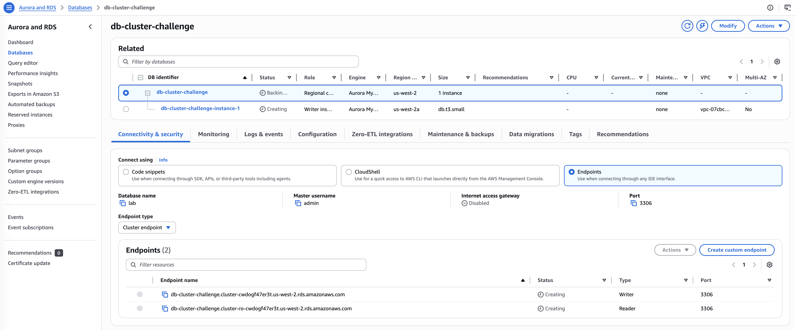

# Challenge Lab: Build Your DB Server and Interact With Your DB
  
This lab is designed to reinforce the concept of leveraging an AWS-managed database instance for solving relational database needs.

**Amazon Relational Database Service** (Amazon RDS) makes it easy to set up, operate, and scale a relational database in the cloud. 
It provides cost-efficient and resizable capacity while managing time-consuming database administration tasks, which allows you to 
focus on your applications and business. Amazon RDS provides you with six familiar database engines to choose from: Amazon Aurora, 
Oracle, Microsoft SQL Server, PostgreSQL, MySQL and MariaDB.

## Steps

1. I launch an Amazon RDS DB instance using Amazon Aurora Provisioned DB engine with the following configuration:
    * DatabaseEngine: `Aurora (MySQL compatible)`
    * Template: Choose `Dev/Test`
    * DB instance size: `Burstable classes` type `db.t3.small`
    * DB instance identifier: `db-cluster-challenge`
    * Master username: `admin`
    * Password: `labchallenge123&` (self-manage)
    * Storage: `Aurora Standard`
    * Availability and durability: `Don't create an Aurora Replica`
    * Amazon VPC: `Lab VPC`
    * DB subnet group: `lab subnet`
    * Security Group: `WebSecurityGorup` (add inbound MYSQL/Aurora port 3306)
    * Initial database name: `lab`
    *  Under Additional configuration:
        * Disable Enable Enhanced monitoring
        * Disable Enable auto minor version upgrade
    * Purchasing Options: On-Demand instances are allowed. Other purchasing options are disabled



2. I click the Details followed by Show:
    * Download PEM from lab details
    * LinuxServer address: 35.89.193.171
  
3. I connect (SSH) to the LinuxServer using a terminal:
```bash
chmod 700 labsuser.pem 
ssh -i labsuser.pem ec2-user@35.89.193.171
```

Output screen:
```bash
The authenticity of host '54.149.121.62 (54.149.121.62)' can't be established.
ED25519 key fingerprint is SHA256:DthcSwIZJPIV9kRvb21VC+8Rh6PZfvfmdC6LDvPMdxw.
This key is not known by any other names.
Are you sure you want to continue connecting (yes/no/[fingerprint])? yes
Warning: Permanently added '54.149.121.62' (ED25519) to the list of known hosts.
   ,     #_
   ~\_  ####_        Amazon Linux 2
  ~~  \_#####\
  ~~     \###|       AL2 End of Life is 2026-06-30.
  ~~       \#/ ___
   ~~       V~' '->
    ~~~         /    A newer version of Amazon Linux is available!
      ~~._.   _/
         _/ _/       Amazon Linux 2023, GA and supported until 2028-03-15.
       _/m/'           https://aws.amazon.com/linux/amazon-linux-2023/

[ec2-user@ip-10-0-2-199 ~]$ 
```

4. I install a MySQL client, and use it to connect to the db with the commands:
```bash
sudo yum install mariadb -y
mysql -h db-cluster-challenge.cluster-cwdogf47er3t.us-west-2.rds.amazonaws.com -P 3306 -u admin --password='labchallenge123&'
```

Terminal screen:
```bash
[ec2-user@ip-10-0-2-199 ~]$ mysql -h db-cluster-challenge.cluster-cwdogf47er3t.us-west-2.rds.amazonaws.com -P 3306 -u admin --password='labchallenge123&'
Welcome to the MariaDB monitor.  Commands end with ; or \g.
Your MySQL connection id is 41
Server version: 5.7.12 MySQL Community Server (GPL)

Copyright (c) 2000, 2018, Oracle, MariaDB Corporation Ab and others.

Type 'help;' or '\h' for help. Type '\c' to clear the current input statement.

MySQL [(none)]> 
```

Then I set the `lab` as default:
```sql
MySQL [(none)]> SHOW DATABASES;
+--------------------+
| Database           |
+--------------------+
| information_schema |
| lab                |
| mysql              |
| performance_schema |
| sys                |
+--------------------+
5 rows in set (0.00 sec)

MySQL [(none)]> USE lab;
Database changed
MySQL [lab]> 
```

5. I create a table RESTART using the code:
```sql
CREATE TABLE `restart` (
`Student_ID` INT(10) ZEROFILL,
`Student_Name` CHAR(52) NOT NULL DEFAULT '',
`Restart_City` CHAR(52) NOT NULL DEFAULT '',
`Graduation_Date` DATE,
PRIMARY KEY (`Student_ID`)
);
```

Terminal screen:
```sql
MySQL [lab]> CREATE TABLE `restart` (
    -> `Student_ID` INT(10) ZEROFILL,
    -> `Student_Name` CHAR(52) NOT NULL DEFAULT '',
    -> `Restart_City` CHAR(52) NOT NULL DEFAULT '',
    -> `Graduation_Date` DATE,
    -> PRIMARY KEY (`Student_ID`)
    -> );
Query OK, 0 rows affected (0.07 sec)
```

6. I insert 10 sample rows into this table with the code:
```sql
INSERT INTO `restart` (`Student_ID`, `Student_Name`, `Restart_City`, `Graduation_Date`) VALUES
(101, 'Alice Johnson', 'New York', '2024-05-15'),
(102, 'Bob Smith', 'Los Angeles', '2023-12-20'),
(103, 'Charlie Brown', 'Chicago', '2025-06-10'),
(104, 'Diana Prince', 'Houston', '2024-11-30'),
(105, 'Ethan Hunt', 'Phoenix', '2023-08-25'),
(106, 'Fiona Gallagher', 'Philadelphia', '2025-04-05'),
(107, 'George Martin', 'San Antonio', '2024-09-17'),
(108, 'Hannah Lee', 'San Diego', '2023-10-22'),
(109, 'Ian Wright', 'Dallas', '2025-02-14'),
(110, 'Julia Roberts', 'San Jose', '2024-07-09');
```

Terminal screen:
```sql
MySQL [lab]> INSERT INTO `restart` (`Student_ID`, `Student_Name`, `Restart_City`, `Graduation_Date`) VALUES
    -> (101, 'Alice Johnson', 'New York', '2024-05-15'),
    -> (102, 'Bob Smith', 'Los Angeles', '2023-12-20'),
    -> (103, 'Charlie Brown', 'Chicago', '2025-06-10'),
    -> (104, 'Diana Prince', 'Houston', '2024-11-30'),
    -> (105, 'Ethan Hunt', 'Phoenix', '2023-08-25'),
    -> (106, 'Fiona Gallagher', 'Philadelphia', '2025-04-05'),
    -> (107, 'George Martin', 'San Antonio', '2024-09-17'),
    -> (108, 'Hannah Lee', 'San Diego', '2023-10-22'),
    -> (109, 'Ian Wright', 'Dallas', '2025-02-14'),
    -> (110, 'Julia Roberts', 'San Jose', '2024-07-09');
Query OK, 10 rows affected (0.01 sec)
Records: 10  Duplicates: 0  Warnings: 0
```

7. To select all rows from this table I use the sql command `SELECT * FROM restart;`:
```sql
MySQL [lab]> SELECT * FROM restart;
+------------+-----------------+--------------+-----------------+
| Student_ID | Student_Name    | Restart_City | Graduation_Date |
+------------+-----------------+--------------+-----------------+
| 0000000101 | Alice Johnson   | New York     | 2024-05-15      |
| 0000000102 | Bob Smith       | Los Angeles  | 2023-12-20      |
| 0000000103 | Charlie Brown   | Chicago      | 2025-06-10      |
| 0000000104 | Diana Prince    | Houston      | 2024-11-30      |
| 0000000105 | Ethan Hunt      | Phoenix      | 2023-08-25      |
| 0000000106 | Fiona Gallagher | Philadelphia | 2025-04-05      |
| 0000000107 | George Martin   | San Antonio  | 2024-09-17      |
| 0000000108 | Hannah Lee      | San Diego    | 2023-10-22      |
| 0000000109 | Ian Wright      | Dallas       | 2025-02-14      |
| 0000000110 | Julia Roberts   | San Jose     | 2024-07-09      |
+------------+-----------------+--------------+-----------------+
10 rows in set (0.01 sec)
```

8. I create a table CLOUD_PRACTITIONER:
```sql
CREATE TABLE cloud_practitioner (
    `Student_ID` INT(10) ZEROFILL,
    `Certification_Date` DATE NOT NULL,
    PRIMARY KEY (`Student_ID`)
);
```

Terminal screen:
```sql
MySQL [lab]> CREATE TABLE cloud_practitioner (
    ->     `Student_ID` INT(10) ZEROFILL,
    ->     `Certification_Date` DATE NOT NULL,
    ->     PRIMARY KEY (`Student_ID`)
    -> );
Query OK, 0 rows affected (0.03 sec)
```

9. I insert 5 sample rows into this table:
```sql
INSERT INTO cloud_practitioner (`Student_ID`, `Certification_Date`) VALUES
(101, '2026-01-15 10:30:00'),
(102, '2026-02-20 14:45:00'),
(111, '2026-03-10 09:15:00'),
(112, '2026-03-25 16:00:00'),
(113, '2026-03-30 11:20:00');
```

Terminal screen:
```sql
MySQL [lab]> INSERT INTO cloud_practitioner (`Student_ID`, `Certification_Date`) VALUES
    -> (101, '2026-01-15 10:30:00'),
    -> (102, '2026-02-20 14:45:00'),
    -> (111, '2026-03-10 09:15:00'),
    -> (112, '2026-03-25 16:00:00'),
    -> (113, '2026-03-30 11:20:00');
Query OK, 5 rows affected, 5 warnings (0.01 sec)
Records: 5  Duplicates: 0  Warnings: 5
```

10. I select all rows from this table using the command `SELECT * FROM cloud_practitioner;`:
```sql
MySQL [lab]> SELECT * FROM cloud_practitioner;
+------------+--------------------+
| Student_ID | Certification_Date |
+------------+--------------------+
| 0000000101 | 2026-01-15         |
| 0000000102 | 2026-02-20         |
| 0000000111 | 2026-03-10         |
| 0000000112 | 2026-03-25         |
| 0000000113 | 2026-03-30         |
+------------+--------------------+
5 rows in set (0.00 sec)
```

11. I perform an inner join between the 2 tables created above and display student ID, Student Name, Certification Date:
```sql
SELECT 
    rs.Student_ID AS `Student ID`,
    rs.Student_Name AS `Student Name`,
    cp.Certification_Date AS `Certification Date`
FROM restart rs
INNER JOIN cloud_practitioner cp
ON rs.Student_ID = cp.Student_ID;
```    

Terminal screen:
```sql
MySQL [lab]> SELECT 
    ->     rs.Student_ID AS `Student ID`,
    ->     rs.Student_Name AS `Student Name`,
    ->     cp.Certification_Date AS `Certification Date`
    -> FROM restart rs
    -> INNER JOIN cloud_practitioner cp
    -> ON rs.Student_ID = cp.Student_ID;
+------------+---------------+--------------------+
| Student ID | Student Name  | Certification Date |
+------------+---------------+--------------------+
| 0000000101 | Alice Johnson | 2026-01-15         |
| 0000000102 | Bob Smith     | 2026-02-20         |
+------------+---------------+--------------------+
2 rows in set (0.00 sec)
```

## Conclusion
* I created an RDS instance
* I used the Amazon RDS Query Editor to query data.
