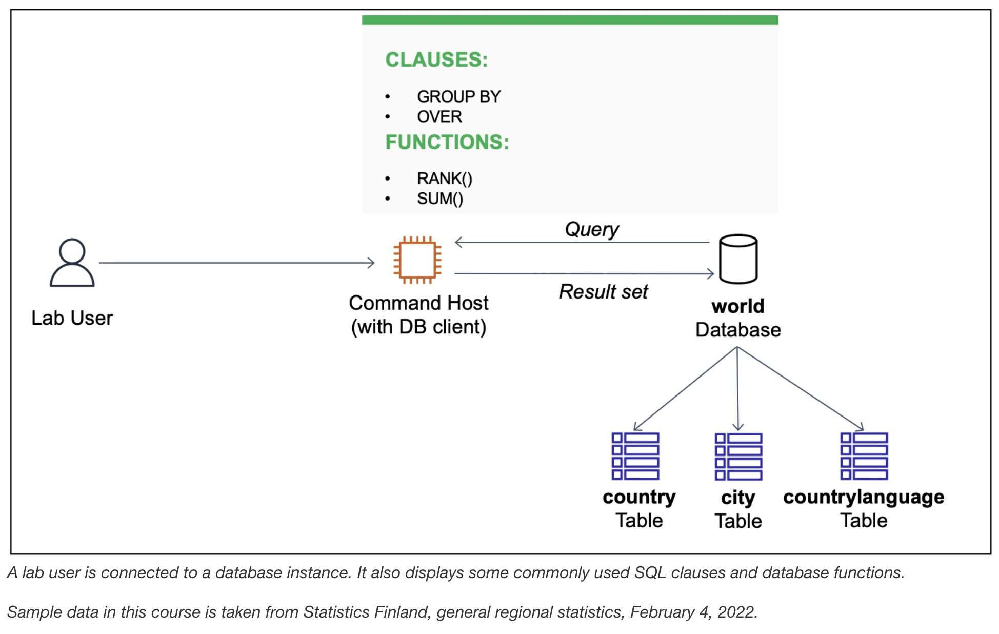

# Organizing Data

The database operations team has created a relational database named **world** containing three tables: city, country, and countrylanguage. 
I will write a few queries to group records for analysis by using both the **GROUP BY** and **OVER** clauses.

## Task 1: Connect to the Command Host

## Task 2: Query the world database

## Challenge

## Conclusion
- I used the **GROUP BY** clause with the aggregate function **SUM()**
- I used the **OVER** clause with the **RANK()** window function
- I used the **OVER** clause with the aggregate function **SUM()** and the **RANK()** window function

## Additional resources
- Country, city, and language data, Statistics Finland: The material was downloaded from Statistics Finland's interface 
service on February 4, 2022, with the [license CC BY 4.0](https://creativecommons.org/licenses/by/4.0/deed.en).
The original data source is available from [Statistics Finland](https://tilastokeskus.fi/tup/kvportaali/index_en.html).

- For more information about database functions and operators, see the following resources:

  - [GROUP By clause](https://mariadb.com/kb/en/group-by/)
  - [OVER clause](https://mariadb.com/kb/en/window-functions-overview/)
  - [SUM function](https://mariadb.com/kb/en/sum/)
  - [RANK function](https://mariadb.com/kb/en/rank/)
  - [SELECT statements](https://mariadb.com/kb/en/select/)
  - [COUNT function](https://mariadb.com/kb/en/count/)
