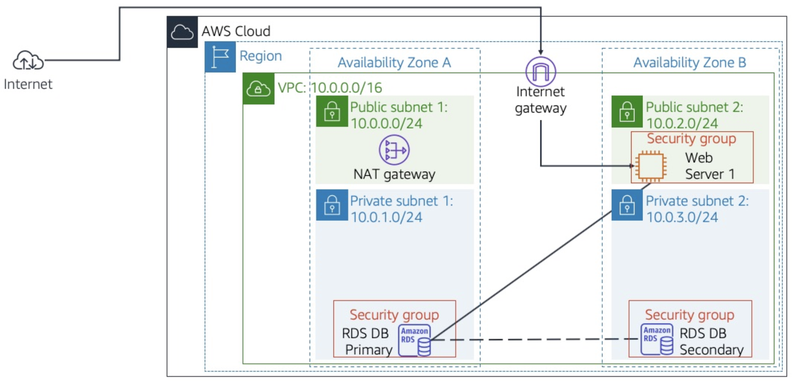
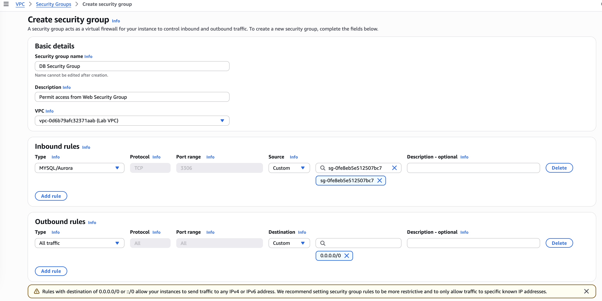
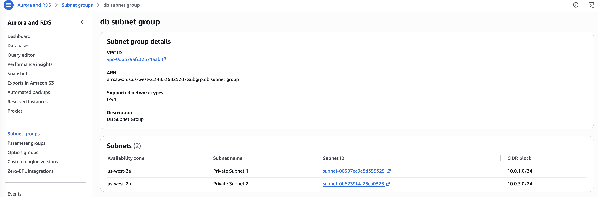
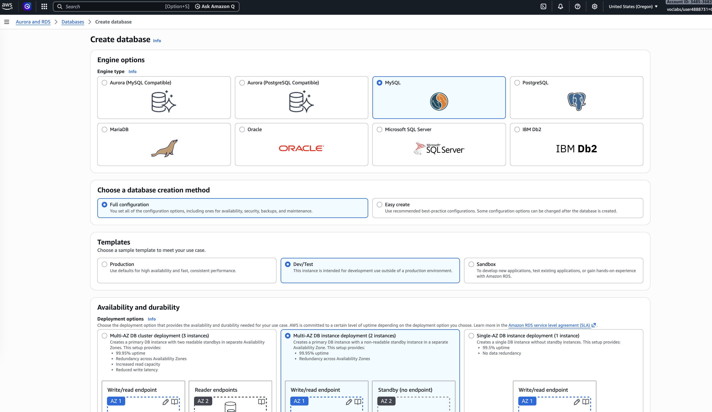
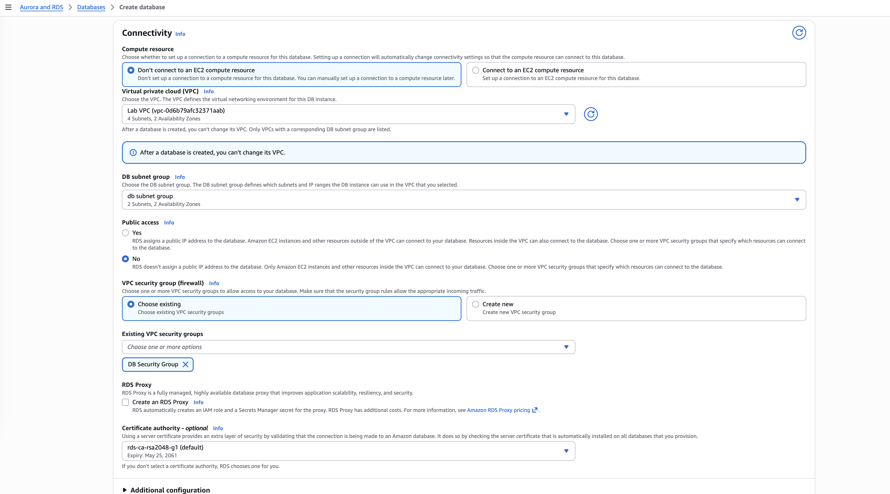
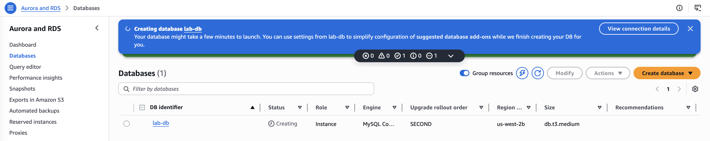
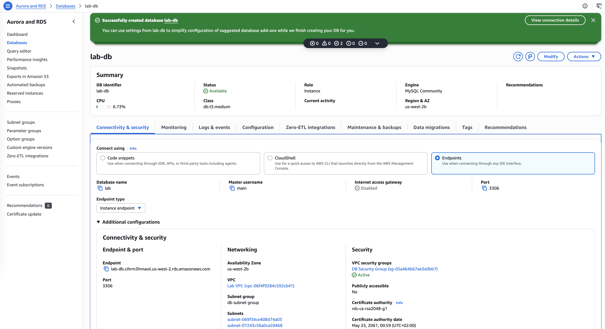

# Build Your DB Server and Interact With Your DB Using an App

In this lab I will leverage an AWS-managed database instance by solving relational database needs.

**Amazon Relational Database Service** (Amazon RDS) makes it easy to set up, operate, and scale a relational database in the cloud. 
It provides cost-efficient and resizable capacity while managing time-consuming database administration tasks, which allows to focus 
on the applications and business. Amazon RDS provides with six familiar database engines to choose from: 
Amazon Aurora, Oracle, Microsoft SQL Server, PostgreSQL, MySQL and MariaDB.

## Task 1: Create a Security Group for the RDS DB Instance
I In this task, I create a security group to allow the web server to access the RDS DB instance:
- Security group name: `DB Security Group`
- Description: `Permit access from Web Security Group`
- VPC: `Lab VPC`

Then I addd an inbound rule to permit traffic on port 3306 (database requests) from any EC2 instance 
that is associated with the Web Security Group:
- Type: MySQL/Aurora (3306)
- Source: Type sg in the search field and then select Web Security Group.

The security group will be used when launching the Amazon RDS database instance.

## Task 2: Create a DB Subnet Group
In this task, I create a DB subnet group that is used to tell RDS which subnets can be used for the database:
- Name: `DB Subnet Group`
- Description: `DB Subnet Group`
- VPC ID: `Lab VPC`

Each DB subnet group requires subnets in at least two Availability Zones: I select `us-west-2s` and `us-west-2b`.
Then I add the subnets `Private Subnet 1` (10.0.1.0/24) and `Private Subnet 2` (10.0.3.0/24).

## Task 3: Create an Amazon RDS DB Instance
In this task, I will configure and launch a Multi-AZ Amazon RDS for MySQL database instance.

Amazon RDS Multi-AZ deployments provide enhanced availability and durability for Database (DB) instances, making them a natural fit for production database workloads. When provisioning a Multi-AZ DB instance, Amazon RDS automatically creates a primary DB instance and synchronously replicates the data to a standby instance in a different Availability Zone (AZ).

Under the *Aurora and RDS* service, I choose th *Database* tab and click on *Create Database*.

Under Engine options I select:
- Engine type: `MySQL`
- Templates: `Dev/Test`
- Availability and durability: `Multi-AZ DB Instance`

Under Settings, I configure the following:
- Engine version: `MySQK8.4.7`
- DB instance identifier: `lab-db`
- Master username: `main`
- Master password: `lab-password`
- Confirm password: `lab-password`

Under Instance configuration, I configure the following for DB instance class:
- Select `Burstable classes (includes t classes)`
- Select `db.t3.medium`

Under Storage, I configure:
- Select `General Purpose (SSD)` under Storage type.

Under Connectivity, I configure:
- Virtual Private Cloud (VPC): `Lab VPC`
- Under VPC security group: choose existing and select `DB Security Group`

Under Monitoring, I expand Additional configuration and then configure the following:
- For Enhanced Monitoring: uncheck Enable Enhanced monitoring

Scroll down to the Additional configuration section and expand this option. Then configure:
- Initial database name: `lab`
- Under Backup: uncheck  Enable automated backups.

After clicking on *Create Database*, I wait for about 5 min for the database to be available. The deployment process is deploying a database in two different Availability zones. Your database will now be launched.

## Task 4: Interact with Your Database

## Conclusions
- I launch an Amazon RDS DB instance with high availability.
- I configure the DB instance to permit connections from my web server.
- I open a web application and interact with my database.
