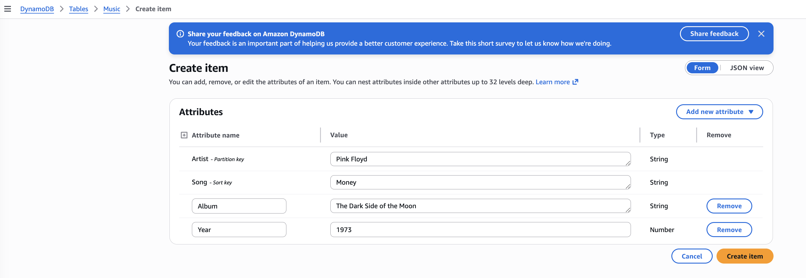
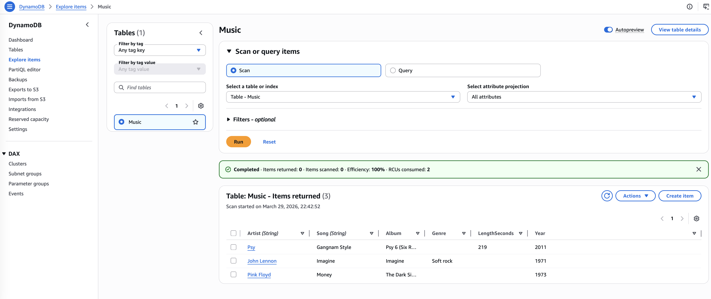
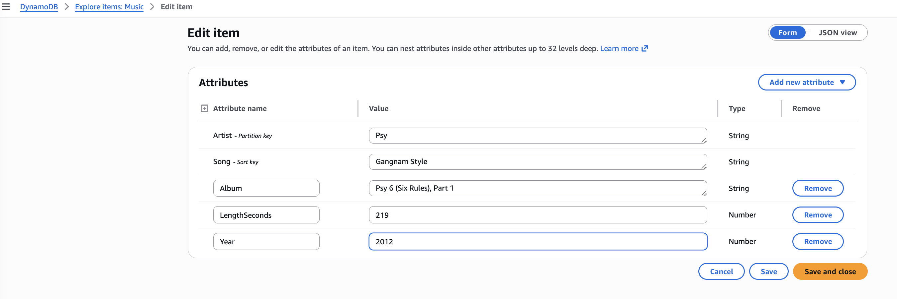
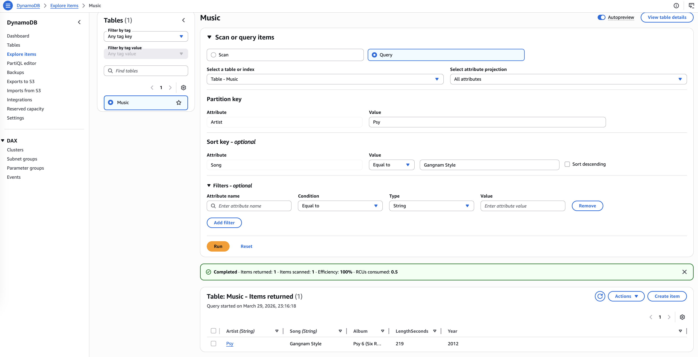
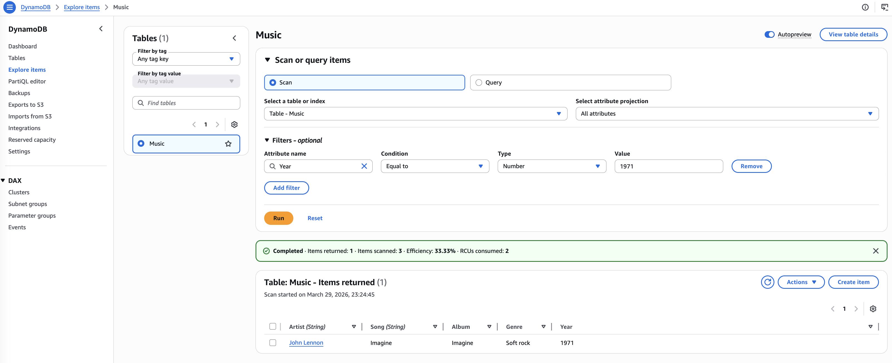

# Introduction to Amazon DynamoDB

Amazon DynamoDB is a fast and flexible **NoSQL** database service for all applications that need consistent, 
single-digit millisecond latency at any scale. It is a fully managed database and supports both document
and key-value data models. Its flexible data model and reliable performance make it a great fit for mobile, 
web, gaming, ad-tech, Internet of Things (IoT), and many other applications.

In this lab, I will create a table in DynamoDB to store information about a music library. 
I will query the music library and then delete the DynamoDB table.

## Task 1: Create a new table
In DynamoDB each table requires a partition key (or a primary key) that is used to partition data across DynamoDB servers. 
A table can also have a sort key. The combination of a partition key and sort key uniquely identifies each item in a DynamoDB table.

I create a new table in DynamoDB with this configuration:
* Table name: `Music`
* Partition key: `Artist` (String)
* Sort key - optional: `Song` (String)

## Task 2: Add data
A table is a collection of data on a particular topic. Each table contains multiple items. An item is a group of attributes that is uniquely 
identifiable among all of the other items. Items in DynamoDB are similar in many ways to rows in other database systems. In DynamoDB, 
there is no limit to the number of items you can store in a table.

Each item consists of one or more attributes. An attribute is a fundamental data element, something that does not need to be broken down any further. 
For example, an item in a Music table contains attributes such as song and artist. Attributes in DynamoDB are similar columns in other database systems, 
but each item (row) can have different attributes (columns).

When writing an item to a DynamoDB table, only the partition key and sort key (if used) are required. Other than these fields, the table does not require a schema. This means that it is possible to add attributes to one item that may be different than the attributes for other items.

I add 3 items into to the Music table using the button `Create item` on the Music table page.
The first itema has atributes:

First item:
* Artist: `Pink Floyd` (partition key)
* Song: `Money` (sort key)
* Album: `The Dark Side of the Moon` (new string attribute)
* Year: `1973` (new number attribute)

Second item:
* Artist: `John Lennon` (partition key)
* Song: `Imagine` (sort key)
* Album: `Imagine` (attribute)
* Year: `1971` (attribute)
* Genre: `Soft rock` (new string attribute)

Third item:
* Artist: `Psy` (partition key)
* Song: `Gangnam Style` (sort key)
* Album: `Psy 6 (Six Rules), Part 1` (attribute)
* Year: `2011` (attribute)
* LengthSeconds: `219` (new number attribute)

The possibility to add items with different attributes demonstrates the flexibility of a NoSQL database.

There are also faster ways to load data into DynamoDB, such as using AWS Command Line Interface, programmatically loading data, 
or using one of the free tools available on the internet.

## Task 3: Modify an existing item
For item `Psy`, I change the Year from 2011 to 2012.

## Task 4: Query the table
There are two ways to query a DynamoDB table: *query* and *scan*.

A query operation finds items based on the primary key and optionally the sort key. It is fully indexed, so it runs very fast.

    * Artist (Partition key): `Psy`
    * Song (Sort key): `Gangnam Style`

Scan for an item involves looking through every item in a table, so it is less efficient and can take significant time for larger tables.

    * Attribute name: `Year`
    * Type: `Number`
    * Value`: `1971`
Only the song released in 1971 is displayed.

## Task 5: Delete the table

## Conclusion
* I created an Amazon DynamoDB table
* I entered data into an Amazon DynamoDB table
* I queried an Amazon DynamoDB table
* I deleted an Amazon DynamoDB table

## Additional resources
* [DynamoDB documentation](http://aws.amazon.com/documentation/dynamodb)
