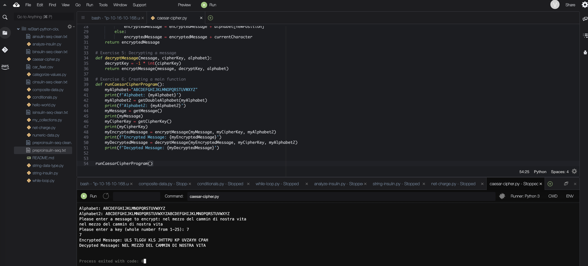

# Using Functions to Implement a Caesar Cipher

In programming, a function is a named section of a program that performs a specific task. Python has built-in functions like print() 
that are provided by the language. Additionally, you can use functions provided by other developers through the import statement. 
For example, you can use import math if you want to use the math.floor() function. In Python, you can make your own functions, 
which are called user-defined functions.

To drive the discussion of user-defined functions, I will write a program that implements a Caesar cipher, which is a simple method of encryption. 
A Caesar cipher takes the letters of a message and shifts each letter along the alphabet by a certain number of places.

## Solution: Caesar Cipher Program

The python code is [caesar-cipher.py](./python-scripts/caesar-cipher.py).

This program implements a simple Caesar cipher to encrypt and decrypt messages.

The Caesar cipher is a substitution cipher where each letter in a message is shifted by a fixed number of positions in the alphabet. 
The shift value is defined by the user as the cipher key.

### How it works

1. The program defines the alphabet and creates a duplicated version to handle letter shifting.
2. The user inputs a message and a cipher key (shift value between 1 and 25).
3. The message is converted to uppercase for consistency.
4. Each letter in the message is shifted forward in the alphabet to create the encrypted message.
5. Non-alphabet characters (e.g., spaces, punctuation) remain unchanged.
6. The encrypted message is then decrypted by shifting letters backward using the same key.

### Key concept

- Encryption: shift letters forward  
- Decryption: shift letters backward  
- The same key is used for both operations  

## Conclusion
- I created user-defined functions
- I used several functions to implement a Caesar cipher encryption program
