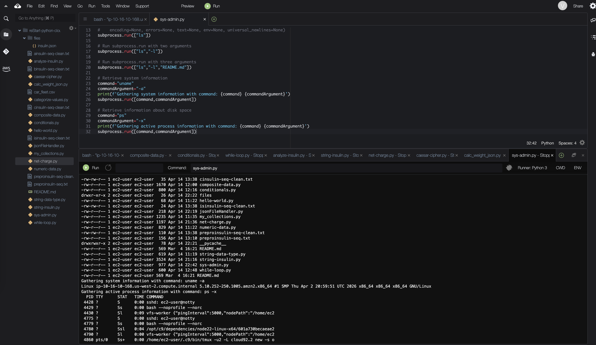

# Introducing System Administration with Python

In this lab, I use Python to execute Bash commands from the command line by leveraging modules such as `os.system()` and `subprocess.run()`
to perform administrative tasks programmatically.

## Solution

The python code for this lab is [sys-admin.py](./python-scripts/sys-admin.py).

The program uses two approaches to run system commands:

- `os.system()` to execute a simple command (`ls`) and display directory contents.
- `subprocess.run()` to execute more flexible and secure system commands.

The script runs several Linux commands:

- `ls` → lists files in the current directory  
- `ls -l` → displays detailed file information  
- `ls -l README.md` → checks details of a specific file  
- `uname -a` → retrieves system information (kernel, OS, architecture)  
- `ps -x` → displays currently running processes  

## Conclusion
- I used `os.system()` to run a Bash command
- I used `subprocess.run()` to run Bash commands
