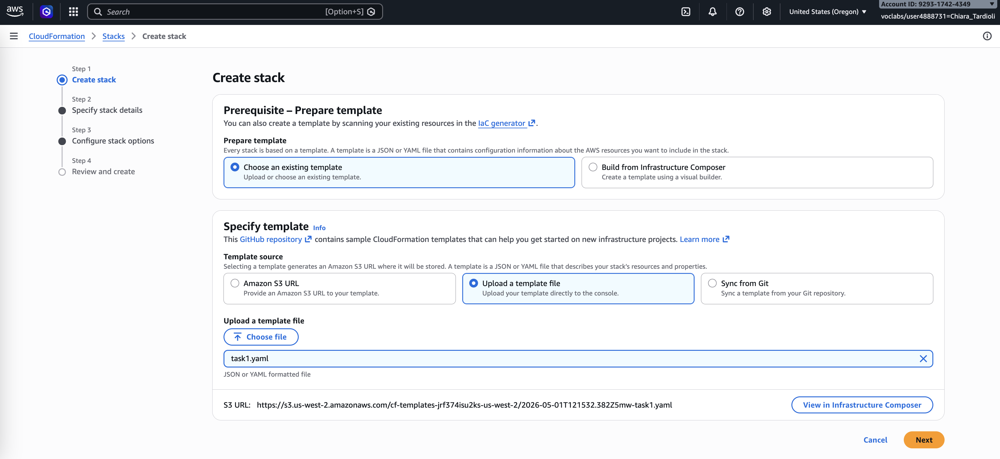
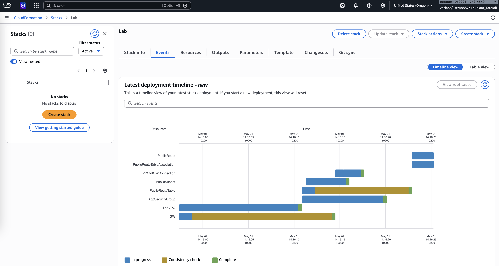
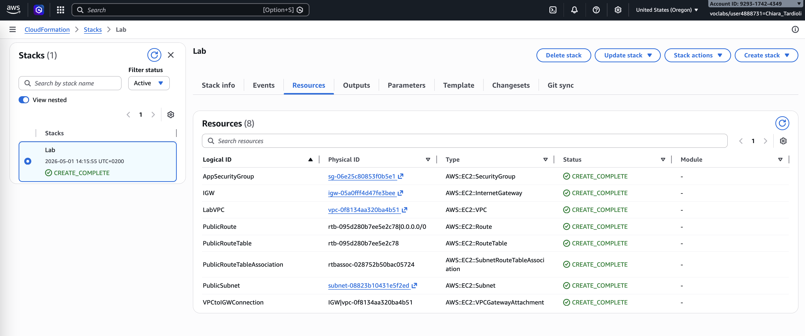
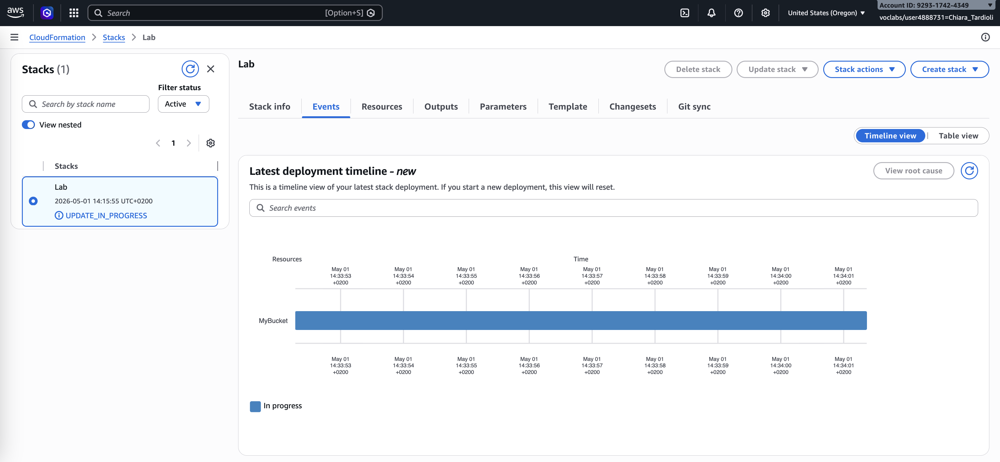
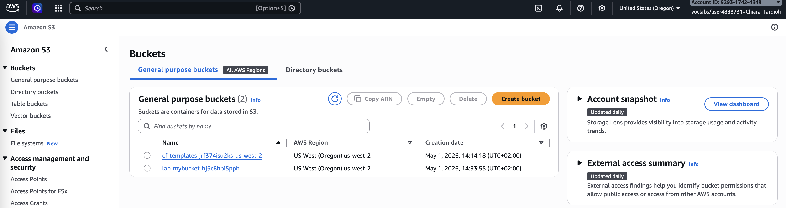
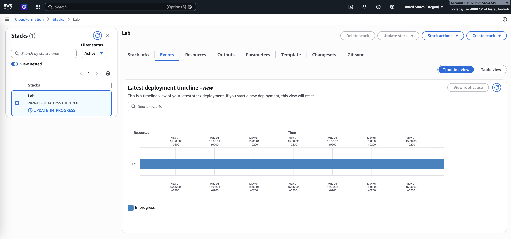
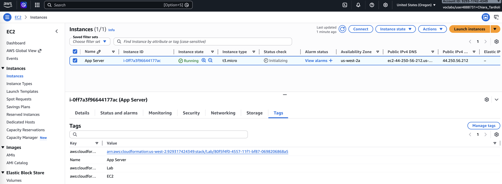
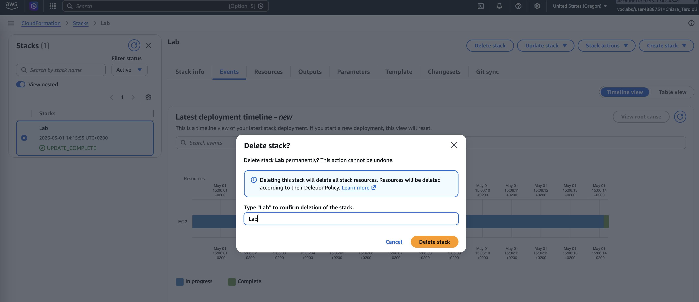
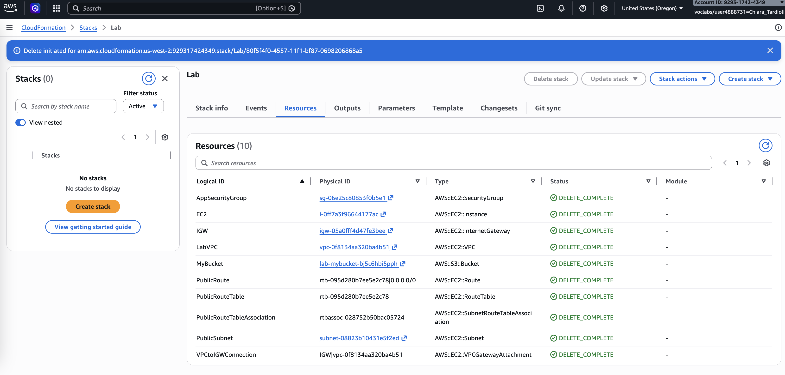

# Automation with CloudFormation

## Introduction

Amazon Web Services (AWS) provides infrastructure automation capabilities through services such as CloudFormation, enabling consistent and repeatable deployments. 
In this lab, I explored how infrastructure can be defined as code using YAML templates and deployed automatically. The lab focused on creating, modifying, 
and deleting a CloudFormation stack while integrating core AWS resources such as a Virtual Private Cloud (VPC), Security Groups, Amazon S3 buckets, and Amazon EC2 instances.
This approach reduces manual configuration errors and improves deployment efficiency.

## Task 1: Deploy a CloudFormation Stack

I started by downloading the provided [task1.yaml](./files/task1.yaml) template and examining its structure. The file contained three main sections: 
- [Parameters](https://docs.aws.amazon.com/AWSCloudFormation/latest/UserGuide/parameters-section-structure.html)
- [Resources](https://docs.aws.amazon.com/AWSCloudFormation/latest/UserGuide/resources-section-structure.html)
- [Outputs](https://docs.aws.amazon.com/AWSCloudFormation/latest/UserGuide/outputs-section-structure.html)

The Parameters section defined CIDR blocks for networking, the Resources section described the VPC and Security Group, and the Outputs section exposed useful 
information about the created resources.

The template is written in a format called YAML, which is commonly used for configuration files. The format of the file is important, including the indents and hyphens. 
CloudFormation templates can also be written in JSON.

Using the AWS Management Console, I created a new CloudFormation stack named **Lab** by uploading the template file. I kept the default parameter values and 
proceeded through the configuration steps.

After launching the stack, I monitored the deployment process through the Events tab, which displayed the sequence of resource creation. I also reviewed 
the Resources tab to see the components being provisioned.

Once the status reached `CREATE_COMPLETE`, I verified that the VPC and associated resources had been successfully created.

## Task 2: Add an Amazon S3 Bucket to the Stack

Next, I modified the existing template to include an Amazon S3 bucket. Based on the documentation, I added a minimal resource definition under 
the Resources section using only the required type declaration.

After saving the changes, I updated the existing CloudFormation stack by uploading the modified template. During the update process, I reviewed 
the change set preview, which indicated that a new S3 bucket would be added without affecting existing resources.

The update completed successfully, and I confirmed that the new S3 bucket appeared in the Resources tab with an automatically generated name.

## Task 3: Add an Amazon EC2 Instance to the Stack

In this task, I extended the template further by adding an EC2 instance. First, I introduced a new parameter to dynamically retrieve the latest Amazon Linux 2 AMI 
using AWS Systems Manager Parameter Store.

Then, I defined the EC2 instance resource under the Resources section. This required specifying several properties, including the AMI reference, 
instance type, security group, subnet, and tags. I used the `!Ref` function to reference existing resources such as the security group and subnet.

After updating the template, I performed another stack update. The preview confirmed that only the EC2 instance would be added.

Once the update completed, I verified that the EC2 instance was successfully created and listed among the stack resources.

## Task 4: Delete the Stack

Finally, I deleted the CloudFormation stack. This process automatically removed all associated resources, including the VPC, S3 bucket, and EC2 instance.

I monitored the deletion process until the stack status changed to `DELETE_COMPLETE` and confirmed that all resources were removed.

## Conclusion

In this lab, I learned how to use AWS CloudFormation to automate infrastructure deployment. I created a stack from a YAML template, 
then incrementally updated it by adding an S3 bucket and an EC2 instance. This demonstrated how CloudFormation allows controlled and 
efficient modifications without redeploying existing resources. I also observed how dependencies between resources are managed automatically.

Overall, the lab highlighted the advantages of infrastructure as code, including consistency, scalability, and easier maintenance. 
Deleting the stack reinforced how CloudFormation simplifies cleanup by removing all associated resources in a single operation.

In summary, I learnt how to:
- Deploy an AWS CloudFormation stack with a defined Virtual Private Cloud (VPC), and Security Group.
- Configure an AWS CloudFormation stack with resources, such as an Amazon Simple Storage Solution (S3) bucket and Amazon Elastic Compute Cloud (EC2).
- Terminate an AWS CloudFormation and its respective resources.

