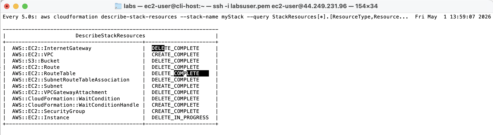
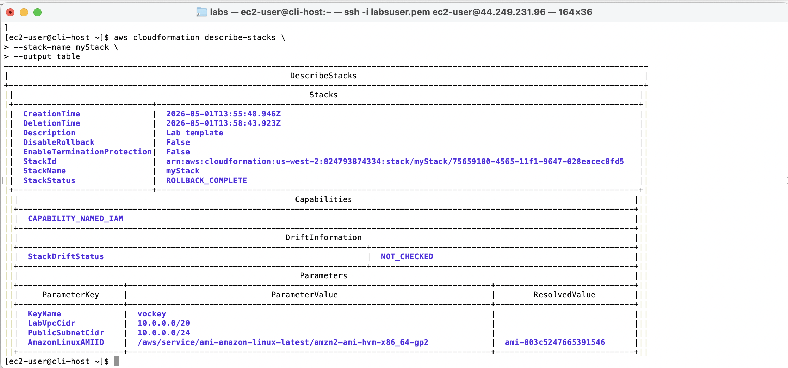
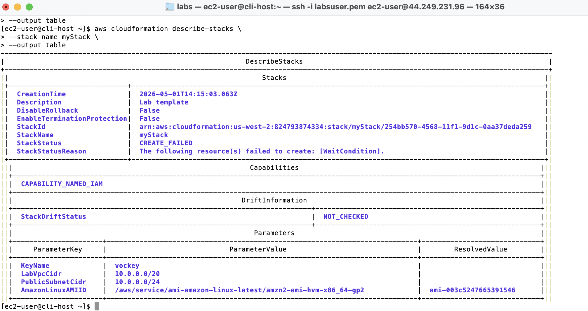

# Troubleshoot CloudFormation – Lab Report

## Introduction

This lab focused on developing practical skills for troubleshooting AWS CloudFormation deployments. The activity covered querying JSON data using JMESPath, 
identifying and resolving stack creation failures, analyzing EC2 instance logs, detecting configuration drift, and resolving issues encountered during stack deletion. 
The goal was to better understand how infrastructure as code (IaC) behaves in real-world scenarios and how to diagnose and fix deployment problems efficiently.

The architectural diagram is illustrated below.


## Task 1: Querying JSON Data with JMESPath

In this task, I explored how to use [JMESPath](http://jmespath.org/) expressions to extract specific data from JSON documents. 
I practiced selecting elements using array indices, retrieving attributes, and applying filters.

I successfully:
- Retrieved specific elements using index-based queries.
- Extracted attributes such as `name` and `price`.
- Used projections to return values from all elements.
- Applied filters to locate elements without knowing their position.

Finally, I constructed a query to extract the `LogicalResourceId` of an EC2 instance:

```
StackResources[?ResourceType == 'AWS::EC2::Instance'].LogicalResourceId
```

This exercise helped me understand how JMESPath is used within AWS CLI commands.


## Task 2: Troubleshooting CloudFormation Stack Creation

#### Connecting to CLI Host and Configuring AWS CLI

I connected to the CLI Host EC2 instance using SSH and configured the AWS CLI with the provided credentials and region.

```bash
   ,     #_
   ~\_  ####_        Amazon Linux 2
  ~~  \_#####\
  ~~     \###|       AL2 End of Life is 2026-06-30.
  ~~       \#/ ___
   ~~       V~' '->
    ~~~         /    A newer version of Amazon Linux is available!
      ~~._.   _/
         _/ _/       Amazon Linux 2023, GA and supported until 2028-03-15.
       _/m/'           https://aws.amazon.com/linux/amazon-linux-2023/

[ec2-user@cli-host ~]$ curl http://169.254.169.254/latest/dynamic/instance-identity/document | grep region
  % Total    % Received % Xferd  Average Speed   Time    Time     Time  Current
                                 Dload  Upload   Total   Spent    Left  Speed
100   476  100   476    0     0   343k      0 --:--:-- --:--:-- --:--:--  464k
  "region" : "us-west-2",
[ec2-user@cli-host ~]$ aws configure
AWS Access Key ID [None]: <AWS Access Key>
AWS Secret Access Key [None]:  <AWS Secret Access Key>  
Default region name [None]: us-west-2
Default output format [None]: json
```

#### 2.1 Initial Stack Creation Attempt

I attempted to create a CloudFormation stack using a provided template. The stack creation failed, and resources were rolled back automatically.

Using CLI commands, I monitored:
- Resource creation status
- Stack status
- Stack events






The error indicated that the `WaitCondition` resource timed out.

I delete the stack resource with the command `aws cloudformation delete-stack --stack-name myStack`.

#### 2.2 Investigating the Failure

To debug the issue, I recreated the stack with rollback disabled. This allowed me to access the EC2 instance logs.



I connected to the web server instance and examined:

- `/var/log/cloud-init-output.log`
- User data script (`part-001`)

I identified the issue:
- The script attempted to install a package named `http`, which does not exist.

Because of the `-e` flag in the script, the failure caused the entire script to stop, preventing the success signal required by the `WaitCondition`.


#### 2.3 Fixing the Template

I edited the CloudFormation template and replaced `yum install -y http` with `yum install -y httpd`

After saving the changes, I deleted the failed stack and created a new one.

This time, the stack creation completed successfully. Also, the Outputs section includes the PublicIP address of the web server and the name of the S3 bucket that was created.


#### 2.4 Verifying the Web Server

I accessed the web server using its public IP address and confirmed that it displayed the expected message.


## Task 3: Drift Detection

#### Manual Modification

I manually modified the security group by restricting SSH access to my IP address.


I also uploaded a file to the S3 bucket created by the stack.


#### Detecting Drift

I initiated drift detection using the AWS CLI and analyzed the results.

Findings:
- The security group showed a status of `MODIFIED`.
- The S3 bucket remained `IN_SYNC` because adding objects does not count as drift.


This demonstrated that CloudFormation detects configuration changes but not data changes within resources.


### Task 4: Stack Deletion and Troubleshooting

#### Failed Deletion Attempt

I attempted to delete the stack, but the process failed due to the S3 bucket containing objects.


CloudFormation does not delete non-empty buckets to prevent data loss.

#### Resolving the Issue

To resolve this, I used the AWS CLI option to retain the S3 bucket during deletion.

Steps:
1. Retrieved the logical resource ID of the bucket.
2. Executed the delete command with the `--retain-resources` parameter.

Example:

```
aws cloudformation delete-stack 
--stack-name myStack 
--retain-resources MyBucket
```

This allowed the stack to be deleted successfully while preserving the bucket and its contents.


## Conclusion

In this lab, I learned how to troubleshoot CloudFormation deployments by analyzing stack events, inspecting EC2 logs, and identifying configuration issues in templates. I gained hands-on experience using JMESPath for querying CLI outputs, which improved my ability to extract relevant information efficiently.

I also understood the importance of disabling rollback during debugging and how small configuration errors can lead to stack failures. Additionally, I explored drift detection and observed how manual changes affect infrastructure managed by CloudFormation.

Finally, I resolved a failed stack deletion scenario by retaining specific resources, demonstrating how to manage dependencies and prevent data loss. This lab provided practical insight into managing infrastructure as code and reinforced best practices for debugging and maintaining AWS environments.

In summary:
- I practiced using JMESPath to query JSON-formatted documents.
- I troubleshot the deployment of an AWS CloudFormation stack by using the AWS CLI.
- I analyzed log files on a Linux EC2 instance to determine the cause of a create-stack failure.
- I troubleshot a failed delete-stack action.

## AWS CLI Commands
```bash
## AWS CLI Commands

```bash
# Retrieve the AWS region of the EC2 instance
curl http://169.254.169.254/latest/dynamic/instance-identity/document | grep region

# Configure AWS CLI credentials and default settings
aws configure

# View the CloudFormation template
less template1.yaml

# Create CloudFormation stack (initial attempt)
aws cloudformation create-stack \
--stack-name myStack \
--template-body file://template1.yaml \
--capabilities CAPABILITY_NAMED_IAM \
--parameters ParameterKey=KeyName,ParameterValue=vockey

# Monitor stack resource creation
watch -n 5 -d \
aws cloudformation describe-stack-resources \
--stack-name myStack \
--query 'StackResources[*].[ResourceType,ResourceStatus]' \
--output table

# Monitor overall stack status
watch -n 5 -d \
aws cloudformation describe-stacks \
--stack-name myStack \
--output table

# View stack events filtered for failures
aws cloudformation describe-stack-events \
--stack-name myStack \
--query "StackEvents[?ResourceStatus == 'CREATE_FAILED']"

# Describe stack details
aws cloudformation describe-stacks \
--stack-name myStack \
--output table

# Delete failed stack
aws cloudformation delete-stack --stack-name myStack

# Create stack without automatic rollback
aws cloudformation create-stack \
--stack-name myStack \
--template-body file://template1.yaml \
--capabilities CAPABILITY_NAMED_IAM \
--on-failure DO_NOTHING \
--parameters ParameterKey=KeyName,ParameterValue=vockey

# Get EC2 instance public IP
aws ec2 describe-instances \
--filters "Name=tag:Name,Values='Web Server'" \
--query 'Reservations[].Instances[].[State.Name,PublicIpAddress]'

# View cloud-init logs for troubleshooting
tail -50 /var/log/cloud-init-output.log

# View user data script executed on instance
sudo cat /var/lib/cloud/instance/scripts/part-001

# Edit CloudFormation template
vim template1.yaml

# Verify template fix (httpd package)
cat template1.yaml | grep httpd

# Delete stack before recreating
aws cloudformation delete-stack --stack-name myStack

# Recreate stack after fixing template
aws cloudformation create-stack \
--stack-name myStack \
--template-body file://template1.yaml \
--capabilities CAPABILITY_NAMED_IAM \
--on-failure DO_NOTHING \
--parameters ParameterKey=KeyName,ParameterValue=vockey

# Retrieve S3 bucket name from stack outputs
bucketName=$(\
aws cloudformation describe-stacks \
--stack-name myStack \
--query "Stacks[*].Outputs[?OutputKey == 'BucketName'].[OutputValue]" \
--output text)

# Display bucket name
echo "bucketName = "$bucketName

# Create a local file
touch myfile

# Upload file to S3 bucket
aws s3 cp myfile s3://$bucketName/

# List contents of S3 bucket
aws s3 ls $bucketName/

# Start drift detection
aws cloudformation detect-stack-drift --stack-name myStack

# Check drift detection status
aws cloudformation describe-stack-drift-detection-status \
--stack-drift-detection-id <driftId>

# View full drift details
aws cloudformation describe-stack-resource-drifts \
--stack-name myStack

# View simplified drift results using JMESPath
aws cloudformation describe-stack-resources \
--stack-name myStack \
--query 'StackResources[*].[ResourceType,ResourceStatus,DriftInformation.StackResourceDriftStatus]' \
--output table

# Show only modified (drifted) resources
aws cloudformation describe-stack-resource-drifts \
--stack-name myStack \
--stack-resource-drift-status-filters MODIFIED

# Attempt to update stack (expected to fail due to drift)
aws cloudformation update-stack \
--stack-name myStack \
--template-body file://template1.yaml \
--parameters ParameterKey=KeyName,ParameterValue=vockey

# Attempt to delete stack (fails due to non-empty S3 bucket)
aws cloudformation delete-stack --stack-name myStack

# Delete stack while retaining S3 bucket
aws cloudformation delete-stack \
--stack-name myStack \
--retain-resources MyBucket
```
