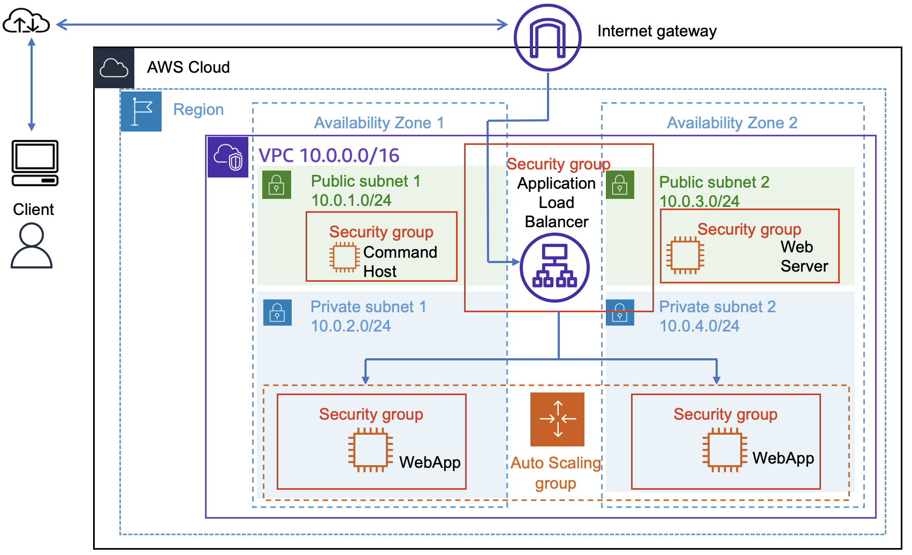
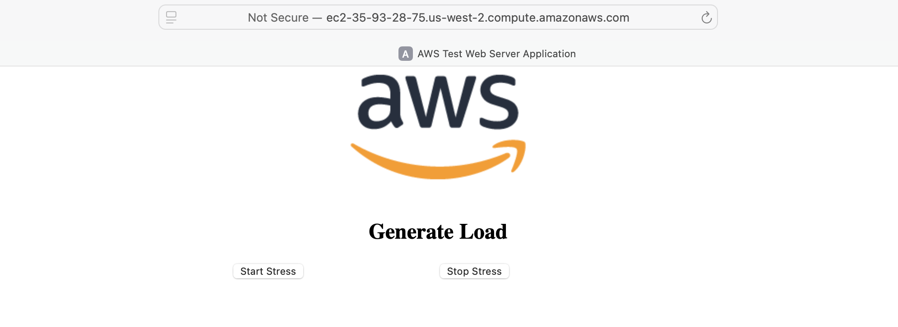
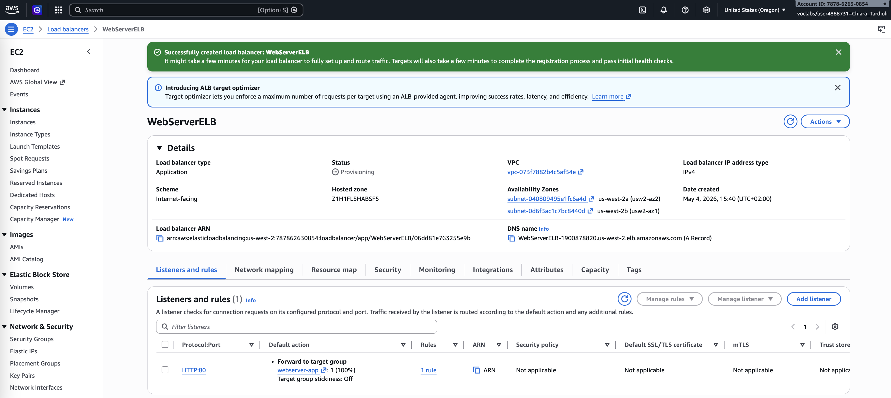
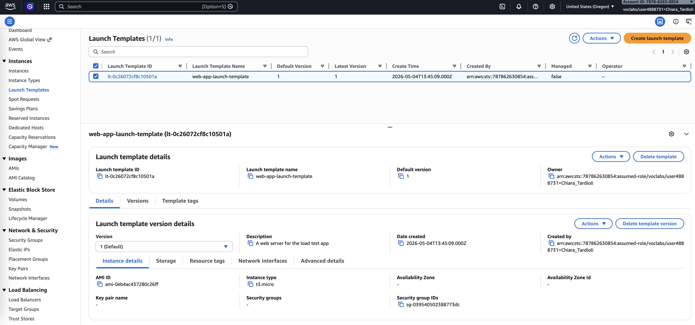
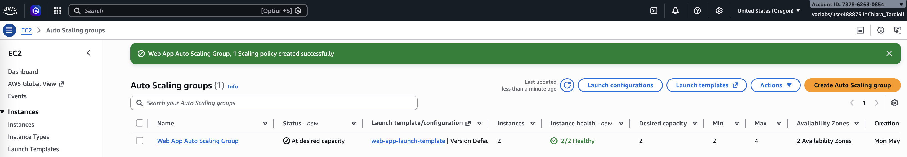
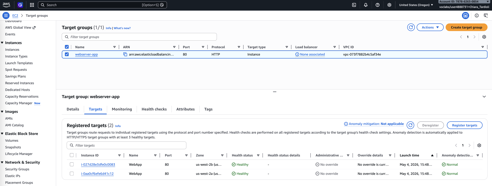
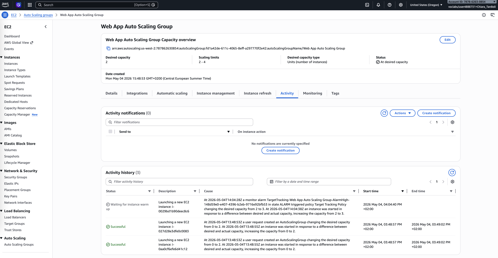

# Using Auto Scaling in AWS (Linux)

This lab demonstrates how to build a scalable and highly available web application infrastructure using Amazon Web Services. 
It combines the use of the AWS Command Line Interface (AWS CLI), Amazon EC2, Auto Scaling, and Elastic Load Balancing to dynamically 
respond to changes in workload. The goal is to automate instance provisioning, distribute traffic efficiently, and maintain application 
performance under varying load conditions.

The architecture evolves from a single command host instance to a distributed system with multiple EC2 instances managed by an Auto Scaling 
group and balanced by an Application Load Balancer across multiple Availability Zones.




## Task 1: Creating a New AMI for Amazon EC2 Auto Scaling

### 1.1 Connecting to the Command Host Instance and configuring the AWS CLI

I began by accessing the EC2 Management Console and connecting to the **Command Host** instance using EC2 Instance Connect. This instance provided a preconfigured environment where I could execute AWS CLI commands required for the lab.

After connecting, I verified the AWS Region using a metadata query and configured the AWS CLI with the appropriate region and output format. This ensured that all subsequent commands were executed in the correct environment.

```bash
  ,     #_
   ~\_  ####_        Amazon Linux 2
  ~~  \_#####\
  ~~     \###|       AL2 End of Life is 2026-06-30.
  ~~       \#/ ___
   ~~       V~' '->
    ~~~         /    A newer version of Amazon Linux is available!
      ~~._.   _/
         _/ _/       Amazon Linux 2023, GA and supported until 2028-03-15.
       _/m/'           https://aws.amazon.com/linux/amazon-linux-2023/

[ec2-user@ip-10-0-1-213 ~]$ curl http://169.254.169.254/latest/dynamic/instance-identity/document | grep region
  % Total    % Received % Xferd  Average Speed   Time    Time     Time  Current
                                 Dload  Upload   Total   Spent    Left  Speed
100   475  100   475    0     0    98k      0 --:--:-- --:--:-- --:--:--  115k
  "region" : "us-west-2",
[ec2-user@ip-10-0-1-213 ~]$ aws configure
AWS Access Key ID [None]: 
AWS Secret Access Key [None]: 
Default region name [us-west-2]: us-west-2
Default output format [None]: json
[ec2-user@ip-10-0-1-213 ~]$
```

### 1.2 Creating a New EC2 Instance

I inspected the provided `UserData.txt` script, which installs and configures a web server capable of generating CPU load. 

```bash
[ec2-user@ip-10-0-1-213 ~]$ cd /home/ec2-user/
[ec2-user@ip-10-0-1-213 ~]$ more UserData.txt 
#!/bin/bash
yum update -y --security
amazon-linux-extras install epel -y
yum -y install httpd php stress
systemctl enable httpd.service
systemctl start httpd
cd /var/www/html
wget http://aws-tc-largeobjects.s3.amazonaws.com/CUR-TF-100-TULABS-1/10-lab-autoscaling-linux/s3/ec2-stress.zip
unzip ec2-stress.zip

echo 'UserData has been successfully executed. ' >> /home/ec2-user/result
find -wholename /root/.*history -wholename /home/*/.*history -exec rm -f {} \;
find / -name 'authorized_keys' -exec rm -f {} \;
rm -rf /var/lib/cloud/data/scripts/*
[ec2-user@ip-10-0-1-213 ~]$ 
```

The last lines of the script erase any history or security information that might have accidentally 
been left on the instance when the image was taken.

Then, I executed an AWS CLI command to launch a new EC2 instance using the specified parameters such as AMI ID, subnet, and security group.

```bash
[ec2-user@ip-10-0-1-213 ~]$ aws ec2 run-instances --key-name $KEYNAME --instance-type t3.micro --image-id $AMIID --user-data file:///home/ec2-user/UserData.txt --security-group-ids $HTTPACCESS --subnet-id $SUBNETID --associate-public-ip-address --tag-specifications 'ResourceType=instance,Tags=[{Key=Name,Value=WebServer}]' --output text --query 'Instances[*].InstanceId'

i-03b19dee09cb55aa8
```

I save the new *InstanceId* in the variable called `NEW_INSTANCE_ID`.

After launching the instance, I waited until it reached the running state and retrieved its public DNS name.

```bash
[ec2-user@ip-10-0-1-213 ~]$ aws ec2 wait instance-running --instance-ids $NEW_INSTANCE_ID
[ec2-user@ip-10-0-1-213 ~]$ aws ec2 describe-instances --instance-id $NEW_INSTANCE_ID --query 'Reservations[0].Instances[0].NetworkInterfaces[0].Association.PublicDnsName'
"ec2-35-93-28-75.us-west-2.compute.amazonaws.com"
```

I accessed the web application through the browser using the url `http://ec2-35-93-28-75.us-west-2.compute.amazonaws.com/index.php` 
to confirm that the web server was functioning correctly.



### 1.3 Creating a Custom AMI

Next, I created a custom AMI from the running EC2 instance using the AWS CLI. This AMI captured the configured web server environment and would later be used to launch identical instances in the Auto Scaling group.


## Task 2: Creating an Auto Scaling Environment

### Task 2.1: Creating an Application Load Balancer

I created an Application Load Balancer named **WebServerELB**. I configured it to operate across two Availability Zones and associated it with public subnets. I also created a target group named **webserver-app** with a health check path of `/index.php`.

After setup, I copied the DNS name of the load balancer for later testing.



### 2.2 Creating a Launch Template

I created a launch template named **web-app-launch-template** using the custom AMI created earlier. I selected the instance type `t3.micro` and assigned the HTTPAccess security group. This template defines how new instances are launched within the Auto Scaling group.



### 2.3 Creating an Auto Scaling Group

Using the launch template, I created an Auto Scaling group named **Web App Auto Scaling Group**. I configured it to launch instances in private subnets across two Availability Zones.

I attached the group to the target group created earlier and enabled load balancer health checks. I set the desired capacity to 2, minimum to 2, and maximum to 4 instances. I also configured a target tracking scaling policy to maintain average CPU utilization at 50%.



## Task 3: Verifying the Auto Scaling Configuration

I verified that two EC2 instances were automatically launched by the Auto Scaling group. I waited until both instances passed their status checks.

Then, I checked the target group and confirmed that both instances were registered and marked as healthy. This indicated that the load balancer was correctly routing traffic to the instances.



## Task 4: Testing Auto Scaling Configuration

To test the scaling behavior, I accessed the web application using the load balancer DNS and initiated the **Start Stress** function. This caused CPU utilization to increase significantly.

I monitored the Auto Scaling group activity and observed that a new EC2 instance was launched after CPU utilization exceeded the defined threshold. This confirmed that the scaling policy was working correctly.



## Conclusion

In this lab, I successfully created and configured a scalable web application infrastructure using AWS services.

I used the AWS CLI to launch an EC2 instance and create a custom AMI. I then configured an Application Load Balancer to distribute incoming traffic and created a launch template to standardize instance configuration. Using this template, I deployed an Auto Scaling group that dynamically adjusted the number of instances based on CPU utilization.

Finally, I validated the system by generating load and observing automatic scaling behavior. This lab demonstrated how to combine AWS services to build a resilient, efficient, and scalable cloud architecture.


## AWS CLI Commands

```bash
# Verify the AWS region of the Command Host instance
curl http://169.254.169.254/latest/dynamic/instance-identity/document | grep region

# Configure AWS CLI credentials, region, and output format
aws configure

# Navigate to the working directory containing lab scripts
cd /home/ec2-user/

# View the user data script used to configure the web server
more UserData.txt

# Launch a new EC2 instance using AMI, subnet, security group, and user data
aws ec2 run-instances \
--key-name KEYNAME \
--instance-type t3.micro \
--image-id AMIID \
--user-data file:///home/ec2-user/UserData.txt \
--security-group-ids HTTPACCESS \
--subnet-id SUBNETID \
--associate-public-ip-address \
--tag-specifications 'ResourceType=instance,Tags=[{Key=Name,Value=WebServer}]' \
--output text \
--query 'Instances[*].InstanceId'

# Wait until the EC2 instance reaches the running state
aws ec2 wait instance-running --instance-ids NEW-INSTANCE-ID

# Retrieve the public DNS name of the EC2 instance
aws ec2 describe-instances \
--instance-id NEW-INSTANCE-ID \
--query 'Reservations[0].Instances[0].NetworkInterfaces[0].Association.PublicDnsName'

# Create an Amazon Machine Image (AMI) from the running instance
aws ec2 create-image \
--name WebServerAMI \
--instance-id NEW-INSTANCE-ID
```
