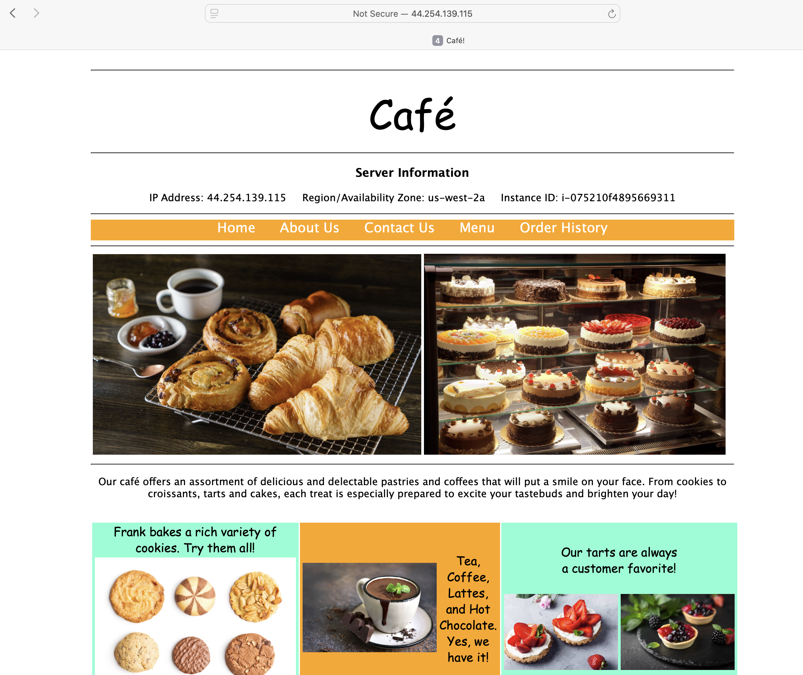
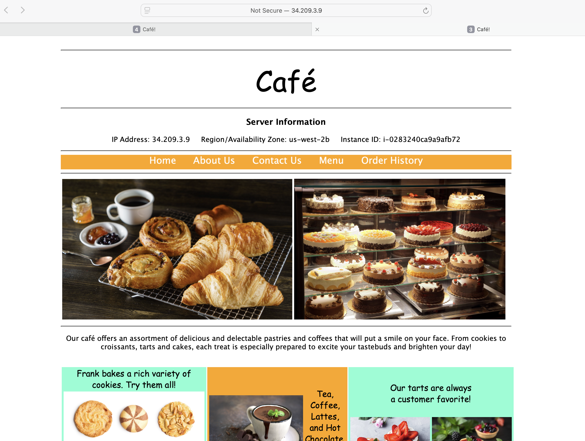
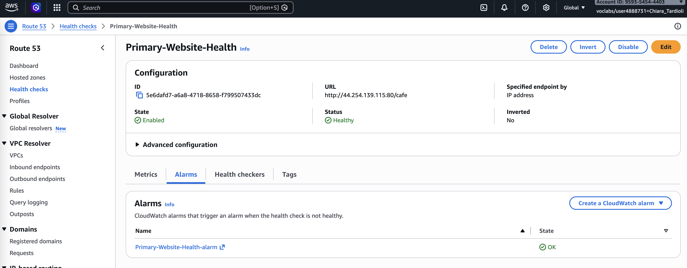
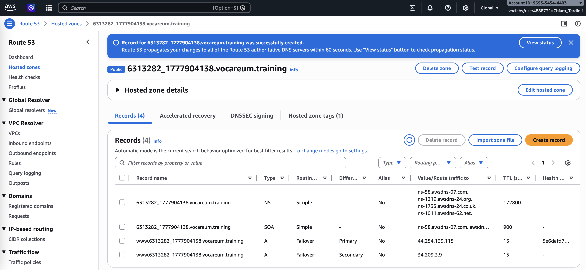
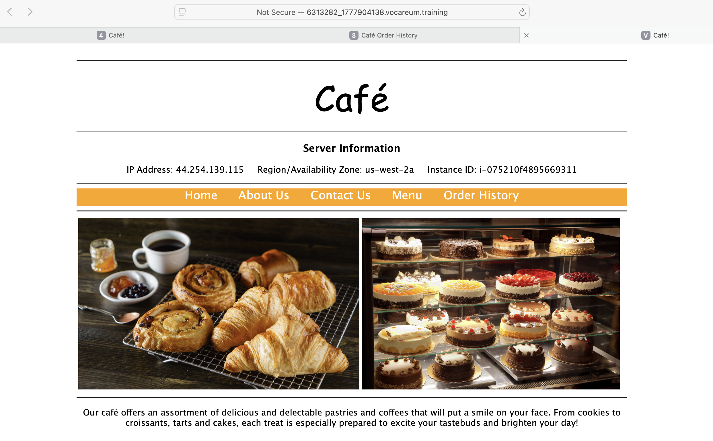
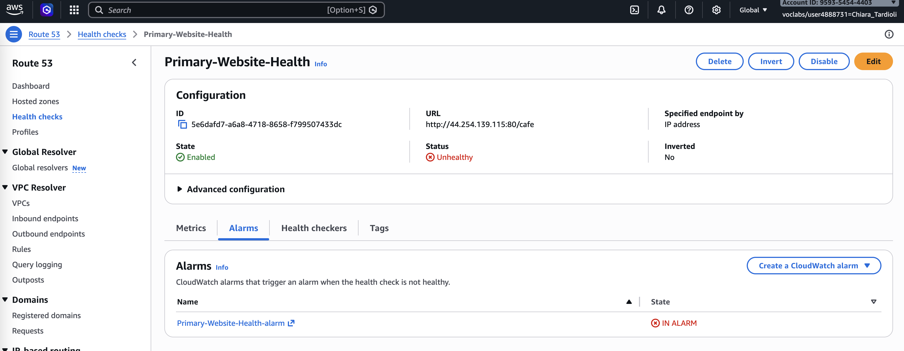
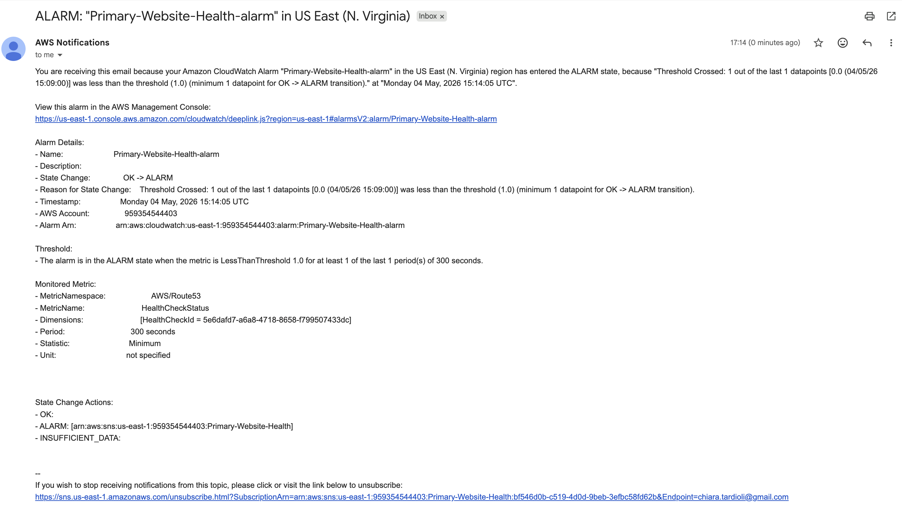
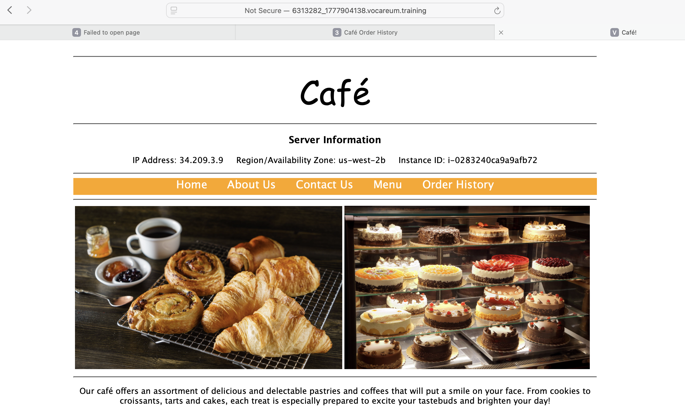

# Amazon Route 53 Failover Routing – Lab Report

This lab focuses on configuring high availability for a web application using Amazon Route 53 failover routing. The objective is to ensure that user 
traffic is automatically redirected to a secondary resource when the primary resource becomes unavailable. By combining health checks, DNS routing policies, 
and distributed infrastructure across multiple Availability Zones, the system achieves improved resilience and fault tolerance.

The architecture consists of two EC2 instances hosting identical web applications in different Availability Zones. Route 53 monitors the health of the 
primary instance and redirects traffic to the secondary instance in case of failure.

## Task 1: Confirming the Café Websites

I began by reviewing the environment that was automatically provisioned. Two EC2 instances were already running, each hosting the café web application in different Availability Zones.

CafeInstance1IPAddress : 44.254.139.115

PrimaryWebSiteURL : 44.254.139.115/cafe

SecondaryWebsiteURL : 34.209.3.9/cafe

CafeInstance2IPAddress : 34.209.3.9

I accessed both the primary and secondary website URLs in separate browser tabs and confirmed that the application was functioning correctly on both instances. 
I verified the server information displayed on each page to confirm that they were running in different Availability Zones.

I also tested the application functionality by placing a sample order, confirming that both instances were fully operational and properly configured.

## Task 2: Configuring a Route 53 Health Check

Next, I created a health check in Route 53 to monitor the availability of the primary website.

I configured the health check to monitor the public IP address of the primary EC2 instance and set the path to `/cafe`. I adjusted the advanced settings 
to use a fast request interval of 10 seconds and a failure threshold of 2 for quicker detection.

I also created a CloudWatch alarm notifications by creating a new SNS topic and subscribing my email address. After creating the health check, 
I confirmed the subscription via email and monitored the health status until it showed as healthy.

## Task 3: Configuring Route 53 Records

#### 3.1 Creating the Primary Record

I navigated to the hosted zone provided for the lab and created a new A record for the domain.

I configured the record with the name `www`, set the value to the IP address of the primary EC2 instance, and selected the failover routing policy 
with the type set to *Primary*. I associated this record with the health check created earlier.

#### 3.2 Creating the Secondary Record

I then created a second A record with the same name `www`, but this time pointing to the IP address of the secondary EC2 instance.

I configured this record as a *Secondary* failover record and did not attach a health check to it. This ensures it only receives traffic when the primary record is unhealthy.

## Task 4: Verifying DNS Resolution

To verify the DNS configuration, I copied the record name and accessed the application using the Route 53 domain.

The URL for my lab is `www.6313282_1777904138.vocareum.training/cafe`.

I confirmed that the request was routed to the primary instance by checking the server information displayed on the webpage, which indicated the correct Availability Zone.

## Task 5: Verifying Failover Functionality

To test failover, I stopped the primary EC2 instance to simulate a failure.

I monitored the health check status in Route 53 and observed that it changed to *Unhealthy* after a short period. 

I also received an email notification indicating the failure.

After refreshing the application URL, I confirmed that the traffic was now being routed to the secondary EC2 instance. 
The server information displayed a different Availability Zone, verifying that failover was working correctly.

## Conclusion

In this lab, I successfully configured failover routing using Amazon Route 53.

I created a health check to monitor the availability of the primary web server and configured DNS records with a failover routing policy. 
I verified that traffic was initially routed to the primary instance and automatically redirected to the secondary instance when the primary became unavailable.

This lab demonstrated how Route 53 can be used to improve application availability and resilience by implementing DNS-based failover mechanisms.

In summary:
- I configured a Route 53 health check that sends emails when the health of an HTTP endpoint becomes unhealthy
- I configured failover routing in Route 53

## Additional resources
- [Amazon Route 53 health checks](https://docs.aws.amazon.com/Route53/latest/DeveloperGuide/welcome-health-checks.html)
- [Amazon Route 53 Failover routing](https://docs.aws.amazon.com/Route53/latest/DeveloperGuide/routing-policy-failover.html)
