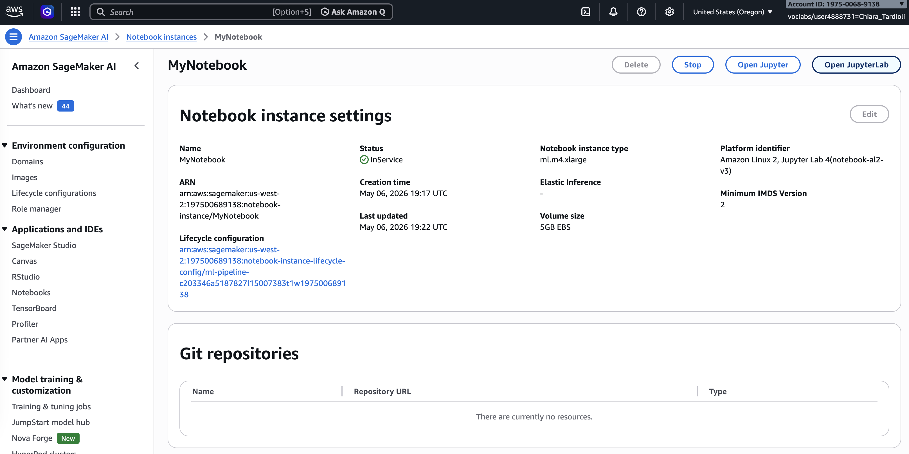
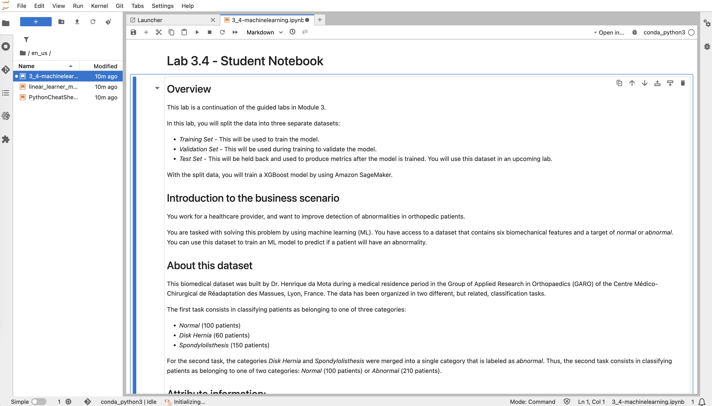
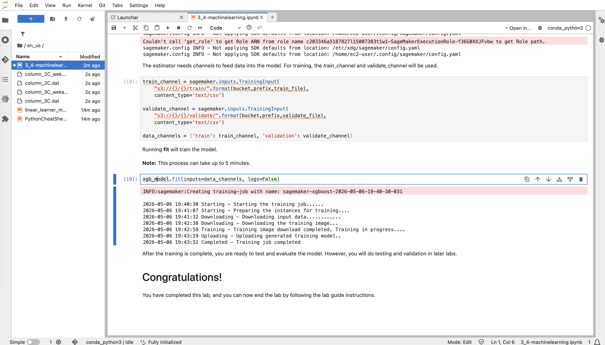

# Training a Machine Learning Model

## Introduction
This lab focuses on training a machine learning model to detect abnormalities in orthopedic patients using a biomechanical dataset. 
The workflow includes data preparation, dataset splitting, and model training using XGBoost in Amazon SageMaker.



## Environment Setup
I accessed the JupyterLab environment through Amazon SageMaker and opened the provided notebook file.

```python
# Open notebook file
en_us/3_4-machinelearning.ipynb
````



## Data Import and Exploration

I loaded the dataset from an external source and converted it into a pandas DataFrame.

```python
import pandas as pd
from scipy.io import arff
import requests, zipfile, io

f_zip = 'http://archive.ics.uci.edu/ml/machine-learning-databases/00212/vertebral_column_data.zip'
r = requests.get(f_zip, stream=True)
Vertebral_zip = zipfile.ZipFile(io.BytesIO(r.content))
Vertebral_zip.extractall()

data = arff.loadarff('column_2C_weka.arff')
df = pd.DataFrame(data[0])
```

I verified the dataset structure and confirmed it contains 6 features and 1 target column.

```python
df.shape
df.columns
```

## Data Preparation

I converted class labels to numeric values and moved the target column to the first position for XGBoost compatibility.

```python
class_mapper = {b'Abnormal':1, b'Normal':0}
df['class'] = df['class'].replace(class_mapper)

cols = df.columns.tolist()
cols = cols[-1:] + cols[:-1]
df = df[cols]
```

## Dataset Splitting

I split the dataset into training, validation, and test sets using stratified sampling.

```python
from sklearn.model_selection import train_test_split

train, test_and_validate = train_test_split(
    df, test_size=0.2, random_state=42, stratify=df['class']
)

test, validate = train_test_split(
    test_and_validate, test_size=0.5, random_state=42, stratify=test_and_validate['class']
)
```


## Uploading Data to S3

I converted datasets to CSV format and uploaded them to Amazon S3.

```python
import boto3, os, io

def upload_s3_csv(filename, folder, dataframe):
    csv_buffer = io.StringIO()
    dataframe.to_csv(csv_buffer, header=False, index=False)
    s3_resource.Bucket(bucket).Object(os.path.join(prefix, folder, filename)).put(
        Body=csv_buffer.getvalue()
    )

upload_s3_csv(train_file, 'train', train)
upload_s3_csv(test_file, 'test', test)
upload_s3_csv(validate_file, 'validate', validate)
```

## Model Training

I configured and trained an XGBoost model using Amazon SageMaker.

```python
from sagemaker.image_uris import retrieve
import sagemaker

container = retrieve('xgboost', boto3.Session().region_name, '1.0-1')

hyperparams = {
    "num_round": "42",
    "eval_metric": "auc",
    "objective": "binary:logistic"
}

xgb_model = sagemaker.estimator.Estimator(
    container,
    sagemaker.get_execution_role(),
    instance_count=1,
    instance_type='ml.m4.xlarge',
    output_path=s3_output_location,
    hyperparameters=hyperparams
)
```

I defined training and validation channels and started the training job.

```python
train_channel = sagemaker.inputs.TrainingInput(
    f"s3://{bucket}/{prefix}/train/",
    content_type='text/csv'
)

validate_channel = sagemaker.inputs.TrainingInput(
    f"s3://{bucket}/{prefix}/validate/",
    content_type='text/csv'
)

xgb_model.fit(inputs={
    'train': train_channel,
    'validation': validate_channel
}, logs=False)
```



## Conclusion

* I split the dataset into training, validation, and test sets
* I prepared and uploaded the data to Amazon S3
* I trained an XGBoost model using Amazon SageMaker
