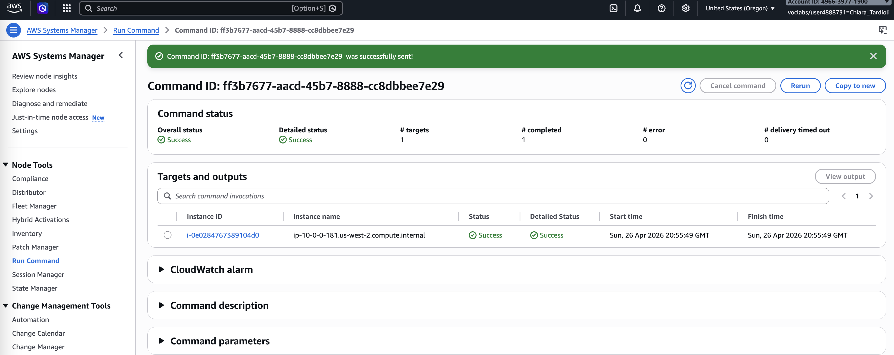
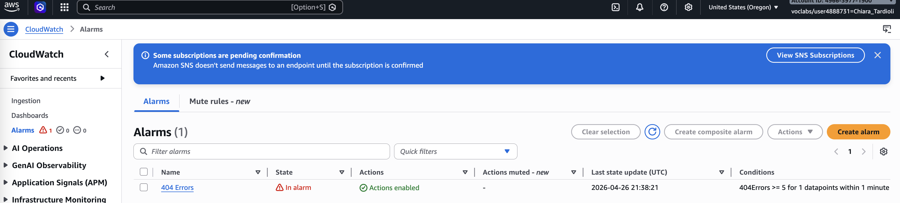
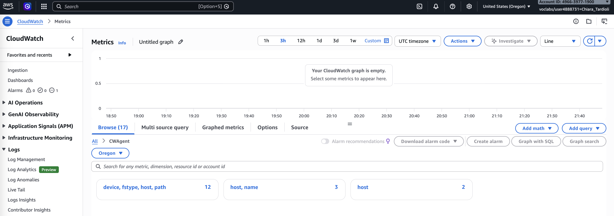
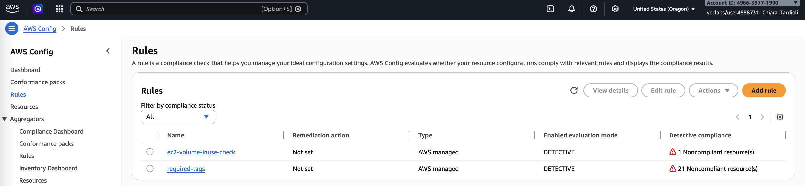

# Monitoring Infrastructure Lab Report

Monitoring is a fundamental component of modern cloud infrastructure, enabling visibility into system performance, application behavior, 
and compliance status. In this lab, I explored core AWS monitoring services including Amazon CloudWatch and AWS Config. The objective was 
to understand how to collect system and application data, analyze logs and metrics, generate alerts, and enforce infrastructure compliance.

The lab focused on integrating multiple AWS tools such as AWS Systems Manager, CloudWatch Logs, CloudWatch Metrics, and CloudWatch Events to 
build a centralized monitoring solution. Through practical tasks, I gained insight into real-time monitoring, automation, and governance 
within a cloud environment.

## Task 1: Installing the CloudWatch Agent

In this task, I used AWS Systems Manager Run Command to install the CloudWatch agent on an EC2 instance. I selected the `AWS-ConfigureAWSPackage` 
document and configured it to install the **AmazonCloudWatchAgent** package.

After successful installation, I created a configuration file in Parameter Store named **Monitor-Web-Server**. This configuration specified:

* Collection of Apache access and error logs
* Monitoring of CPU, memory, disk, and swap metrics

I then executed another Run Command using the `AmazonCloudWatch-ManageAgent` document to start the agent with the stored configuration.

This step ensured that both logs and system-level metrics were continuously sent to CloudWatch.

## Task 2: Monitoring Application Logs using CloudWatch Logs

I accessed the web server and intentionally generated errors by requesting non-existent pages. These actions created log entries that were 
automatically forwarded to CloudWatch Logs.

Inside the **HttpAccessLog** log group, I verified that the logs contained HTTP requests, including 404 errors. I then created a metric filter 
to detect entries with status code 404 using a defined filter pattern.

Next, I configured an alarm based on this metric:

* Threshold: ≥ 5 errors within 1 minute
* Notification: Sent via an SNS topic to my email

After generating multiple failed requests, the alarm transitioned to the **ALARM** state, and I received an email notification.

This demonstrated how log-based monitoring can trigger real-time alerts.

## Task 3: Monitoring Instance Metrics using CloudWatch

I explored system metrics available through both default CloudWatch monitoring and the CloudWatch agent.

From the EC2 console, I reviewed default metrics such as:

* CPU utilization
* Network activity
* Disk operations

Then, in CloudWatch Metrics, I examined custom metrics under the **CWAgent** namespace. These included:

* Memory usage (mem_used_percent)
* Disk usage (used_percent)
* Swap utilization

This provided deeper visibility into the internal state of the instance, which is not available through default metrics alone.

**Screenshot Placeholder:**
`[Insert screenshot of EC2 monitoring tab]`
`[Insert screenshot of CWAgent metrics in CloudWatch]`

## Task 4: Creating Real-Time Notifications

I created a rule in CloudWatch Events to monitor EC2 instance state changes. The rule was configured to trigger when an instance entered 
the **stopped** or **terminated** state.

The rule used an SNS topic as a target to send email notifications.

To test the setup, I stopped the EC2 instance. Shortly after, I received a notification email containing event details in JSON format.

This task showed how infrastructure events can be captured and acted upon instantly.

**Screenshot Placeholder:**
`[Insert screenshot of CloudWatch Events rule configuration]`
`[Insert screenshot of notification email received]`

## Task 5: Monitoring Infrastructure Compliance using AWS Config

I enabled AWS Config Rules and added two managed rules:

1. **required-tags**

   * Ensures all resources have a `project` tag

2. **ec2-volume-inuse-check**

   * Detects unattached EBS volumes

After evaluation, I observed:

* Some resources were non-compliant due to missing tags
* One EBS volume was not attached to any instance

This task demonstrated how AWS Config continuously audits infrastructure against defined policies.

`

## Conclusion

In this lab, I implemented a comprehensive monitoring solution using AWS-native services. I successfully installed and configured the CloudWatch agent,
enabling detailed collection of logs and system metrics. By analyzing logs and creating metric filters, I was able to detect application-level issues 
and trigger automated alerts.

I also explored system performance monitoring through CloudWatch Metrics and extended visibility using custom agent-based data. The use of CloudWatch 
Events allowed me to respond to infrastructure changes in real time, while AWS Config provided continuous compliance evaluation.

Overall, this lab demonstrated how combining monitoring, alerting, and compliance tools can significantly improve system reliability, operational awareness, 
and governance in a cloud environment.
