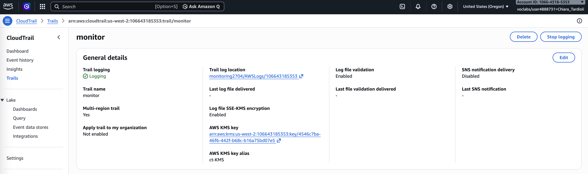
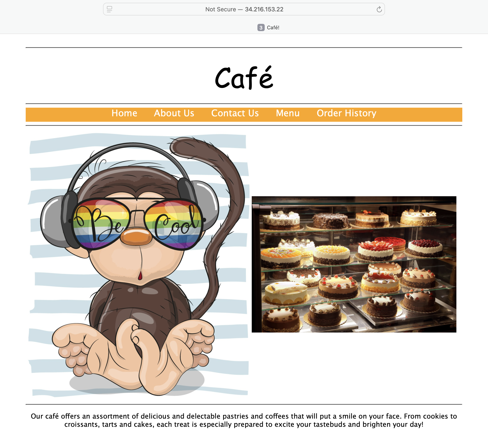
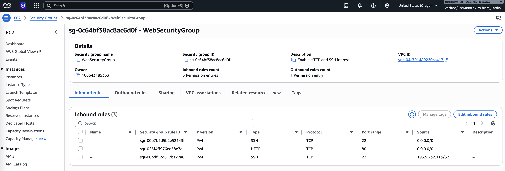
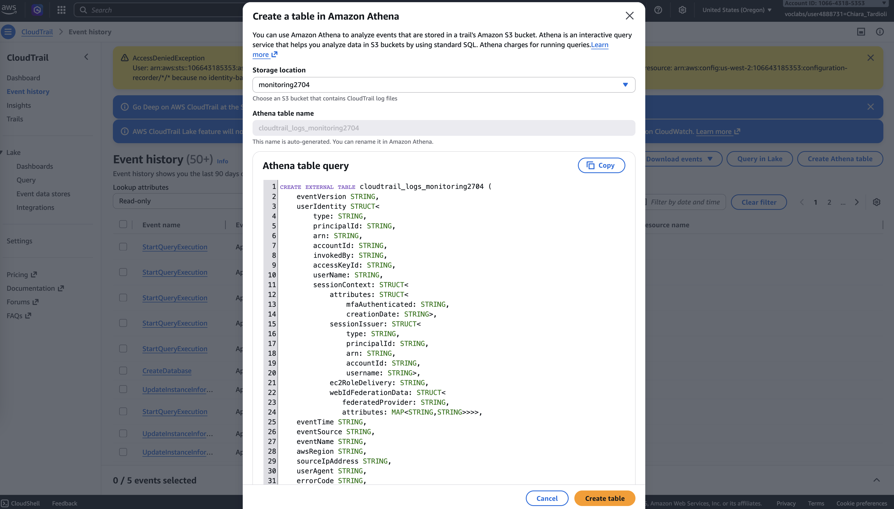
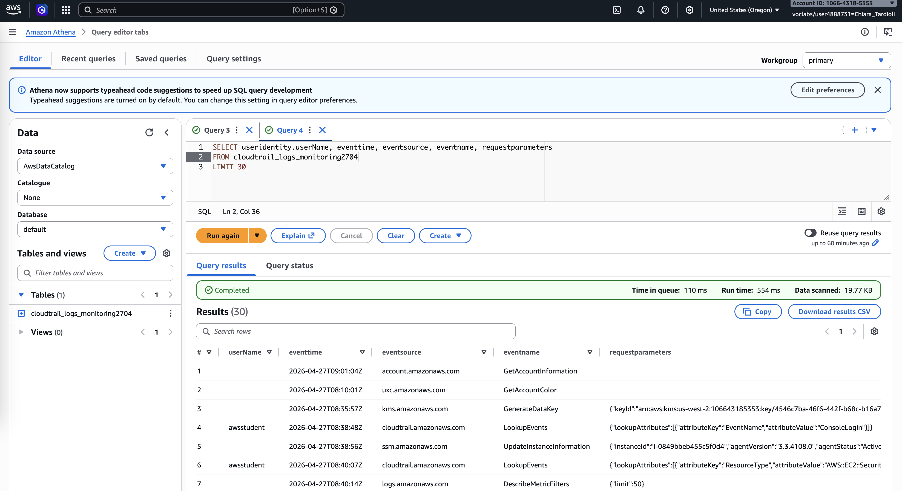
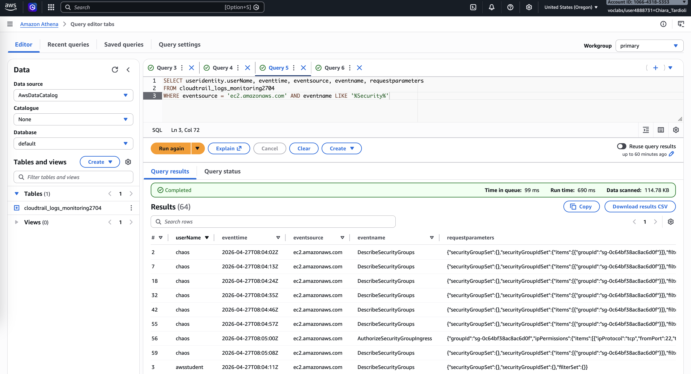
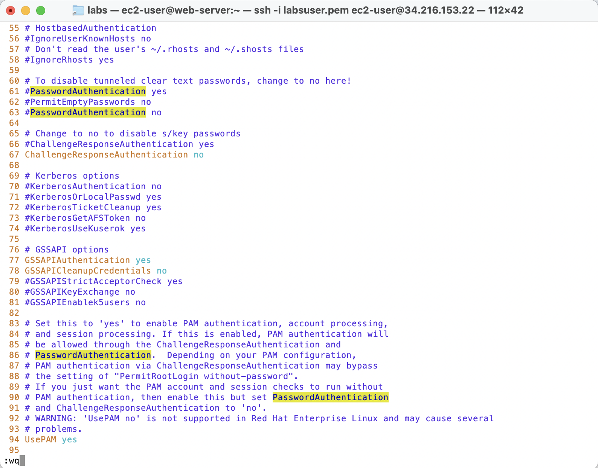
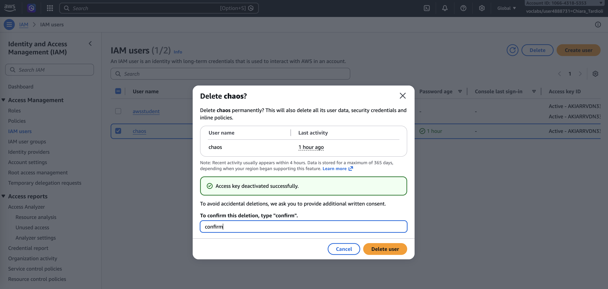

# Working with AWS CloudTrail

## Introduction
AWS CloudTrail is a service that enables governance, compliance, operational auditing, and risk auditing of AWS accounts. 
It records account activity and API usage across AWS services, allowing users to track changes and investigate actions performed within an environment.

In this lab, a CloudTrail trail was created to monitor activity in an AWS account hosting a Café website on an Amazon EC2 instance. 
Shortly after configuration, the website was compromised, and security group rules were modified. The objective of this lab is to 
investigate the incident using CloudTrail logs, identify the responsible user, and restore system security using multiple analysis tools, 
including Linux commands, AWS CLI, and Amazon Athena.

The architectural diagram illustrates the setup that this activity uses.


## Task 1: Observing the System and Modifying Security Group
In this task, I accessed the EC2 instance running the Café Web Server and reviewed its security group configuration. Initially, only HTTP (port 80) access was allowed. 
I then added an SSH rule allowing access from my IP address only.

After updating the rule, I verified that the Café website was functioning normally by accessing it through the public IP address.


## Task 2: Creating CloudTrail and Detecting the Security Incident
I created a new CloudTrail trail named **monitor**, configured to store logs in an S3 bucket with the following configuration:
- Trail name: `monitor`
- Create a new S3 bucket: `checked`
- Trail log bucket and folder: `monitoring2704`
- AWS KMS alias: `ct-KMS`

  

Shortly after enabling logging, I noticed that the Café website had been modified unexpectedly.



Upon reviewing the EC2 security group, I discovered an additional inbound rule allowing SSH access from anywhere (0.0.0.0/0), which indicated a 
security breach.




## Task 3: Analyzing CloudTrail Logs Using grep and AWS CLI
I connected to the EC2 instance via SSH and downloaded CloudTrail logs from the S3 bucket. The logs were extracted and analyzed using Linux commands:
```bash
chiara@macbook-air:~/labs$ chmod 700 labsuser.pem 
chiara@macbook-air:~/labs$ ssh -i labsuser.pem ec2-user@34.216.153.22
The authenticity of host '34.216.153.22 (34.216.153.22)' can't be established.
ED25519 key fingerprint is SHA256:X/yDuY7DUS98loVkCG13oySLwiEISr8rF6QNH1kNaj4.
This key is not known by any other names.
Are you sure you want to continue connecting (yes/no/[fingerprint])? yes
Warning: Permanently added '34.216.153.22' (ED25519) to the list of known hosts.
   ,     #_
   ~\_  ####_        Amazon Linux 2
  ~~  \_#####\
  ~~     \###|       AL2 End of Life is 2026-06-30.
  ~~       \#/ ___
   ~~       V~' '->
    ~~~         /    A newer version of Amazon Linux is available!
      ~~._.   _/
         _/ _/       Amazon Linux 2023, GA and supported until 2028-03-15.
       _/m/'           https://aws.amazon.com/linux/amazon-linux-2023/

[ec2-user@web-server ~]$ mkdir ctraillogs
[ec2-user@web-server ~]$ cd ctraillogs/
[ec2-user@web-server ctraillogs]$ aws s3 ls
2026-04-27 07:51:59 cafeimagefiles72344
2026-04-27 08:03:48 monitoring2704
[ec2-user@web-server ctraillogs]$ aws s3 cp s3://monitoring2704/ . --recursive
download: s3://monitoring2704/AWSLogs/106643185353/CloudTrail/us-west-2/2026/04/27/106643185353_CloudTrail_us-west-2_20260427T0815Z_teNeI2QmobmBTIs2.json.gz to AWSLogs/106643185353/CloudTrail/us-west-2/2026/04/27/106643185353_CloudTrail_us-west-2_20260427T0815Z_teNeI2QmobmBTIs2.json.gz
download: s3://monitoring2704/AWSLogs/106643185353/CloudTrail/us-west-2/2026/04/27/106643185353_CloudTrail_us-west-2_20260427T0810Z_2fxF0z1ItT1MUoxC.json.gz to AWSLogs/106643185353/CloudTrail/us-west-2/2026/04/27/106643185353_CloudTrail_us-west-2_20260427T0810Z_2fxF0z1ItT1MUoxC.json.gz
[ec2-user@web-server ctraillogs]$ ls AWSLogs/106643185353/CloudTrail/us-west-2/2026/04/27/
106643185353_CloudTrail_us-west-2_20260427T0810Z_2fxF0z1ItT1MUoxC.json.gz
106643185353_CloudTrail_us-west-2_20260427T0815Z_teNeI2QmobmBTIs2.json.gz
[ec2-user@web-server ctraillogs]$ cd AWSLogs/106643185353/CloudTrail/us-west-2/2026/04/27/
[ec2-user@web-server 27]$ gunzip *.gz
[ec2-user@web-server 27]$ ls
106643185353_CloudTrail_us-west-2_20260427T0810Z_2fxF0z1ItT1MUoxC.json
106643185353_CloudTrail_us-west-2_20260427T0815Z_teNeI2QmobmBTIs2.json
```

The log files are in `json` format. To improve readability, I used a Python utility to format the content:
```bash
cat 106643185353_CloudTrail_us-west-2_20260427T0815Z_teNeI2QmobmBTIs2.json | python -m json.tool
````

This made it easier to understand the structure of the log entries. Each entry contains standard fields such as `awsRegion`, `eventName`, `eventSource`, 
`eventTime`, `requestParameters`, `sourceIPAddress`, and `userIdentity`.

However, even a single log file contains a large number of entries. Since multiple log files are generated over time, analyzing them manually 
becomes inefficient.

To search across multiple files and filter relevant information, I used Linux commands such as `grep`. I filtered log entries based on `sourceIPAddress` 
and `eventName` to identify suspicious activity. This approach helped narrow down actions related to the security group modifications.
```bash
[ec2-user@web-server 27]$ ip=34.216.153.22
[ec2-user@web-server 27]$ for i in $(ls); do echo $i && cat $i | python -m json.tool | grep sourceIPAddress ; done
106643185353_CloudTrail_us-west-2_20260427T0810Z_2fxF0z1ItT1MUoxC.json
            "sourceIPAddress": "193.5.232.113",
            "sourceIPAddress": "16.148.102.148",
            "sourceIPAddress": "34.216.153.22",
            "sourceIPAddress": "34.216.153.22",
            "sourceIPAddress": "34.216.153.22",
            ...
[ec2-user@web-server 27]$ for i in $(ls); do echo $i && cat $i | python -m json.tool | grep eventName ; done
106643185353_CloudTrail_us-west-2_20260427T0810Z_2fxF0z1ItT1MUoxC.json
            "eventName": "GetEventSelectors",
            "eventName": "DescribeSecurityGroups",
            "eventName": "DescribeInstances",
            "eventName": "DescribeInstances",
            ...
106643185353_CloudTrail_us-west-2_20260427T0815Z_teNeI2QmobmBTIs2.json
            ...
            "eventName": "UpdateInstanceInformation",
            "eventName": "GetParametersByPath",
            "eventName": "DescribeRegions",
            "eventName": "DescribeSecurityGroups",
            "eventName": "DescribeInstances",
           ...
[ec2-user@web-server 27]$ 
```

A more effective approach was to use AWS CLI CloudTrail commands to analyze the logs. I used the `lookup-events` command to investigate EC2 
security group modifications and identify the user responsible for the changes.

First, I checked for console login activity:
```bash
[ec2-user@web-server 27]$ aws cloudtrail lookup-events --lookup-attributes AttributeKey=EventName,AttributeValue=ConsoleLogin
{
    "Events": []
}
```

The result returned no events, indicating that the actions were not performed through the AWS Management Console.

Next, I retrieved the AWS Region and the security group ID associated with the Café Web Server instance:

```bash
[ec2-user@web-server 27]$ region=$(curl http://169.254.169.254/latest/dynamic/instance-identity/document|grep region | cut -d '"' -f4)
  % Total    % Received % Xferd  Average Speed   Time    Time     Time  Current
                                 Dload  Upload   Total   Spent    Left  Speed
100   474  100   474    0     0   153k      0 --:--:-- --:--:-- --:--:--  231k
[ec2-user@web-server 27]$ sgId=$(aws ec2 describe-instances --filters "Name=tag:Name,Values='Cafe Web Server'" --query 'Reservations[*].Instances[*].SecurityGroups[*].[GroupId]' --region $region --output text)
[ec2-user@web-server 27]$ echo $region
us-west-2
[ec2-user@web-server 27]$ echo $sgId
sg-0c64bf38ac8ac6d0f
```

Using this information, I filtered CloudTrail events related to security group changes:
```bash
aws cloudtrail lookup-events \
--lookup-attributes AttributeKey=ResourceType,AttributeValue=AWS::EC2::SecurityGroup \
--region $region --output text | grep $sgId
```

## Task 4: Querying CloudTrail Logs Using Amazon Athena
To simplify log analysis, I created an Athena table based on CloudTrail logs stored in S3. This allowed structured querying using SQL.



The table is created with a default name that includes the name of the S3 bucket.

I ran queries to extract key fields such as:
- useridentity.userName  
- eventtime  
- eventsource  
- eventname  
- requestparameters  




### Challenge: Identifying the Hacker
By combining results from CloudTrail logs, AWS CLI, and Athena queries, I identified:
- The Event Name: `AuthorizeSecurityGroupIngress`
- The IAM user responsible for the security group modification: `chaos`
- The timestamp of the malicious activity: `2026-04-27T08:05:00Z`
- The source IP address used for access: `34.216.153.22`
- Action: Opened port 22 (SSH) to 0.0.0.0/0
- The method of access (programmatic or console): AWS CLI (based on user agent)

This confirmed that the IAM user chaos was responsible for modifying the security group and introducing the security vulnerability.




## Task 5: Securing the Environment and Recovering the System

1. Removing Unauthorized OS Access

I detected an unauthorized OS user (`chaos-user`) on the EC2 instance. I terminated their session and removed the account from the system.
```bash
[ec2-user@web-server ~]$ sudo aureport --auth

Authentication Report
============================================
# date time acct host term exe success event
============================================
1. 27/04/26 08:05:08 chaos-user ec2-16-148-102-148.us-west-2.compute.amazonaws.com ssh /usr/sbin/sshd yes 135
2. 27/04/26 08:05:08 chaos-user 16.148.102.148 ssh /usr/sbin/sshd yes 138
3. 27/04/26 08:12:27 ec2-user 193.5.232.113 ? /usr/sbin/sshd yes 161
4. 27/04/26 08:12:27 ec2-user 193.5.232.113 ? /usr/sbin/sshd yes 162
5. 27/04/26 08:12:27 ec2-user 193.5.232.113 ssh /usr/sbin/sshd yes 165
6. 27/04/26 08:32:59 ec2-user 193.5.232.113 ? /usr/sbin/sshd yes 195
7. 27/04/26 08:32:59 ec2-user 193.5.232.113 ? /usr/sbin/sshd yes 196
8. 27/04/26 08:32:59 ec2-user 193.5.232.113 ssh /usr/sbin/sshd yes 199
9. 27/04/26 09:18:57 ec2-user 193.5.232.113 ? /usr/sbin/sshd yes 250
10. 27/04/26 09:18:57 ec2-user 193.5.232.113 ? /usr/sbin/sshd yes 251
11. 27/04/26 09:18:57 ec2-user 193.5.232.113 ssh /usr/sbin/sshd yes 254
[ec2-user@web-server ~]$ who
chaos-user pts/0        2026-04-27 08:05 (ec2-16-148-102-148.us-west-2.compute.amazonaws.com)
ec2-user pts/1        2026-04-27 08:12 (193.5.232.113)
ec2-user pts/2        2026-04-27 08:33 (193.5.232.113)
ec2-user pts/3        2026-04-27 09:18 (193.5.232.113)
[ec2-user@web-server ~]$ sudo userdel -r chaos-user
userdel: user chaos-user is currently used by process 3981
[ec2-user@web-server ~]$ sudo kill -9 3981
[ec2-user@web-server ~]$ who
ec2-user pts/1        2026-04-27 08:12 (193.5.232.113)
ec2-user pts/2        2026-04-27 08:33 (193.5.232.113)
ec2-user pts/3        2026-04-27 09:18 (193.5.232.113)
[ec2-user@web-server ~]$ sudo userdel -r chaos-user
[ec2-user@web-server ~]$ sudo cat /etc/passwd | grep -v nologin
root:x:0:0:root:/root:/bin/bash
sync:x:5:0:sync:/sbin:/bin/sync
shutdown:x:6:0:shutdown:/sbin:/sbin/shutdown
halt:x:7:0:halt:/sbin:/sbin/halt
ec2-user:x:1000:1000:EC2 Default User:/home/ec2-user:/bin/bash
```

2. Fixing SSH Security Configuration

I reviewed the SSH configuration file and found that password authentication was enabled. I disabled password authentication (line 61) and ensured only key-based 
authentication was allowed. I then restarted the SSH service. I also delete the inbound rule that allows port 22 access from 0.0.0.0/0 (the one the hacker created).
```bash
[ec2-user@web-server ~]$ sudo ls -l /etc/ssh/sshd_config
-rw------- 1 root root 3957 Apr 27 07:51 /etc/ssh/sshd_config
[ec2-user@web-server ~]$ sudo vi /etc/ssh/sshd_config
[ec2-user@web-server ~]$ sudo service sshd restart
Redirecting to /bin/systemctl restart sshd.service
```




3. Restoring Website Integrity

I restored the original Café website image by replacing the modified file with the backup version. After refreshing the website, the correct content was displayed again.
```bash
[ec2-user@web-server ~]$ cd /var/www/html/cafe/images/
[ec2-user@web-server images]$ ls -l
total 5732
-rwxrwxrwx 1 root root 647353 Apr  2  2019 Cake-Vitrine.jpg
-rwxrwxrwx 1 root root 480820 Apr  2  2019 Chocolate-Chip-Cookies.jpg
-rwxrwxrwx 1 1001 root 486325 Apr  2  2019 Coffee-and-Pastries.backup
-rw-r--r-- 1 1001 root 260603 Apr 27 07:52 Coffee-and-Pastries.jpg
-rwxrwxrwx 1 root root 631884 Apr  3  2019 Coffee.jpg
-rwxrwxrwx 1 root root  17528 Apr  6  2021 Coffee-Shop.png
-rwxrwxrwx 1 root root 429183 Apr  2  2019 Cookies.jpg
-rwxrwxrwx 1 root root 351781 Apr  2  2019 Croissants.jpg
-rwxrwxrwx 1 root root 316090 Apr  2  2019 Cup-of-Hot-Chocolate.jpg
-rwxrwxrwx 1 root root  94341 Apr  2  2019 default-image.jpg
-rwxrwxrwx 1 root root 380753 Apr  2  2019 Donuts.jpg
-rwxrwxrwx 1 root root 411014 Apr  2  2019 Frank-Martha.jpg
-rwxrwxrwx 1 root root 319081 Apr  2  2019 Latte.jpg
-rwxrwxrwx 1 root root 243718 Apr  2  2019 Muffins.jpg
-rwxrwxrwx 1 root root 290697 Apr  2  2019 Strawberry-Blueberry-Tarts.jpg
-rwxrwxrwx 1 root root 479213 Apr  2  2019 Strawberry-Tarts.jpg
[ec2-user@web-server images]$ sudo mv Coffee-and-Pastries.backup Coffee-and-Pastries.jpg
```

4. Removing Malicious IAM User

Finally, I deleted the unauthorized IAM user (**chaos**) from the AWS account to prevent further misuse of permissions.



## Conclusion
This lab demonstrated how AWS CloudTrail can be used to monitor, investigate, and respond to security incidents in an AWS environment. 
I configured a CloudTrail trail, analyzed logs using multiple tools, and identified unauthorized modifications to a security group.

I used Linux utilities, AWS CLI commands, and Amazon Athena to trace the source of the incident and determine the responsible user. 
After identifying the issue, I removed unauthorized access, corrected SSH configuration settings, restored the compromised website, 
and deleted the malicious IAM user.

Overall, the lab highlighted the importance of continuous monitoring, log analysis, and proactive security measures in maintaining 
a secure AWS environment.

In summary:
- I configured a CloudTrail trail
- I analyzed CloudTrail logs by using various methods to discover relevant information
- I imported CloudTrail log data into Athena
- I run queries in Athena to filter CloudTrail log entries
- I resolved security concerns within the AWS account and on an EC2 Linux instance

## Additional resources
- [AWS CLI Reference page for CloudTrail](https://docs.aws.amazon.com/cli/latest/reference/cloudtrail/)
