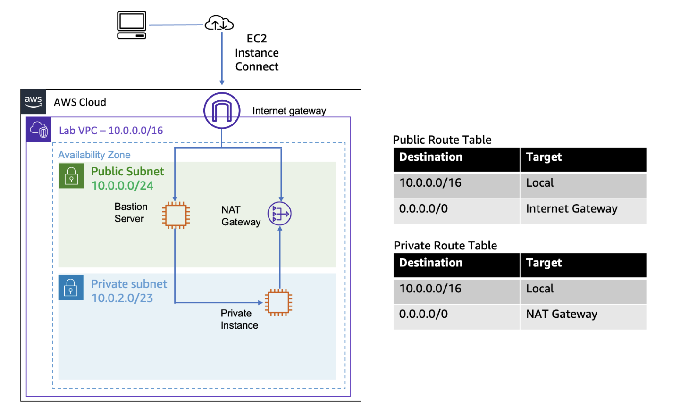
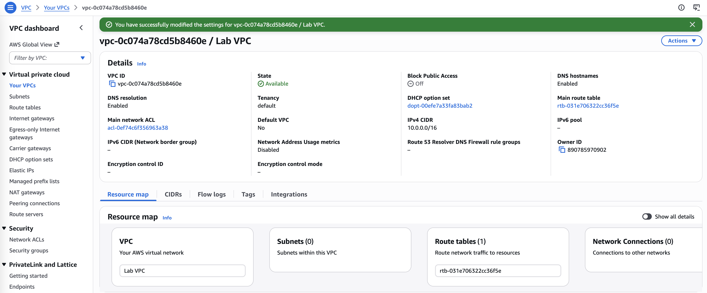
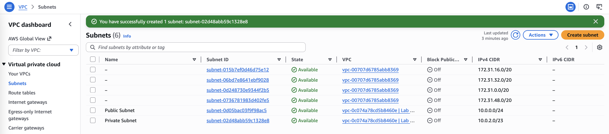
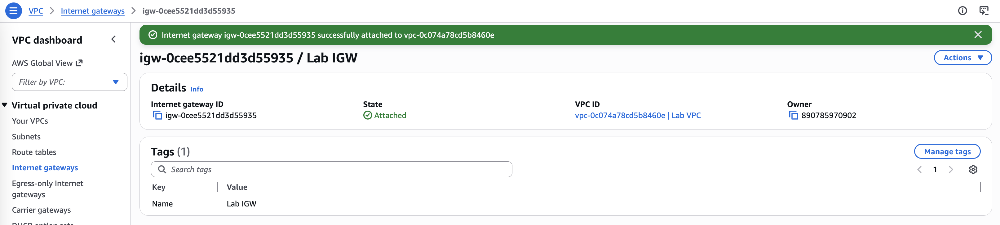
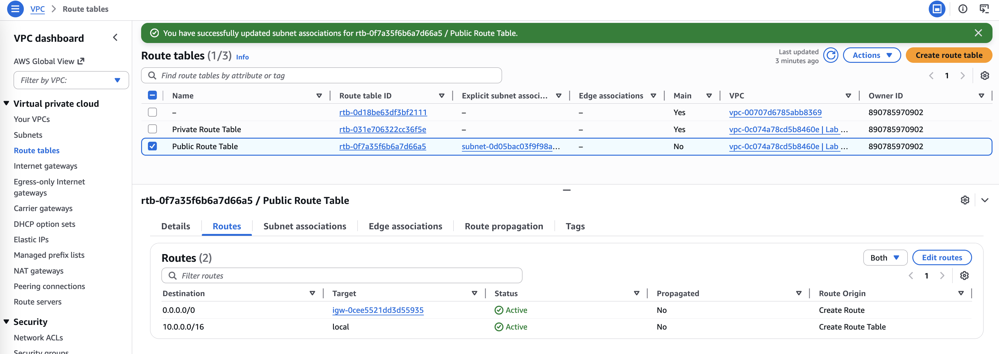
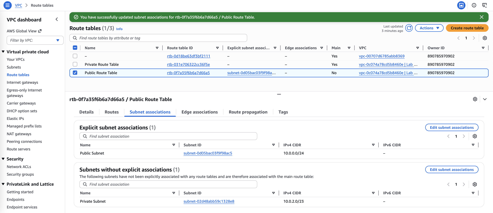
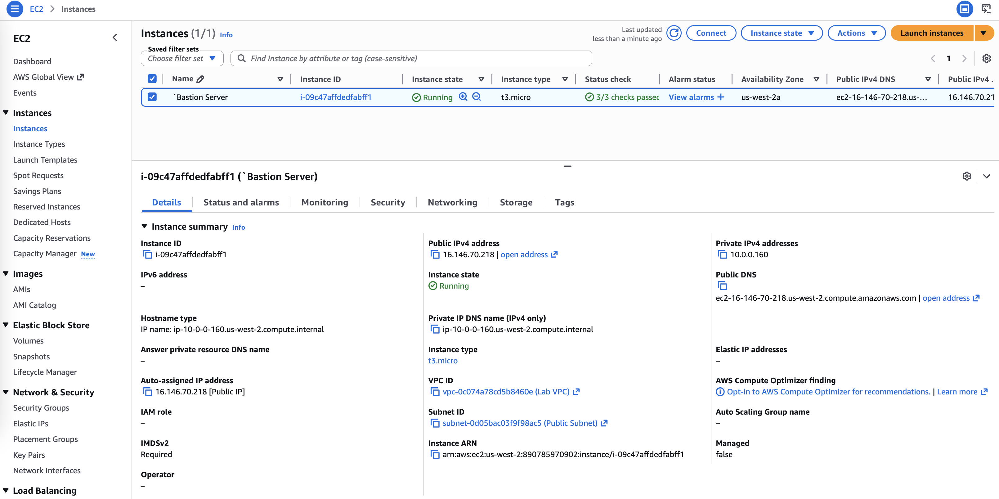
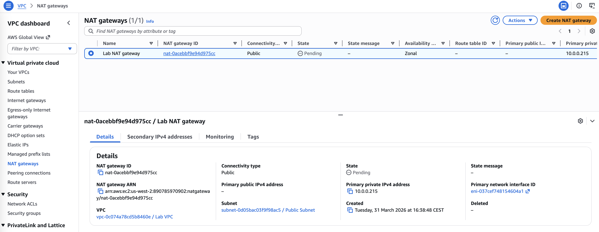
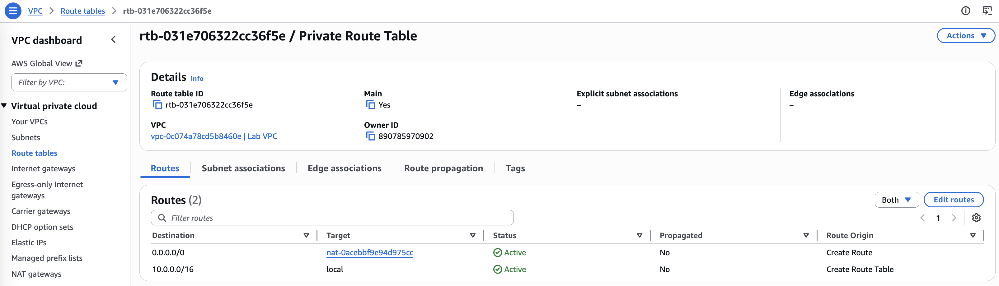
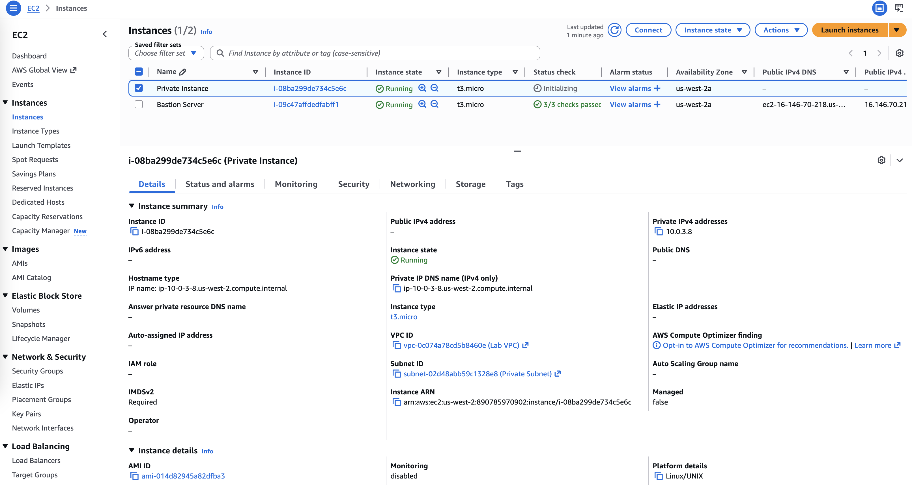

# Configuring a VPC

Amazon Virtual Private Cloud (Amazon VPC) gives the ability to provision a logically isolated section of the 
Amazon Web Services (AWS) Cloud where AWS resources can be launched in a virtual network. You have complete 
control over your virtual networking environment, including selecting your IP address ranges, creating subnets, 
and configuring route tables and network gateways.

In this lab, I will build a virtual private cloud (VPC) and other network components required to deploy resources, 
such as an Amazon Elastic Compute Cloud (Amazon EC2) instance.



## Task 1: Creating a VPC
I create a new VPC with these configurations:
- Resources to create: `VPC only`
- Name tag: `Lab VPC`
- IPv4 CIDR block: `IPv4 CIDR manual input`
- IPv4 CIDR: `10.0.0.0/16`
- IPv6 CIDR block: `No IPv6 CIDR block`
- Tenancy: `Default`
- Tags: Leave the suggested tags as is.

Then I click *Edit the VPC settings* under Actions. In the DNS settings section, I select `Enable DNS hostnames`.
Now EC2 instances launched into the VPC automatically receive a public IPv4 Domain Name System (DNS) hostname.



## Task 2: Creating subnets

1. I create a public subnet with these settings:
- VPC ID: `Lab VPC`
- Subnet name: `Public Subnet`
- Availability Zone: `us-west-2a` (Choose the first Availability Zone in the list. Do not choose No preference.)
- IPv4 CIDR block: `10.0.0.0/24`

Then I click *Edit subnet settings* under Actions. In the Auto-assign IP settings section, I select `Enable auto-assign public IPv4 address`.
The public subnet will automatically assign a public IP address for all EC2 instances that are launched within it.

2. I create a private subnet, which is used for resources that are to remain isolated from the internet:
- VPC ID: `Lab VPC`
- Subnet name: `Private Subnet`
- Availability Zone: `us-west-2a` (Choose the first Availability Zone on the list. Do not choose No preference.)
- IPv4 CIDR block: `10.0.2.0/23`

My VPC now has two subnets. However, the VPC is totally isolated and cannot communicate with resources outside the VPC. 



## Task 3: Creating an internet gateway
I create an internet gateway for my VPC:
- Name tag: `Lab IGW`
- Attach to a VPC: `Lab VPC` 
The internet gateway is required to establish outside connectivity to EC2 instances in VPCs.



My public subnet now has a connection to the internet. However, to route traffic to the internet, I must also configure 
the public subnet's route table so that it uses the internet gateway.

## Task 4: Configuring route tables

1. I rename the route table for local traffic with `Private Route Table`.
There is currently only one route. It shows that all traffic destined for 10.0.0.0/16 (which is the range of the Lab VPC) 
will be routed locally. This option allows all subnets within a VPC to communicate with each other.

2. I create a public route table for internet-bound traffic:
- Name: `Public Route Table`
- VPC: `Lab VPC`

Under Rooute section , I add a route:
- Destination:`0.0.0.0/0` (internet-bound traffic)
- Target: `Internet Gateway` with `Lab IGW`

Now I associates this new route table with the public subnet. 
Under Actions, I select *Edit subnet associations*, then select Public Subnet.
The public subnet is now public because it has a route table entry that sends traffic to the internet through the internet gateway.





## Task 5: Launching a bastion server in the public subnet
I create an EC2 instance with this configurations:
- Name and tags section: `Bastion Server`
- Application and OS Images (Amazon Machine Image):
  - Quick Start: `Amazon Linux`
  - Amazon Machine Image (AMI): `Amazon Linux 2023 AMI`
- Instance type: `t3.micro`
- Key pair (login): `Proceed without a key pair (Not recommended)`
- Edit Network:
  - VPC - required: `Lab VPC`
  - Subnet: `Public Subnet`
  - Auto-assign public IP: `Enable`
  - Firewall (security groups): `Create security group`
  - Security group name - required: `Bastion Security Group`
  - Description - required: `Allow SSH`
  - Inbound security groups rules:
    - Type: Choose `ssh`
    - Source type: `Anywhere`



## Task 6: Creating a NAT gateway

1. I launch a NAT gateway in the public subnet:
- Name: `Lab NAT gateway`
- Availability mode: `Zonal`
- Subnet: `Public Subnet`



2. I configure the private subnet to send internet-bound traffic to the NAT gateway. In Route tables, I select Private Route Table and add a route:
- Destination: `0.0.0.0/0`
- Target: `NAT Gateway` with `nat-`

Resources in the private subnet that wish to communicate with the internet now have their network traffic directed to the NAT gateway, 
which forwards the request to the internet. Responses flow through the NAT gateway back to the private subnet.




## Optional challenge: Testing the private subnet
In this optional challenge, I will launch an EC2 instance in the private subnet and confirm that it can communicate with the internet.

1. I launch an instance in the private subnet called `Private Instance`.



2. I log in to the bastion server and, from there, I log in to the private instance with Private IPv4 addresses `10.0.3.8`.

```bash
   ,     #_
   ~\_  ####_        Amazon Linux 2023
  ~~  \_#####\
  ~~     \###|
  ~~       \#/ ___   https://aws.amazon.com/linux/amazon-linux-2023
   ~~       V~' '->
    ~~~         /
      ~~._.   _/
         _/ _/
       _/m/'
[ec2-user@ip-10-0-0-160 ~]$ ssh 10.0.3.8
The authenticity of host '10.0.3.8 (10.0.3.8)' can't be established.
ED25519 key fingerprint is SHA256:1scTFVDInX4gCItOhEYwybPEpmX6z3Azcq5Isav+BfQ.
This key is not known by any other names
Are you sure you want to continue connecting (yes/no/[fingerprint])? yes
Warning: Permanently added '10.0.3.8' (ED25519) to the list of known hosts.
ec2-user@10.0.3.8's password: 
   ,     #_
   ~\_  ####_        Amazon Linux 2023
  ~~  \_#####\
  ~~     \###|
  ~~       \#/ ___   https://aws.amazon.com/linux/amazon-linux-2023
   ~~       V~' '->
    ~~~         /
      ~~._.   _/
         _/ _/
       _/m/'
[ec2-user@ip-10-0-3-8 ~]$
```

3. I test the NAT gateway anf that the private instance can access the internet by sending a request to `amazon.com`.

```bash
[ec2-user@ip-10-0-3-8 ~]$ ping -c 3 amazon.com
PING amazon.com (98.87.170.74) 56(84) bytes of data.

--- amazon.com ping statistics ---
3 packets transmitted, 0 received, 100% packet loss, time 2089ms

[ec2-user@ip-10-0-3-8 ~]$
```

This output indicates that the private instance successfully communicated with amazon.com on the internet.
The private instance is in the private subnet, and the only way that this is possible in the curent scenario is by going through the NAT gateway.

## Conclusions
- I created a VPC with a private and public subnet, an internet gateway, and a NAT gateway.
- I configure droute tables associated with subnets to local and internet-bound traffic by using an internet gateway and a NAT gateway.
- I launched a bastion server in a public subnet.
- I used a bastion server to log in to an instance in a private subnet.
- I completed the optional challenge section and created an Amazon EC2 instance in a private 
subnet and connect to it through the bastion server.

## Notes

1. In every Region, a default VPC with a Classless Inter-Domain Routing (CIDR) block of 172.31.0.0/16 has already been created. 
Even if I haven't created anything in my account yet, I see some pre-existing VPC resources already there.

2. `Enable DNS hostnames`: EC2 instances launched into the VPC automatically receive a public IPv4 Domain Name System (DNS) hostname.

3. Even though this subnet has been named `Public Subnet`, it is not yet public. A public subnet must have an internet gateway, 
which you attach in a task later in the lab.

4. The `CIDR block` of 10.0.2.0/23 includes all IP addresses that start with 10.0.2.x and 10.0.3.x. This range is twice as large as the public 
subnet because most resources should be kept in private subnets unless they specifically need to be accessible from the internet.

5. A `bastion server` (also known as a jump box) is an EC2 instance in a public subnet that is securely configured to provide access to resources 
in a private subnet. Systems operators can connect to the bastion server and then jump into resources in the private subnet.

6. The `Private IPv4 addresses` is a private IP address starting with 10.0.2.x or 10.0.3.x. This address is not reachable directly from the internet, 
which is why you first logged in to the bastion server. You now log in to the private instance.
