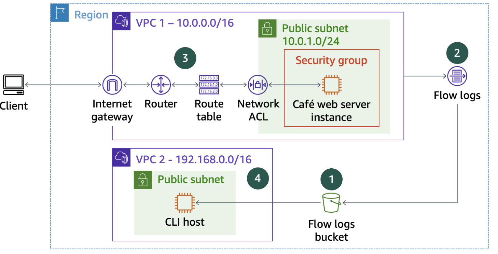
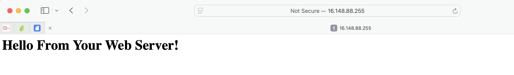

# Troubleshooting a VPC

In this lab, I will troubleshoot virtual private cloud (VPC) configurations and analyze VPC Flow Logs.

I will begin with an environment that includes two VPCs, Amazon Elastic Compute Cloud (Amazon EC2) instances, and other networking components shown 
in the diagram below.
This diagram also shows four numbered circles (#1–4) that indicate the order in which I will work through this lab.



AWS services:
- EC2 instances
- Amazon Simple Storage Service (Amazon S3) bucket


## Task 1: Connecting to the CLI Host instance

1. I connect to the `CLI Host` using the EC2 Management Console.
```bash
   ,     #_
   ~\_  ####_        Amazon Linux 2
  ~~  \_#####\
  ~~     \###|       AL2 End of Life is 2026-06-30.
  ~~       \#/ ___
   ~~       V~' '->
    ~~~         /    A newer version of Amazon Linux is available!
      ~~._.   _/
         _/ _/       Amazon Linux 2023, GA and supported until 2028-03-15.
       _/m/'           https://aws.amazon.com/linux/amazon-linux-2023/

[ec2-user@cli-host ~]$
```

2. I configure the AWS CLI on the CLI Host instance with the command `aws congigure` and the following parameters:
- AWS Access Key ID: `< AccessKey>`
- AWS Secret Access Key:`<SecretKey>`
- Default region name: `us-west-2`
- Default output format: `json`

## Task 2: Creating VPC Flow Logs

1. I create an S3 bucket  where the flow logs will be published:
```bash
aws s3api create-bucket --bucket flowlog20260405 --region 'us-west-2' --create-bucket-configuration LocationConstraint='us-west-2'
```

Output:
```bash
{
    "Location": "http://flowlog20260405.s3.amazonaws.com/"
}
```

3. I get the VPC ID for VPC1:
```bash
aws ec2 describe-vpcs --query 'Vpcs[*].[VpcId,Tags[?Key==`Name`].Value,CidrBlock]' --filters "Name=tag:Name,Values='VPC1'"
```

Output:
```bash
[
    [
        "vpc-0d6117f5364c05d1d", 
        [
            "VPC1"
        ], 
        "10.0.0.0/16"
    ]
]
```

4. I create VPC Flow Logs on VPC1 to capture information about IP traffic between network interfaces in VPC1. The flow logs are then published to the S3 bucket.
```bash
aws ec2 create-flow-logs --resource-type VPC --resource-ids vpc-0d6117f5364c05d1d --traffic-type ALL --log-destination-type s3 --log-destination arn:aws:s3:::flowlog20260404
```

Output:
```bash
{
    "Unsuccessful": [], 
    "FlowLogIds": [
        "fl-0ce3731cfc100a6c5"
    ], 
    "ClientToken": "alZro6sAbJYDU90H+bHPHcrZAy2Wg7Otd29+FWNOOUM="
}
```

5. To confirm that the flow log was created I run the command `aws ec2 describe-flow-logs`.
The command output shows that a single flow log was created with a FlowLogStatus of ACTIVE and a log destination that points to your S3 bucket.
```bash
{
    "FlowLogs": [
        {
            "LogDestinationType": "s3", 
            "Tags": [], 
            "ResourceId": "vpc-0d6117f5364c05d1d", 
            "CreationTime": "2026-04-05T09:29:36.737Z", 
            "TrafficType": "ALL", 
            "FlowLogStatus": "ACTIVE", 
            "LogFormat": "${version} ${account-id} ${interface-id} ${srcaddr} ${dstaddr} ${srcport} ${dstport} ${protocol} ${packets} ${bytes} ${start} ${end} ${action} ${log-status}", 
            "FlowLogId": "fl-0ce3731cfc100a6c5", 
            "MaxAggregationInterval": 600, 
            "LogDestination": "arn:aws:s3:::flowlog20260405", 
            "DeliverLogsStatus": "SUCCESS"
        }
    ]
}
```

## Task 3: Troubleshooting VPC configuration issues to allow access to resources
Here, I analyze access to the web server instance and troubleshoot some networking issues. 

1. I copy and paste *WebServerIP IP address* `54.200.166.86` into a new browser tab. 
I recall that the cafe web server instance runs in the public subnet in VPC1.

2. In the CLI Host terminal, I find details about the web server instance:
```bash
aws ec2 describe-instances --filter "Name=ip-address,Values='16.148.88.255'"
```

A large JSON document is returned that provides more details than I need for your troubleshooting. 
To return only relevant details, you filter the results on the client side by using the query parameter.
The command in the next step returns only the state of the instance, the private IP address, the instance ID, 
the security groups that are applied to it, the subnet in which it runs, and the key pair name that is associated with it. 

3. I filter the results using the query parameter:
```bash
aws ec2 describe-instances --filter "Name=ip-address,Values='16.148.88.255'" --query 'Reservations[*].Instances[*].[State,PrivateIpAddress,InstanceId,SecurityGroups,SubnetId,KeyName]'
```

Output:
```bash
[
    [
        [
            {
                "Code": 16, 
                "Name": "running"
            }, 
            "10.0.1.113", 
            "i-080537e8fee8c21f5", 
            [
                {
                    "GroupName": "c203346a5187757l14538602t1w761183759049-WebSecurityGroup-nay824whUpA4", 
                    "GroupId": "sg-00fd2748ee040b1db"
                }
            ], 
            "subnet-0d697d9f218ade797", 
            "vockey"
        ]
    ]
]
```

4. I verify that I cannpt connect to the *Cafe Web Server* instance using the EC2 Management Console.

### Troubleshooting challenge #1
Here I will resolve the issue that prevented me from accessing the website.

1. I check which ports are open on the web server EC2 instance using the command `nmap`
```bash
[ec2-user@cli-host ~]$ nmap 16.148.88.255

Starting Nmap 6.40 ( http://nmap.org ) at 2026-04-05 09:46 UTC
Note: Host seems down. If it is really up, but blocking our ping probes, try -Pn
Nmap done: 1 IP address (0 hosts up) scanned in 3.03 seconds
```

The command *nmap* cannot find any open ports.

2. I check the security group details by using the command `aws ec2 describe-security-groups --group-ids '<GroupID>'`
```bash
[ec2-user@cli-host ~]$ aws ec2 describe-security-groups --group-ids 'sg-00fd2748ee040b1db'
{
    "SecurityGroups": [
        {
            "IpPermissionsEgress": [
                {
                    "IpProtocol": "-1", 
                    "PrefixListIds": [], 
                    "IpRanges": [
                        {
                            "CidrIp": "0.0.0.0/0"
                        }
                    ], 
                    "UserIdGroupPairs": [], 
                    "Ipv6Ranges": []
                }
            ], 
            "Description": "Enable HTTP access", 
            "Tags": [
                {
                    "Value": "c203346a5187757l14538602t1w761183759049", 
                    "Key": "cloudlab"
                }, 
                {
                    "Value": "arn:aws:cloudformation:us-west-2:761183759049:stack/c203346a5187757l14538602t1w761183759049/f4650cf0-30d0-11f1-af86-02a472f2502d", 
                    "Key": "aws:cloudformation:stack-id"
                }, 
                {
                    "Value": "WebSecurityGroup", 
                    "Key": "aws:cloudformation:logical-id"
                }, 
                {
                    "Value": "c203346a5187757l14538602t1w761183759049", 
                    "Key": "aws:cloudformation:stack-name"
                }, 
                {
                    "Value": "WebSecurityGroup", 
                    "Key": "Name"
                }
            ], 
            "IpPermissions": [
                {
                    "PrefixListIds": [], 
                    "FromPort": 80, 
                    "IpRanges": [
                        {
                            "CidrIp": "0.0.0.0/0"
                        }
                    ], 
                    "ToPort": 80, 
                    "IpProtocol": "tcp", 
                    "UserIdGroupPairs": [], 
                    "Ipv6Ranges": []
                }, 
                {
                    "PrefixListIds": [], 
                    "FromPort": 22, 
                    "IpRanges": [
                        {
                            "CidrIp": "0.0.0.0/0"
                        }
                    ], 
                    "ToPort": 22, 
                    "IpProtocol": "tcp", 
                    "UserIdGroupPairs": [], 
                    "Ipv6Ranges": []
                }
            ], 
            "GroupName": "c203346a5187757l14538602t1w761183759049-WebSecurityGroup-nay824whUpA4", 
            "VpcId": "vpc-0d6117f5364c05d1d", 
            "OwnerId": "761183759049", 
            "GroupId": "sg-00fd2748ee040b1db"
        }
    ]
}
```

The security group settings that are applied to the web server EC2 instance look like they are allowing connectivity to port 22.

3. I check the route table settings for the route table that is associated with the subnet where the web server is running.
```bash
[ec2-user@cli-host ~]$ aws ec2 describe-route-tables --filter "Name=association.subnet-id,Values='subnet-0d697d9f218ade797'"
{
    "RouteTables": [
        {
            "Associations": [
                {
                    "SubnetId": "subnet-0d697d9f218ade797", 
                    "AssociationState": {
                        "State": "associated"
                    }, 
                    "RouteTableAssociationId": "rtbassoc-0d260dbb0618579fd", 
                    "Main": false, 
                    "RouteTableId": "rtb-05f86acb7cacdb3a9"
                }
            ], 
            "RouteTableId": "rtb-05f86acb7cacdb3a9", 
            "VpcId": "vpc-0d6117f5364c05d1d", 
            "PropagatingVgws": [], 
            "Tags": [
                {
                    "Value": "VPC1PublicRouteTable", 
                    "Key": "aws:cloudformation:logical-id"
                }, 
                {
                    "Value": "VPC1 Public Route Table", 
                    "Key": "Name"
                }, 
                {
                    "Value": "c203346a5187757l14538602t1w761183759049", 
                    "Key": "aws:cloudformation:stack-name"
                }, 
                {
                    "Value": "c203346a5187757l14538602t1w761183759049", 
                    "Key": "cloudlab"
                }, 
                {
                    "Value": "arn:aws:cloudformation:us-west-2:761183759049:stack/c203346a5187757l14538602t1w761183759049/f4650cf0-30d0-11f1-af86-02a472f2502d", 
                    "Key": "aws:cloudformation:stack-id"
                }
            ], 
            "Routes": [
                {
                    "GatewayId": "local", 
                    "DestinationCidrBlock": "10.0.0.0/16", 
                    "State": "active", 
                    "Origin": "CreateRouteTable"
                }
            ], 
            "OwnerId": "761183759049"
        }
    ]
}
```

The public subnet is not routed to the interenet. To fix the issue I create a new route.
```bash
[ec2-user@cli-host ~]$ aws ec2 create-route --route-table-id 'rtb-05f86acb7cacdb3a9' --gateway-id 'igw-095164480f3ede1f3' --destination-cidr-block '0.0.0.0/0'
{
    "Return": true
}
```

This time, when I refresh the webpage where I tried to load the web server page `16.148.88.255`, the browser page displays the message "Hello From Your Web Server!"



### Troubleshooting challenge #2
Here I will resolve the issue that prevented me from accessing the web server instance using EC2 instance Connect. 

I already verified that the web server is running. I successfully created a route table entry to connect the subnet where the web server instance is running to the internet. I also verified that the security group allows connections on port 22, which is the default SSH port.
Now I will check the network access control list (network ACL) settings for the network ACL that is associated with the subnet where the instance is running. 

```bash
[ec2-user@cli-host ~]$ aws ec2 describe-network-acls --filter "Name=association.subnet-id,Values='subnet-0d697d9f218ade797'" --query 'NetworkAcls[*].[NetworkAclId,Entries]'
[
    [
        "acl-0385e47cb02589ecf", 
        [
            {
                "RuleNumber": 100, 
                "Protocol": "-1", 
                "Egress": true, 
                "CidrBlock": "0.0.0.0/0", 
                "RuleAction": "allow"
            }, 
            {
                "RuleNumber": 32767, 
                "Protocol": "-1", 
                "Egress": true, 
                "CidrBlock": "0.0.0.0/0", 
                "RuleAction": "deny"
            }, 
            {
                "RuleNumber": 40, 
                "Protocol": "6", 
                "PortRange": {
                    "To": 22, 
                    "From": 22
                }, 
                "Egress": false, 
                "RuleAction": "deny", 
                "CidrBlock": "0.0.0.0/0"
            }, 
            {
                "RuleNumber": 100, 
                "Protocol": "-1", 
                "Egress": false, 
                "CidrBlock": "0.0.0.0/0", 
                "RuleAction": "allow"
            }, 
            {
                "RuleNumber": 32767, 
                "Protocol": "-1", 
                "Egress": false, 
                "CidrBlock": "0.0.0.0/0", 
                "RuleAction": "deny"
            }
        ]
    ]
]
```

Inbound SSH traffic is blocked by Network ACL *acl-0385e47cb02589ecf* due to rule *40*, which explicitly denied TCP port *22* from all sources *(0.0.0.0/0)*.
I delete this rule and test again the connection to cafe web server.

```bash
[ec2-user@cli-host ~]$ aws ec2 delete-network-acl-entry --network-acl-id acl-0385e47cb02589ecf --rule-number 40 --ingress
[ec2-user@cli-host ~]$ aws ec2 describe-network-acls --filter "Name=association.subnet-id,Values='subnet-0d697d9f218ade797'" --query 'NetworkAcls[*].[NetworkAclId,Entries]'
[
    [
        "acl-0385e47cb02589ecf", 
        [
            {
                "RuleNumber": 100, 
                "Protocol": "-1", 
                "Egress": true, 
                "CidrBlock": "0.0.0.0/0", 
                "RuleAction": "allow"
            }, 
            {
                "RuleNumber": 32767, 
                "Protocol": "-1", 
                "Egress": true, 
                "CidrBlock": "0.0.0.0/0", 
                "RuleAction": "deny"
            }, 
            {
                "RuleNumber": 100, 
                "Protocol": "-1", 
                "Egress": false, 
                "CidrBlock": "0.0.0.0/0", 
                "RuleAction": "allow"
            }, 
            {
                "RuleNumber": 32767, 
                "Protocol": "-1", 
                "Egress": false, 
                "CidrBlock": "0.0.0.0/0", 
                "RuleAction": "deny"
            }
        ]
    ]
]
```

```bash
   ,     #_
   ~\_  ####_        Amazon Linux 2
  ~~  \_#####\
  ~~     \###|       AL2 End of Life is 2026-06-30.
  ~~       \#/ ___
   ~~       V~' '->
    ~~~         /    A newer version of Amazon Linux is available!
      ~~._.   _/
         _/ _/       Amazon Linux 2023, GA and supported until 2028-03-15.
       _/m/'           https://aws.amazon.com/linux/amazon-linux-2023/

[ec2-user@web-server ~]$ hostname
web-server
```
## Task 4: Analyzing flow logs
While resolving the network issues, I created some useful entries in the flow logs that I created when you created VPC Flow Logs at the beginning of this lab. 
Here, I query the flow logs to observe the activities that they capture.

1. Downloading and extracting flow logs

```bash
mkdir flowlogs
cd flowlogs
aws s3 ls
aws s3 cp s3://flowlog20260405/ . --recursive
```

```bash
[ec2-user@cli-host flowlogs]$ cd AWSLogs/761183759049/vpcflowlogs/us-west-2/2026/04/05/
[ec2-user@cli-host 05]$ gunzip *.gz
[ec2-user@cli-host 05]$ ls
761183759049_vpcflowlogs_us-west-2_fl-0ce3731cfc100a6c5_20260405T0930Z_412d0816.log  761183759049_vpcflowlogs_us-west-2_fl-0ce3731cfc100a6c5_20260405T1050Z_0c612992.log
761183759049_vpcflowlogs_us-west-2_fl-0ce3731cfc100a6c5_20260405T0930Z_824fa0aa.log  761183759049_vpcflowlogs_us-west-2_fl-0ce3731cfc100a6c5_20260405T1050Z_cd9e7c66.log
761183759049_vpcflowlogs_us-west-2_fl-0ce3731cfc100a6c5_20260405T0935Z_0d4532db.log  761183759049_vpcflowlogs_us-west-2_fl-0ce3731cfc100a6c5_20260405T1055Z_7bd4c042.log
761183759049_vpcflowlogs_us-west-2_fl-0ce3731cfc100a6c5_20260405T0935Z_f3f0260e.log  761183759049_vpcflowlogs_us-west-2_fl-0ce3731cfc100a6c5_20260405T1055Z_c429a131.log
761183759049_vpcflowlogs_us-west-2_fl-0ce3731cfc100a6c5_20260405T0940Z_a4ca0a34.log  761183759049_vpcflowlogs_us-west-2_fl-0ce3731cfc100a6c5_20260405T1100Z_989cc5fb.log
761183759049_vpcflowlogs_us-west-2_fl-0ce3731cfc100a6c5_20260405T0940Z_d60e79f1.log  761183759049_vpcflowlogs_us-west-2_fl-0ce3731cfc100a6c5_20260405T1100Z_f23dc4c4.log
761183759049_vpcflowlogs_us-west-2_fl-0ce3731cfc100a6c5_20260405T0945Z_0a7eccf2.log  761183759049_vpcflowlogs_us-west-2_fl-0ce3731cfc100a6c5_20260405T1105Z_0d1ea9f8.log
761183759049_vpcflowlogs_us-west-2_fl-0ce3731cfc100a6c5_20260405T0945Z_f9eddb28.log  761183759049_vpcflowlogs_us-west-2_fl-0ce3731cfc100a6c5_20260405T1105Z_afff4700.log
761183759049_vpcflowlogs_us-west-2_fl-0ce3731cfc100a6c5_20260405T0950Z_35de592d.log  761183759049_vpcflowlogs_us-west-2_fl-0ce3731cfc100a6c5_20260405T1110Z_8d1285fd.log
761183759049_vpcflowlogs_us-west-2_fl-0ce3731cfc100a6c5_20260405T0950Z_d3f850c1.log  761183759049_vpcflowlogs_us-west-2_fl-0ce3731cfc100a6c5_20260405T1110Z_9624d67d.log
761183759049_vpcflowlogs_us-west-2_fl-0ce3731cfc100a6c5_20260405T0955Z_1d8c4c13.log  761183759049_vpcflowlogs_us-west-2_fl-0ce3731cfc100a6c5_20260405T1115Z_20e45838.log
761183759049_vpcflowlogs_us-west-2_fl-0ce3731cfc100a6c5_20260405T0955Z_ed9e9875.log  761183759049_vpcflowlogs_us-west-2_fl-0ce3731cfc100a6c5_20260405T1115Z_d6508515.log
761183759049_vpcflowlogs_us-west-2_fl-0ce3731cfc100a6c5_20260405T1000Z_05a05cd3.log  761183759049_vpcflowlogs_us-west-2_fl-0ce3731cfc100a6c5_20260405T1120Z_54fc44c2.log
761183759049_vpcflowlogs_us-west-2_fl-0ce3731cfc100a6c5_20260405T1000Z_dd5f7d39.log  761183759049_vpcflowlogs_us-west-2_fl-0ce3731cfc100a6c5_20260405T1120Z_8b219954.log
761183759049_vpcflowlogs_us-west-2_fl-0ce3731cfc100a6c5_20260405T1005Z_c5ae9773.log  761183759049_vpcflowlogs_us-west-2_fl-0ce3731cfc100a6c5_20260405T1125Z_73885029.log
761183759049_vpcflowlogs_us-west-2_fl-0ce3731cfc100a6c5_20260405T1005Z_f6888dc9.log  761183759049_vpcflowlogs_us-west-2_fl-0ce3731cfc100a6c5_20260405T1125Z_dea5a8c1.log
761183759049_vpcflowlogs_us-west-2_fl-0ce3731cfc100a6c5_20260405T1010Z_1e01076d.log  761183759049_vpcflowlogs_us-west-2_fl-0ce3731cfc100a6c5_20260405T1130Z_98b98634.log
761183759049_vpcflowlogs_us-west-2_fl-0ce3731cfc100a6c5_20260405T1010Z_86f9059d.log  761183759049_vpcflowlogs_us-west-2_fl-0ce3731cfc100a6c5_20260405T1130Z_adb6263f.log
761183759049_vpcflowlogs_us-west-2_fl-0ce3731cfc100a6c5_20260405T1015Z_5c1c3be2.log  761183759049_vpcflowlogs_us-west-2_fl-0ce3731cfc100a6c5_20260405T1135Z_5b2a9d43.log
761183759049_vpcflowlogs_us-west-2_fl-0ce3731cfc100a6c5_20260405T1015Z_f3a80277.log  761183759049_vpcflowlogs_us-west-2_fl-0ce3731cfc100a6c5_20260405T1135Z_fc356131.log
761183759049_vpcflowlogs_us-west-2_fl-0ce3731cfc100a6c5_20260405T1020Z_201ceb4b.log  761183759049_vpcflowlogs_us-west-2_fl-0ce3731cfc100a6c5_20260405T1140Z_66ae70f3.log
761183759049_vpcflowlogs_us-west-2_fl-0ce3731cfc100a6c5_20260405T1020Z_9aa83715.log  761183759049_vpcflowlogs_us-west-2_fl-0ce3731cfc100a6c5_20260405T1140Z_c88b50d7.log
761183759049_vpcflowlogs_us-west-2_fl-0ce3731cfc100a6c5_20260405T1025Z_857e0e10.log  761183759049_vpcflowlogs_us-west-2_fl-0ce3731cfc100a6c5_20260405T1145Z_85e2a0f0.log
761183759049_vpcflowlogs_us-west-2_fl-0ce3731cfc100a6c5_20260405T1025Z_d79cadbb.log  761183759049_vpcflowlogs_us-west-2_fl-0ce3731cfc100a6c5_20260405T1145Z_eb14ad1e.log
761183759049_vpcflowlogs_us-west-2_fl-0ce3731cfc100a6c5_20260405T1030Z_9c72988d.log  761183759049_vpcflowlogs_us-west-2_fl-0ce3731cfc100a6c5_20260405T1150Z_3349a2fb.log
761183759049_vpcflowlogs_us-west-2_fl-0ce3731cfc100a6c5_20260405T1030Z_9d57e1bc.log  761183759049_vpcflowlogs_us-west-2_fl-0ce3731cfc100a6c5_20260405T1150Z_3a764d6b.log
761183759049_vpcflowlogs_us-west-2_fl-0ce3731cfc100a6c5_20260405T1035Z_479f8495.log  761183759049_vpcflowlogs_us-west-2_fl-0ce3731cfc100a6c5_20260405T1155Z_33025e79.log
761183759049_vpcflowlogs_us-west-2_fl-0ce3731cfc100a6c5_20260405T1035Z_b7fdcb02.log  761183759049_vpcflowlogs_us-west-2_fl-0ce3731cfc100a6c5_20260405T1155Z_fd746c50.log
761183759049_vpcflowlogs_us-west-2_fl-0ce3731cfc100a6c5_20260405T1040Z_2c1bd2b9.log  761183759049_vpcflowlogs_us-west-2_fl-0ce3731cfc100a6c5_20260405T1200Z_4e124c1d.log
761183759049_vpcflowlogs_us-west-2_fl-0ce3731cfc100a6c5_20260405T1040Z_d57195f0.log  761183759049_vpcflowlogs_us-west-2_fl-0ce3731cfc100a6c5_20260405T1200Z_7295e0b5.log
761183759049_vpcflowlogs_us-west-2_fl-0ce3731cfc100a6c5_20260405T1045Z_37d5c4b8.log  761183759049_vpcflowlogs_us-west-2_fl-0ce3731cfc100a6c5_20260405T1205Z_280103a9.log
761183759049_vpcflowlogs_us-west-2_fl-0ce3731cfc100a6c5_20260405T1045Z_8bca7662.log
```

All the log files are now extracted in the folder `AWSLogs/761183759049/vpcflowlogs/us-west-2/2026/04/05/`.

2. Analyzing the logs

To preview the first 10 line of a file, I use the command *head`. The header row indicates the kind of data that each log entry contains. 
Each entry contains information, such as the IP address of the source of the event (in the fourth column), the destination port (seventh column), 
start and end timestamps (in Unix timestamp format), and the action that resulted (ACCEPT or REJECT).

```bash
[ec2-user@cli-host 05]$ head 761183759049_vpcflowlogs_us-west-2_fl-0ce3731cfc100a6c5_20260405T1045Z_37d5c4b8.log
version account-id interface-id srcaddr dstaddr srcport dstport protocol packets bytes start end action log-status
2 761183759049 eni-0748364acdd1e6191 64.62.156.56 10.0.1.198 34739 3128 6 1 40 1775386055 1775386082 REJECT OK
2 761183759049 eni-0748364acdd1e6191 65.49.1.107 10.0.1.198 4339 5683 17 1 32 1775386055 1775386082 REJECT OK
2 761183759049 eni-0748364acdd1e6191 162.216.150.147 10.0.1.198 53755 46615 6 1 44 1775386055 1775386082 REJECT OK
2 761183759049 eni-0748364acdd1e6191 195.178.110.204 10.0.1.198 45665 102 6 1 52 1775386055 1775386082 REJECT OK
2 761183759049 eni-03ea31929c2ad1629 10.0.1.113 44.254.112.134 52978 443 6 2 128 1775386079 1775386097 ACCEPT OK
2 761183759049 eni-03ea31929c2ad1629 10.0.1.113 23.142.248.8 51429 123 17 1 76 1775386079 1775386097 ACCEPT OK
2 761183759049 eni-03ea31929c2ad1629 10.0.1.113 44.254.14.144 35114 443 6 54 26215 1775386079 1775386097 ACCEPT OK
2 761183759049 eni-03ea31929c2ad1629 35.203.210.191 10.0.1.113 54182 12083 6 1 44 1775386079 1775386097 REJECT OK
2 761183759049 eni-03ea31929c2ad1629 44.254.14.144 10.0.1.113 443 36296 6 48 13104 1775386079 1775386097 ACCEPT OK
```

To search each log file in the current directory and return lines that contain the word REJECT, I use the command `grep -rn REJECT .`
This command returns a large dataset because it includes every event where the VPC settings rejected the request.
```bash
[ec2-user@cli-host 05]$ grep -rn REJECT . | wc -l
3467
```

To refine the search by looking for only lines that contain 22 (which is the port number where I attempted to connect to the web server 
when access was blocked), I run the command `grep -rn 22 . | grep REJECT`. The command returns a smaller number of results.
```bash
[ec2-user@cli-host 05]$ grep -rn 22 . | grep REJECT | wc -l
618
```

To isolate the result set so that it displays only the log entries that correspond to the failed SSH connection attempts that I made, 
I filter the results further using the command `grep -rn 22 . | grep REJECT | grep <ip-address>`.
```bash
[ec2-user@cli-host 05]$ grep -rn 22 . | grep REJECT | grep 193.5.233.119
./761183759049_vpcflowlogs_us-west-2_fl-0ce3731cfc100a6c5_20260405T0940Z_d60e79f1.log:7:2 761183759049 eni-03ea31929c2ad1629 193.5.233.119 10.0.1.113 52265 443 6 1 64 1775381989 1775382017 REJECT OK
./761183759049_vpcflowlogs_us-west-2_fl-0ce3731cfc100a6c5_20260405T0940Z_d60e79f1.log:14:2 761183759049 eni-03ea31929c2ad1629 193.5.233.119 10.0.1.113 52280 443 6 9 576 1775382017 1775382048 REJECT OK
./761183759049_vpcflowlogs_us-west-2_fl-0ce3731cfc100a6c5_20260405T0940Z_d60e79f1.log:15:2 761183759049 eni-03ea31929c2ad1629 193.5.233.119 10.0.1.113 52265 443 6 8 512 1775382017 1775382048 REJECT OK
./761183759049_vpcflowlogs_us-west-2_fl-0ce3731cfc100a6c5_20260405T0940Z_d60e79f1.log:30:2 761183759049 eni-03ea31929c2ad1629 193.5.233.119 10.0.1.113 52280 443 6 1 64 1775382049 1775382075 REJECT OK
./761183759049_vpcflowlogs_us-west-2_fl-0ce3731cfc100a6c5_20260405T0940Z_d60e79f1.log:32:2 761183759049 eni-03ea31929c2ad1629 193.5.233.119 10.0.1.113 52265 443 6 1 64 1775382049 1775382075 REJECT OK
```

The number of lines in the result set should now match the number of times I tried and failed to use SSH to connect the web server instance.
Also the elastic network interface ID is in each of the log entries that were returned by my query: `eni-03ea31929c2ad1629`.

To confirm that the network interface ID that is recorded in the flow log matches the network interface that is assigned to the web server instance (as part of the network interface),
I run the command:
```bash
[ec2-user@cli-host 05]$ aws ec2 describe-network-interfaces --filters "Name=association.public-ip,Values='16.148.88.255'" --query 'NetworkInterfaces[*].[NetworkInterfaceId,Association.PublicIp]'

[
    [
        "eni-03ea31929c2ad1629", 
        "16.148.88.255"
    ]
]
```

Two long numbers appear toward the end of each log entry before the REJECT term.
These numbers are Unix-formatted timestamps. The first timestamp indicates the start time of each event that was captured. The second timestamp indicates the end time. 
To translate one of the timestamps into a human-readable format, run the `date -d @` command for one of the captured timestamps from one of the filtered REJECT results.
It indicates a time from today that corresponds to when I were working through this lab. 
To compare the result to the current time, run the following command `date`.
```bash
ec2-user@cli-host 05]$ date -d @1775382049
Sun Apr  5 09:40:49 UTC 2026
[ec2-user@cli-host 05]$ date -d @1775382075
Sun Apr  5 09:41:15 UTC 2026
[ec2-user@cli-host 05]$ date
Sun Apr  5 12:37:49 UTC 2026
[ec2-user@cli-host 05]$
```

## Conclusion
- I created VPC Flow Logs
- I troubleshot VPC configuration issues
- I analyzed flow logs

## AWS CLI
```bash
# Start AWS CLI
aws configure

# Create the S3 bucket
aws s3api create-bucket --bucket flowlog###### --region 'us-west-2' --create-bucket-configuration LocationConstraint='us-west-2'

# Get the VPC ID for VPC1
aws ec2 describe-vpcs --query 'Vpcs[*].[VpcId,Tags[?Key==`Name`].Value,CidrBlock]' --filters "Name=tag:Name,Values='VPC1'"

# Create VPC Flow Logs on VPC1
aws ec2 create-flow-logs --resource-type VPC --resource-ids <vpc-id> --traffic-type ALL --log-destination-type s3 --log-destination arn:aws:s3:::<flowlog######>

# Confirm that the flow log was created
aws ec2 describe-flow-logs

# Delete AWS VPC Flow Log fl-XXXXXXX
aws ec2 delete-flow-logs --flow-log-ids <fl-XXXXXXX>

# Show all details about the web server instance
aws ec2 describe-instances --filter "Name=ip-address,Values='<WebServerIP>'"

# Show relevant details about the web server instance
aws ec2 describe-instances --filter "Name=ip-address,Values='<WebServerIP>'" --query 'Reservations[*].Instances[*].[State,PrivateIpAddress,InstanceId,SecurityGroups,SubnetId,KeyName]'

# Install the nmap utility
sudo yum install -y nmap

# Display which ports are open (on the web server EC2 instance)
nmap <WebServerIP>

# Display the security group details
aws ec2 describe-security-groups --group-ids 'WebServerSgId'

# Check the route table settings for the route table that is associated with the subnet where the web server is running
aws ec2 describe-route-tables --filter "Name=association.subnet-id,Values='<VPC1PubSubnetID>'"

# or if there are more than one route tables
aws ec2 describe-route-tables  --route-table-ids '<VPC1PubRouteTableId>' --filter "Name=association.subnet-id,Values='<VPC1PubSubnetID>'"

# Create new route for the rout table with destination the internet
aws ec2 create-route --route-table-id '<VPC1PubRouteTableId>' --gateway-id  '<VPC1GatewayId>' --destination-cidr-block '0.0.0.0/0'

# Display details about the command
aws ec2 create-route help

# Get the gateway-id
aws ec2 describe-internet-gateways

# Check the network access control list (network ACL) settings for the network ACL that is associated with the subnet where the instance is running
aws ec2 describe-network-acls --filter "Name=association.subnet-id,Values='VPC1PublicSubnetID'" --query 'NetworkAcls[*].[NetworkAclId,Entries]'

# Delete rule
aws ec2 delete-network-acl-entry --network-acl-id <acl-XXXX> --rule-number <number> --ingress

# List all S3 buckets
aws s3 ls

# Download the flow logs
aws s3 cp s3://<flowlog######>/ . --recursive

# Display network interface
aws ec2 describe-network-interfaces --filters "Name=association.public-ip,Values='<WebServerIP>'" --query 'NetworkInterfaces[*].[NetworkInterfaceId,Association.PublicIp]'
```

## Additional resources
- [Flow Log Records](https://docs.aws.amazon.com/vpc/latest/userguide/flow-logs.html#flow-log-records)
- [AWS CLI Command Reference: create-route](https://docs.aws.amazon.com/cli/latest/reference/ec2/create-route.html)
- [AWS CLI Command Reference: delete-network-acl-entry](https://docs.aws.amazon.com/cli/latest/reference/ec2/delete-network-acl-entry.html#delete-network-acl-entry)
- [AWS CLI Command Reference: describe-security-groups](https://docs.aws.amazon.com/cli/latest/reference/ec2/describe-security-groups.html)
- [Connect to Your Linux Instance](https://docs.aws.amazon.com/AWSEC2/latest/UserGuide/AccessingInstances.html)
- [Querying Amazon VPC Flow Logs](https://docs.aws.amazon.com/athena/latest/ug/vpc-flow-logs.html)
  
