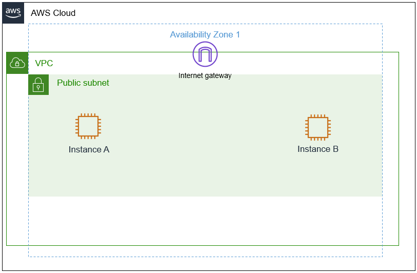

# Internet Protocols - Public and Private IP addresses

In this lab, I will investigate the customer’s environment and apply troubleshooting techniques to resolve the customer’s issue. 
Within the scenario, I will discover that the customer’s EC2 instance (instance A) needs a public IP address to connect to the internet. 
I will test this by using an SSH utility to connect to the instance. I will note that private IP addresses are used within the VPC and c
annot establish a connection to the internet. As highlighted in module 4, I will also discover that using a public range of IP addresses 
for a VPC can lead to complications, such as receiving replies from unrelated external resources.

## Scenario

My role is a cloud support engineer at Amazon Web Services (AWS). During my shift, a customer from a Fortune 500 company requests assistance 
regarding a networking issue within their AWS infrastructure. The following is the email and an attachment regarding their architecture:

Ticket from the customer

>Hello, Cloud Support!
>
>We currently have one virtual private cloud (VPC) with a CIDR range of 10.0.0.0/16. In this VPC, we have two Amazon Elastic Compute Cloud
>(Amazon EC2) instances: instance A and instance B. Even though both are in the same subnet and have the same configurations with AWS resources,
>instance A cannot reach the internet, and instance B can reach the internet. I think it has something to do with the EC2 instances, but I'm not sure.
>I also had a question about using a public range of IP address such as 12.0.0.0/16 for a VPC that I would like to launch. Would that cause any issues?
>Attached is our architecture for reference.
>
>Thanks!
>
>Jess
>
>Cloud Admin



Figure: The customer's architecture, which consists of a VPC, internet gateway, public subnet with instance A, and a public subnet with instance B.

## OSI Model

In the scenario, Jess, who is the customer requesting assistance, has two EC2 instances in one VPC. Instance A cannot reach the internet, 
and instance B can even though they are configured the same within the VPC. Currently, the customer's AWS architecture seems sound because 
one of their instances works. Jess suspects that the instance configuration may be the issue.

She also has a question about using a public range of IP addresses for the new VPC and has asked if you could provide further insight on her question.

There is one VPC with the same CIDR of 10.0.0.0/16 with two instances — instance A and instance B — with the same configurations. 
When troubleshooting networking and AWS, I can apply a troubleshooting method where I start from the top and work my way down or 
start from the bottom and work my way up. Here I start troubleshooting from the bottom and work my way to the top in layers using 
an example such as the OSI model. At the very bottom of this architecture is the EC2 instance. Although the cloud architecture does 
not directly translate to the OSI model, the following is an example of how the OSI and cloud relate.

| OSI Layer | Description                                             | AWS Infrastructure                          |
|-----------|---------------------------------------------------------|---------------------------------------------|
| Layer 7   | Application (how the end user sees it)                  | Application                                 |
| Layer 6   | Presentation (translator between layers)                | Web Servers, application servers            |
| Layer 5   | Session (session establishment, security)               | EC2 instances                               |
| Layer 4   | Transport (TCP, flow control)                           | Security Groups, NACLs                      |
| Layer 3   | Network (Packets which contain IP addresses)            | Route Tables, Internet Gateway, Subnets     |
| Layer 2   | Data Link (Frames with physical MAC addresses)          | Route Tables, Internet Gateway, Subnets     |
| Layer 1   | Physical (cables, transmission bits and volts)          | Regions, Availability Zones                 |


## Task 1: Investigate the customer's environment
First, I gain an understanding of the customer's environment and note the Public and Private IPv4 addresses for each enstance.

Instance A:
- Private IPv4 address: `10.0.10.30`
- Public IPv4 address: 'None

Instance B:
- Private IPv4 address: `10.0.10.63`
- Public IPv4 address: `35.87.129.222`

## Task 2: Use SSH to connect to an Amazon Linux EC2 instance
Instance B has a Public IPv4 address and I can connect to the instance using SSH.
```bash
$ ssh -i labsuser.pem ec2-user@35.87.129.222
The authenticity of host '35.87.129.222 (35.87.129.222)' can't be established.
ED25519 key fingerprint is SHA256:1BKWqHIwEGfpe44lKY6FFopUxt2vqYAQjYHcS3vvosQ.
This key is not known by any other names.
Are you sure you want to continue connecting (yes/no/[fingerprint])? yes
Warning: Permanently added '35.87.129.222' (ED25519) to the list of known hosts.
   ,     #_
   ~\_  ####_        Amazon Linux 2
  ~~  \_#####\
  ~~     \###|       AL2 End of Life is 2026-06-30.
  ~~       \#/ ___
   ~~       V~' '->
    ~~~         /    A newer version of Amazon Linux is available!
      ~~._.   _/
         _/ _/       Amazon Linux 2023, GA and supported until 2028-03-15.
       _/m/'           https://aws.amazon.com/linux/amazon-linux-2023/

[ec2-user@ip-10-0-10-63 ~]$
```

However, instance B does not have the Public IPv4 address and it is not possible to connect to the instance with the Private IPv4 address.

## Task 3: Send the Response to the customer (5-10 min)


>Hi Jess,
>
>Thanks for reaching out and for providing the architecture details—this made it much easier to investigate the issue.
>
>After reviewing your setup, I found that the difference in internet connectivity between instance A and instance B is due to
>their IP addressing. Instance B has a public IPv4 address assigned, which allows it to communicate with the internet through
>the Internet Gateway attached to your VPC. Instance A, however, only has a private IPv4 address. Since private IP addresses are
>not routable over the internet, instance A cannot establish outbound internet connectivity.
>
>To resolve this issue, you have a couple of options:
>
>* Assign a public IPv4 address to instance A (either by enabling auto-assign public IP or associating an Elastic IP).
>* Alternatively, if you prefer to keep instance A private, you can configure a NAT Gateway or NAT instance in a public subnet.
>This would allow instance A to initiate outbound internet traffic securely without exposing it directly to inbound internet access.
>
>Regarding your question about using a public IP range such as 12.0.0.0/16 for a new VPC, I would not recommend this approach.
>While AWS technically allows you to define almost any CIDR block, using a publicly routable IP range that you do not own can
>lead to unexpected routing conflicts. For example, responses to outbound traffic may be misrouted or intercepted by legitimate
>owners of that public IP space on the internet. This can result in connectivity issues that are difficult to troubleshoot.
>
>As a best practice, it is strongly recommended to use private IP address ranges defined by RFC 1918
>(such as 10.0.0.0/8, 172.16.0.0/12, or 192.168.0.0/16) when designing VPC networks. These ranges are specifically
>reserved for internal use and avoid conflicts with public internet routing.
>
>Please let me know if you'd like help implementing any of these solutions or reviewing your architecture further.
>
>Best regards,
>
>Cloud Support Engineer
>
>AWS Support Team


## Conclusions
- I summarized and investigated the customer scenario
- I analyzed the difference between a private and public IP address
- I developped a solution to the customer's issue in this lab
- I summarized and describe your findings (group activity)
