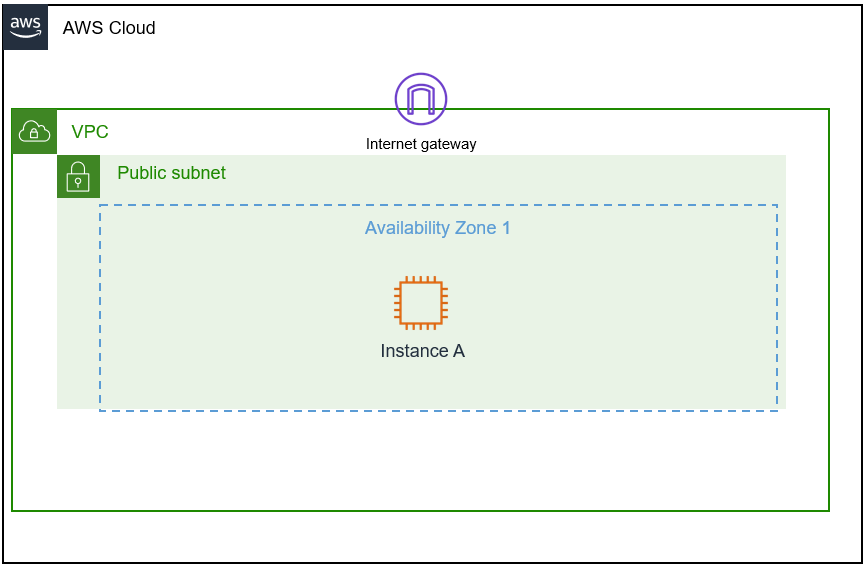
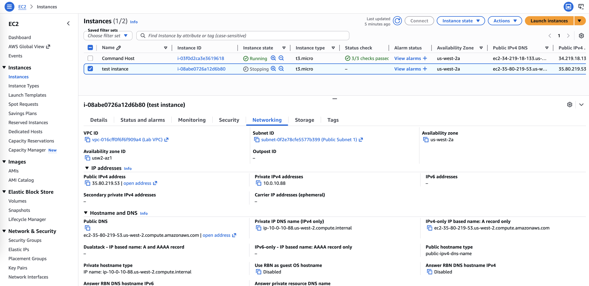

# Internet Protocols - Static and Dynamic Addresses

In this lab, I will investigate a customer’s environment and apply troubleshooting techniques to resolve an IP addressing issue with 
an Amazon EC2 instance. I will discover that the instance uses a dynamic IP address, which changes whenever it is stopped and started. 
To ensure consistent connectivity, I will recommend attaching an Elastic IP (EIP) to provide a persistent, static IP. I will verify this 
solution by SSHing into the instance and restarting it to confirm that the IP remains unchanged. This approach aligns with AWS best 
practices for managing public-facing instances, ensuring reliable access and minimizing connectivity disruptions.

## Scenario
Your role is a cloud support engineer at Amazon Web Services (AWS). During your shift, a customer from a Fortune 500 company requests assistance regarding a networking issue within their AWS infrastructure. The email and an attachment of their architecture is below:

Ticket from your customer

>Hello Cloud Support!
>
>We are having issues with one of our EC2 instances. The IP changes every time we start and stop this instance called Public Instance.
>This causes everything to break since it needs a static IP address. We are not sure why the IP changes on this instance to a random
>IP every time. Can you please investigate? Attached is our architecture. Please let me know if you have any questions.
>
>Thanks!
>Bob, Cloud Admin

Architecture diagram

Figure: Customer VPC architecture, which includes one public subnet and one EC2 instance

## Task 1: Investigate the customer's environment
I think that Bob assigned a dynamic IP address to his EC2 instance because it constantly changes when it is stopped and started again. 
Here I will test this theory by launching a new EC2 instance in the AWS lab environment ans replicate their issue.

1. I launch a new instance with these configuarations:
- Name tag: `test instance`
- Amazon Machine Image (AMI): `Amazon Linux 2 AMI (HVM)`
- Instance Type: `t3.micro`
- Network VPC: `Lab VPC`
- Subnet: `Public Subnet 1`
- Auto-assign Public IP: `enable`
- Security Group: `Linux Instance SG` (existing sg)
- Key pair: `vockey | RSA` (existing)

2. The Private and Public IPv4 address for the *test instance* are:
- Private IPv4 address: `10.0.10.88`
- Public IPv4 address: `35.88.141.104`

3. Once the instance is in status *running*, I stop the instance and then restart it again. 
Now the Private and Public IPv4 address for the *test instance* are:
- Private IPv4 address: `10.0.10.88`
- Public IPv4 address: `54.70.82.105`

I have recreate the customer's issue: the Public IP address change when the *test instancehe* stops and restarts.

## Task 2: Fix issue with Elastic IP (EIP) address
Bob needs a permanent Public IP address that doesn't change when he stops and restarts his instance. 
AWS does have a solution that allocates a persistent public IP address to an EC2 instance, called an Elastic IP (EIP).

1. Under **Network and Security**, I select **Elastic IPs** and click on the button **Allocate Elastic IP address**. I create an elastic IP with this configurations:
- Network border group: `us-west-2`
- Associate to instace: `test instance`
- Associated to Private IP: `10.0.10.88`

The Elastic IP is `35.80.219.53`.

2. I go back to the *test instance* and review that the Public IP address is `35.80.219.53`. I check that it does not change 
if the instance is stopped and started again.

## Task 3: Send the Response to the customer (5-10 minutes)

>Hi Bob,
>
>Thank you for reaching out and providing your architecture details—it made it easier to investigate the issue.
>
>After reviewing your environment, I found that the reason your Public Instance’s IP changes each time it is stopped and started
>is because it currently has a dynamic public IPv4 address assigned. Dynamic IPs in AWS are automatically allocated and released
>when an instance stops or starts, which explains why the IP keeps changing and causes disruptions for services that require a
>consistent address.
>
>To resolve this, I recommend creating an **Elastic IP (EIP)** and assigning it to your Public Instance. An EIP is a static public
>IP address that remains associated with your instance even when it is stopped and restarted, ensuring stable connectivity.
>
>To verify this solution, I tested a new instance called `test instance` and confirmed that after assigning an EIP, the public
>IP does not change when the instance is stopped and restarted.
>
>Please let me know if you would like guidance on creating and assigning an Elastic IP to your instance, or if you would like me to
>assist with implementing this solution.
>
>Best regards,
>  
>Cloud Support Engineer  
>
>AWS Support Team

## Conclusion
In this lab, I will:
- Summarize the customer scenario
- Analyze the difference between a statically and dynamically assigned IP addresses using EC2 instances
- Assign a persistent (static) IP to an EC2 instance
- Develop a solution to the customers issue found within this lab; after developing a solution, summarize and describe your findings

## Additional Resources
- [Amazon EC2 Instance public IP addressing](https://docs.aws.amazon.com/AWSEC2/latest/UserGuide/using-instance-addressing.html)
- [EIP](https://docs.aws.amazon.com/AWSEC2/latest/UserGuide/elastic-ip-addresses-eip.html)
