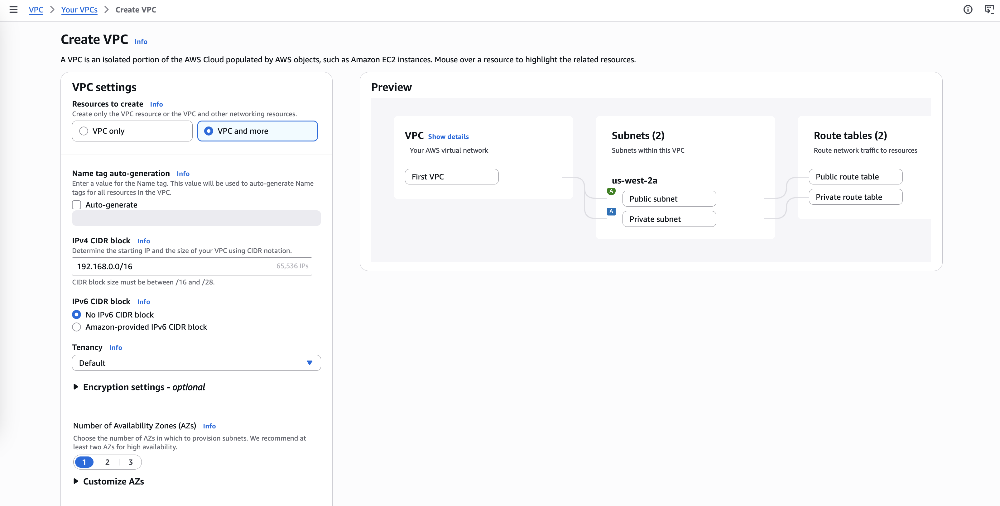
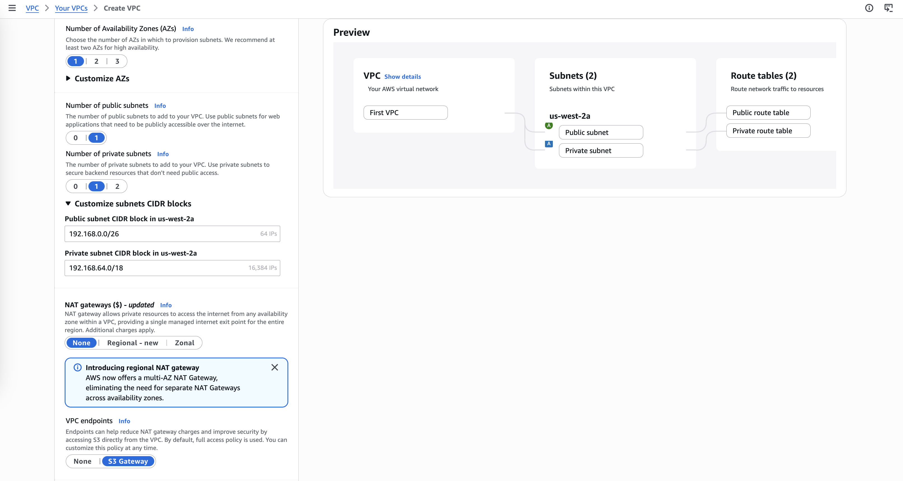
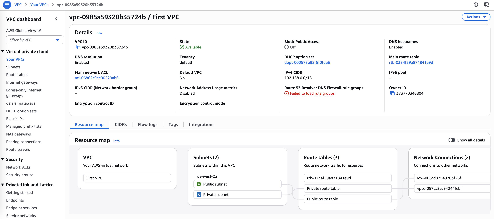

# Create Subnets and Allocate IP addresses in an Amazon Virtual Private Cloud (Amazon VPC)

In this lab, I will investigate a customer’s environment and analyze their request to provide a clear walkthrough 
of their infrastructure. I will learn how to launch a VPC, determine the appropriate CIDR block and IP range to assign, 
and guide the customer through the process of building a VPC in AWS. This lab will help reinforce best practices for 
designing and deploying secure, properly structured virtual networks.

## Scenario
My role is a cloud support engineer at AWS. During my shift, a customer from a startup company requests assistance regarding 
a networking issue within their AWS infrastructure. The following is the email and an attachment regarding their architecture:

Ticket from the customer

>Hello, Cloud Support!
>
>I'm new to AWS, and I need help setting up a VPC. Can you please help me through the setup process? I would like to build only
>the VPC part and would like to make it look something like the following picture. Can you help me ensure  I have around 15,000
>private IP addresses in this VPC available?  I would also like the VPC IPv4 CIDR block to be a 192.x.x.x. I don't remember which
>is a private range though. Can you confirm that? I would also like to allocate at least 50 IP addresses for the public subnet.
>
>Thanks!
>
>Paulo Santos
>
>Startup Owner

Figure: In the customer's VPC architecture, the customer needs approximately 15,000 IP addresses for their Seattle office 
headquarters and 50 IP addresses for their operations department, which will be in the public subnet.

## Task 1: Investigate the customer's needs

In this scenario, Paulo, who is the customer requesting assistance, has switched to using AWS and would like assistance in launching his first VPC. 
He has some networking knowledge but is new to AWS. You know that he needs around 15,000 IP addresses in the private range within his VPC, and he 
would like a public subnet. He would like to allocate at least 50 IP addresses in the public subnet.   

1. First I build a VPC environment based on the customer's requirements:
- VPC name: `First VPC`
- IPv4 CIDR block: `192.168.0.0/16` (65536 IPs)
- VPC with one AZ and a Single Public Subnet
- Public Subnet name: `Public subnet`
- Public subnet's IPv4 CIDR: `192.168.0.0/26` (64 IPs)
- Private Subnet name: `Private subnet`
- Private subnet's IPv4 CIDR: `192.168.64.0/18` (16384 IPs)

## Task 2: Send the response to the customer

> Subject: Assistance with Your VPC Setup
>
> Hi Paulo,
>
> Thank you for reaching out! I’d be happy to help you set up your VPC. Let’s address each of your points.
>
> **Private IPv4 Range:**  
> The private IPv4 ranges you can use are:  
> - 10.0.0.0 – 10.255.255.255  
> - 172.16.0.0 – 172.31.255.255  
> - 192.168.0.0 – 192.168.255.255  
>
> So yes, the `192.x.x.x` range you mentioned can be used as a private range.
>
> **VPC and Subnet Sizing:**  
> To meet your requirements:  
> - **VPC IPv4 CIDR block:** `192.168.0.0/16` → provides 65,536 IP addresses, which easily covers your need for ~15,000 private IPs.  
> - **Public subnet:** `192.168.0.0/26` → provides 64 IP addresses (enough for your minimum 50 IPs requirement).  
> - **Private subnet:** `192.168.64.0/18` → provides 16,384 IP addresses, sufficient for your 15,000 private IPs.
>
> **Architecture:**  
> With this setup, you’ll have one Availability Zone (AZ) containing a single public subnet and a private subnet. This is a common configuration for startups and is a good starting point for adding resources later.
>
> If you’d like, I can provide step-by-step instructions on how to create this VPC and the subnets in the AWS Management Console or via AWS CLI.
>
> Let me know how you’d like to proceed!
>
> Best regards,  
> Cloud Support Engineer 
> AWS Support Team
> 
## Conclusion
- I summarized the customer scenario
- I created a Amazon Virtual Private Cloud (Amazon VPC) with subnets and IP addresses
- I familiarized with the Amazon Web Services (AWS) Management Console
- I developped a solution to the customer's issue in this lab
- I summarized and described my findings

## Notes

1. A VPC is like a data center but in the cloud. It is logically isolated from other virtual networks, and you can use a VPC to spin up and launch your AWS resources within minutes.
2. Resources within a VPC communicate with each other through private IP addresses. An instance needs a public IP address for it to communicate outside the VPC. The VPC needs networking resources, such as an internet gateway and a route table, for the instance to reach the internet.
3. A CIDR block is a range of private IP addresses that is used within the VPC (for example, the /16 number that you see next to an IP address).
4. A subnet is a range of IP addresses within your VPC.
5. To determine the CIDR range, you can use the following third-party calculator: https://www.subnet-calculator.com/
6. To determine the recommended range of private IP addresses that you can use, you can refer to the following guide: https://datatracker.ietf.org/doc/html/rfc1918.

## Additional resources
- [What is Amazon VPC?](https://docs.aws.amazon.com/vpc/latest/userguide/what-is-amazon-vpc.html)
- [IP Addressing in your VPC](https://docs.aws.amazon.com/vpc/latest/userguide/vpc-ip-addressing.html)
- [RFC 1918](https://datatracker.ietf.org/doc/html/rfc1918)
- [VPC CIDR](https://docs.aws.amazon.com/vpc/latest/userguide/VPC_Subnets.html#add-cidr-block-restrictions)
- [Subnet calculator](https://www.subnet-calculator.com/)
