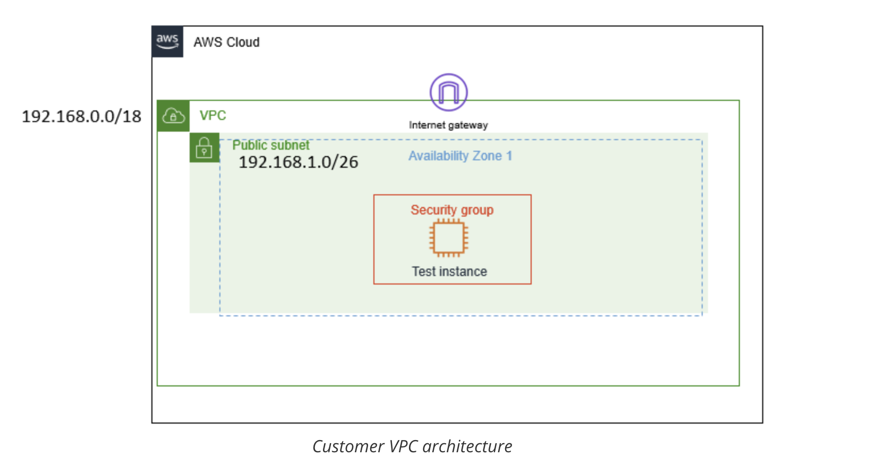

# Creating Networking Resources in an Amazon Virtual Private Cloud (VPC)

In this lab, I will investigate a customer’s environment and analyze their request to build a fully functional VPC. 
I will apply a blended approach using the OSI model to understand how AWS cloud services fit within each network layer. 
I will create resources beginning with the VPC and progress through the AWS console, following the left-hand navigation pane, 
to ensure the customer’s EC2 instance achieves full network connectivity. This lab will reinforce best practices for designing 
and deploying AWS networking infrastructure in a structured and methodical way.

## Scenario
My role is a Cloud Support Engineer at Amazon Web Services (AWS). During my shift, a customer from a startup company requests 
assistance regarding a networking issue within their AWS infrastructure. The email and an attachment of their architecture is below.

Email from the customer

>Hello Cloud Support!
>
>I previously reached out to you regarding help setting up my VPC. I thought I knew how to attach all the resources to make an internet connection,
>but I cannot even ping outside the VPC. All I need to do is ping! Can you please help me set up my VPC to where it has network connectivity and can ping?
>The architecture is below. Thanks!
>
>Brock, startup owner



## Task 1: Investigate the customer's needs

In this scenario, Brock, the customer requesting assistance, has requested help in creating resources for his VPC to be routable to the internet. 
I will keep the VPC CIDR at 192.168.0.0/18 and public subnet CIDR of 192.168.1.0/26.

1. Creating the VPC:
- Name tag: `Test VPC`
- IPv4 CIDR block: `192.168.0.0/18`

2. Creating Subnets:
- VPC ID: `Test VPC`
- Subnet name: `Public subnet`
- IPv4 subnet CIDR block: `192.168.1.0/28` (16 IPs)

3. Creating Route Table:
- Name: `Public route table`
- VPC: `Test VPC`

4. Creating Internet Gateway and attach Internet Gateway:
- Name: `IGW test VPC`
- Attach to VPC: `Test VPC`

5. Add route to *Public route table* and associate subnet to route table:
- Destination: `0.0.0/0`
- Target: `IGW test VPC` (Internet Gatway)
- Associate to `Public subnet`

6. Creating a Network ACL:
- Name: `Public Subnet NACL`
- VPC: `Test VPC`
- Add new Inbound rule:
  - Rule number: Enter 100
  - Type: `All traffic`
- Add new Outbound rule:
  - Rule number: Enter 100
  - Type: `All traffic`
    
7. Creating a Security Group:
- Security group name: `public security group`
- Description: `allows public access`
- VPC: `Test VPC`
- Inbound rules:
  - `SSH` (port 22) from `0.0.0/0` (Anywhere-IPv4)
  - `HTTP` (port 80) from `0.0.0/0` (Anywhere-IPv4)
  - `HTTPS` (port 443) from `0.0.0/0` (Anywhere-IPv4)
- Outbound rule:
  - `All traffic` from `0.0.0/0` (custom)

I now have a functional VPC. In the next task I will launch an EC2 instance to ensure that everything works.

## Task 2: Launch EC2 instance and SSH into instance

1. I create a new instance with these configurations:
- Name and tags: `Bastion Server`
- Application and OS Images (Amazon Machine Image):
  - Quick Start: `Amazon Linux`
  - Amazon Machine Image (AMI): `Amazon Linux 2023 AMI`
- Instance type: `t3.micro`
- Key pair (login): `vockey`
- Network settings:
  - VPC: `Test VPC`
  - Subnet: `Public Subnet`
  - Auto-assign public IP: `Enable`
  - Firewall (security groups): `public security group` (existing security group)

2. I connect to the Bastion Server via SSH. The Public IPv4 address of the Bastion Server is `34.221.201.192`.
```bash
$ chmod 700 labsuser.pem 
$ ssh -i labsuser.pem ec2-user@34.221.201.192
The authenticity of host '34.221.201.192 (34.221.201.192)' can't be established.
ED25519 key fingerprint is SHA256:FIe7w+eDaXVI4ofOLkmi53OkSTHavLYXReyWsh7xCHo.
This key is not known by any other names.
Are you sure you want to continue connecting (yes/no/[fingerprint])? yes
Warning: Permanently added '34.221.201.192' (ED25519) to the list of known hosts.
   ,     #_
   ~\_  ####_        Amazon Linux 2023
  ~~  \_#####\
  ~~     \###|
  ~~       \#/ ___   https://aws.amazon.com/linux/amazon-linux-2023
   ~~       V~' '->
    ~~~         /
      ~~._.   _/
         _/ _/
       _/m/'
[ec2-user@ip-192-168-1-4 ~]$
```

## Task 3: Use ping to test internet connectivity

I test the connectivity with a ping to the google website:

```bash
[ec2-user@ip-192-168-1-4 ~]$ ping google.com
PING google.com (142.251.46.78) 56(84) bytes of data.
64 bytes from pnseab-ad-in-f14.1e100.net (142.251.46.78): icmp_seq=1 ttl=117 time=5.63 ms
64 bytes from pnseab-ad-in-f14.1e100.net (142.251.46.78): icmp_seq=2 ttl=117 time=5.68 ms
64 bytes from pnseab-ad-in-f14.1e100.net (142.251.46.78): icmp_seq=3 ttl=117 time=5.69 ms
64 bytes from pnseab-ad-in-f14.1e100.net (142.251.46.78): icmp_seq=4 ttl=117 time=5.65 ms
64 bytes from pnseab-ad-in-f14.1e100.net (142.251.46.78): icmp_seq=5 ttl=117 time=5.65 ms
64 bytes from pnseab-ad-in-f14.1e100.net (142.251.46.78): icmp_seq=6 ttl=117 time=5.69 ms
64 bytes from pnseab-ad-in-f14.1e100.net (142.251.46.78): icmp_seq=7 ttl=117 time=5.66 ms
^C
--- google.com ping statistics ---
7 packets transmitted, 7 received, 0% packet loss, time 6008ms
rtt min/avg/max/mdev = 5.629/5.664/5.694/0.022 ms
[ec2-user@ip-192-168-1-4 ~]$
```

The message on the terminal screen is saying I have replies from google.com and 0% packet loss.

## Objectives
- I summarized the customer scenario
- Create a VPC, Internet Gateway, Route Table, Security Group, Network Access List, and EC2 instance to create a routable network within the VPC
- I familiarize with the console
- I developped a solution to the customers issue found within this lab

## Note

1. Protocols which can be directly used with AWS's Security Group (SG) and Network Access Control Lists (NACLs).
A VPC needs an Internet Gateway (IGW) in order for the VPC to reach the internet, which has the route as 0.0.0.0/0. 
These routes go on what is called a Route Table, which are associated to subnets so they know where they belong. 
As mentioned in previous labs, you will follow the order of the navigation console to build this VPC, and a troubleshooting 
method to build a fully functioning VPC. When building a VPC from scratch, it is easier to work from the top and move down to
the bottom since you do not have an instance yet. Think of this as building a sandwich; the VPC is the bun, and the resources
are everything in between.

2. A **VPC** is like a data center, but located in the cloud. It's logically isolated from other virtual networks. Now you will build a VPC.

3. A **subnet** is a range of IP addresses within your VPC. In your VPC, you can create a public and a private subnet. You can separate subnets 
according to specific architectural needs. For example, if you have servers that shouldn't be directly accessed by the internet, you would put
them in the private subnet. For test servers or instances that require internet connectivity can be placed in the public subnet. Companies also
separate subnets according to offices, teams, or floors.

4. A **route table** contains the rules or routes that determine where network traffic within your subnet and VPC will go. It controls the network traffic like 
a router, and, just like a router, it stores IP addresses within the VPC. You associate a route table to each subnet and put the routes that you need your
subnet to be able to reach. For this step, you will create the route table first, and then add the routes as you create AWS resources for the VPC.

5. An Internet Gateway **IGW** is what allows the VPC to have internet connectivity and allows communication between resources in your VPC and the internet. The IGW is used 
as a target in the route table to route internet-routable traffic and to perform network address translation (NAT) for EC2 instances. NAT is a bit beyond the 
scope of this lab, but it is referenced in the reference section if you'd like to dive deeper.

6. Security groups and Network Access Control Lists (NACLs) work as the firewall within your VPC. Security groups work at the instance level and are stateful,
which means they block everything by default. NACLs work at the subnet level and are stateless, which means they do not block everything by default.

7. An NACL is a layer of security that acts like a firewall at the subnet level. The rules to set up a NACL are similar to security groups in the way that 
they control traffic. The following rules apply: NACLs must be associated to a subnet, NACLs are stateless, and they have the following parts:
  - Rule number: The lowest number rule gets evaluated first. As soon as a rule matches traffic, its applied; for example: 10 or 100. Rule 10 would get evaluated first.
  - Type of traffic; for example: HTTP or SSH
  - Protocol: You can specify all or certain types here
  - Port range: All or specific ones
  - Destination: Only applies to outbound rules  
  - Allow or Deny specified traffic.


## Additional Resources
- [What is Amazon VPC?](https://docs.aws.amazon.com/vpc/latest/userguide/what-is-amazon-vpc.html)
- [IP Addressing in your VPC](https://docs.aws.amazon.com/vpc/latest/userguide/vpc-ip-addressing.html)
- [Route tables for your VPC](https://docs.aws.amazon.com/vpc/latest/userguide/VPC_Route_Tables.html)
- [Internet Gateways](https://docs.aws.amazon.com/vpc/latest/userguide/VPC_Internet_Gateway.html)
- [Network ACLs](https://docs.aws.amazon.com/vpc/latest/userguide/vpc-network-acls.html#nacl-rules)
- [Security Groups](https://docs.aws.amazon.com/vpc/latest/userguide/VPC_SecurityGroups.html#VPCSecurityGroups)
