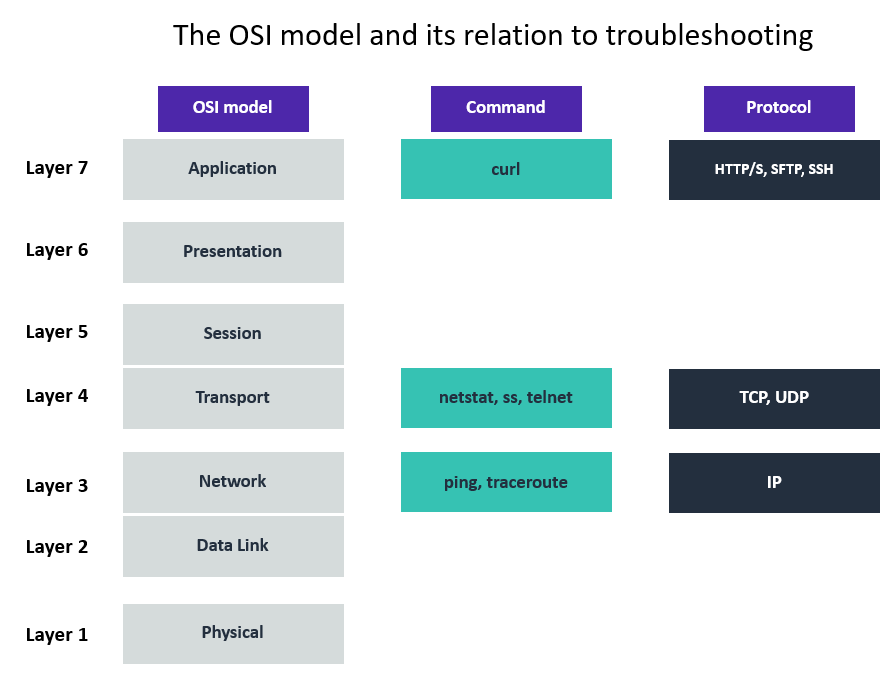

# Internet Protocol Troubleshooting Commands

In this lab, I will act as a new network administrator who is troubleshooting customer issues, 
I will explore troubleshooting techniques by following the OSI model. I will focus specifically on Layers 3, 4, and 7, and 
I will correlate each layer with commonly used troubleshooting commands. Through practical examples and customer-based scenarios, I will 
apply these commands to identify and resolve networking issues. While this lab will not cover an exhaustive list of troubleshooting tools, 
I will use some of the most common and effective commands to diagnose typical networking problems.

Some layers have commands related to them to help with troubleshooting. The following is an example of how the troubleshooting commands flow 
with the Open Systems Interconnection (OSI) model.



Figure: This is an example of how troubleshooting commands have similarities to the OSI model.

### Layer 3 (network): The ping and traceroute commands

1. **ping**

The `ping` command is used to test connectivity between a local machine and a specified destination. It works by sending Internet Control Message Protocol (ICMP) echo request packets to a target host, such as `amazon.com` or `8.8.8.8`. The destination responds with echo reply packets, allowing measurement of the round-trip time (RTT).

This command is primarily used to verify whether a host is reachable and to troubleshoot network connectivity issues. By examining the responses, it is possible to assess latency and detect packet loss. Many implementations also allow continuous transmission of requests, which can be useful for ongoing monitoring of network stability.

The `ping` command accepts an IP address or URL along with optional parameters. The `-c` option specifies the number of echo requests to send.

Example usage:

```bash
[ec2-user@ip-10-0-10-132 ~]$ ping 8.8.8.8 -c 5
PING 8.8.8.8 (8.8.8.8) 56(84) bytes of data.
64 bytes from 8.8.8.8: icmp_seq=1 ttl=117 time=5.38 ms
64 bytes from 8.8.8.8: icmp_seq=2 ttl=117 time=5.39 ms
64 bytes from 8.8.8.8: icmp_seq=3 ttl=117 time=5.39 ms
64 bytes from 8.8.8.8: icmp_seq=4 ttl=117 time=5.39 ms
64 bytes from 8.8.8.8: icmp_seq=5 ttl=117 time=5.40 ms

--- 8.8.8.8 ping statistics ---
5 packets transmitted, 5 received, 0% packet loss, time 4006ms
rtt min/avg/max/mdev = 5.380/5.393/5.403/0.080 ms
[ec2-user@ip-10-0-10-132 ~]$
```

In this example, five ICMP echo requests are sent to `8.8.8.8`, a public DNS server operated by Google, to test connectivity and measure response times.

2. **traceroute**

The `traceroute` command is used to analyze the path that packets take from a local machine to a destination, such as `8.8.8.8`. Each intermediate device along the route is referred to as a *hop*.

The output displays each hop in sequence, along with the latency for reaching that hop. This information helps identify where delays or disruptions occur along the network path.

Packet loss may appear at individual hops and is often associated with issues in the local area network (LAN) or the Internet Service Provider (ISP). If packet loss occurs closer to the final hops, it may indicate a problem near the destination server.

A failed hop is typically shown as three asterisks (`***`), indicating that no response was received within the timeout period. By comparing the hostnames and IP addresses before and after such failures, it is possible to locate potential points of failure or filtering.

Example usage:

```bash
[ec2-user@ip-10-0-10-132 ~]$ traceroute 8.8.8.8
traceroute to 8.8.8.8 (8.8.8.8), 30 hops max, 60 byte packets
 1  242.16.83.239 (242.16.83.239)  5.362 ms 242.4.194.199 (242.4.194.199)  5.364 ms 242.16.82.107 (242.16.82.107)  15.591 ms
 2  99.82.10.8 (99.82.10.8)  6.624 ms  5.980 ms *
 3  * 99.83.117.223 (99.83.117.223)  5.586 ms 99.82.10.7 (99.82.10.7)  5.486 ms
 4  * 142.251.61.157 (142.251.61.157)  6.708 ms 108.170.255.127 (108.170.255.127)  6.539 ms
 5  dns.google (8.8.8.8)  5.304 ms  5.402 ms  5.387 ms
[ec2-user@ip-10-0-10-132 ~]$
```

This command reveals the route taken to reach the destination and provides insight into network performance and potential issues along the path.


### Layer 4 (transport): The netstat and telnet commands

3. **netstat**

The `netstat` command is used to display network connections, listening ports, and associated processes on a system. It is a useful tool for troubleshooting network issues and verifying whether specific ports are open or in use.

For example, during a routine security scan, a compromised port may be detected on a subnet. To investigate further, `netstat` can be run on a local host within that subnet to determine whether the port is actively listening when it should not be.

The command provides insight into active TCP connections and listening services, helping identify unexpected or unauthorized network activity. It is particularly valuable when diagnosing issues starting from the host machine and working outward through the network.

Common options include:

* `netstat -tp`: Displays established TCP connections along with the associated processes
* `netstat -tlp`: Shows services that are currently listening for incoming connections
* `netstat -ntlp`: Displays listening services without resolving port names (shows numeric ports only)

Example usage:

```bash
[ec2-user@ip-10-0-10-132 ~]$ netstat -tp
(No info could be read for "-p": geteuid()=1000 but you should be root.)
Active Internet connections (w/o servers)
Proto Recv-Q Send-Q Local Address           Foreign Address         State       PID/Program name    
tcp        0     36 ip-10-0-10-132.us-w:ssh bbcs-113.232.5.19:36032 ESTABLISHED -                   
[ec2-user@ip-10-0-10-132 ~]$
```

This command outputs currently established TCP connections, allowing verification of which remote hosts are connected and which processes are involved.

Overall, `netstat` provides a snapshot of Layer 4 (transport layer) connectivity. By revealing active connections and listening ports, it helps narrow down potential network or security issues efficiently.

4. **telnet**

The `telnet` command is used to test connectivity to a specific host and port, helping verify whether a service is reachable over a TCP connection. It is often used in troubleshooting to determine if network access is being blocked by firewalls, security groups, or access control rules.

For example, a customer may have a secure web server with firewall rules configured to block port 80. To confirm whether the port is actually inaccessible, the `telnet` command can be used to attempt a connection to that port. If the connection is refused, it indicates that the port is properly blocked.

Before using `telnet`, it may need to be installed:

```bash
sudo yum install telnet -y
```

The command accepts a hostname or IP address followed by a port number.

Example usage:

```bash
[ec2-user@ip-10-0-10-132 ~]$ telnet www.google.com 80
Trying 142.251.156.119...
Connected to www.google.com.
Escape character is '^]'.

```

This command attempts to establish a TCP connection to port 80 on the specified server. If successful, it confirms that the port is open and reachable. When connecting to a web server on port 80, it is also possible to manually send an HTTP request through the session.

The `telnet` command operates primarily at the transport layer (Layer 4) to test TCP connectivity, but it can also be used at the application layer (Layer 7) for simple protocol interactions.

* If the connection succeeds, the port is open and accessible
* If the connection fails with **“connection refused”**, the port is reachable but blocked by a firewall or service configuration
* If the connection fails with **“connection timed out”**, it may indicate a lack of network connectivity or routing issues

Overall, `telnet` is a simple and effective tool for verifying port accessibility and identifying where connectivity problems may exist.

### Layer 7 (application): The curl command

5. **curl**

The `curl` command is used to transfer data between a local machine and a remote server. It supports multiple protocols, most commonly HTTP and HTTPS, and is widely used to test web services and troubleshoot connectivity.

For example, a customer running an Apache web server may want to verify that their website is functioning correctly by checking for a successful HTTP response (such as **200 OK**). The `curl` command can be used to send a request and inspect the server’s response.

Example usage:

```bash
[ec2-user@ip-10-0-10-132 ~]$ curl -vLo /dev/null https://aws.com
  % Total    % Received % Xferd  Average Speed   Time    Time     Time  Current
                                 Dload  Upload   Total   Spent    Left  Speed
  0     0    0     0    0     0      0      0 --:--:-- --:--:-- --:--:--     0*   Trying 3.169.173.67:443...
* Connected to aws.com (3.169.173.67) port 443
...
> GET / HTTP/2
> Host: aws.amazon.com
> User-Agent: curl/8.3.0
> Accept: */*
> 
{ [5 bytes data]
< HTTP/2 200 
< content-type: text/html;charset=utf-8
< date: Mon, 13 Apr 2026 13:33:39 GMT
< set-cookie: aws-priv=eyJ2IjoxLCJldSI6MCwic3QiOjB9; Version=1; Comment="Anonymous cookie for privacy regulations"; Domain=.aws.amazon.com; Max-Age=31536000; Expires=Tue, 13 Apr 2027 13:33:39 GMT; Path=/; Secure
< set-cookie: aws_lang=en; Domain=.amazon.com; Path=/
< x-content-type-options: nosniff
< server: Server
< x-frame-options: SAMEORIGIN
< x-xss-protection: 1; mode=block
< strict-transport-security: max-age=47304000; includeSubDomains
< x-amz-id-1: A39AE69C3E9A458CB1FE
< last-modified: Thu, 09 Apr 2026 20:44:30 GMT
< vary: accept-encoding
< x-cache: Miss from cloudfront
< via: 1.1 250b49a977a2df6676d3fbf2508fc16e.cloudfront.net (CloudFront)
< x-amz-cf-pop: HIO52-P2
< x-amz-cf-id: abhHDF7u4FmDDTm9iQMtt4Qhosghn0mVKr66LAwGKkGZvF1yD7fV6g==
< 
{ [8186 bytes data]
100  331k    0  331k    0     0  1534k      0 --:--:-- --:--:-- --:--:-- 1534k
* Connection #2 to host aws.amazon.com left intact
[ec2-user@ip-10-0-10-132 ~]$ 
```

This command sends a request to a web server and provides detailed output about the connection and response, while discarding the actual page content.

Common options include:

* `-I`: Sends a HEAD request and returns only the response headers
* `-i`: Includes response headers with the output (GET request)
* `-k`: Ignores SSL certificate errors
* `-v`: Enables verbose output, showing detailed request and response information
* `-o /dev/null`: Discards the response body (such as HTML and CSS content)

After execution, the output displays details about the connection and the HTTP response. A **200 OK** status indicates that the server is operating correctly and responding successfully to requests.

The `curl` command is a powerful tool for testing communication between a local system and a server. By examining responses and status codes, it helps identify issues related to connectivity, server configuration, or application behavior.


## Conclusion
- I practiced troubleshooting commands
- I identified how to use these commands in customer scenarios

## Additional resources
- [ping](https://docs.aws.amazon.com/vpn/latest/s2svpn/HowToTestEndToEnd_Linux.html)
- [telnet](https://aws.amazon.com/premiumsupport/knowledge-center/ec2-windows-unable-connect-port/)
- [traceroute](https://aws.amazon.com/premiumsupport/knowledge-center/network-issue-vpc-onprem-ig/)
