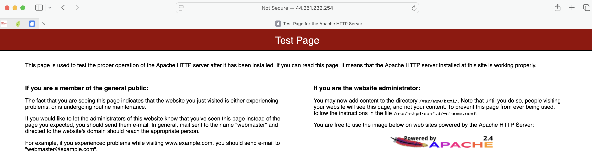

# Troubleshooting a Network Issue

My role is a cloud support engineer at Amazon Web Services (AWS). During my shift, a consulting company has a networking issue within their AWS infrastructure. 
The following is the email and an attachment of their architecture:

Email from the customer
>Hello, Cloud Support!
>
>When I create an Apache server through the command line, I cannot ping it. I also get an error when I enter the IP address in the browser.
>Can you please help figure out what is blocking my connection?
>
>Thanks!
>
>Ana
>
>Contractor


## Task 1: Install httpd

I logged to the EC2 istance using `SSH` from a terminal. Then I start the `httpd` server.

```bash
chiara@macbook-air:~/labs$ chmod 700 labsuser.pem 
chiara@macbook-air:~/labs$ ssh -i labsuser.pem ec2-user@44.251.232.254
The authenticity of host '44.251.232.254 (44.251.232.254)' can't be established.
ED25519 key fingerprint is SHA256:wr4OdMHh0JcbuNLj1y978d5XjYO6cbDeE4a6LUJs5Ro.
This key is not known by any other names.
Are you sure you want to continue connecting (yes/no/[fingerprint])? yes
Warning: Permanently added '44.251.232.254' (ED25519) to the list of known hosts.
   ,     #_
   ~\_  ####_        Amazon Linux 2
  ~~  \_#####\
  ~~     \###|       AL2 End of Life is 2026-06-30.
  ~~       \#/ ___
   ~~       V~' '->
    ~~~         /    A newer version of Amazon Linux is available!
      ~~._.   _/
         _/ _/       Amazon Linux 2023, GA and supported until 2028-03-15.
       _/m/'           https://aws.amazon.com/linux/amazon-linux-2023/

[ec2-user@ip-10-0-10-234 ~]$ 44.251.232.254
-bash: 44.251.232.254: command not found
[ec2-user@ip-10-0-10-234 ~]$ sudo systemctl status httpd.service
● httpd.service - The Apache HTTP Server
   Loaded: loaded (/usr/lib/systemd/system/httpd.service; disabled; vendor preset: disabled)
   Active: inactive (dead)
     Docs: man:httpd.service(8)
[ec2-user@ip-10-0-10-234 ~]$ sudo systemctl start httpd.service
[ec2-user@ip-10-0-10-234 ~]$ sudo systemctl status httpd.service
● httpd.service - The Apache HTTP Server
   Loaded: loaded (/usr/lib/systemd/system/httpd.service; disabled; vendor preset: disabled)
   Active: active (running) since Mon 2026-04-13 13:54:42 UTC; 5s ago
     Docs: man:httpd.service(8)
 Main PID: 2525 (httpd)
   Status: "Processing requests..."
   CGroup: /system.slice/httpd.service
           ├─2525 /usr/sbin/httpd -DFOREGROUND
           ├─2526 /usr/sbin/httpd -DFOREGROUND
           ├─2527 /usr/sbin/httpd -DFOREGROUND
           ├─2528 /usr/sbin/httpd -DFOREGROUND
           ├─2529 /usr/sbin/httpd -DFOREGROUND
           └─2530 /usr/sbin/httpd -DFOREGROUND

Apr 13 13:54:42 ip-10-0-10-234.us-west-2.compute.internal systemd[1]: Startin...
Apr 13 13:54:42 ip-10-0-10-234.us-west-2.compute.internal systemd[1]: Started...
Hint: Some lines were ellipsized, use -l to show in full.
[ec2-user@ip-10-0-10-234 ~]$ sudo systemctl status httpd.service
```

The httpd service is now running but it does not load on the public IP of the istance `http://44.251.232.254`.

## Task 2: Investigate the customer's VPC configuration

Ana, the customer requesting assistance, cannot reach her Apache server even though it is active.
I check each service within the VPC to confirm that each resource is configured correctly.

1. Subnets - Are the route tables associated to the correct subnets?
2. Route Tables - Do the route tables have the correct routes?
3. Internet Gateway - Is there an Internet Gateway and is it attached?
4. Security Groups and network ACLs - Are the correct rules configured?

I ping websites such as www.amazon.com.
```bash
[ec2-user@ip-10-0-10-234 ~]$ ping -c 4 www.amazon.com
PING cf.47cf2c8c9-frontier.amazon.com (3.163.26.68) 56(84) bytes of data.
64 bytes from server-3-163-26-68.hio52.r.cloudfront.net (3.163.26.68): icmp_seq=1 ttl=249 time=5.33 ms
64 bytes from server-3-163-26-68.hio52.r.cloudfront.net (3.163.26.68): icmp_seq=2 ttl=249 time=5.36 ms
64 bytes from server-3-163-26-68.hio52.r.cloudfront.net (3.163.26.68): icmp_seq=3 ttl=249 time=5.31 ms
64 bytes from server-3-163-26-68.hio52.r.cloudfront.net (3.163.26.68): icmp_seq=4 ttl=249 time=5.32 ms

--- cf.47cf2c8c9-frontier.amazon.com ping statistics ---
4 packets transmitted, 4 received, 0% packet loss, time 3004ms
rtt min/avg/max/mdev = 5.314/5.334/5.362/0.075 ms
```
This confirm that I can get to the internet, so the internet gateway and route table are working.

Instead, the security group lacked an inbound rule allowing HTTP traffic (port 80) from the internet (0.0.0.0/0). I added this rule to 
the Linux instance SG security group and retested the server using its public URL.




## Conclusion
- I analyzed the customer scenario.
- I troubleshot the issue.
