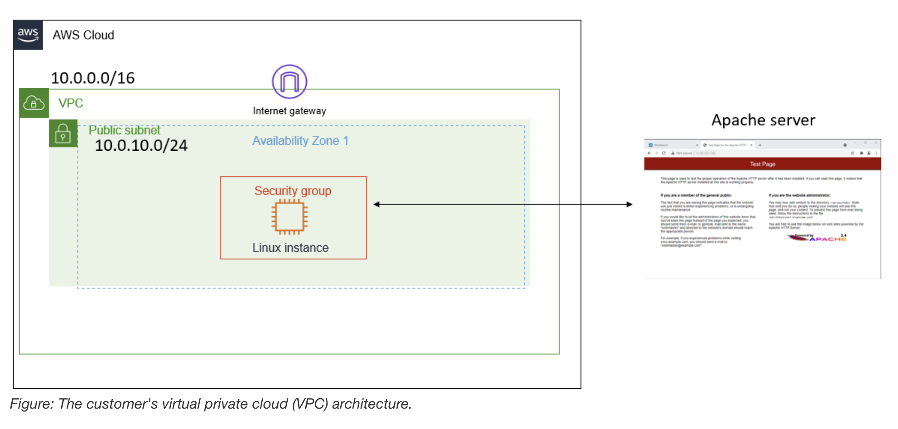

# Troubleshooting a Network Issue

My role is a cloud support engineer at Amazon Web Services (AWS). During my shift, a consulting company has a networking issue within their AWS infrastructure. 
The following is the email and an attachment of their architecture:

Email from the customer
>Hello, Cloud Support!
>
>When I create an Apache server through the command line, I cannot ping it. I also get an error when I enter the IP address in the browser.
>Can you please help figure out what is blocking my connection?
>
>Thanks!
>
>Ana
>
>Contractor

##

## Conclusion
- I analyzed the customer scenario.
- I troubleshot the issue.
