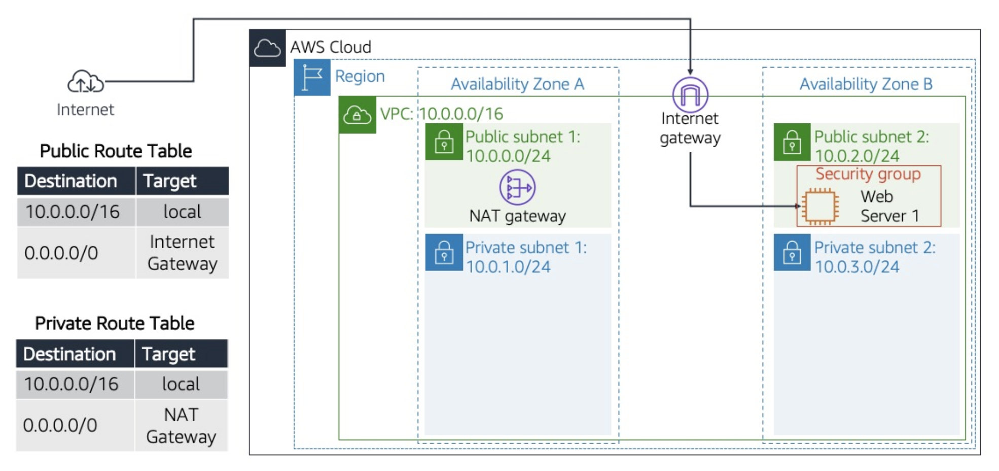
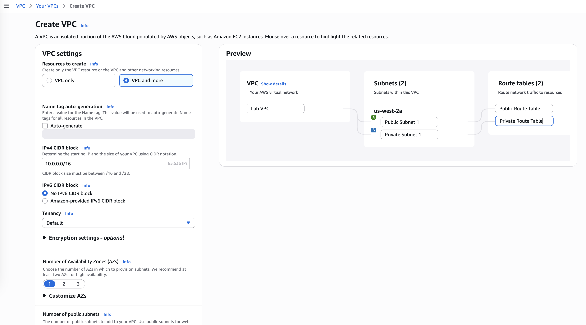
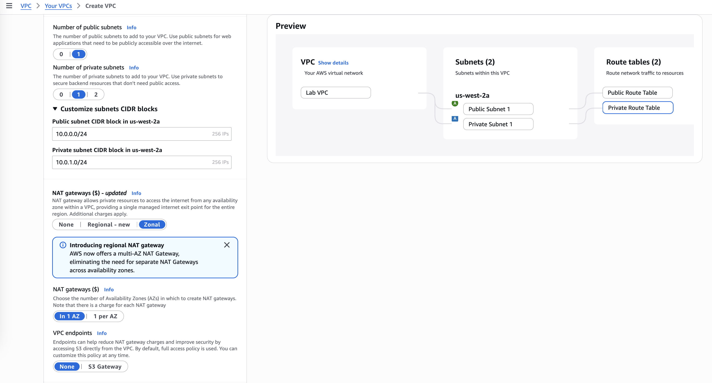
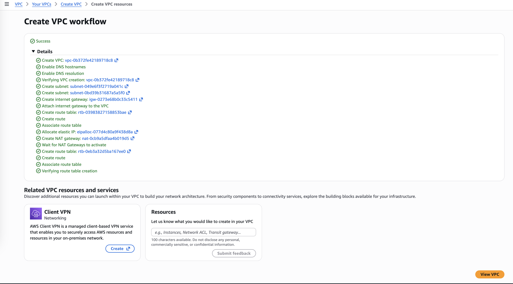
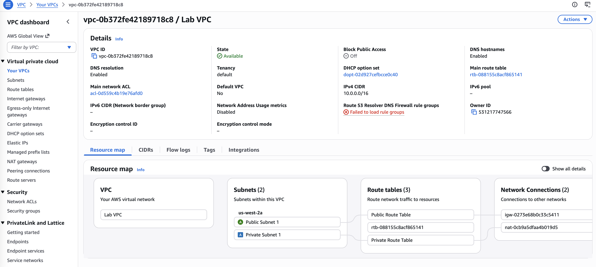
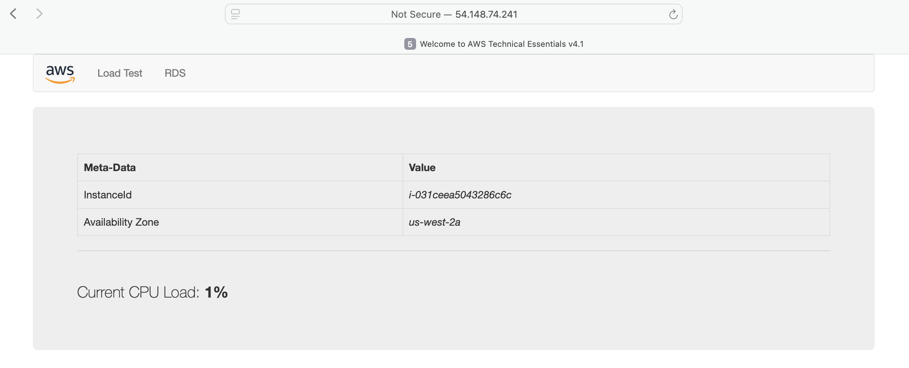

# Build Your VPC and Launch a Web Server

In this lab, I will use Amazon Virtual Private Cloud (VPC) to create my own VPC and add additional components to build a customized network 
for a Fortune 100 customer. I will also create security groups for my EC2 instance. I will then configure and customize an EC2 instance to 
run a web server and launch it into the VPC that matches the customer diagram shown below.



## Task 1: Create your VPC

I use the VPC Wizard to create a VPC, an internet gateway, and two subnets in a single Availability Zone. An internet gateway is a VPC component 
that allows communication between instances in my VPC and the internet.

After creating the VPC, I add subnets. Each subnet resides entirely within one Availability Zone and cannot span zones. If a subnet’s traffic is routed 
to an internet gateway, it is known as a public subnet. If a subnet does not have a route to the internet gateway, it is known as a private subnet.

The wizard also creates a NAT gateway, which is used to provide internet connectivity to EC2 instances in private subnets.









## Task 2: Create additional subnets

I create two additional subnets in a second Availability Zone. This option is useful for creating resources in multiple Availability Zones to provide high availability.

I create another public subnet:
- VPC ID: `Lab VPC`
- Subnet name: `Public Subnet 2`  
- Availability Zone: `No preference`
- IPv4 CIDR block: `10.0.2.0/24`

The subnet will have all IP addresses starting with **10.0.2.x**.

I create another private subnet:
- VPC ID: `Lab VPC`
- Subnet name: `Private Subnet 2`
- Availability Zone: `No preference`
- IPv4 CIDR block: `10.0.3.0/24`

The subnet will have all IP addresses starting with **10.0.3.x**.

## Task 3: Associate the subnets and add routes

I navigate to Route Tables in the left pane and select the Public Route Table, then edit the subnet associations to include Public Subnet 2 and save the changes. 
I then repeat the process for the Private Route Table, adding Private Subnet 2 and saving the updated associations.

Now my VPC has public and private subnets configured in two Availability Zones.
 
## Task 4: Create a VPC security group

I create a VPC security group, which acts as a virtual firewall for my instance, with the following options:
- Security group name: `Web Security Group`
- Description: `Enable HTTP access`
- VPC: `Lab VPC`

Under Inbound rules, I add a new rule with these options:
- Type: `HTTP`
- Source: `Anywhere IPv4`
- Description: `Permit web requests`

When an instance is launched, one or more security groups is associated with it.

## Task 5: Launch a web server instance
I launch an EC2 instance into the new VPC and configure it to act as a web server with the following congisurations:
- Name:  `Web Server 1`
- Quick Start: `Amazon Linux`
- Amazon Machine Image (AMI): `Amazon Linux 2023 kernel-6.1 AMI`
- Instance type: `t3.micro`
- Key pair: `vockey`
- VPC: `Lab VPC`
- Subnet: `Public Subnet 2`
- Auto-assign public IP: `Enable`
- Firewall (security groups): `Web Security Group.` (existing security group)
- User data:
```bash
#!/bin/bash
# Install Apache, MySQL, PHP
dnf install -y httpd mariadb105 php

# Download lab files
wget https://aws-tc-largeobjects.s3.us-west-2.amazonaws.com/CUR-TF-100-RESTRT-1/267-lab-NF-build-vpc-web-server/s3/lab-app.zip

unzip lab-app.zip -d /var/www/html/

# Enable and start Apache (systemd)
systemctl enable httpd
systemctl start httpd
```

After it passes the status checks, I copy the Public IPv4 DNS `54.148.74.241` and open it in a browser to verify that the web server is running successfully.




## Conclusion
- I created a virtual private cloud (VPC)
- I created subnets
- I configured a security group
- I launched an Amazon Elastic Compute Cloud (Amazon EC2) instance into a VPC

## Additional resources
- [What is Amazon VPC?](https://docs.aws.amazon.com/vpc/latest/userguide/what-is-amazon-vpc.html)
