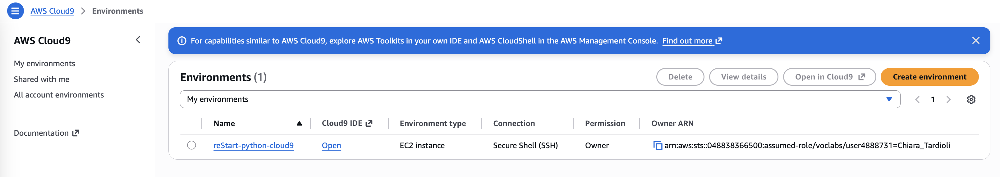
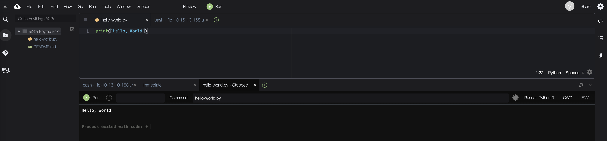
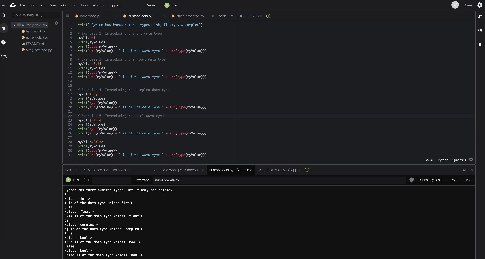
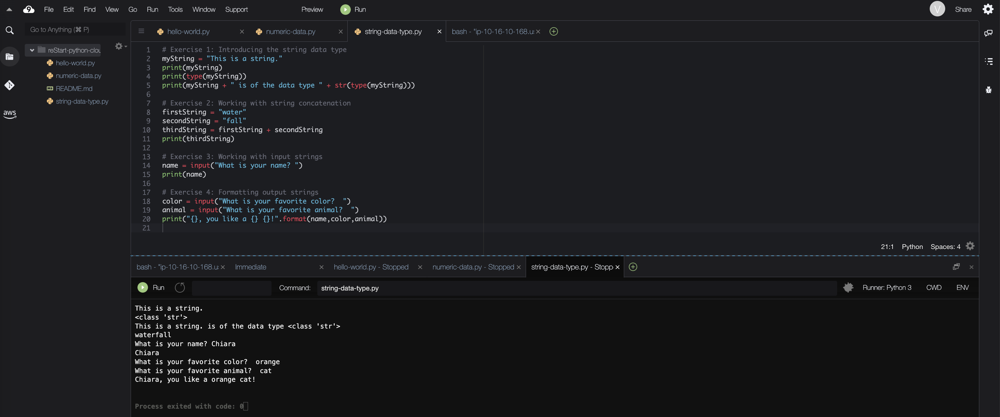
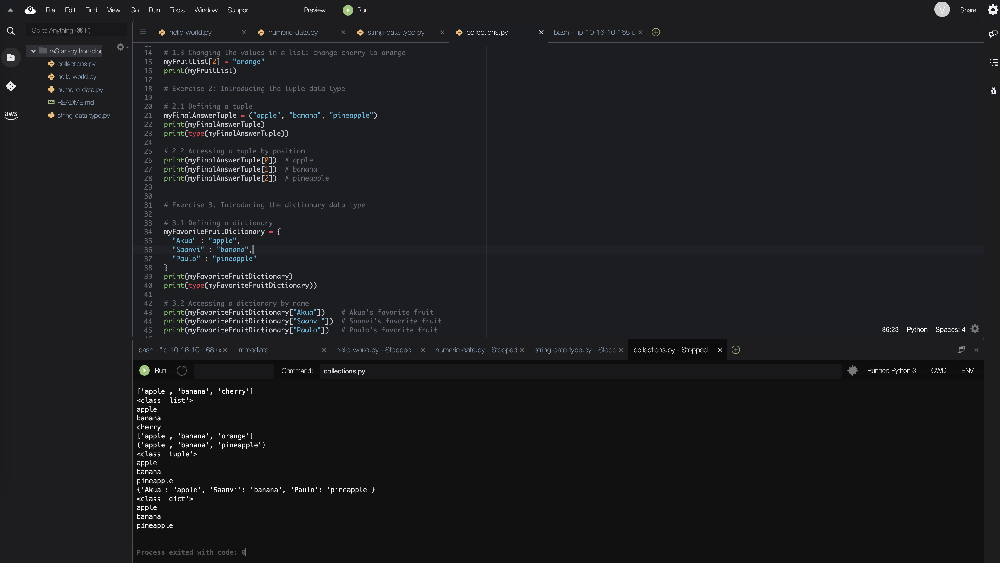
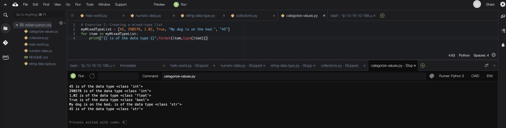
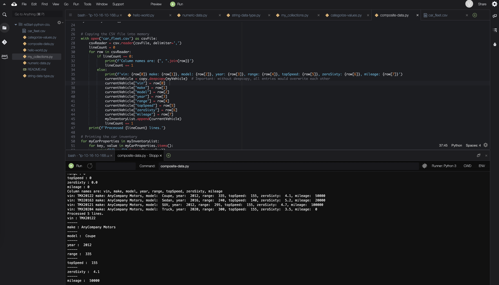
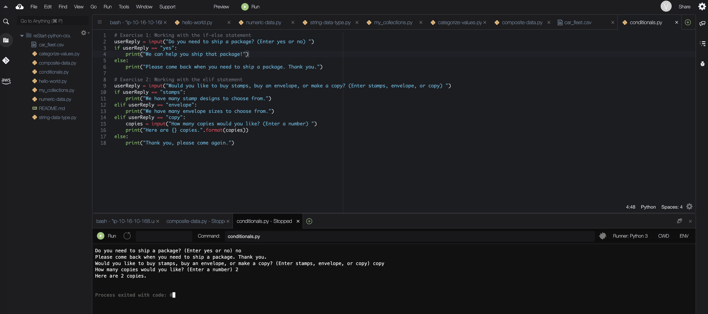
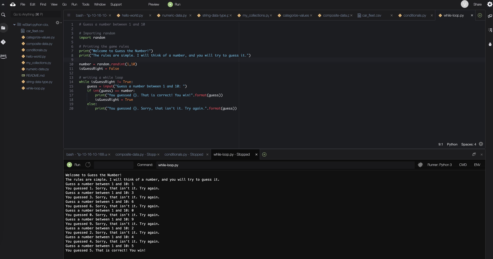

# AWS Cloud9 : Practise Python

### Accessing the AWS Cloud9 IDE

**AWS Cloud9** is a cloud-based integrated development environment (IDE) provided by Amazon Web Services that allows users to write, run, and debug code directly from a web browser. It includes a code editor, debugger, and terminal with a preconfigured AWS CLI, and supports over 40 programming languages.

Cloud9 environments can run on Amazon EC2 instances or on custom Linux servers, and they can be connected to source control systems like AWS CodeCommit. Environments can be easily created through the AWS Management Console or CLI, often automatically provisioning the required infrastructure.


## Labs 1-9



### 1. Creating a Hello, World Program

Python file name: `hello-world.py`
```python
#Exercise 2: Writing your first Python program
print("Hello, World")
```



### 2. Working with Numeric Data Types

Python file name: `numeric-data.py`
```python
print("Python has three numeric types: int, float, and complex")

# Exercise 2: Introducing the int data type
myValue=1
print(myValue)
print(type(myValue))
print(str(myValue) + " is of the data type " + str(type(myValue)))

# Exercise 3: Introducing the float data type
myValue=3.14
print(myValue)
print(type(myValue))
print(str(myValue) + " is of the data type " + str(type(myValue)))


# Exercise 4: Introducing the complex data type
myValue=5j
print(myValue)
print(type(myValue))
print(str(myValue) + " is of the data type " + str(type(myValue)))

# Exercise 5: Introducing the bool data type
myValue=True
print(myValue)
print(type(myValue))
print(str(myValue) + " is of the data type " + str(type(myValue)))

myValue=False
print(myValue)
print(type(myValue))
print(str(myValue) + " is of the data type " + str(type(myValue)))
```



### 3. Working with the String Data Type

Python file name: `string-data.py`
```python
# Exercise 1: Introducing the string data type
myString = "This is a string."
print(myString)
print(type(myString))
print(myString + " is of the data type " + str(type(myString)))

# Exercise 2: Working with string concatenation
firstString = "water"
secondString = "fall"
thirdString = firstString + secondString
print(thirdString)

# Exercise 3: Working with input strings
name = input("What is your name? ")
print(name)

# Exercise 4: Formatting output strings
color = input("What is your favorite color?  ")
animal = input("What is your favorite animal?  ")
print("{}, you like a {} {}!".format(name,color,animal))
```



### 4. Working with Lists, Tuples, and Dictionaries

Python file name: `collections.py`
```python
# Exercise 1: Introducing the list data type

# 1.1 efining a list
myFruitList = ["apple", "banana", "cherry"]
print(myFruitList)
print(type(myFruitList))


# 1.2 Accessing a list by position
print(myFruitList[0])   # apple
print(myFruitList[1])   # banana
print(myFruitList[2])   # cherry

# 1.3 Changing the values in a list: change cherry to orange
myFruitList[2] = "orange"
print(myFruitList)

# Exercise 2: Introducing the tuple data type

# 2.1 Defining a tuple
myFinalAnswerTuple = ("apple", "banana", "pineapple")
print(myFinalAnswerTuple)
print(type(myFinalAnswerTuple))

# 2.2 Accessing a tuple by position
print(myFinalAnswerTuple[0])  # apple
print(myFinalAnswerTuple[1])  # banana
print(myFinalAnswerTuple[2])  # pineapple


# Exercise 3: Introducing the dictionary data type

# 3.1 Defining a dictionary
myFavoriteFruitDictionary = {
  "Akua" : "apple",
  "Saanvi" : "banana",
  "Paulo" : "pineapple"
}
print(myFavoriteFruitDictionary)
print(type(myFavoriteFruitDictionary))

# 3.2 Accessing a dictionary by name
print(myFavoriteFruitDictionary["Akua"])    # Akua's favorite fruit
print(myFavoriteFruitDictionary["Saanvi"])  # Saanvi's favorite fruit
print(myFavoriteFruitDictionary["Paulo"])   # Paulo's favorite fruit
```



### 5. Categorizing Values

Python file name: `categorize-values.py`
```python
# Exercise 1: Creating a mixed-type list
myMixedTypeList = [45, 290578, 1.02, True, "My dog is on the bed.", "45"]
for item in myMixedTypeList:
    print("{} is of the data type {}".format(item,type(item)))
```



### 6. Working with Composite Data Types

The car inventory data is in the file [car_fleet.csv](./files/car_fleet.csv):

```csv
vin,make,model,year,range,topSpeed,zeroSixty,mileage
TMX20122,AnyCompany Motors, Coupe, 2012, 335, 155, 4.1, 50000
TM320163,AnyCompany Motors, Sedan, 2016, 240, 140, 5.2, 20000
TMX20121,AnyCompany Motors, SUV, 2012, 295, 155, 4.7, 100000
TMX20204,AnyCompany Motors, Truck, 2020, 300, 155, 3.5, 0
```

Python file name: `composite-data.py`

```python
# ---------- Car inventory program ----------
import csv
import copy


# Defining the dictionary
myVehicle = {
    "vin" : "<empty>",
    "make" : "<empty>" ,
    "model" : "<empty>" ,
    "year" : 0,
    "range" : 0,
    "topSpeed" : 0,
    "zeroSixty" : 0.0,
    "mileage" : 0
}
for key, value in myVehicle.items():
    print("{} : {}".format(key,value))
    
# Define an empty list
myInventoryList = []


# Copying the CSV file into memory
with open('car_fleet.csv') as csvFile:
    csvReader = csv.reader(csvFile, delimiter=',')  
    lineCount = 0  
    for row in csvReader:
        if lineCount == 0:
            print(f'Column names are: {", ".join(row)}')  
            lineCount += 1  
        else:  
            print(f'vin: {row[0]} make: {row[1]}, model: {row[2]}, year: {row[3]}, range: {row[4]}, topSpeed: {row[5]}, zeroSixty: {row[6]}, mileage: {row[7]}')  
            currentVehicle = copy.deepcopy(myVehicle)
            currentVehicle["vin"] = row[0]  
            currentVehicle["make"] = row[1]  
            currentVehicle["model"] = row[2]  
            currentVehicle["year"] = row[3]  
            currentVehicle["range"] = row[4]  
            currentVehicle["topSpeed"] = row[5]  
            currentVehicle["zeroSixty"] = row[6]  
            currentVehicle["mileage"] = row[7]  
            myInventoryList.append(currentVehicle)  
            lineCount += 1  
    print(f'Processed {lineCount} lines.')

# Printing the car inventory
for myCarProperties in myInventoryList:
    for key, value in myCarProperties.items():
        print("{} : {}".format(key,value))
        print("-----")
```
 **Important**: without deepcopy, all entries would overwrite each other



### 7. Working with Conditionals

Python file name: `conditionals.py`
```python
# Exercise 1: Working with the if-else statement
userReply = input("Do you need to ship a package? (Enter yes or no) ")
if userReply == "yes":
    print("We can help you ship that package!")
else:
    print("Please come back when you need to ship a package. Thank you.")

# Exercise 2: Working with the elif statement
userReply = input("Would you like to buy stamps, buy an envelope, or make a copy? (Enter stamps, envelope, or copy) ")
if userReply == "stamps":
    print("We have many stamp designs to choose from.")
elif userReply == "envelope":
    print("We have many envelope sizes to choose from.")
elif userReply == "copy":
    copies = input("How many copies would you like? (Enter a number) ")
    print("Here are {} copies.".format(copies))
else:
    print("Thank you, please come again.")
```



### 8. Working with Loops

Python file name: `while-loop.py`
```python
# Guess a number between 1 and 10

# Importing random
import random

# Printing the game rules
print("Welcome to Guess the Number!")
print("The rules are simple. I will think of a number, and you will try to guess it.")

number = random.randint(1,10)
isGuessRight = False

# writing a while loop
while isGuessRight != True:
    guess = input("Guess a number between 1 and 10: ")
    if int(guess) == number:
        print("You guessed {}. That is correct! You win!".format(guess))
        isGuessRight = True
    else:
        print("You guessed {}. Sorry, that isn’t it. Try again.".format(guess))
```

Here is the pseudocode (written logic) for the **while loop**:

* If the user has not guessed the correct number, continue running the loop.
* Ask the user to guess a number between 1 and 10.
* Convert the user’s input into a number.
* Check if the guessed number is equal to the randomly generated number.
* If the guess is correct, display a success message and end the loop.
* If the guess is incorrect, display a message telling the user to try again and repeat the loop.




### 9. Creating a Git Repository

You can find all python scripts here: [Python Scripts](./python-scripts)

