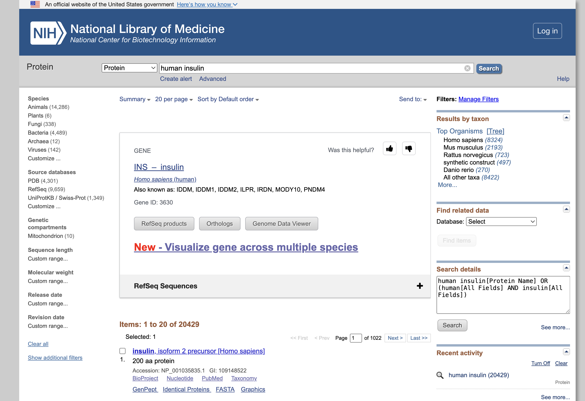
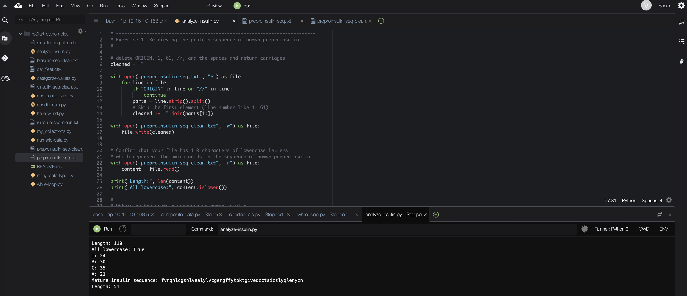

# Preparing to Analyze Insulin with Python

In this lab, I will retrieve the protein sequence of human insulin from human preproinsulin.

## Exercise 1: Retrieving the protein sequence of human preproinsulin
The National Center for Biotechnology Information (NCBI) has information on many biological sequences.

From the NCBI Website [https://ncbi.nlm.nih.gov](https://ncbi.nlm.nih.gov), I search the `human insulin` and 
select the `insulin [Homo sapiens] GenBank: AAA59172.1`.



Then I copy and paste the insulin sequence into the new file `preproinsulin-seq.txt`.
```txt
ORIGIN      
        1 malwmrllpl lallalwgpd paaafvnqhl cgshlvealy lvcgergffy tpktrreaed
       61 lqvgqvelgg gpgagslqpl alegslqkrg iveqcctsic slyqlenycn
//
```

## Exercise 2: Obtaining the protein sequence of human insulin

Insulin is obtained from preproinsulin through a series of cut-and-paste procedures. 
Insulin formation process:
- Insulin is produced from preproinsulin through a series of cut-and-paste (processing) steps.
- Preproinsulin consists of:
  - A 24 amino acid (aa) signal sequence
  - An 86 amino acid proinsulin molecule
- During processing:
  - The signal sequence (aa 1–24) is removed
  - The remaining molecule becomes proinsulin
- Further processing of proinsulin produces the final insulin:
  - Amino acids 25–54 → form part of the insulin molecule
  - Amino acids 90–110 → form another part of the insulin molecule

I use Python code [analyze-insulin.py](./python-scripts/analyze-insulin.py) to retrieve only those amino acids in the sequence that compose insulin.


