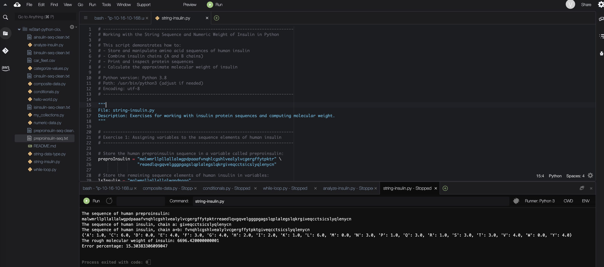

# Working with the String Sequence and Numeric Weight of Insulin in Python

I will store the protein sequence of human preproinsulin in a string variable and the weight of preproinsulin in int and float variables.
Next, I will print these variables to the console, with comments that explain the code. I will do basic math and string concatenations.

## Solution

The full code for this lab is avalable here: [string-insulin](./python-scripts/string-insulin.py)

## Conclusion
- I added comments that explain the intention and flow of your code
- I used print() to print elements of your Python code to the console
- I used string manipulations to get the sequence of insulin from preproinsulin
- I did basic math on the molecular weight and sequence of insulin
- I assigned string, int, and float variables to numbers that represent the weight of insulin
- I explored Python exceptions
