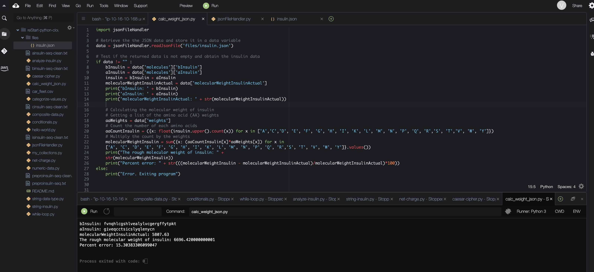

# Creating File Handlers and Modules for Retrieving Information about Insulin

## Solution

The python files for this lab are: 
- [calc_weight_json.py](./python-scripts/calc_weight_json.py)
- [jsonFileHandler.py](./python-scripts/jsonFileHandler.py)

The output files are stored in a subfolder named `files`.

## Conclusion
- I created a module
- I opened a file and load the JSON data it contains using the built-in JSON module of Python
- I parsed the JSON structure to access insulin data
- I calculated the rough molecular weight of human insulin using given code (similar to the lab Working with the String Sequence and Numeric Weight of Insulin in Python)
