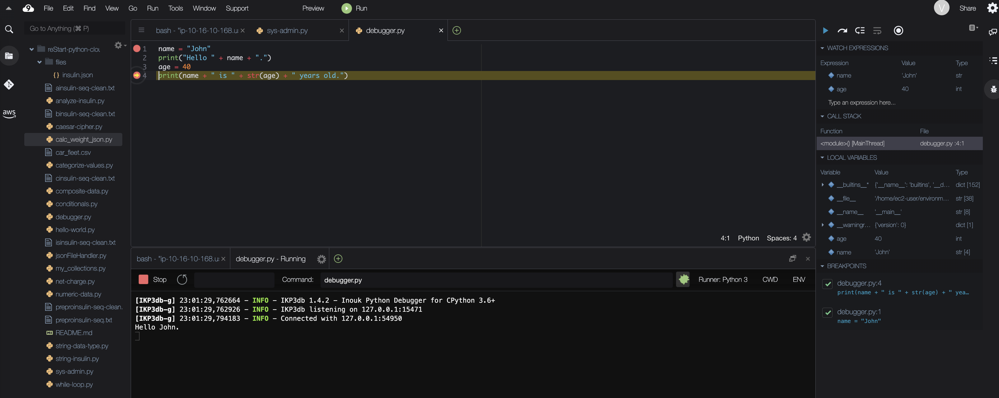

# Using the Cloud9 Python Debugger

A *software bug* refers to an error, flaw, or failure in a computer program that causes an incorrect or unexpected result. 
A *debugger* is a computer program that is used to test and find bugs (debug) other programs. One can use a debugger to step through the code. 
The Python Debugger (pdb) is an interactive source code debugger for Python programs. 
In this lab, I will use the pdb to step through the scripts I wrote in previous labs.

## Solution

Cloud9 offers an interactive source code debugger for several languages, including Python. 
In this exercise, I cover some of the basic commands for debugging the [debugger.py](./python-scripts/debugger.py) file.

## Conclusion
- I explored the basic features of the Python Debugger
- I used the Python Debugger to step through Python scripts
