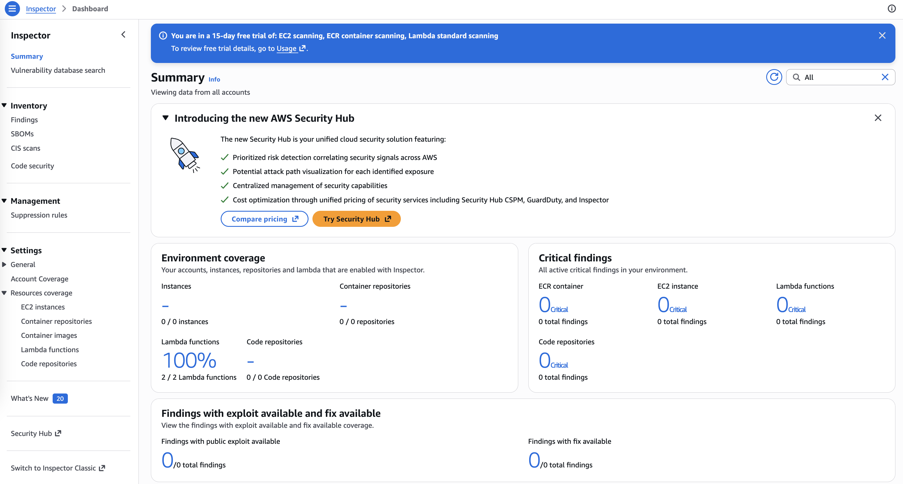

# Network Hardening : Using Amazon Inspector for vulnerability assesment and remediation

In this lab, I used **Amazon Inspector** to identify and remediate vulnerabilities in **AWS Lambda** functions. The process included activating the service, reviewing detected vulnerabilities, and applying remediation steps to secure the application environment.

## Scenario
The scenario is based on developers at AnyCompany who are building a serverless application and require an integrated security tool during development. 
Amazon Inspector fulfills this need by continuously scanning for vulnerable software packages and issues within the code, while also automatically extending protection 
to other resources such as Amazon EC2 instances and Amazon ECR repositories. This ensures a proactive approach to security as new resources and updates are introduced.

## Task 1: Activating Amazon Inspector

I began by activating Amazon Inspector through the AWS Management Console. Once enabled, the service automatically initiated scans across supported resources, including Lambda functions.

After activation, the dashboard indicated that scanning was in progress. I monitored the **Environment coverage** section until Lambda coverage reached 100%, confirming that all functions were being scanned.

Below it the Amazon Inspector dashboard showing **activation status** and **Lambda coverage at 100%**. By default, scanning is activated for Amazon EC2, Amazon ECR, and AWS Lambda standard scanning.

## Task 2: Reviewing Lambda Findings

While the scan was running, I explored the detected vulnerabilities under the **Findings** section. Amazon Inspector reported multiple findings related to Lambda functions, 
each with details such as severity, affected resource, and vulnerability description.

One key finding was **CVE-2023-32681**, which identified a vulnerability in the Python `requests` package. By opening the finding details, I accessed additional information, including:

* Severity level (Medium)
* Impacted Lambda function
* External reference to the National Vulnerability Database (NVD)
* Recommended remediation steps

*Suggested screenshots:*

* Findings list showing vulnerabilities
* Detailed view of a specific finding (CVE-2023-32681)
* NVD vulnerability page (optional but useful for context)

## Task 3: Remediating Vulnerabilities

### 3.1 Updating Lambda Function Dependencies

To remediate the identified vulnerability, I modified the Lambda function configuration:

* Opened the **get-request** Lambda function
* Edited the `requirements.txt` file
* Removed the fixed version (`requests==2.20.0`) and replaced it with `requests` to allow installation of the latest secure version
* Deployed the updated function

This change ensured that the function used an up-to-date and secure version of the package.

*Suggested screenshots:*

* Lambda function code editor showing `requirements.txt` before and after changes
* Deployment success message

### 3.2 Verifying Remediation

After deployment, Amazon Inspector automatically triggered a new scan. I then:

* Navigated back to the Inspector dashboard
* Filtered findings by **Closed status**
* Confirmed that the vulnerability (CVE-2023-32681) was resolved

Additionally, I verified that the Lambda function had been rescanned by checking the updated timestamp in the **Resource coverage** section.

*Suggested screenshots:*

* Closed findings list showing resolved vulnerability
* Resource coverage page with updated scan timestamp

## Conclusion

This lab demonstrated how Amazon Inspector provides continuous security monitoring for AWS resources. By identifying vulnerable dependencies and 
applying recommended fixes, I was able to remediate security risks effectively. The automated rescanning process ensured that the issue was resolved 
and validated, reinforcing a proactive approach to cloud security.

## Conclusion
- I activated Amazon Inspector.
- I analyzed and interpret vulnerability findings.
- I remediated the vulnerabilities found by Amazon Inspector.
