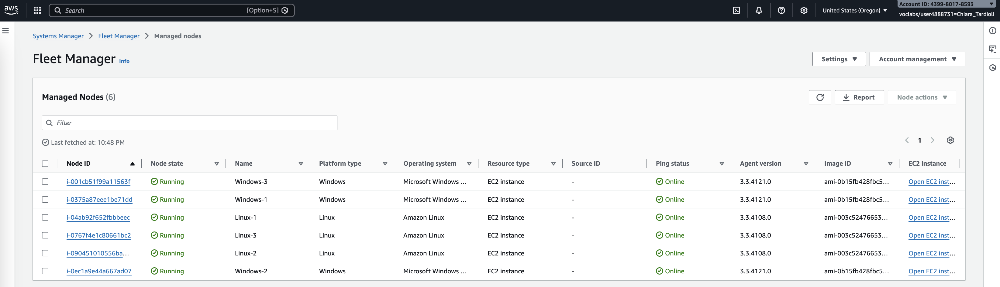
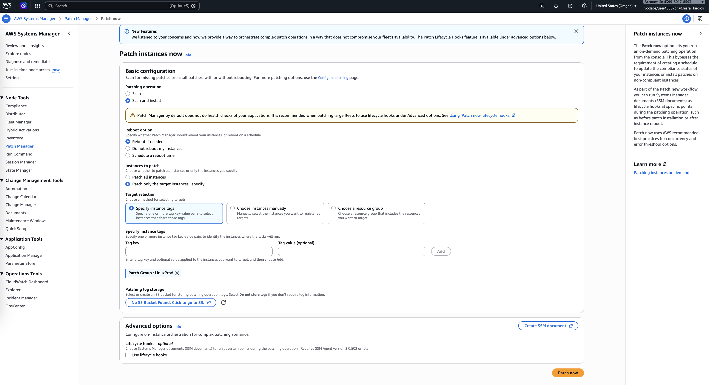
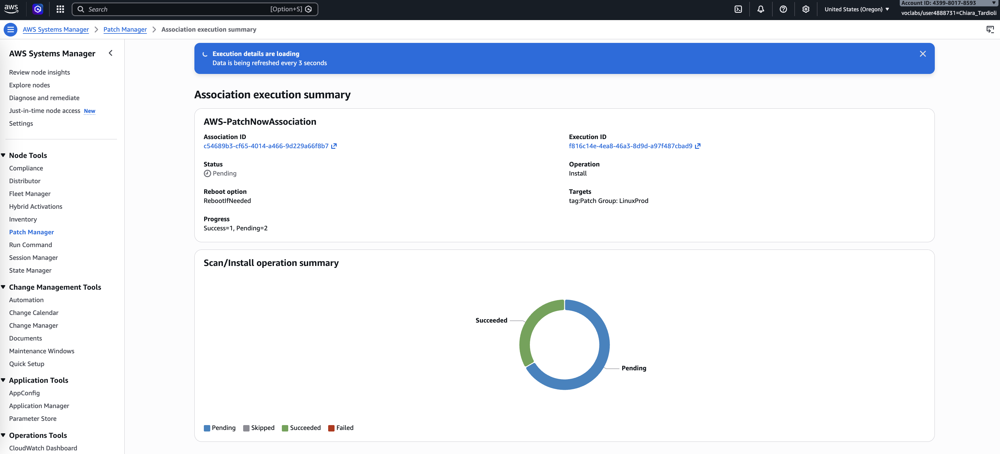
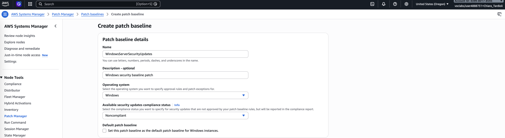
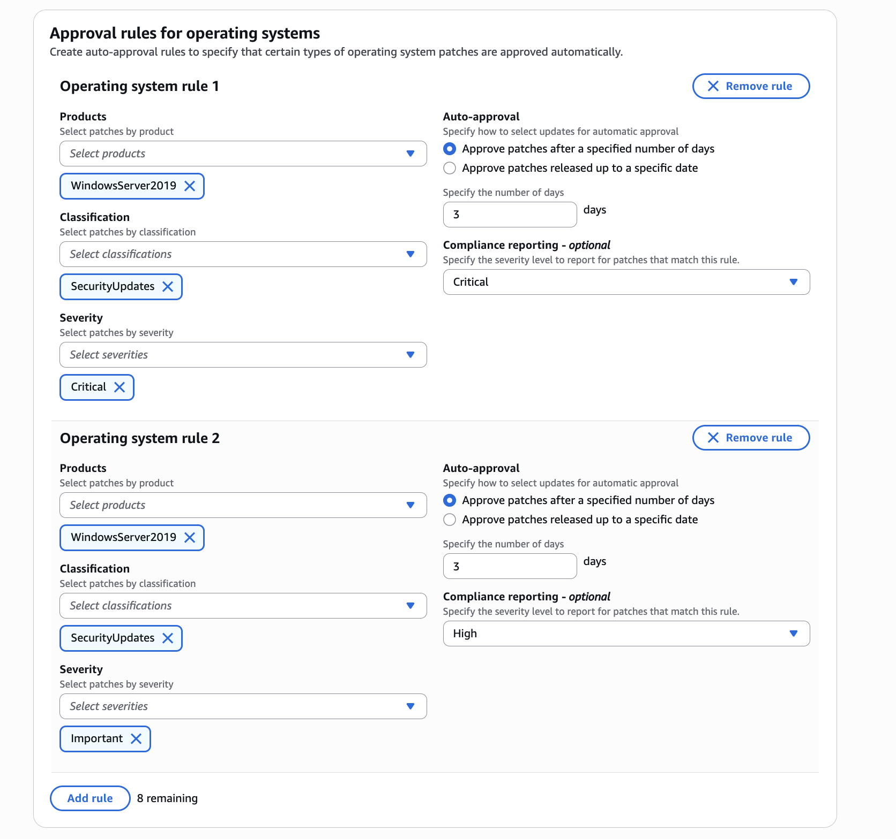
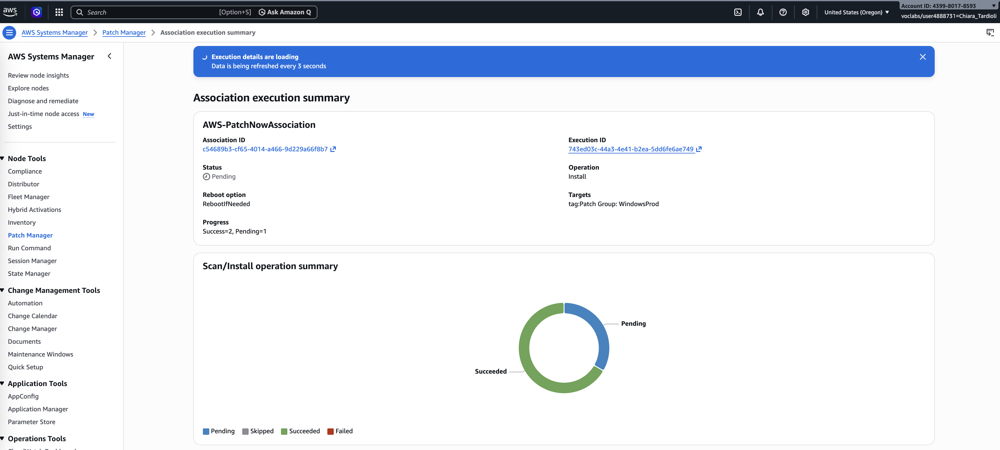
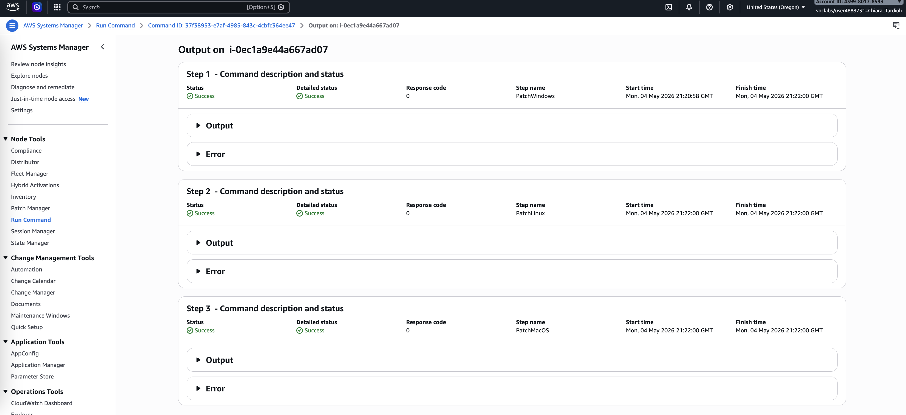
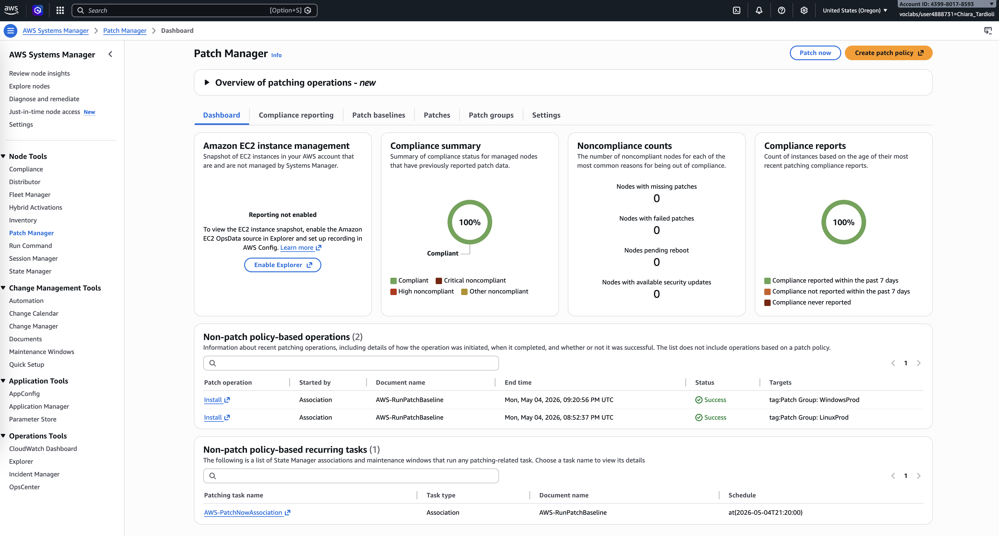
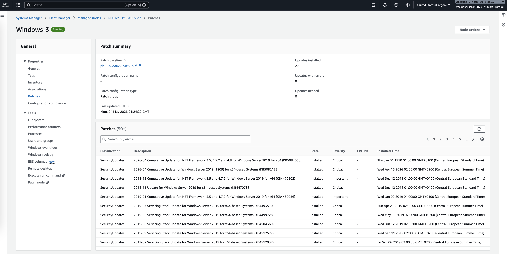

# Systems Hardening with Patch Manager via AWS Systems Manager

In large-scale IT environments, maintaining up-to-date operating systems and applications across numerous machines is a critical security requirement. 
Patch management ensures that vulnerabilities are mitigated and systems remain compliant with organizational security policies. 

In this lab, I used AWS Systems Manager Patch Manager to automate the patching process for both Linux and Windows EC2 instances. 
I applied default patch baselines for Linux instances and created a custom patch baseline for Windows instances. 
Additionally, I verified patch compliance across all instances.

## Task 1: Patch Linux Instances Using Default Baselines

I began by accessing AWS Systems Manager through the AWS Management Console and navigating to Fleet Manager to inspect the available EC2 instances. 
I confirmed that there were three Linux instances and three Windows instances, and verified their configuration and IAM roles.

Next, I navigated to Patch Manager and initiated the patching process using the default baseline for Amazon Linux 2. I configured the patch operation 
to scan and install updates, allowing the system to reboot if necessary. I targeted instances using the tag `Patch Group: LinuxProd`.

After starting the patching process, I monitored the AWS-PatchNowAssociation panel and observed the progress of all three Linux instances until completion.

## Task 2: Create a Custom Patch Baseline for Windows Instances

I proceeded to create a custom patch baseline specifically for Windows instances. In Patch Manager, I selected the option to create a new patch baseline 
and configured it with the name `WindowsServerSecurityUpdates`.

I defined approval rules to include only security updates for Windows Server 2019, focusing on critical and important severity levels. 
Both rules were configured with an auto-approval delay of three days.

After creating the baseline, I associated it with a patch group named `WindowsProd`.

## Task 3: Patch Windows Instances

### Task 3.1: Tagging Windows Instances

I navigated to the EC2 dashboard and added tags to each Windows instance. I assigned the tag `Patch Group: WindowsProd` to ensure they would be
targeted by the custom patch baseline.

### Task 3.2: Patching Windows Instances

Returning to Patch Manager, I initiated the patching process for Windows instances. I configured the operation similarly to the Linux patching 
process, selecting scan and install with reboot if required, and targeting instances using the `WindowsProd` tag.

I accessed the execution details through the provided Execution ID and reviewed the Run Command output. This allowed me to confirm that the patch group 
`WindowsProd` was correctly applied and that Patch Manager executed the required operations.

## Task 4: Verifying Compliance

Finally, I verified the compliance status of all instances using the Patch Manager dashboard. The compliance summary indicated that all six instances were compliant.

In the compliance reporting tab, I reviewed detailed information for each instance, including noncompliant patch counts and baseline IDs. 
I also inspected individual node details to confirm which patches were installed and their timestamps.

## Conclusion

In this lab, I successfully applied system hardening techniques using AWS Systems Manager Patch Manager. I patched Linux instances using the default baseline 
and created a custom patch baseline for Windows instances focused on security updates. By using patch groups and tags, I efficiently targeted instances for patching. 
Finally, I verified that all instances were compliant, ensuring that the environment met the required security standards.

In summary:
- I patched Linux instances using default baseline.
- I created custom patch baseline.
- I used patch groups to to patch Windows instances using custom patch baseline.
- I verified patch compliance.
