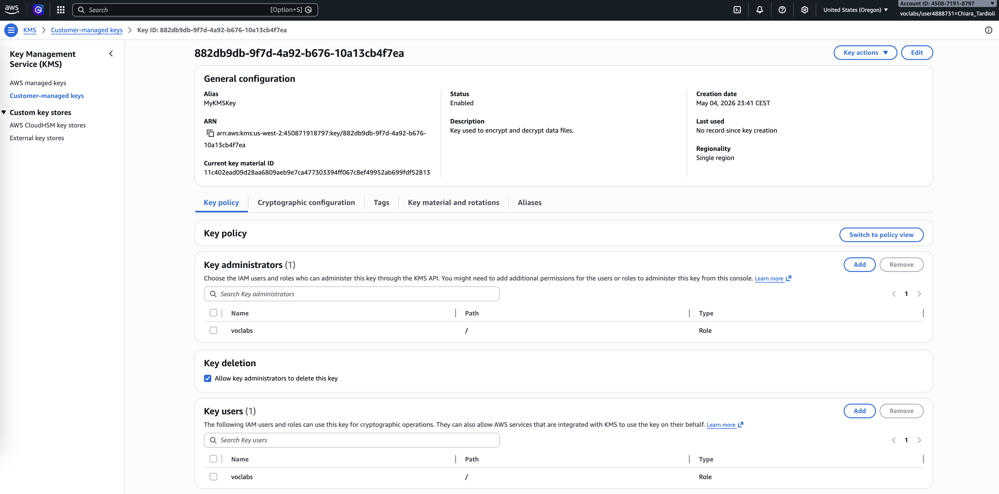

# Data Protection Using Encryption

Cryptography is the process of converting information into a secure format to protect its confidentiality, integrity, and authenticity. A key component of cryptography is encryption, which transforms readable data (plaintext) into an unreadable format (ciphertext). Only authorized users with the correct key can decrypt the data back into its original form.

In this lab, I worked with AWS services to understand how encryption is implemented in practice. I used AWS Key Management Service (KMS) to create and manage encryption keys, configured an EC2 instance to use these keys, and applied encryption and decryption processes to text files using the AWS Encryption CLI.

## Task 1: Create an AWS KMS Key
In this task, I created a symmetric encryption key using AWS KMS. I accessed the KMS service from the AWS Management Console and selected the option to create a new key.

I configured the key with the alias **MyKMSKey** and added a description indicating its purpose for encrypting and decrypting data files. I assigned administrative and usage permissions to the provided IAM role (voclabs), ensuring proper access control.

After reviewing the configuration, I completed the key creation process and copied the key’s ARN. This ARN was essential for later steps where the key was used in encryption and decryption commands.

## Task 2: Configure the File Server Instance
In this task, I connected to the preconfigured EC2 instance (File Server) using AWS Systems Manager Session Manager.

Once connected, I configured AWS CLI credentials on the instance. Initially, I entered placeholder values, then replaced them with valid credentials obtained from the lab environment. I edited the `~/.aws/credentials` file using the `vi` editor and verified the configuration.

After setting up credentials, I installed the AWS Encryption CLI using `pip3` and updated the system path to ensure the CLI could be executed globally.

These steps enabled the EC2 instance to securely interact with AWS KMS and perform encryption operations.

## Task 3: Encrypt and Decrypt Data
In this task, I created sample text files containing mock sensitive data. I started by generating three files and adding content to one of them (`secret1.txt`). I verified the file contents using the `cat` command.

Next, I created an output directory to store encrypted files and defined a variable containing the KMS key ARN. Using the AWS Encryption CLI, I encrypted the file by specifying the input file, KMS key, encryption context, and output location.

After running the encryption command, I confirmed its success by checking the exit status and listing the output directory. The encrypted file (`secret1.txt.encrypted`) contained unreadable ciphertext, demonstrating that the encryption process was successful.

I then decrypted the file using the corresponding CLI command and verified that the output file (`secret1.txt.encrypted.decrypted`) contained the original plaintext content.

This process demonstrated how symmetric encryption uses the same key for both encryption and decryption, ensuring data confidentiality.

## Conclusion
In this lab, I successfully implemented data protection using encryption within AWS. I created a KMS key, configured an EC2 instance to use secure credentials, and installed the AWS Encryption CLI. I then encrypted plaintext data into ciphertext and decrypted it back into its original form.

This lab demonstrated the practical use of encryption for securing sensitive data and highlighted the importance of key management in maintaining data security.
