# Introduction to AWS Identity and Access Management (IAM)

In modern business environments, secure access to systems and resources is essential. Organizations rely on authentication and authorization 
mechanisms to ensure that only permitted users can access specific resources. Without proper access control, systems become vulnerable to 
unauthorized usage and potential security breaches.

This lab focuses on AWS Identity and Access Management (IAM), a service that enables secure management of users, groups, and permissions within 
an AWS environment. The objective is to understand how IAM policies, users, and groups interact to enforce controlled access to AWS services 
such as Amazon EC2 and Amazon S3.

## Task 1: Create an Account Password Policy

In this task, I configured a custom password policy for the AWS account.

I navigated to IAM and accessed the **Account settings** section. From there, I modified the existing password policy to enforce stricter security requirements. 
Specifically, I increased the minimum password length from 8 to 10 characters and enabled most of the available security options, such as requiring uppercase 
letters, lowercase letters, numbers, and non-alphanumeric characters. I also kept the default settings for password expiration (90 days) and password reuse 
prevention (last 5 passwords).

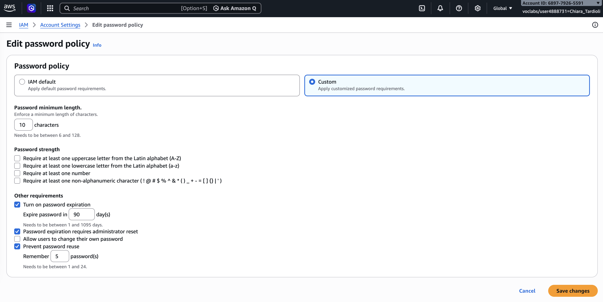

After saving the changes, the new policy was applied at the account level, affecting all IAM users. This ensures stronger password security and reduces the risk 
of compromised credentials.

## Task 2: Explore Users and User Groups

In this task, I explored the pre-configured IAM users and groups.

First, I reviewed the users (`user-1`, `user-2`, and `user-3`). I observed that `user-1` initially had no permissions assigned and was not part of any group.

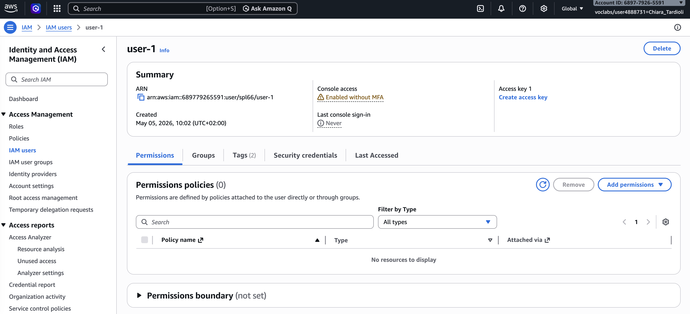

Next, I examined the existing user groups:

- **EC2-Support** – attached to the `AmazonEC2ReadOnlyAccess` managed policy
- **S3-Support** – attached to the `AmazonS3ReadOnlyAccess` managed policy
- **EC2-Admin** – assigned a custom inline policy

I inspected the policies associated with each group. The managed policies provided read-only access to specific services, while the inline policy for EC2-Admin 
allowed additional actions such as starting and stopping EC2 instances.

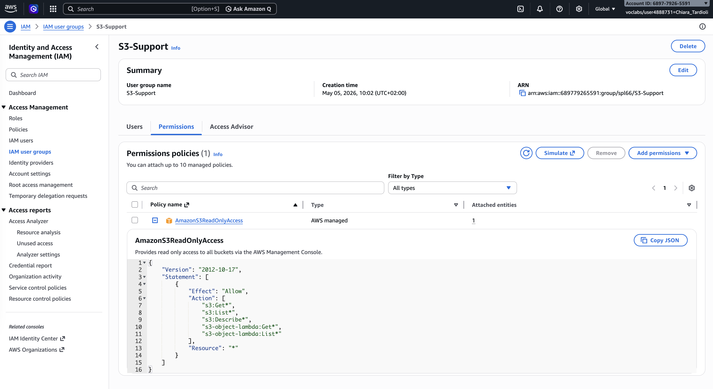

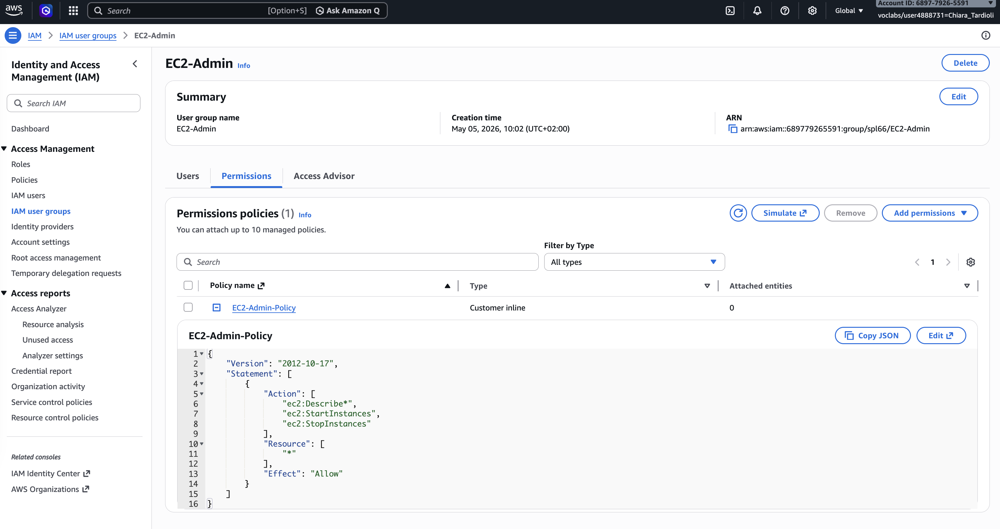

This task helped me understand how permissions are structured and applied through IAM policies and groups.

## Task 3: Add Users to User Groups

In this task, I assigned users to their respective groups based on the business scenario.

I performed the following assignments:

- Added `user-1` to the **S3-Support** group
- Added `user-2` to the **EC2-Support** group
- Added `user-3` to the **EC2-Admin** group

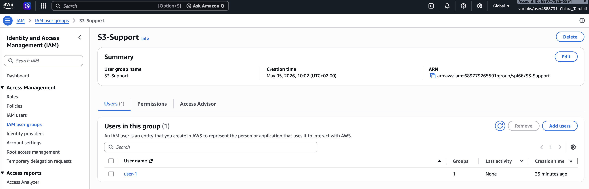

After completing the assignments, I verified that each group contained exactly one user.

By assigning users to groups, they automatically inherited the permissions defined by the group policies, demonstrating efficient permission management.

## Task 4: Sign In and Test User Permissions

In this task, I tested the permissions by signing in as each user using the IAM sign-in URL `https://689779265591.signin.aws.amazon.com/console`.

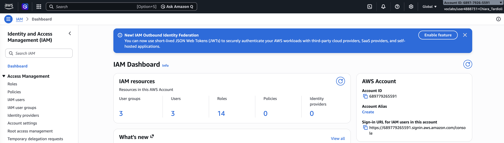

### Testing user-1 (S3-Support)

I logged in as `user-1` and accessed Amazon S3. I was able to view buckets and their contents, confirming read-only access.

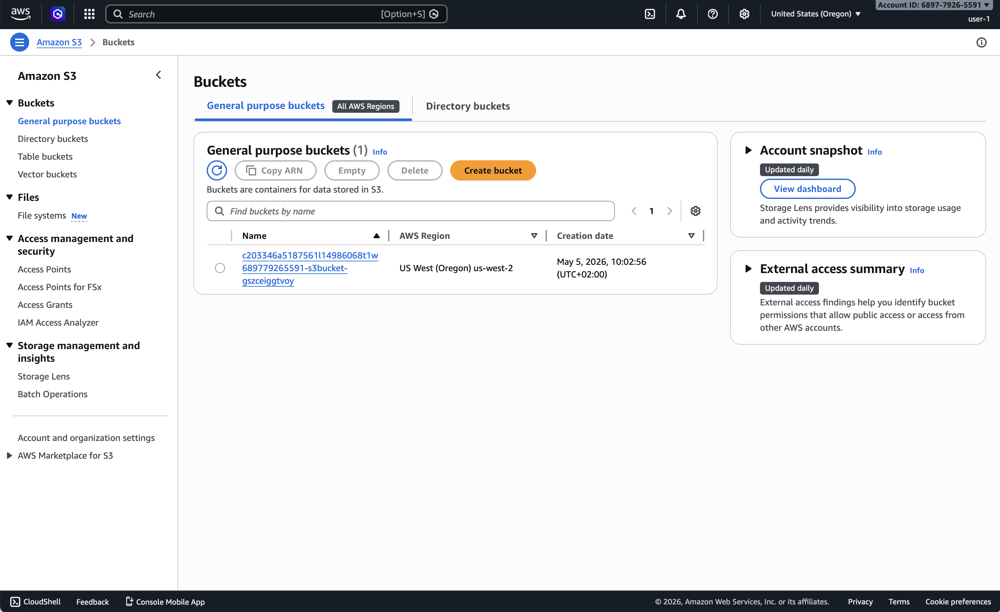

When I attempted to access EC2, I received an authorization error, confirming that no EC2 permissions were granted.

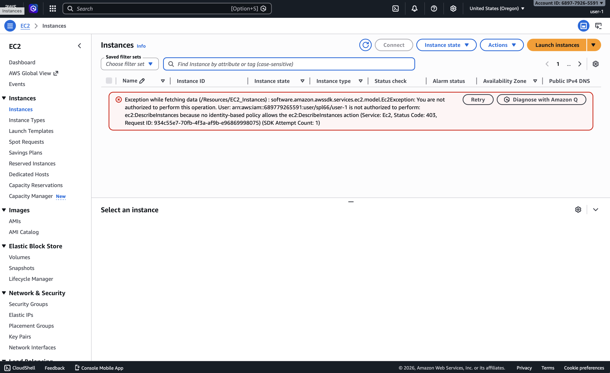

#### Testing user-2 (EC2-Support)

Next, I logged in as `user-2`. I was able to view EC2 instances but could not stop them due to insufficient permissions.

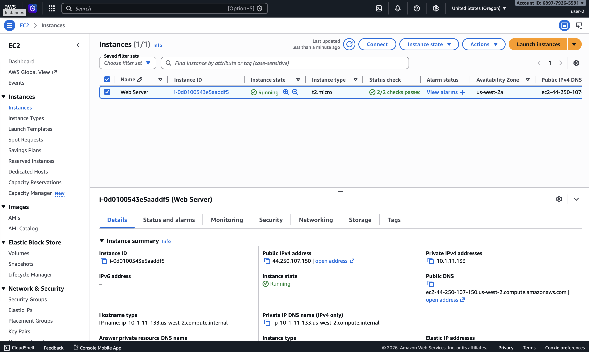

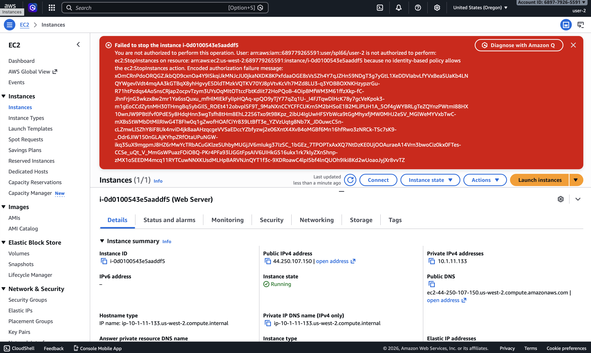

I also confirmed that access to S3 was denied.

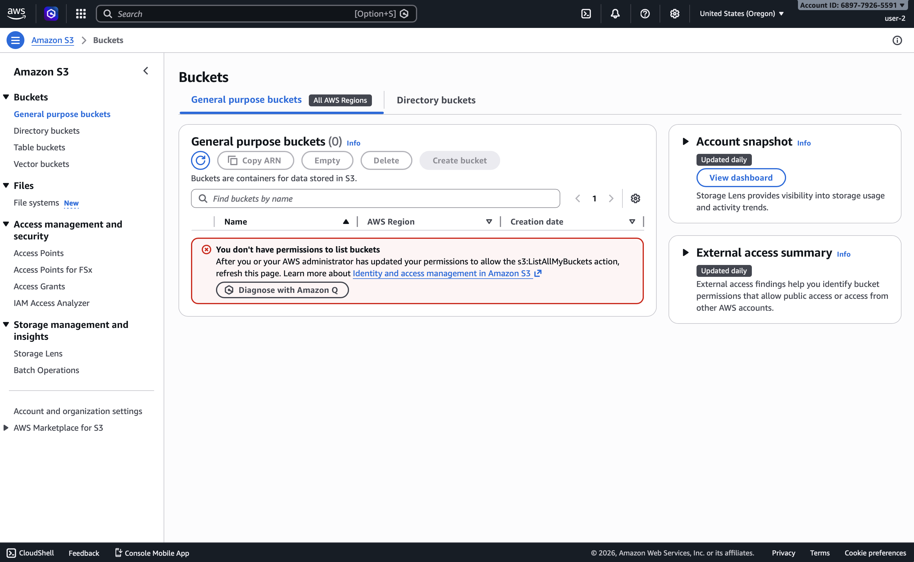

#### Testing user-3 (EC2-Admin)

Finally, I logged in as `user-3`. I was able to view EC2 instances and successfully stop an instance, confirming administrative-level permissions.

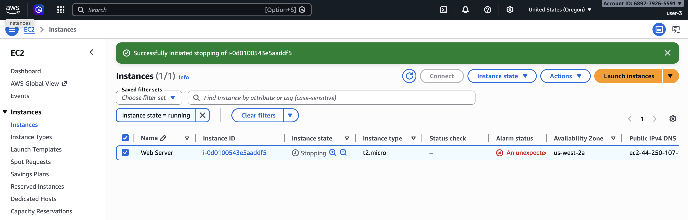

This task demonstrated how IAM policies directly affect user capabilities across AWS services.

## Conclusion

In this lab, I successfully configured and tested AWS IAM components.

I created a strong password policy to enhance account security, explored existing users and groups, and analyzed how policies define permissions. 
I then assigned users to appropriate groups based on their roles and verified access by logging in as each user.

This lab reinforced the importance of role-based access control and demonstrated how IAM simplifies permission management while maintaining security 
across AWS resources.

In summary:
- I created and applied an IAM password policy
- I explored pre-created IAM users and user groups
- I inspected IAM policies as applied to the pre-created user groups
- I added users to user groups with specific capabilities active
- I located and used the IAM sign-in URL
- I experimented with the effects of policies on service access
