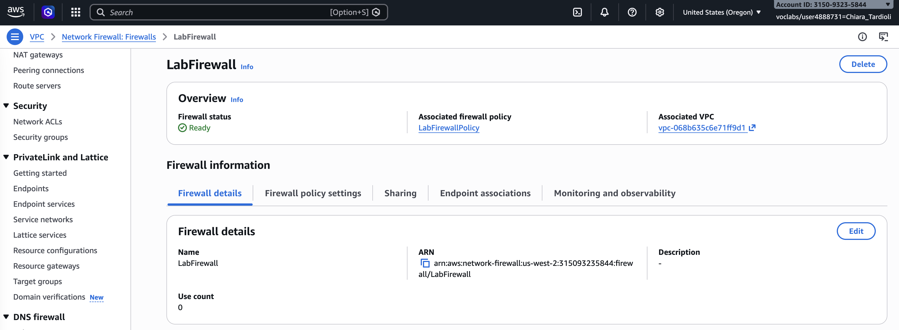
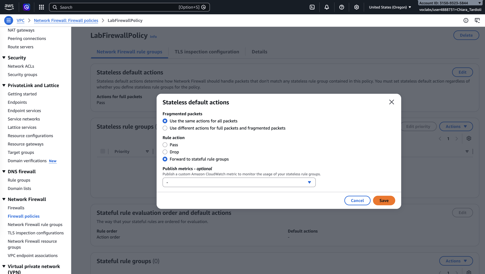
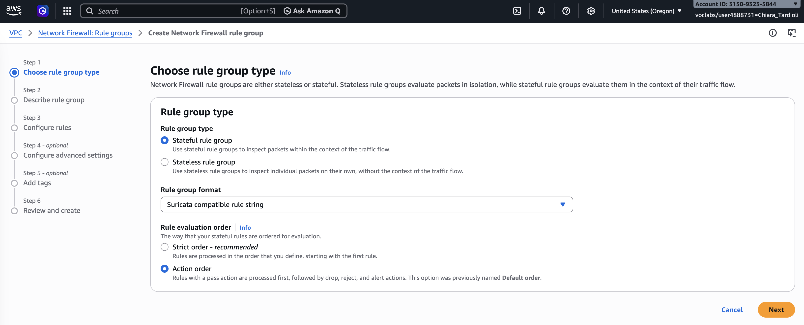
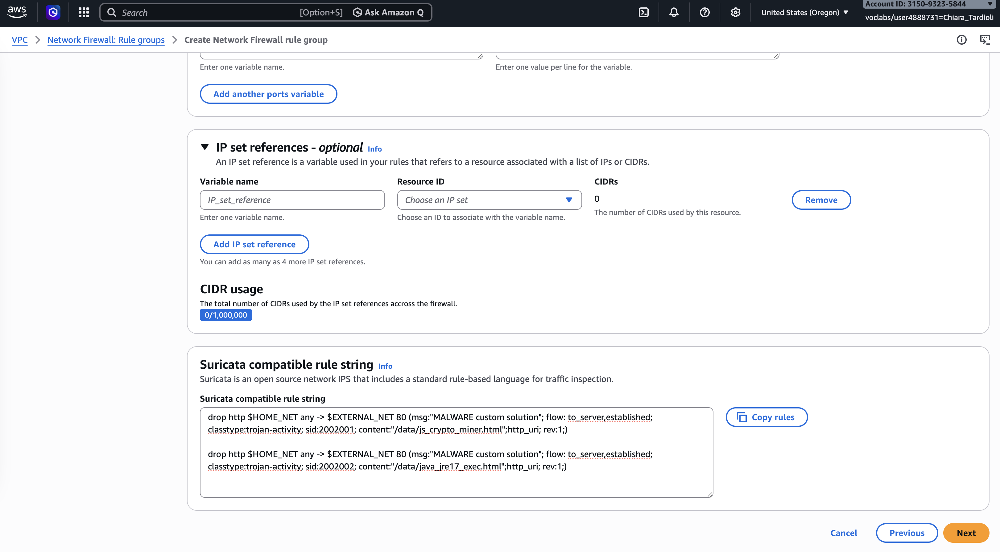
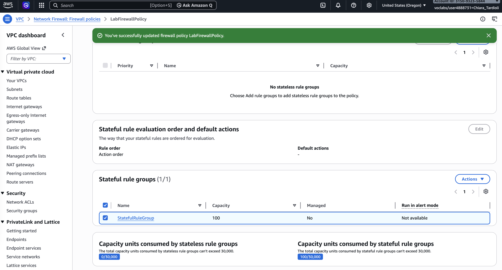

# Malware Protection Using an AWS Network Firewall

Malware poses a significant threat to modern IT infrastructures by enabling unauthorized access, data theft, and system disruption. 
Organizations must implement strong security mechanisms to protect their networks from malicious content. 
Firewalls serve as a critical layer of defense by controlling incoming and outgoing network traffic based on predefined security rules.

This lab focuses on using AWS Network Firewall to mitigate malware threats. The objective is to identify malicious traffic, create filtering rules,
and enforce policies that prevent users from accessing harmful content hosted on external websites.

## Task 1: Confirm Reachability

In this task, I verified that the malicious URLs were accessible from the network.

I connected to the pre-configured TestInstance using AWS Systems Manager Session Manager. After navigating to the home directory, 
I used the `wget` command to simulate downloading malicious files.

I executed the commands to download the test malware files. Both requests returned a **200 OK** response, confirming successful access.

To verify the downloads, I listed the directory contents and confirmed that both files were present.

This confirmed that the current firewall configuration did not block access to the malicious site.

## Task 2: Inspect the Network Firewall

In this task, I inspected the existing AWS Network Firewall configuration.

I navigated to the VPC service and accessed the configured firewall named **LabFirewall**. I reviewed the associated firewall policy and examined how traffic was handled.

I modified the stateless default actions to forward all traffic to the stateful rule groups for deeper inspection.

This change ensures that traffic is evaluated with context, allowing more advanced filtering based on connection state and patterns.

## Task 3: Create a Firewall Rule Group

In this task, I created a stateful firewall rule group to block malicious URLs.

I configured a new rule group using Suricata-compatible rules and defined rules to drop HTTP traffic targeting the known malicious file paths.

I added rules that specifically block requests containing:

- `/data/js_crypto_miner.html`
- `/data/java_jre17_exec.html`

After completing the configuration, I created the rule group successfully.

## Task 4: Attach Rule Group to the Network Firewall

In this task, I attached the newly created rule group to the existing firewall policy.

I selected the firewall policy associated with **LabFirewall** and added the **StatefulRuleGroup** under stateful rule groups.

After applying the changes, the firewall policy was updated successfully, enabling active filtering of malicious traffic.

## Task 5: Validate the Solution

In this task, I validated that the firewall rules effectively blocked access to malicious content.

I reconnected to the TestInstance and attempted to download the same files using `wget`. This time, the requests did not complete 
successfully and remained in a waiting state.

This behavior confirmed that the firewall was blocking access to the malicious URLs.

I then removed the previously downloaded files and verified that the directory was empty.

The results demonstrated that the implemented firewall rules were working as intended.

## Conclusion

In this lab, I successfully implemented malware protection using AWS Network Firewall.

I verified initial exposure to malicious content, inspected and modified firewall behavior, created a custom stateful rule group,
and applied it to the firewall policy. Finally, I validated that the malicious URLs were effectively blocked.

This lab demonstrated how network-level security controls can be used to prevent malware access and protect organizational resources from external threats.

In summary:
- I updated a network firewall
- I created a firewall rules group
- I verified and tested that access to malicious sites is blocked
