# Monitor an EC2 Instance with Amazon CloudWatch

This lab focused on monitoring and logging AWS resources using Amazon CloudWatch and Amazon SNS. The objective was to configure a monitoring solution 
capable of detecting high CPU utilization on an Amazon EC2 instance and automatically sending notifications through Amazon SNS.

The lab environment provided a preconfigured EC2 instance named **Stress Test** along with the required IAM permissions and Systems Manager access. 
During the lab, CloudWatch metrics and alarms were configured, CPU stress testing was performed, and a CloudWatch dashboard was created to 
visualize monitoring data.


## AWS Services

The following AWS resources were available in the lab environment:

- One preconfigured Amazon EC2 instance named **Stress Test**
- AWS Systems Manager Session Manager access
- IAM roles and backend configurations already provisioned
- Amazon CloudWatch
- Amazon SNS


## Task 1: Configure Amazon SNS

In this task, I created an Amazon SNS topic and subscribed an email endpoint to receive notifications from CloudWatch alarms.

#### 1. Create an SNS Topic

I navigated to the AWS Management Console and opened the Amazon SNS service.

I created a new topic with the following configuration:
- Type: `Standard`
- Name: `MyCwAlarm`

#### 2. Create an Email Subscription

After creating the topic, I added a subscription using my email address.
- Protocol: `Email`
- Endpoint: `<My email address>`

Once the subscription was created, the status remained **Pending confirmation** until I confirmed the subscription through the email sent by AWS.

After confirming the subscription, the status changed to **Confirmed**.

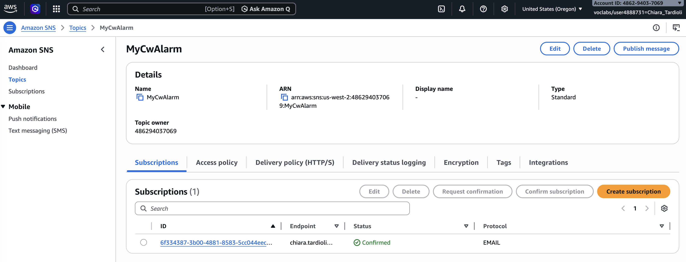


## Task 2: Create a CloudWatch Alarm

In this task, I configured a CloudWatch alarm to monitor CPU utilization for the Stress Test EC2 instance.

#### 1. View EC2 Metrics

I opened Amazon CloudWatch and navigated to:

```text
Metrics → All Metrics → EC2 → Per-Instance Metrics
````

I selected the **CPUUtilization** metric for the Stress Test instance.

Initially, the CPU utilization remained close to 0% because no workload was running on the instance.

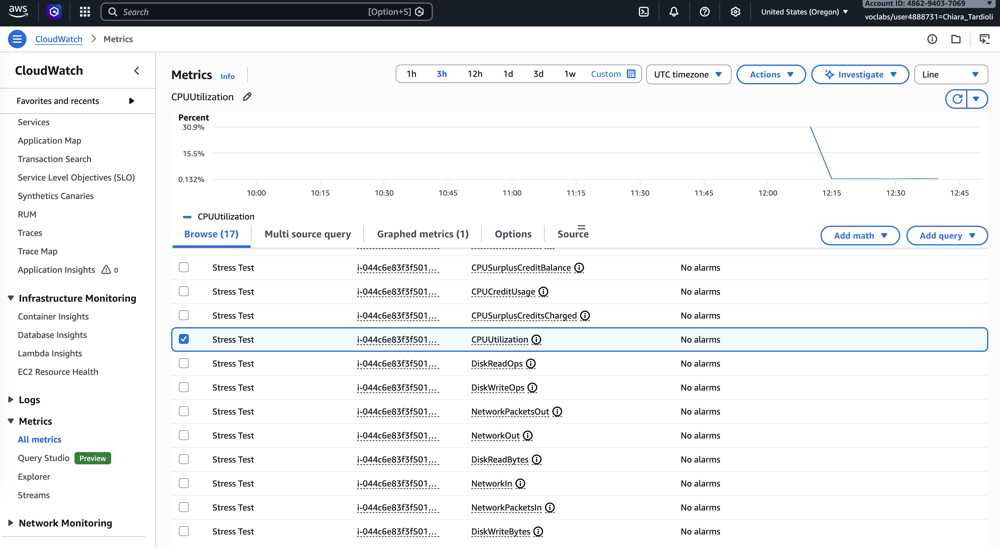

#### 2. Configure the Alarm

I created a new CloudWatch alarm using the following settings:

- Metric: `CPUUtilization`
- Statistic: `Average`
- Period: `1 minute`
- Threshold Type: `Static`
- Condition: `Greater than 60`
- SNS Topic: `MyCwAlarm`

The alarm configuration triggered notifications whenever CPU utilization exceeded 60%.

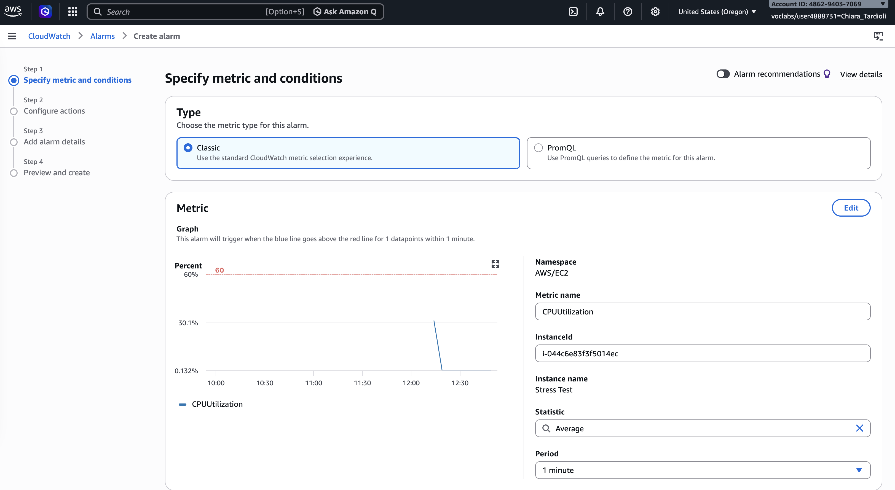

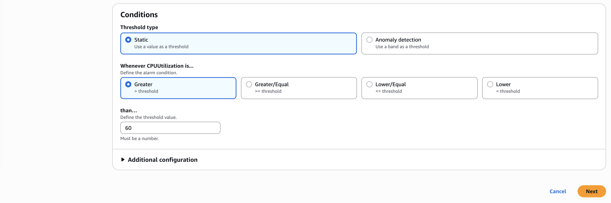

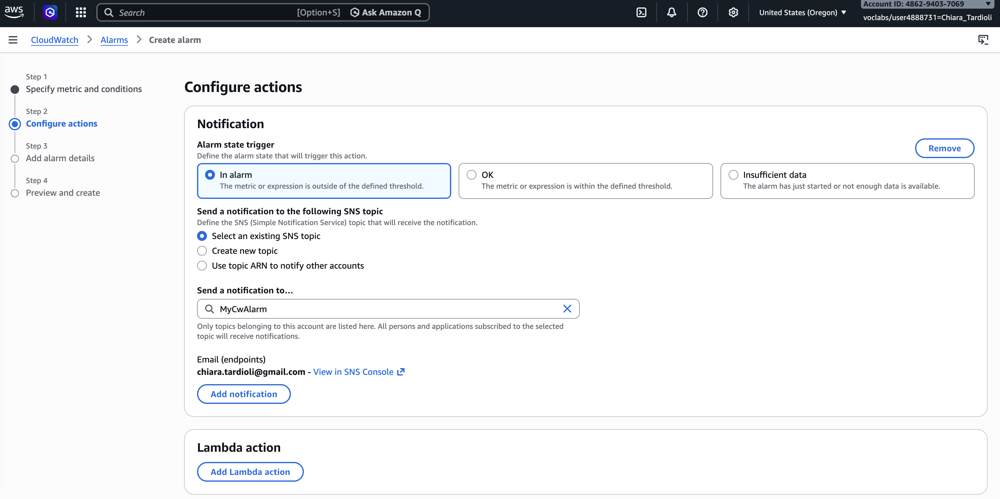


#### 3. Alarm Details

The alarm was created with the following configuration:

- Alarm Name: `LabCPUUtilizationAlarm`
- Description: `CloudWatch alarm for Stress Test EC2 instance CPUUtilization`

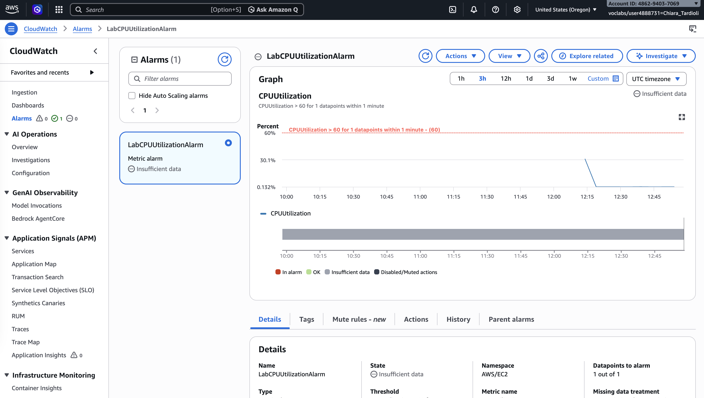


## Task 3: Test the CloudWatch Alarm

In this task, I generated a CPU spike on the EC2 instance to validate that the CloudWatch alarm and SNS notifications were functioning correctly.

#### 1. Run the CPU Stress Test

Using the provided Systems Manager connection link, I accessed the Stress Test instance terminal and executed the following command to increase CPU utilization:

```bash
sudo stress --cpu 10 -v --timeout 400s
```

This command generated CPU load for 400 seconds using 10 worker threads.

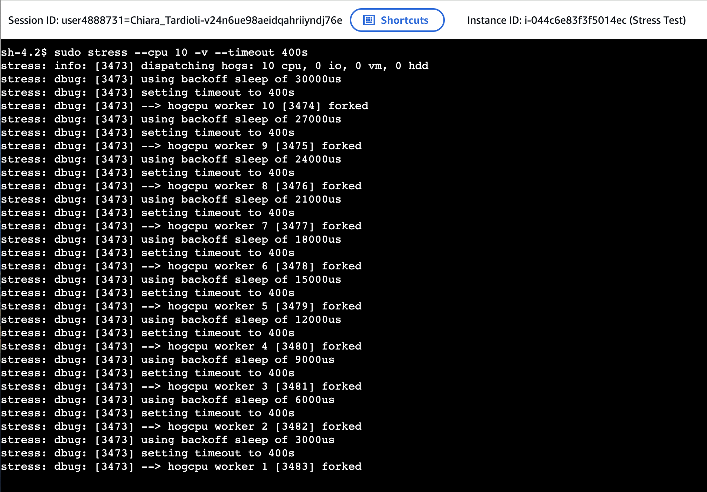

#### 2. Monitor CPU Usage

In a second terminal session, I monitored system resource usage using the `top` command. 

The output showed CPU utilization approaching 100%.

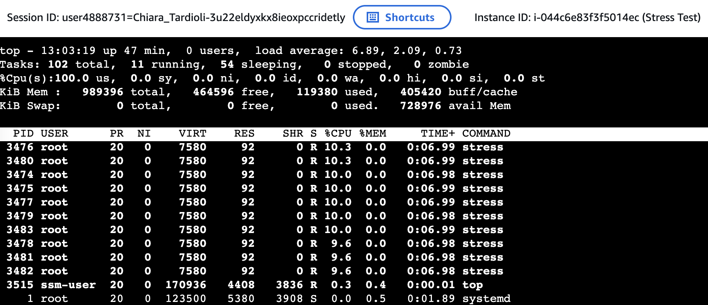


#### 3. Verify the CloudWatch Alarm

I returned to the CloudWatch console and monitored the alarm state.

After several minutes, the alarm state changed from `OK` to `In Alarm`.

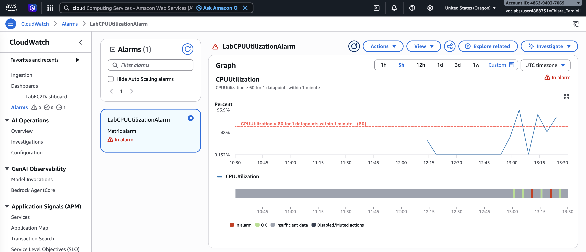

The CloudWatch graph showed CPU utilization exceeding the 60% threshold.


#### 4. Verify Email Notification

I checked my email inbox and confirmed that Amazon SNS successfully sent an alert notification.

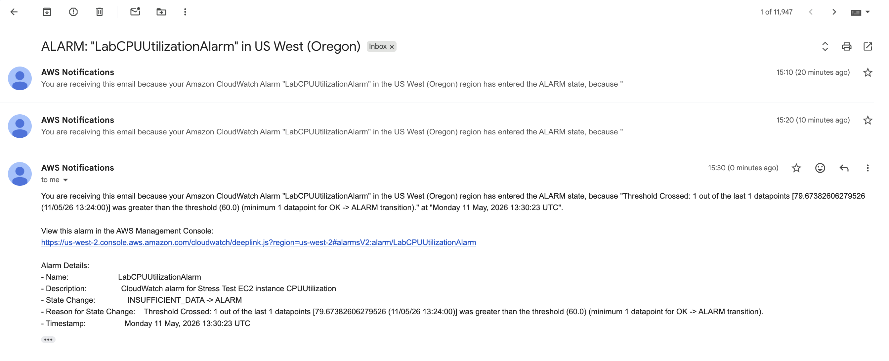

### Result

The CloudWatch alarm successfully detected the CPU spike and triggered an SNS email notification.

## Task 4: Create a CloudWatch Dashboard

In this task, I created a CloudWatch dashboard to visualize CPU utilization metrics.

I navigated to:

```text
CloudWatch → Dashboards → Create dashboard
```

I configured the dashboard with the following settings:

- Dashboard Name: `LabEC2Dashboard`
- Widget Type: `Line Graph`
- Metric: `CPUUtilization` for the Stress Test instance

After adding the widget, I saved the dashboard.

The dashboard provided a centralized view of CPU utilization metrics for the monitored EC2 instance.

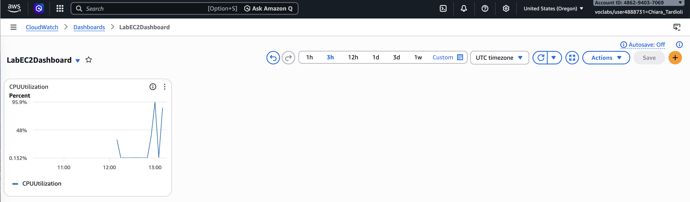


## Conclusions

In this lab, I implemented a monitoring solution for an Amazon EC2 instance using Amazon CloudWatch and Amazon SNS.

I completed the following tasks:

* Created an Amazon SNS notification topic
* Configured a CloudWatch alarm
* Performed a CPU stress test on an EC2 instance
* Verified that SNS email notifications were delivered
* Created a CloudWatch dashboard for metric visualization

This lab demonstrated how AWS monitoring tools can be used to detect abnormal resource utilization and provide automated alerts for operational and security monitoring.
