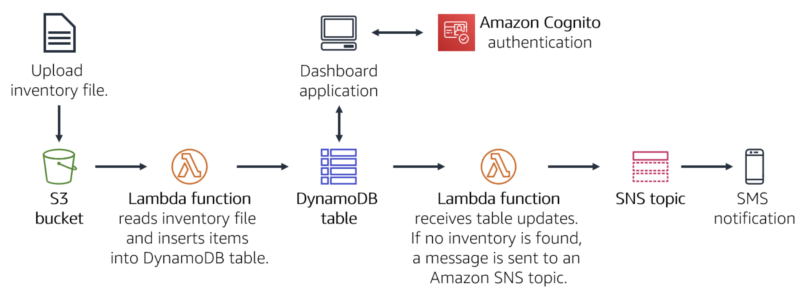
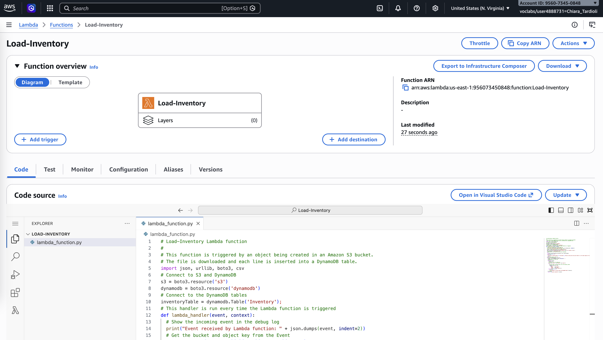
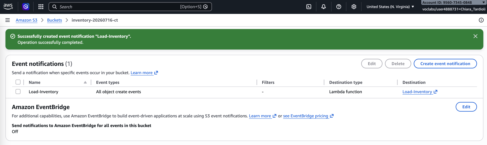
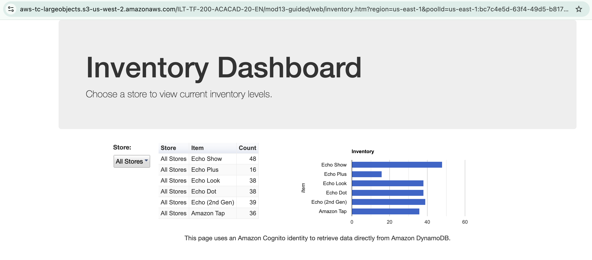
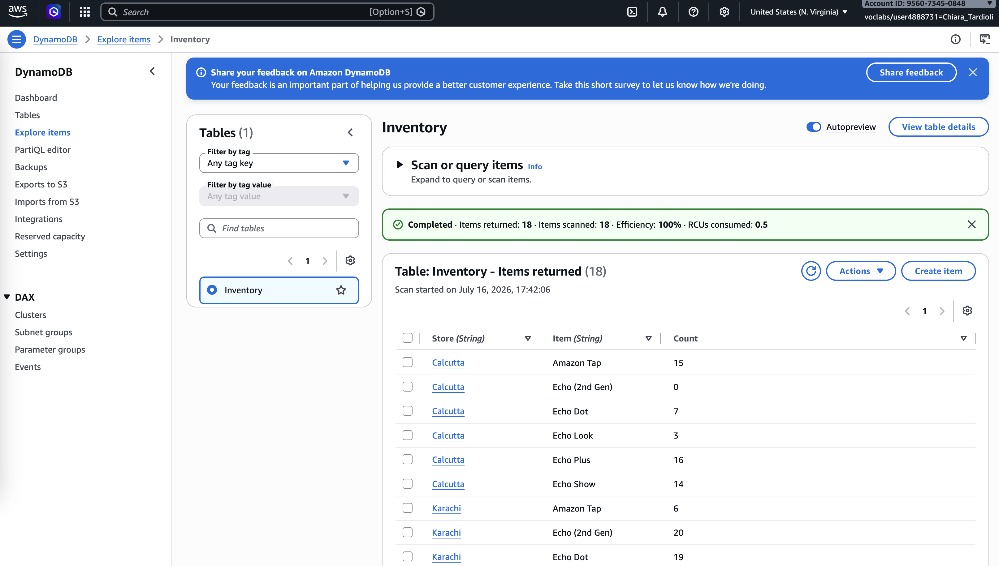
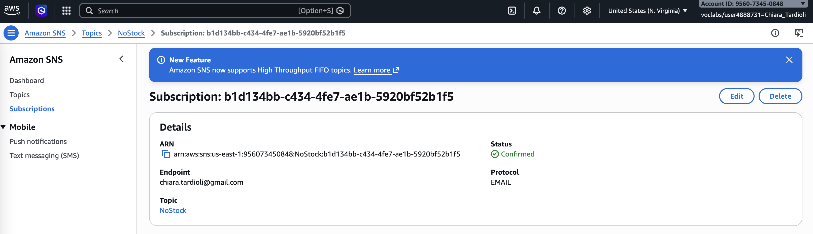
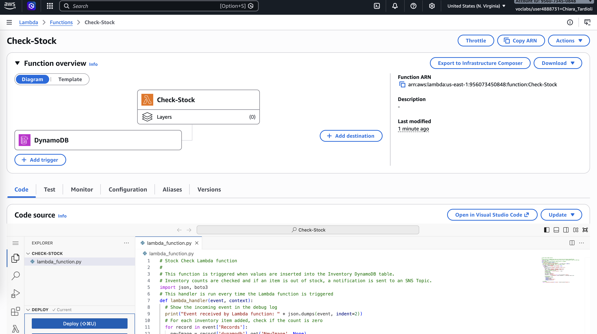
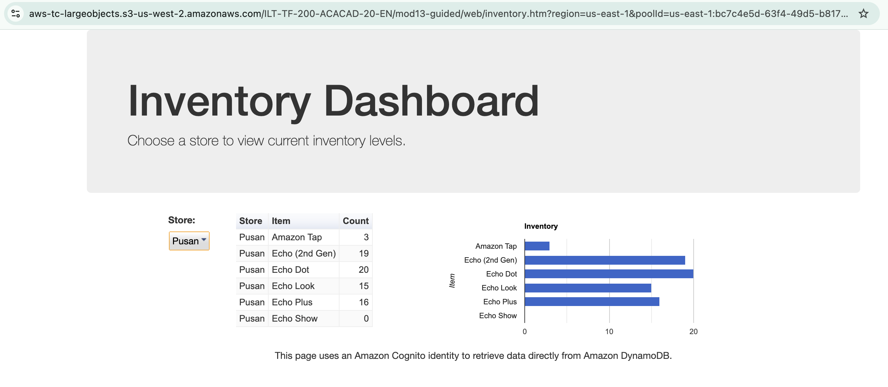
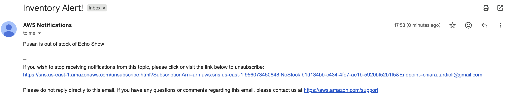

# Lab Report: Implementing a Serverless Architecture on AWS

**Lab:** [Module 13 – Guided Lab 2: Implementing a Serverless Architecture on AWS](https://labs.vocareum.com/main/main.php?m=editor&mode=s&asnid=1045963&stepid=1045964&hideNavBar=1)

**Scenario:** Build an inventory tracking system for stores worldwide. Stores upload inventory files to Amazon S3, which triggers an AWS Lambda function that loads the data into an Amazon DynamoDB table. A serverless dashboard displays inventory levels, and a second Lambda function monitors stock and sends a notification through Amazon SNS when an item is out of stock.

## Introduction

This lab implements a fully serverless, event-driven inventory tracking system on AWS, without provisioning or managing any servers. The architecture chains four managed services together: Amazon S3 receives inventory files, AWS Lambda processes them and writes to Amazon DynamoDB, a DynamoDB Stream triggers a second Lambda function that checks stock levels, and Amazon SNS delivers out-of-stock notifications by email. The solution demonstrates key serverless principles: automatic scaling, pay-per-use billing, and loose coupling between independent, single-purpose functions.



## Task 1: Create the Lambda Function to Load Data

I created a Lambda function named `Load-Inventory` (Python 3.9), using an existing execution role scoped with the permissions needed to read from S3 and write to DynamoDB. I deployed the provided handler code, which:

- Downloads the CSV file from the S3 bucket that triggered the event
- Parses each row with `csv.DictReader`
- Writes each row (`Store`, `Item`, `Count`) into the DynamoDB `Inventory` table using `put_item`

This function is not invoked directly; it is designed to run only in response to an S3 event, which I configured in the next task.



## Task 2: Configure the Amazon S3 Event Trigger

I created an S3 bucket (`inventory-<random-number>`) to serve as the upload endpoint for stores. In the bucket's **Properties**, I added an event notification (`Load-Inventory`) for **All object create events**, with the destination set to the `Load-Inventory` Lambda function. This wires the two services together: any object uploaded to the bucket now automatically invokes the Lambda function, with no polling or scheduling required.



## Task 3: Test the Loading Process

I uploaded a sample inventory CSV file (store, item, count columns) to the S3 bucket. This upload triggered the `Load-Inventory` function, which parsed the file and inserted the records into DynamoDB.

I verified the result in two ways: through the serverless dashboard application (a static site on S3 that authenticates anonymously via Amazon Cognito and reads directly from DynamoDB), and by inspecting the `Inventory` table's Items tab in the DynamoDB console.





## Task 4: Configure Notifications with Amazon SNS

I created an SNS topic named `NoStock` (Standard type) to handle out-of-stock alerts. I then created an email subscription to the topic using my own address and confirmed it via the confirmation link sent by Amazon SNS. Any message published to this topic from this point on is delivered directly to my inbox.



## Task 5: Create the Lambda Function to Send Notifications

Rather than embedding stock-checking logic into `Load-Inventory`, I created a second, single-purpose function named `Check-Stock` (Python 3.9) with its own execution role scoped for SNS access. This separation keeps each function focused on one responsibility and lets new business logic be added independently without affecting the existing load pipeline.

I deployed the provided handler code, which:

- Iterates over the incoming DynamoDB stream records
- Checks the `Count` value of each new/updated item
- If `Count` equals zero, looks up the `NoStock` topic ARN and publishes an "Inventory Alert!" message identifying the store and item

I then added a **DynamoDB trigger** to the function, pointing at the `Inventory` table, so it fires automatically whenever the table is updated by the loading process.



## Task 6: Test the End-to-End System

I uploaded another inventory file to the S3 bucket to exercise the full pipeline: S3 → `Load-Inventory` Lambda → DynamoDB → DynamoDB Stream → `Check-Stock` Lambda → SNS → email. I refreshed the dashboard and confirmed the new store's data appeared. Shortly after, I received an email notification for the item with zero stock, confirming that every stage of the event-driven chain worked correctly end to end.




Uploading multiple inventory files at the same time would trigger multiple concurrent, independent invocations of `Load-Inventory`, since Lambda scales out automatically per event rather than queuing them behind a single instance. Each file would be processed in parallel and would independently trigger `Check-Stock` for any resulting DynamoDB writes.

## Conclusion

I implemented a complete serverless inventory tracking system using Amazon S3, AWS Lambda, Amazon DynamoDB, and Amazon SNS, with Amazon Cognito supporting anonymous read access for the dashboard. This lab reinforced how event-driven, decoupled functions replace traditional server-based workflows: S3 events, DynamoDB Streams, and SNS topics act as the connective tissue between independent Lambda functions, each with a single, well-defined responsibility. I also saw firsthand how this design scales automatically with load and incurs cost only when it is actually used, since there is no idle compute to pay for. This project gave me practical, hands-on experience with the core AWS services used in production serverless architectures.


## Python functions

```python
# Load-Inventory Lambda function
#
# This function is triggered by an object being created in an Amazon S3 bucket.
# The file is downloaded and each line is inserted into a DynamoDB table.
import json, urllib, boto3, csv
# Connect to S3 and DynamoDB
s3 = boto3.resource('s3')
dynamodb = boto3.resource('dynamodb')
# Connect to the DynamoDB tables
inventoryTable = dynamodb.Table('Inventory');
# This handler is run every time the Lambda function is triggered
def lambda_handler(event, context):
  # Show the incoming event in the debug log
  print("Event received by Lambda function: " + json.dumps(event, indent=2))
  # Get the bucket and object key from the Event
  bucket = event['Records'][0]['s3']['bucket']['name']
  key = urllib.parse.unquote_plus(event['Records'][0]['s3']['object']['key'])
  localFilename = '/tmp/inventory.txt'
  # Download the file from S3 to the local filesystem
  try:
    s3.meta.client.download_file(bucket, key, localFilename)
  except Exception as e:
    print(e)
    print('Error getting object {} from bucket {}. Make sure they exist and your bucket is in the same region as this function.'.format(key, bucket))
    raise e
  # Read the Inventory CSV file
  with open(localFilename) as csvfile:
    reader = csv.DictReader(csvfile, delimiter=',')
    # Read each row in the file
    rowCount = 0
    for row in reader:
      rowCount += 1
      # Show the row in the debug log
      print(row['store'], row['item'], row['count'])
      try:
        # Insert Store, Item and Count into the Inventory table
        inventoryTable.put_item(
          Item={
            'Store':  row['store'],
            'Item':   row['item'],
            'Count':  int(row['count'])})
      except Exception as e:
         print(e)
         print("Unable to insert data into DynamoDB table".format(e))
    # Finished!
    return "%d counts inserted" % rowCount
```

```python
# Stock Check Lambda function
#
# This function is triggered when values are inserted into the Inventory DynamoDB table.
# Inventory counts are checked and if an item is out of stock, a notification is sent to an SNS Topic.
import json, boto3
# This handler is run every time the Lambda function is triggered
def lambda_handler(event, context):
  # Show the incoming event in the debug log
  print("Event received by Lambda function: " + json.dumps(event, indent=2))
  # For each inventory item added, check if the count is zero
  for record in event['Records']:
    newImage = record['dynamodb'].get('NewImage', None)
    if newImage:      
      count = int(record['dynamodb']['NewImage']['Count']['N'])  
      if count == 0:
        store = record['dynamodb']['NewImage']['Store']['S']
        item  = record['dynamodb']['NewImage']['Item']['S']  
        # Construct message to be sent
        message = store + ' is out of stock of ' + item
        print(message)  
        # Connect to SNS
        sns = boto3.client('sns')
        alertTopic = 'NoStock'
        snsTopicArn = [t['TopicArn'] for t in sns.list_topics()['Topics']
                        if t['TopicArn'].lower().endswith(':' + alertTopic.lower())][0]  
        # Send message to SNS
        sns.publish(
          TopicArn=snsTopicArn,
          Message=message,
          Subject='Inventory Alert!',
          MessageStructure='raw'
        )
  # Finished!
  return 'Successfully processed {} records.'.format(len(event['Records']))
```

## Inventory

Extract from `inventory-berlin.csv`:

```text
store,item,count
Berlin,Echo Dot,12
Berlin,Echo (2nd Gen),19
Berlin,Echo Show,18
Berlin,Echo Plus,0
Berlin,Echo Look,10
Berlin,Amazon Tap,15
```

Extract from `inventory-pusan.csv`:

```text
store,item,count
Pusan,Echo Dot,20
Pusan,Echo (2nd Gen),19
Pusan,Echo Show,0
Pusan,Echo Plus,16
Pusan,Echo Look,15
Pusan,Amazon Tap,3
```

Extract from `inventory-calcutta.csv`:

```text
store,item,count
Calcutta,Echo Dot,7
Calcutta,Echo (2nd Gen),0
Calcutta,Echo Show,14
Calcutta,Echo Plus,16
Calcutta,Echo Look,3
Calcutta,Amazon Tap,15
```
